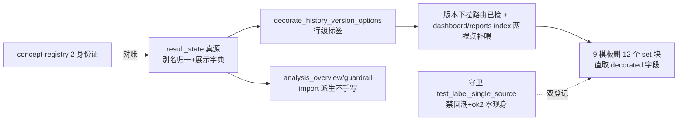

# fusion-label-single-source design

## 0. 术语约定

| 术语 | 定义 | 防冲突结论 |
|---|---|---|
| 词表 | code 值→中文标签的映射字典（strategy_zh/status_zh） | 仅指排产 result_status 与 strategy 两词表；equipment/personnel 的 status_zh 是设备/人员状态（enum_display.py 后端注入），不同概念不在收编面 |
| 行级标签 | decorate_history_version_options 给每行加的 result_status_label/strategy_label 等字段 | 收编后模板唯一消费形态 |
| 输入别名 | ok/fail——历史库可能存在的旧值，读取时归一为 success/failed（_LEGACY_RESULT_STATUS_ALIASES） | 与「平行展示键」相对：别名只进归一不进展示字典 |
| 死键 | 'ok2'——零写入方证据的词表键 | 本 feature 全删并 cs-decide 留证 |

## 1. 决策与约束

**需求摘要**（roadmap 第 8 条，模块 C，契约 4.8）：11 处（双轨退役后实测 9 文件 12 个 ``）模板内联 strategy/status 字典收编唯一字源；三套 status 口径拍板归一；ok2 死键清理；概念身份证。

**复杂度档位**：Web 应用默认档位，无偏离。

**关键决策**：

1. **真源拍板：口径 C（result_state 别名归一链）**。三套候选中 `scheduler_summary_result_state.py` 是唯一把 ok/fail 当**输入别名归一**（_LEGACY_RESULT_STATUS_ALIASES :16-20）而非平行展示键的实现，且有 simulated 复合标签（「模拟排产 / {outcome}」）与 unknown 诚实文案——`build_summary_display_state`（scheduler_summary_display.py:395）产出的 `result_status_label` 即 display_label 真源（roadmap 4.8 第三候选）。口径 A（analysis_overview 7 键含私货）与口径 B（history_summary 4 键 outcome 表）降级为真源的消费方/同步点。
2. **收编走行级标签，不走模板字典注入**：版本下拉的消费路由（reports 明细四页 reports_page_support:50/system_history/week_plan/gantt/analysis_read/resource_dispatch）的数据已经过 `decorate_history_version_options`——模板把 `status_zh.get(...)` 兜底删掉直取 `it.result_status_label`/`it.strategy_label`（gantt/resource_dispatch 现已是 `or` 双写，删右半即可）；`ui_macros.version_option_label` 宏优先吃 decorated 字段，status_zh 兜底实际不可达（侦察核证）。**不注入 Jinja 全局词表**——行级标签覆盖全部消费点后，再造模板级字典就是第二字源。
3. **两个裸点补喂（Codex 审核修正：不止 dashboard 一个）**：① dashboard.py:330/:350 的 `workbench_history` 是 **ScheduleHistory dataclass**（query service 返回对象），而 decorate 内部 `dict(raw or {})` 只吃 mapping——**先 `.to_dict()` 再 decorate**：`decorate_history_version_options([workbench_history.to_dict()])[0]`；dashboard.html:126-139 删两个 `` 后改吃 decorated 字段；**dashboard.html:137 的 `latest_history_time_display` 传参路径不动**（fusion-v2-quickwin-pack 产物，时间显示继续走路由侧 helper，不与 decorate 产出字段合流——两路并存零冲突，决策刻意保守）。② **reports/index.html:21 的 `latest_version` 是第二裸点**：来自 `engine.list_versions(limit=1)` 的仓库原始 dict（reports_page_support.py:138-141，SQL 只取 5 列无 label 字段）——`reports_index_context` 里对 `versions` 过一次 decorate 再取 [0]（与明细四页同函数，零新依赖）。
4. **ok2 死键全删**：写入方零证据——git log -S 'ok2' 对 core/ data/ 零命中 + ScheduleResultStatus 枚举仅 4 值（源码证据为主；活库实测 simulated/success 仅旁证，老现场库不可证伪）；**删除后的兜底语义**：旧库若真有 ok2 行，经 resolve 走 unknown 路径显示「有问题，需检查」——诚实降级而非静默错标成功，可接受且更正确。删除面：3 个 Python 定义点（analysis_overview.py:24 / guardrail_messages.py:12 / result_state.py:18）+ 9 模板内联（随决策 2 整块删）+ 2 测试夹具同步改（test_query_services.py:286 / test_history_summary_parser.py:138 的 legacy 别名测试改为只钉 ok/fail）。**ok/fail 保留为输入别名**：活库虽无，老现场库不可证伪，且 test_history_summary_parser 钉死了容忍行为。
5. **两份 Python 同形字典改 import 真源**：analysis_overview.py 的 status 子表与 guardrail_messages.py 的 _RESULT_STATUS_LABELS 不再各自手写 7/8 键——改为从 result_state 的归一字典派生（展示字典 = 4 合法值 + unknown，输入别名只进 resolve 不进展示）；strategy 子表同理从 history_summary._STRATEGY_LABELS import（7 键含 manual/improve/greedy 防御键现状保留，词表瘦身归后续）。**未知态文案拍板**：统一「有问题，需检查」（_VERSION_OPTION_STATUS_LABELS 现值；这是对 roadmap 4.8「未识别的××」表述的细化定版——4.8 给的是形制示例非逐字契约，本 design 拍真源现值避免全站换词）——guardrail_messages 的「结果状态异常/未记录」改齐前先 grep 测试断言面（reports_plan_template_fields/resource_dispatch 消费方的既有断言同步）；test_system_history_route_contract.py:317 断言「结果状态未知」不得出现，新文案不冲突。
6. **概念身份证两张**（cs-semantic-radar 体系，照 plan_role 范本）：concept-registry.yaml 加 `schedule_result_status`（4 合法值 + 别名政策「ok/fail 输入别名、ok2 非法」+ canonical_resolver 指 result_state；对账规则：ScheduleResultStatus 枚举值集 ⊆ 展示字典键集、别名键集与 _LEGACY_RESULT_STATUS_ALIASES 一致）与 `schedule_strategy`（**registry 字段分两层**——`allowed_values` 只收 4 个 sort_strategy 合法配置值（与 config_field_spec choices 对账相等），`display_compat_values` 另收 manual/improve/greedy 三个历史展示兼容值（与 _STRATEGY_LABELS 7 键对账：合法值∪兼容值=标签键集）；forbidden_meanings 写「improve/greedy 是 algo_mode 不是 sort_strategy 合法配置值」「manual 仅由甘特发布写入非用户可选」——**不做三方硬相等**：测试夹具与历史行真实在用 greedy（test_scheduler_analysis_read_context:41），硬相等会红）；concepts/ 两张 md 卡；check_concept_registry.py 加对账段；__snapshots__/result_status_labels.json + strategy_labels.json 快照。
7. **回潮守卫**：仿 batches 先例（test_scheduler_batches_degraded_visible 的禁回潮写法）建 `tests/web_pages/test_label_single_source_contract.py`——9 收编模板 grep 断言不得再现 `set strategy_zh =` / `set status_zh =` 字面字典（analysis.html 的后端注入形态豁免）+ 'ok2' 全仓 templates/web 零现身；双登记 GUARD_TESTS + groups_misc ui_layout 组。
8. **test_v2_strategy_zh_contract.py 更新**：docstring 明文预告了本 feature；收编后更新 docstring 并保留 strict helper 4 键断言。

**明确不做**：equipment/personnel/process/material 的实体状态词表（不同概念）；strategy 7 键瘦身（improve/greedy 防御键去留归后续 cs-refactor——需先考古老库 strategy 字段实存值）；mode/dispatch_mode/dispatch_rule 子表收编（analysis_labels 其余子表只有 analysis 一个消费方，无漂移面）；语义雷达 drift-ledger 回填（无既有漂移记录涉及这两概念）。

## 2. 名词与编排

### 2.1 名词层

**现状**：
- 12 个内联 ``：strategy_zh ×3（dashboard:126-134/gantt:11-19/resource_dispatch:11-19，7 键逐字同形）+ status_zh ×9（dashboard:135/gantt:20/resource_dispatch:20/week_plan:4/reports 五页:5，7 键含 ok/fail/ok2 逐字同形）。
- 四处 Python 定义点三种口径：A analysis_overview:17-25（7 键直译）+ 同形 guardrail_messages:5-14（8 键）；B history_summary:29-34（4 键 outcome）；C result_state:8-20（5 键 + 别名归一）。
- decorate 链：版本下拉消费路由已覆盖；两裸点（dashboard dataclass 直传 / reports index 仓库原始 dict）。
- 语义雷达：registry 现 4 概念，check_concept_registry.py 可跑。

**变化**：
- 修改 9 模板：删 12 个 ``，消费点改 decorated 字段。
- 修改 web/routes/dashboard.py：workbench_history 过 decorate。
- 修改 3 个 viewmodel：analysis_overview/guardrail_messages 改 import 真源派生；result_state 删 ok2 别名行。
- 修改 2 测试 + 新增 1 守卫测试 + 双登记。
- 新增 registry 2 条 + concepts 2 md + check 对账段 + 2 快照 json。

接口示例：

```python
# web/viewmodels/scheduler_summary_result_state.py —— 唯一字源（修订后）
_RESULT_STATUS_LABELS = {"success": "成功", "partial": "部分成功", "failed": "失败",
                         "simulated": "模拟排产", "unknown": "有问题，需检查"}
_LEGACY_RESULT_STATUS_ALIASES = {"ok": "success", "fail": "failed"}  # ok2 已删（死键，cs-decide 留证）

def result_status_display_labels() -> Dict[str, str]:
    """展示字典（4 合法值 + unknown）——analysis_overview/guardrail_messages 从此派生，不再手写。"""
```

```jinja
{# 模板消费形态（收编后唯一写法）：#}
{{ it.result_status_label }}   {# 行级标签，decorate 产出 #}
{{ it.strategy_label }}
```

### 2.2 编排层



**现状**：12 处模板字典 + 4 处 Python 字典共 16 个漂移点；ok2 假键 12 处。
**变化**：真源 1 处 + 派生 2 处 + 行级消费；ok2 归零。

**流程级约束**：
- 删 `` 前逐页核对消费点全部有 decorated 字段可吃（gantt/resource_dispatch 的 `or` 双写删右半；version_option_label 宏兜底参数随删）。
- dashboard 补喂后验证 latest_history_time_display 与 decorate 产出值逐字一致（v2-quickwin 的公开时间格式契约不回归——test_dashboard_schedule_time_display 钉着）。
- 未知态文案统一动作要过 test_system_history_route_contract（「结果状态未知」禁词）与 reports 既有断言。
- 改 9 模板 = anchor-baseline 缓存税 4 entry 作废（预期内）；EXPECTED_PAGE_SIGNALS 无词表中文锚（侦察核证）不撞；language_polish 只锚 gantt/utilization 的非词表文案不撞。
- 概念身份证的 check_concept_registry.py 对账段必须实跑通过（账本 vs ScheduleResultStatus 枚举 vs 真源字典三方一致）。

### 2.3 挂载点清单

1. 模板收编：9 文件删 12 个 `` + 消费点改写 — 修改
2. 两裸点补喂：web/routes/dashboard.py（to_dict 后 decorate）+ web/routes/reports_page_support.py reports_index_context（versions 过 decorate）— 修改
3. Python 字典归一：analysis_overview.py / guardrail_messages.py 改派生；result_state.py 删 ok2 + 加 result_status_display_labels() — 修改
4. 测试同步：test_query_services.py / test_history_summary_parser.py 删 ok2 夹具；test_v2_strategy_zh_contract.py docstring — 修改
5. 回潮守卫：tests/web_pages/test_label_single_source_contract.py 新文件 + GUARD_TESTS + groups_misc ui_layout 组双登记 — 新增/修改
6. 语义雷达：concept-registry.yaml +2 / concepts/ +2 md / check_concept_registry.py 对账段 / __snapshots__ +2 json — 新增/修改

### 2.4 推进策略

1. 真源修订：result_state 删 ok2 + 公开展示字典；analysis_overview/guardrail 改派生；未知态文案统一 → 全量相关测试绿
2. 行级收编：dashboard（to_dict）+ reports index（versions decorate）两裸点补喂 → 9 模板删 set 块改 decorated 字段 → 逐页浏览器目检 + 既有页面测试绿
3. 守卫与身份证：回潮守卫（先红后绿：临时回贴一个 set 块即红）+ 双登记 + registry/概念卡/check 对账/快照 → check_concept_registry 实跑 OK
4. required 门禁全绿收尾

### 2.5 结构健康度与微重构

##### 评估
- 文件级 — 新增守卫测试 ~60 行、概念卡 2 md、check 对账段 ~40 行；9 模板净减 ~80 行；无文件逼近 500 行线。
- compound 检索：无冲突 convention。

##### 结论：不做

##### 超出范围的观察
- strategy 词表 7 键含 improve/greedy 防御键（algo_mode 混入 strategy 的历史遗留）——身份证 forbidden_meanings 先钉住语义，瘦身归 cs-refactor（需老库考古）。
- analysis_labels 其余三子表（mode/dispatch_mode/dispatch_rule）单消费方无漂移面，若未来第二消费方出现应直接走 decorate 模式。

## 3. 验收契约

关键场景：
1. 9 模板 grep：`set strategy_zh` / `set status_zh` 零命中（analysis.html 后端注入形态豁免仍在）；渲染输出与收编前逐字一致（成功/模拟排产等中文标签不变）。
2. dashboard「当前查看排产」卡与 reports 首页「最近一次排产」行：策略/状态中文与收编前一致；latest_history_time_display 公开时间格式不回归（既有测试绿）。
3. ok2 全仓零现身：grep templates/ web/ 零命中；test_history_summary_parser legacy 测试只钉 ok/fail 且绿。
4. 未知态：构造 unknown status 行 → 全链路显示「有问题，需检查」；「结果状态未知」全仓禁词测试绿。
5. 真源派生：analysis_overview/guardrail_messages 无手写 status 字典（grep 字面 '成功' 定义行）；analysis 页渲染零变化。
6. 回潮守卫先红后绿；GUARD_TESTS/组双登记后 test_long_gate_manifest 自洽绿。
7. 语义守卫双命令分跑：主 .venv 跑 `.codestable/semantics/tools/check_concept_registry.py`（registry 对账）OK；`.venv-semantic` 跑 run_semantic_guards.py（snapshot/property）OK；两快照 json 与真源一致。
8. 浏览器目检：dashboard/gantt/week_plan/resource_dispatch/reports 五类页版本下拉与摘要行标签正常。
9. required 门禁全绿。

明确不做的反向核对：
- equipment/personnel/process/material 模板零 diff。
- config_field_spec.py（4 键权威 choices）零 diff；sort_strategies.py 零 diff。
- analysis_labels 的 mode/dispatch_mode/dispatch_rule 子表零 diff。
- 词表中文值本身零变化（收编是搬运不是改文案——language_polish 纪律）。

## 4. 与项目级架构文档的关系

验收时归并：ARCHITECTURE.md 补「排产词表唯一字源」条目；roadmap 第 8 条回写 done——解锁 fusion-plan-context-capsule（第 9 条）进而解锁 nav-specs-unify/quick-locate/analysis-action-refresh 链。概念身份证落档 .codestable/semantics/（语义雷达体系内归并，无需另立 ADR——registry 即决策载体）。
