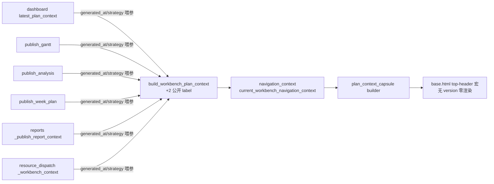

# fusion-plan-context-capsule design

## 0. 术语约定

| 术语 | 定义 | 防冲突结论 |
|---|---|---|
| 胶囊 | 壳层 top-header 常驻的一行计划上下文（版本 · 方案身份 · 生成时间 · 策略 · 数据范围），全站统一渲染 | 与 workbench_nav_menu（跳转菜单）并列不混合；与页面内数据行/版本选择器无关 |
| 生成时间 | 选中排产版本的 schedule_time 公开口径（format_public_datetime），**不是**首页值班台的「今日待处理生成时间」（那是 current_now 实时戳，语义不同不合并） | dashboard.html:14 的 generated_at_label 保留原语义 |
| 版本号单点化 | **分两阶段**：阶段一（本 feature）立胶囊 + 壳层 chrome 单点（dashboard.html:14 的 version·plan_role muted 行去重）；阶段二（#28 analysis 概览卡「页头接 4.2 胶囊」/#19 dashboard 体检表）做页面正文清理 | roadmap 4.2 原文「胶囊上线后版本号在页面正文只允许出现在胶囊一处」**本 design 同步修订为两阶段口径**（roadmap 变更日志落账，不留契约与实现打架——Codex 阻塞拍板）；数据行（历史表每行 vN）、版本选择器选项永久豁免（数据不是 chrome） |

## 1. 决策与约束

**需求摘要**（roadmap 第 9 条 + 契约 4.2，模块 C）：版本/方案/时间上下文全站常驻且只出现一处。依赖第 8 条词表单源（已 done）。Codex 设计审核两阻塞拍板：① 发布点是 6 个不是 5 个（roadmap 4.2 漏列 resource_dispatch——该页 _workbench_context 直接 build+set_current，是真实发布点）；② 「版本号全站单点化」分两阶段并**同步修订 roadmap 4.2 原文**（不留契约与实现打架）。

**复杂度档位**：Web 应用默认档位，无偏离。

**关键决策**：

1. **合同扩展（4.2）**：`build_workbench_plan_context` 新增 `generated_at=_UNSET, strategy=_UNSET` 两 kwargs（模块级私有 sentinel，唯一表达「调用方没传」——None 不能身兼两态，历史行的 schedule_time/strategy 本身可能是 None/空串，见 2.1 接口示例）；输出新增 `generated_at_label`（走 `format_public_datetime`——坏值「时间记录异常」、缺失「-」，与首页「当前查看排产」卡同一单点）与 `strategy_label`。**策略未知值文案拍板**：roadmap 4.2 写「未识别的策略」，但第 8 条词表单源已钉死 `strategy_display_label` 的未知态「历史记录异常」/缺失态「旧历史未记录」——**遵词表单源，不造第三套文案**（roadmap 4.2 那行先于 #8 完成而写，**已于设计期修订 roadmap 原文并落变更日志**，见第 4 节）。
2. **import 方向**：scheduler_workbench_links.py 从 `.scheduler_history_summary` 导入 `format_public_datetime, strategy_display_label`（已核无环：history_summary 只依赖 core.models 与 summary_display）。行数 449→~462（<500，余量落账）。
3. **胶囊 builder 落新文件** `web/viewmodels/plan_context_capsule.py`（4.2 红线：禁止往 449 行的 links 文件顺手加码）：`build_plan_context_capsule(context) -> Optional[Dict]`——context 无 version（`_has_value` 假）返回 None（基础数据页零渲染）；有 version 返回 `{"version_label", "plan_role_label", "generated_at_label", "strategy_label", "date_range_label"}` 全 `*_label` 公开字段（4.2 约束：缺字段显示「-」，不显示 plan_role/scenario_id raw 值——context 里 version_label/plan_role_label 已是公开口径，直接消费）。
4. **模板接线**：新建 `templates/components/_plan_context_capsule.html` 宏 + 模板全局 `workbench_plan_capsule()`（注入点 template_globals.py 与导航全局同列；实现在 navigation_context.py：`current_workbench_navigation_context()` → builder，~10 行）。挂载 base.html top-header：`<h2>` 之后 workbench nav 之前。CSS ~15 行进 ui_contract.css header 区（token 化，不引新 hex——hex 冻结白名单不动）。
5. **6 发布点喂参**：
   - **dashboard**（坑点：双发布后写覆盖，set_current 调用点现位于 dashboard.py:287/:350）——喂参落 `dashboard_workbench_context.latest_plan_context`（第二次发布的 context 构造处）：从 latest_history 取 `schedule_time/strategy` 传入。第一次发布不喂（会被覆盖，喂了也白喂——roadmap 4.2 已点名）。
   - **gantt/analysis/week_plan**（scheduler_navigation_publish 三函数）：`_publish_context` 链新增 `generated_at/strategy` 透传 kwargs；调用点取数——gantt：**复用 `_selected_version_result_status_label` 已有的 `get_by_version` 单次查询**（该 helper 改为同时返回 selected dict 供状态标签与胶囊两用，不发第二次查询、也不退化成 limit-30 行列表查不到就「-」）；analysis：`read_ctx.selected_item` 现成；week_plan：`_load_selected_week_plan_summary` 的 selected_history 现成。
   - **reports**（reports_page_support `_publish_report_context`）：同款 kwargs；调用点从 `versions`（decorate 过，decorate 不丢 schedule_time/strategy 原始字段——复制后追加 label）按 version 查行。
   - **resource_dispatch**（Codex 阻塞补列）：`_workbench_context`（scheduler_resource_dispatch.py:68）加 `generated_at/strategy` 喂参；取数从 `_decorate_page_context` 现成的 decorated `versions`（:146）按 version 查行。
   - 取数 helper `history_row_capsule_fields(rows, version) -> Dict`（plan_context_capsule.py 内，纯函数）：从 decorated 行列表按 version 取 schedule_time/strategy，查不到返回空 dict——reports/resource_dispatch 共用；gantt/analysis/week_plan 走各自现成 selected 行。
6. **版本号单点化（阶段一范围）**：删 dashboard.html:14 的 `workbench_summary.latest_plan.version_label · plan_role_label` 两段（与胶囊逐字重复；该行保留「今日待处理生成时间」——语义不同）。analysis 版本概览卡/dashboard 体检表/dashboard「当前查看版本」摘要卡归阶段二（#28/#19，roadmap 同步修订后两条验收时执行正文唯一性断言）。
7. **测试**：① 合同扩展单测（坏时间「时间记录异常」/缺失「-」/未知策略「历史记录异常」走词表单源/不喂参字段为「-」）；② builder 单测（无 version None/全字段形态/缺字段「-」）；③ 页面契约（带版本页胶囊渲染含 v 号与方案身份；基础数据页零胶囊；dashboard 去重后 muted 行无 version_label）；④ 6 发布点喂参各 1 条断言（capsule 字段非「-」）。不进 GUARD_TESTS（展示链非安全红线，links contract 已在 required）。

**明确不做**：不动 `_context_summary`/`required_params` 等链接合同既有输出；不做 analysis 版本概览卡清理（#28）；不做 dashboard 体检表重排（#19）；不做导航 specs 化（#10）；胶囊不带跳转动作（纯展示，动作归 workbench_nav_menu）；不显示 scenario_id 原值（plan_role_label 公开口径已含「模拟预览（场景名）」形态）。

## 2. 名词与编排

### 2.1 名词层

**现状**：build_workbench_plan_context（scheduler_workbench_links.py:138，输出 version_label/plan_role_label 公开口径现成）；format_public_datetime/strategy_display_label（scheduler_history_summary，#8 词表单源）；6 发布点（dashboard_workbench_context.py:100 / scheduler_navigation_publish.py:81/111/140 / reports_page_support.py:91 / scheduler_resource_dispatch.py:68）；模板全局安装点 template_globals.py；base.html top-header :111-113。

**变化**：
- 修改 `web/viewmodels/scheduler_workbench_links.py`：+2 kwargs、+2 输出字段（~13 行）。
- 新增 `web/viewmodels/plan_context_capsule.py`（~70 行）：build_plan_context_capsule + history_row_capsule_fields。
- 修改 `web/navigation_context.py`：workbench_plan_capsule()（消费 current_workbench_navigation_context）。
- 修改 `web/bootstrap/template_globals.py`：注入 workbench_plan_capsule。
- 新增 `templates/components/_plan_context_capsule.html`；修改 `templates/base.html`（挂载）+ `templates/dashboard.html`（:14 去重）。
- 修改 `web/viewmodels/dashboard_workbench_context.py` + `scheduler_navigation_publish.py`（3 函数+3 路由调用点）+ `reports_page_support.py` + `scheduler_resource_dispatch.py`（喂参，共 6 发布点）。
- 修改 `static/css/ui_contract.css`（胶囊样式 ~15 行，纯 token）。
- 新增 `tests/web_pages/test_plan_context_capsule.py`。

接口示例：

```python
# scheduler_workbench_links.py 扩展（kwargs 末尾加）
# 「未喂参」vs「喂了空值」用模块级私有 sentinel 钉死（Codex 复审阻塞拍板）：
# None 不能身兼两态——历史行 schedule_time/strategy 本身可能是 None/空串
_UNSET = object()  # 模块级私有 sentinel，唯一表达"调用方没传"

def build_workbench_plan_context(*, ..., back_to=None,
                                 generated_at=_UNSET, strategy=_UNSET) -> Dict[str, Any]:
    # 输出新增：
    # "generated_at_label": "-" if generated_at is _UNSET else format_public_datetime(generated_at)
    #   （喂了 None/空串 → format_public_datetime 自身返 "-"；坏值→"时间记录异常"）
    # "strategy_label": "-" if strategy is _UNSET else strategy_display_label(strategy)
    #   （词表单源：喂了 None/空串→"旧历史未记录"，未知→"历史记录异常"——
    #    URL fallback 等未喂参路径显示"-"，发布点喂了缺失值的旧历史行诚实显示"旧历史未记录"）

# web/viewmodels/plan_context_capsule.py
def build_plan_context_capsule(context) -> Optional[Dict[str, str]]:
    # context 无 version → None（页面零渲染）
    # 返回 {"version_label","plan_role_label","generated_at_label","strategy_label","date_range_label"}
    # date_range_label: "date_from ～ date_to" 或 "-"

def history_row_capsule_fields(rows, version) -> Dict[str, Any]:
    # decorated 行列表按 version 取 {"generated_at": schedule_time, "strategy": strategy}
    # 查不到 → {}（胶囊该两项显示"-"，诚实降级不另发查询）
```

### 2.2 编排层



**流程级约束**：
- 喂参全部走 schedule_time/strategy **raw 值**进合同，label 转换只在合同内一处（不在调用点先转 label——单点纪律）。
- 未发布页面走 current_workbench_navigation_context 的 request-args fallback：无 version → 胶囊零渲染；有 version 但无 generated_at/strategy（URL 进来的）→ 两项「-」（诚实：URL 不含此信息，不发查询补——胶囊是上下文回显不是数据查询入口）。
- dashboard 第一次发布（dashboard.py:287 的 set_current）不喂参（被 :350 覆盖）；验收断言首页胶囊字段非「-」证明喂参落点对。

### 2.3 挂载点清单

1. `web/viewmodels/scheduler_workbench_links.py` — 修改（合同 +2 字段）
2. `web/viewmodels/plan_context_capsule.py` — 新文件
3. `web/navigation_context.py` + `web/bootstrap/template_globals.py` — 修改（全局注入）
4. `templates/components/_plan_context_capsule.html` — 新文件
5. `templates/base.html` — 修改（挂载）
6. `templates/dashboard.html` — 修改（:14 去重）
7. 喂参 6 处：`dashboard_workbench_context.py` / `scheduler_navigation_publish.py`（3 函数+3 路由调用点）/ `reports_page_support.py` / `scheduler_resource_dispatch.py`
8. `static/css/ui_contract.css` — 修改（~15 行）
9. `tests/web_pages/test_plan_context_capsule.py` — 新文件

### 2.4 推进策略

1. 合同扩展 + builder + 单测 → 绿
2. 模板全局 + 宏 + base.html 挂载 + CSS → 浏览器目检（带版本页/基础数据页）
3. 6 发布点喂参 + 页面契约测试 → 绿 → 浏览器目检首页/甘特/分析/周计划/报表/资源排班
4. dashboard.html:14 去重 + 既有测试回归 + daily gate → 绿

### 2.5 结构健康度与微重构

##### 评估
scheduler_workbench_links 449→461（<500 落账）；navigation_context 131→~145；reports_page_support 500→498（喂参 +9 行由多行调用收单行抵消，余量极窄——下次进此文件先拆）；新文件 2。零结构问题。

##### 结论：不做

## 3. 验收契约

关键场景：
1. 合同四类边界钉死：①不传参（_UNSET）→ 两 label 均「-」；②传 generated_at=None/空串 → 「-」（format_public_datetime 口径）；③传 strategy=None/空串 → 「旧历史未记录」（与①刻意不同——词表单源缺失态）；④正常值 schedule_time="2026-06-01 08:00:00" → "2026年6月1日 08:00"、strategy="weighted" → 「综合优先级和交期」、坏时间 → 「时间记录异常」、未知策略 → 「历史记录异常」。
2. 带版本页（甘特 ?version=7）：top-header 胶囊渲染 v7 · 正式采用方案 · 生成时间 · 策略 · 日期范围。
3. 基础数据页（/material/materials）：胶囊零渲染（HTML 无胶囊容器）。
4. 首页：胶囊字段非「-」（喂参落在第二次发布 dashboard.py:350 的 latest_plan_context 构造处的实证）；dashboard.html muted 行不再含 version_label/plan_role_label（去重）。
5. 6 发布点各 1 条断言（gantt/analysis/week_plan/resource_dispatch 页面断言 + 首页见场景 4；reports 多入口共用 _publish_report_context——抽 1 个报表页做页面断言 + history_row_capsule_fields 单测覆盖公共取数，不逐页铺）。
6. 既有回归：links contract（required_params 等合同输出不变）、dashboard 系、analysis 系全绿；daily gate 绿。
7. history_row_capsule_fields 查不到 version（30 条外旧版本等）→ 返回空 dict → 胶囊两项「-」（诚实降级是有意行为不是漏查，单测钉死防后人误修）。
8. URL fallback 路径（无发布点页面带 ?version=N 进来）→ 胶囊渲染 version/plan_role 基础字段，generated_at/strategy 为「-」（不发查询补——页面契约断言）。
9. CSS 零新 hex（token 冻结白名单不动）。

明确不做的反向核对：
- analysis 版本概览卡/dashboard 体检表零 diff（#28/#19 范围）。
- 胶囊无 `<a>` 动作；无 scenario_id raw 值出现在 HTML。
- 并行 WIP（backup.py/system_backup.py）零接触（staged diff 核对）。

## 4. 与项目级架构文档的关系

**设计期即修（approve 前完成，不留契约打架）**：roadmap 4.2 修订三处——① 「未识别的策略」改「strategy_label 走 #8 词表单源（未知『历史记录异常』/缺失『旧历史未记录』）」；② 「胶囊上线后版本号在页面正文只允许出现在胶囊一处」改两阶段口径（阶段一壳层 chrome 单点=本 feature；阶段二正文清理=#28/#19 验收时执行正文唯一性断言）；③ 发布点清单补 resource_dispatch（4.2 原文漏列）。变更日志落账。

验收时归并：ARCHITECTURE.md 工作台上下文链接合同段补胶囊条目；roadmap 第 9 条回写 done（解锁 #10 nav-specs/#22 quick-locate/#28 analysis-refresh）。
