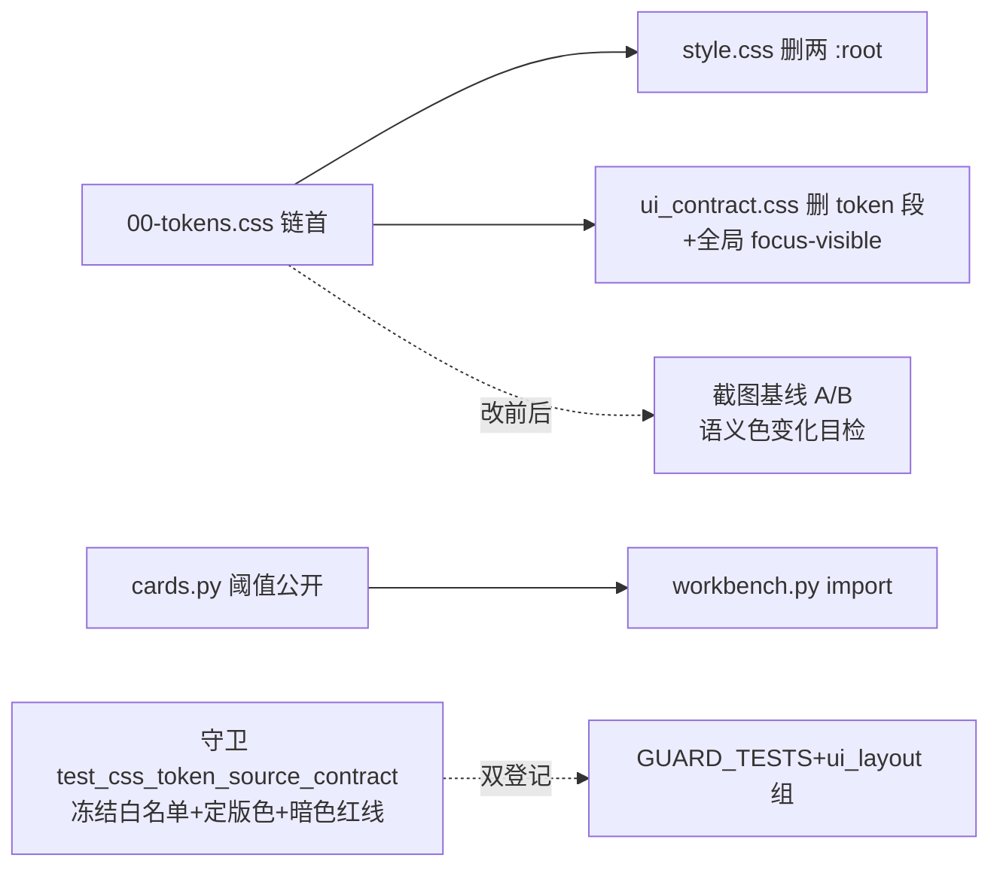

# fusion-tokens-single-source design

## 0. 术语约定

| 术语 | 定义 | 防冲突结论 |
|---|---|---|
| token | 00-tokens.css 中定义的 CSS 自定义属性（--ui-* 为语义层正名） | 与测试锚「token」（test_ui_contract_component_tokens）同词不同物，本 doc 默认指 CSS token |
| 别名块 | 旧名（--primary-color/--success-color/--aps-* 等）→ var(--ui-*) 的映射段，迁移期保留 | 期满删除归 hex-migration 之后的收尾 |
| 裸 hex | CSS 中直接书写的 #RGB/#RRGGBB 颜色字面量 | 00-tokens.css 是全仓唯一允许新增裸 hex 的文件 |
| 冻结白名单 | per-file 裸 hex 计数上限字典（初值=现状），只许降不许升 | 「门禁拒绝新增」的最小机制；hex-migration 逐文件清零 |

## 1. 决策与约束

**需求摘要**（roadmap 第 5 条，模块 T，契约 4.4）：三套语义色分叉值合一定版；token 唯一真相源建档；旧名降别名；负荷阈值双份 Python 定义收编单点；00-tokens.css 之外新增裸 hex 由门禁拒绝。**本条刻意不做**：存量 678 处裸 hex 替换、180 块暗色散规则收敛（均归第 6 条 fusion-hex-migration）；check_css_compat.py 独立门禁脚本（归第 4 条 fusion-frontend-gates）。

**复杂度档位**：Web 应用默认档位，无偏离。

**关键决策**：

1. **00-tokens.css 内容五段**：① `:root` 语义层——从 ui_contract.css:7-79 搬移 --ui-* 约 60 变量并**把三层回退链坍缩为直接定版值**（`var(--primary-color, var(--aps-primary, #2563eb))` → `#2563eb`；tokens 在链首加载，回退链的级联依赖消失；全仓 JS 运行时写入只有 --aps-bar-color 一处已白名单，无其它中间层运行时改写依赖——Codex 审核 grep 核证）；新增契约 4.4 的字号阶（--font-size-1..5 = 12/13/14/17/22px + --font-size-kpi 28px）、间距阶（--space-1..7 = 4/8/12/16/24/32/40px）、圆角三档（--radius-1..3 = 4/6/8px）、--ui-focus-ring（已存在，搬移）。② **壳层与结构 token 段**（Codex 审核补段）：style.css:1-30 的非语义变量**原名整体搬移不改名**——sidebar 9 变量、--sidebar-width/--header-height、--bg-color/--card-bg/--text-main/--text-muted/--border-color、--shadow-sm/md、--radius-md、--font-family；造 --ui- 新名属重命名工程（消费方遍布 style.css），不归本条，留待后续波次评估。③ `html[data-theme="dark"]` 纯 token 重赋值块——从 ui_contract.css:2874-2944 搬移，**只放 --ui-* 与壳层 token 的重赋值；旧名（--primary-color/--aps-*）不写 dark 变体**——别名映射 `var(--ui-x)` 是动态解析，dark 下自动跟随，写了反而是死值副本。④ 别名块（见决策 3）。⑤ 文件头注释：唯一真相源声明 + 负荷阈值跨语言对照注释（值在 Python，见决策 5）。
2. **语义色三值合一是有意视觉变化（影响面拍板）**：定版只动**主色三个**——`--ui-success`（#10b981→#16a34a）、`--ui-warning`（#f59e0b→#d97706）、`--ui-danger`（#ef4444→#dc2626）及其别名旧名；**bg/border/text/muted 四件套不动**（--ui-success-text #15803d 等已是 slate 族内深浅梯度，与定版主色同族——样张 dashboard-restyle-proto.html 也区分主色与 text 色，design 接口示例不得把 -text 写成主色值）。受影响组件清单（A/B 目检重点）：按钮 success/danger 变体（ui_contract.css:304/:513/:1950）、开关 on 态、统计卡 danger 值（style.css:614 区）、flash/badge 三变体、甘特今日线/超期标记（消费 --ui-danger 的 var 引用处）；primary #2563eb 无分叉不动；暗色态 --ui-primary #3b82f6 是设计内换肤保留——三语义主色在暗色块**无独立重赋值**（grep 核实），故暗色同样吃到定版变化，A/B 必须亮暗两套都翻。**改前后跑截图基线 A/B**（anchor-baseline 第二节工具，改前基线 output/ui_baseline/20260612_032724 已留存）。
3. **别名块放 00-tokens.css 尾部独立段**（注释「迁移期别名，hex-migration 后评估删除」）：**只收语义色旧名两组**——style.css 的 --primary-color/--primary-hover/--secondary-color/--success-color/--warning-color/--danger-color 六名 + style.css:709-715 的 --aps-* 6 名，全部映射 `var(--ui-*)`；**壳层/结构变量（--bg-*/--text-*/--border-color/--radius-md/--shadow-*/sidebar 9 变量/--sidebar-width/--header-height/--font-family）不进别名块**——它们按决策 1 段② 原名搬移，本身就是正名无需映射。随后**删除 style.css 两个 :root 块与 ui_contract.css:2874-2944**（搬移而非复制，单一真相源不留副本）。**白名单不动**：`--aps-bar-color`（aps_gantt.css:61，gantt_decorations.js:267 setProperty 的 JS 接口）、`--aps-stack-gap`/`--aps-tone-*`（ui_contract.css 47 处组件作用域变量，非全局 token）。
4. **间距阶双轨并存拍板**：契约 --space-1..7（px 制）与既有 --ui-space-1..6（rem 制，第 5 档 20px vs 契约 24px 冲突）是两套阶——--space-* 是目标态新阶（本条建档），--ui-space-* 是存量消费中的旧阶（.aps-stack-* 等），**原样搬进 00-tokens.css 不改值**，标注「旧阶，消费方迁移归 debox/longtail 波次」。不在本条强改：改值会让全站间距瞬移，违背"本条唯一可见变化是语义色"的承诺。
5. **负荷阈值 Python 单点**：`web/viewmodels/dashboard_workbench_cards.py` 公开 `LOAD_WARNING_RATIO = 0.75` / `LOAD_DANGER_RATIO = 0.90`（模块 docstring 注明唯一真相源+第 15 条 fusion-gantt-load-strip 将消费此契约名）；`dashboard_workbench.py:14-15` 删私有副本改 import（该文件已 import cards 模块，零新依赖）。CSS 侧零改动（severity-* 类已是纯消费方，ui_contract.css:6085-6151）。
6. **裸 hex 冻结白名单用 pytest 守卫**（print_css_contract 同形态先例，不新建 tools/ 脚本不改 run_quality_gate.py）：新建 `tests/web_pages/test_css_token_source_contract.py`——① 00-tokens.css 存在、含定版四色、暗色块内非 token 重赋值行 ≤10；② per-file 裸 hex 计数 ≤ 冻结值字典（初值=实现时实测：ui_contract 383/style 97/aps_gantt 115/calendar_picker 33/frappe-gantt 25/print 5/aps_gantt_simulation 16/resource_dispatch 0/compatibility 4 ± 本条搬移产生的增减，以实测为准），**只许降不许升**——新文件默认 0；hex-migration 逐文件清零时只需同步下调字典值，机制顺滑衔接；**正则口径钉死**：`#[0-9a-fA-F]{3}\b|#[0-9a-fA-F]{4}\b|#[0-9a-fA-F]{6}\b|#[0-9a-fA-F]{8}\b`（3/4/6/8 位全收，alpha 变体不漏）、**整文件状态机剥离 `/* */` 块注释**（含多行块注释，单行剥离会漏）再计数（注释内 hex 不算债）、CSS 文件无 `#id` 选择器误报源（`#gantt` 等 id 选择器后跟字母不满足 `{3}\b` 边界的纯 hex 形态——实现时以三文件抽查比对 grep 验证口径一致）；③ 阈值单点断言（workbench 与 cards 引用同一常量对象 + 全仓 grep 负荷 0.75 仅一处定义）。双登记 QUALITY_GATE_GUARD_TESTS + groups_misc ui_layout 组 target_paths（required registry 与组 target 强制相等的门禁契约，anchor-baseline-prep 实证过）。
7. **token 锚测试迁移**：`test_ui_contract_component_tokens.py:66-76` 硬断言 11 个 token 名在 ui_contract.css——改为断言定义在 00-tokens.css（**事实纠偏**：Codex 审核核证该测试既不在 GUARD_TESTS 也不在任何 required 组——非 required 测试，改动无 gate source 指纹影响；初稿"攒同批吃一次全量重跑"的推断作废。它属全量档，验收时手跑确认绿即可）。
8. **全局焦点环上岗**：00-tokens.css 不放选择器规则（纯变量文件纪律唯一例外评估后否决——规则放 ui_contract.css 末尾新段）：`:focus-visible { outline: none; box-shadow: var(--ui-focus-ring); }` 全局规则 + compatibility.css:45 既有反向抑制保留。散 :focus 样式（style.css 19 处等）不动，清理归第 10/6 条。
9. **加载顺序**：base.html:42 之前插 `<link rel="stylesheet" href="{{ url_for('static', filename='css/00-tokens.css') }}">` 作首条——static_versioning 对新文件零配置生效（mtime 机制）；extra_head 子页 CSS（gantt/calendar/resource_dispatch）均 extends base.html，自动继承链首 tokens。

**明确不做**：存量 678 裸 hex 替换（第 6 条）；180 块暗色散规则收敛（第 6 条）；check_css_compat.py（第 4 条）；--ui-space-* 改值或消费方迁移（debox/longtail 波次）；散 :focus 清理（第 10 条）；12 列栅格落地（契约 4.4 有但属 dashboard-cockpit 等页面级 feature 消费）；templates/JS 引用变更（零消费现状保持）。

## 2. 名词与编排

### 2.1 名词层

**现状**：
- 三处 :root 分裂：style.css:1-30（V2 主题层，success/warning/danger 用 antd 暖调值）、style.css:709-715（V1 收编区 --aps-*，注释已预告本 feature 收编）、ui_contract.css:7-79（--ui-* 约 60 变量，三层回退链桥接旧名）。
- 语义色三值分叉：success #10b981 vs #16a34a；warning #f59e0b vs #d97706；danger #ef4444 vs #dc2626。
- 暗色 token 重赋值块 ui_contract.css:2874-2944（~60 条，含 --ui-*/--primary-*/--aps-* 三段）。
- 阈值双份：dashboard_workbench.py:14-15 与 dashboard_workbench_cards.py:7-8 同名同值私有常量。
- --ui-* 消费 450+ 处（ui_contract 主体 + gantt/calendar/dispatch 子表），templates/JS 零消费。
- 裸 hex 678 处分布 9 文件（resource_dispatch.css 唯一已清零）。

**变化**：
- 新增 `static/css/00-tokens.css`（预估 ~200 行）：五段结构（:root 语义层 / 壳层与结构 token / dark 重赋值 / 别名块 / 头注释）。
- 修改 `static/css/style.css`：删两个 :root 块（:1-30、:709-715，net -36 行）。
- 修改 `static/css/ui_contract.css`：删 :7-79 token 定义与 :2874-2944 暗色 token 块（搬移）；末尾加全局 :focus-visible 规则段。
- 修改 `templates/base.html`：链首插 00-tokens.css。
- 修改 `web/viewmodels/dashboard_workbench_cards.py`（常量公开化）+ `dashboard_workbench.py`（删副本改 import）。
- 新增 `tests/web_pages/test_css_token_source_contract.py`；修改 `test_ui_contract_component_tokens.py`（锚迁移）。

接口示例：

```css
/* static/css/00-tokens.css 结构骨架（五段） */
/* ① 语义层唯一真相源（全仓唯一允许新增裸 hex 的文件） */
:root {
  --ui-primary: #2563eb;
  --ui-success: #16a34a;   /* 定版主色：三值合一，原 #10b981 弃用 */
  --ui-warning: #d97706;   /* 原 #f59e0b 弃用 */
  --ui-danger: #dc2626;    /* 原 #ef4444 弃用 */
  /* bg/border/text/muted 四件套原值搬移不动（--ui-success-text 保持 #15803d 等深浅梯度） */
  --font-size-1: 12px; /* ...五级+KPI */
  --space-1: 4px;      /* ...七档（--ui-space-* 旧阶原样保留同段） */
  --radius-1: 4px;     /* 4/6/8 三档 */
  --ui-focus-ring: 0 0 0 3px rgba(37, 99, 235, 0.35);
}
/* ② 壳层与结构 token（style.css :root 原名搬移：--sidebar-* / --header-height / --font-family / --shadow-* / --bg-color 等） */
:root { --sidebar-width: 240px; /* ... 原名原值，不造 --ui- 新名 */ }
/* ③ 暗色：纯 token 重赋值（本文件特例红线 ≤10，现 0）；只重赋 --ui-*/壳层名，别名旧名不写 dark 变体 */
html[data-theme="dark"] { --ui-primary: #3b82f6; /* ... */ }
/* ④ 迁移期别名块（hex-migration 后评估删除）——var() 动态解析，dark 下自动跟随 */
:root { --primary-color: var(--ui-primary); --success-color: var(--ui-success); --aps-success: var(--ui-success); /* ... */ }
```

```python
# web/viewmodels/dashboard_workbench_cards.py —— 负荷阈值唯一真相源
LOAD_WARNING_RATIO = 0.75  # 第 15 条 fusion-gantt-load-strip 将消费此名
LOAD_DANGER_RATIO = 0.90
```

### 2.2 编排层



**现状**：变量三处分裂靠级联回退链桥接；语义色三值并存；阈值双份。
**变化**：单文件真相源 + 别名兼容；唯一可见变化=语义色定版；阈值单点。

**流程级约束**：
- 搬移不复制：token 在 00-tokens.css 落定后，原定义点必须同步删除（grep 断言旧 :root 块零残留）。
- 语义色变化必须过截图 A/B：改前基线已有（output/ui_baseline/20260612_032724），改后复跑对照，逐页确认变化仅限语义色相关元素。
- 别名块映射必须逐名核对消费方（grep 每个旧名仍可解析）；--aps-bar-color/--aps-stack-gap/--aps-tone-* 三类白名单零 diff。
- gate source 指纹改动只来自新守卫的 registry 双登记（test_css_token_source_contract.py 进 GUARD_TESTS）——与功能改动同批提交，只吃一次缓存全废；test_ui_contract_component_tokens.py 非 required（决策 7 纠偏），其锚迁移不动指纹。
- 改 CSS 前先查 anchor-baseline.md 第一节（本 feature 撞锚预判：⑤ manual 系不碰 manual-* 规则避开；② EXPECTED_PAGE_SIGNALS 文案/id 不动避开；④ ui_contract_component_tokens 主动迁锚）。

### 2.3 挂载点清单

1. 链首加载：`templates/base.html` :42 前插 link — 修改
2. token 文件：`static/css/00-tokens.css` — 新文件
3. 旧定义删除：`static/css/style.css` 两 :root + `static/css/ui_contract.css` :7-79/:2874-2944 — 修改（搬移）
4. 焦点环全局规则：`static/css/ui_contract.css` 末尾新段 — 修改
5. 阈值单点：`web/viewmodels/dashboard_workbench_cards.py` + `dashboard_workbench.py` — 修改
6. 守卫：`tests/web_pages/test_css_token_source_contract.py` 新文件 + `tools/test_registry_data.py` GUARD_TESTS + `tools/test_registry_groups_misc.py` ui_layout 组 — 双登记
7. 锚迁移：`tests/web_pages/test_ui_contract_component_tokens.py` :66-76 指向 00-tokens.css — 修改

### 2.4 推进策略

1. 00-tokens.css 建档（五段）+ base.html 链首 + style.css/ui_contract.css 搬移删除 → required 快测绿 + 浏览器目检
2. 阈值单点化 + 守卫测试（冻结白名单实测初值）+ 双登记 + 锚迁移 → 守卫绿 + test_long_gate_manifest 自洽
3. 截图基线 A/B：复跑 capture_ui_baseline 对照 20260612_032724 基线，逐页确认变化仅语义色 → 目检留痕
4. required 门禁全绿收尾

### 2.5 结构健康度与微重构

##### 评估
- 文件级 — 00-tokens.css ~180 行；守卫测试 ~80 行；均远低于 500 行。ui_contract.css 6277 行**净减**约 140 行（搬出 token 段）。
- 目录级 — static/css/ 加 1 文件，00- 前缀显式表达加载顺序语义。
- compound 检索：无冲突 convention。

##### 结论：不做

##### 超出范围的观察
- ui_contract.css 6277 行远超大文件线——css-layer-split（第 7 条）正是为拆它立项，本条搬出 token 段是第一刀。
- style.css/ui_contract.css 的 px/rem 双写制（13px vs 0.8125rem 同义并存 44+11 处）——归 hex-migration 顺手统一评估。

## 3. 验收契约

关键场景：
1. 00-tokens.css 五段齐全：定版四色直接 hex；字号/间距/圆角/焦点环 token 全；壳层段原名原值（--sidebar-width/--font-family 等）；dark 块纯 token 重赋值（非 token 行 0 ≤ 红线 10）；别名块只收语义色旧名两组（壳层名不进——本身是正名）。
2. 旧定义零残留：style.css 无 :root（grep 断言，壳层变量已随段②搬移）；ui_contract.css :7-79 原 token 定义与 :2874-2944 暗色 token 块已删（--ui-* 定义仅存于 00-tokens.css；--aps-stack-gap/--aps-tone-* 组件作用域变量原地保留）。
3. 全站渲染正常：required 门禁全绿；浏览器几何冒烟 2 条绿（CDP 探针硬锚不撞——壳结构零变化）；20 页 HTML 契约绿。
4. 语义色生效实证：浏览器实测主色三 token 计算值 --ui-success/--ui-warning/--ui-danger = #16a34a/#d97706/#dc2626（getComputedStyle）；四件套不动实证（--ui-success-text 仍 #15803d）；截图 A/B 对照基线 20260612_032724 **亮暗两套都翻**（暗色无独立主色重赋值同样吃到变化），重点组件：按钮 success/danger 变体、开关 on 态、统计卡 danger 值、flash/badge 三变体、甘特超期标记；版面/字号/间距零漂移。
5. 别名兼容实证：--primary-color/--success-color/--aps-success 等旧名消费点（var() 引用共 50+ 处）计算值全部解析为新定版值非 fallback；**壳层旧名 computed-style 断言**：--font-family/--sidebar-width/--bg-color 在浏览器计算值与改前一致（style.css 大面积消费这些名字，断链即整站破相）。
6. 阈值单点：cards.py 公开常量 + workbench.py import 同对象（is 断言）；dashboard 风险卡/待办 severity 行为零变化（既有 dashboard 测试绿）。
7. 守卫测试绿：冻结白名单 per-file 计数断言（实现时实测初值）；故意在任一 CSS 加一个裸 hex → 守卫红（先红后绿验证白名单真拦截）。
8. 焦点环：Tab 键导航任意按钮出现 focus ring（浏览器目检）；compatibility.css 反向抑制不冲突。
9. test_ui_contract_component_tokens.py 锚迁移后绿；test_long_gate_manifest 25 条自洽绿。
10. required 全量 0 失败。

明确不做的反向核对：
- 存量裸 hex 计数不因本条下降（除搬移段自身）——本条无 hex 替换 diff。
- aps_gantt.css/calendar_picker.css/frappe-gantt.css/resource_dispatch.css/print.css 零 diff。
- --aps-bar-color/--aps-stack-gap/--aps-tone-* 白名单零 diff（grep 计数前后一致）。
- templates/（除 base.html 一行）与 static/js/ 零 diff。
- EXPECTED_PAGE_SIGNALS / language_polish 测试零 diff。

## 4. 与项目级架构文档的关系

验收时归并：ARCHITECTURE.md 补「设计令牌单一真相源」条目（00-tokens.css 地位+别名块纪律+裸 hex 冻结白名单机制）；roadmap 第 5 条回写 done——解锁 fusion-hex-migration（第 6 条）与 fusion-frontend-gates（第 4 条）、fusion-gantt-load-strip（第 15 条，阈值契约名已就位）、fusion-analysis-action-refresh（第 28 条）。anchor-baseline.md 第一节后续由 hex-migration 更新缓存税实测数据。
