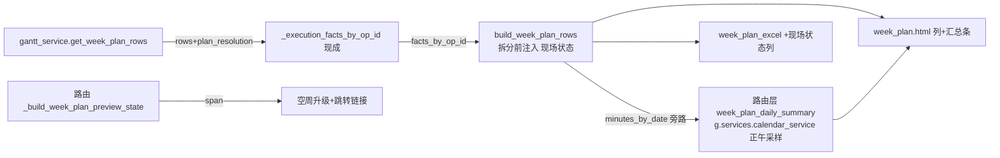

# fusion-week-plan-enrich design

## 0. 术语约定

| 术语 | 定义 | 防冲突结论 |
|---|---|---|
| 现场状态列 | 周计划每行（按日拆分后的段行）显示该工序的现场执行状态中文标签（待开工/生产中/已暂停/异常中/已完工） | 词表单源 `core/models/operation_execution_labels.STATUS_LABELS`（甘特详情/资源派工同源）；同一工序跨多日的所有段行显示同一状态（状态属于工序不属于日段） |
| 每日合计行 | 按日聚合的「计划工时合计 / 单资源容量」摘要行（页面渲染在表格外的日汇总条，不混进数据行） | 计划工时 = 该日全部段时长之和；容量 = 4.6 协议单资源口径——必须明示「按全局工作日历估算，未按单台设备/单人细分」 |
| 空周提示升级 | 空周时告知所选版本计划实际所在日期区间 + 「跳到计划区间」链接 | 复用 `get_plan_time_span_for_view`（dashboard/_load_history_span_dates 同源）；版本无计划行（失败/模拟）时保持现有空文案不加跳转 |

## 1. 决策与约束

**需求摘要**（roadmap 第 16 条，模块 W，items.yaml notes）：周计划是现场事实链路最大的未接页面；拆分后行丢 op_id，注入必须在拆分前（roadmap 已核证）。无前置依赖。模块 W 纪律：只消费已存在的服务/字段，不新增算法。

**复杂度档位**：Web 应用默认档位，无偏离。

**关键决策**：

1. **现场状态列注入点 = `build_week_plan_rows` 拆分前**（roadmap 点名：`_split_by_day` 后行丢 op_id）：`build_week_plan_rows(*, rows, wr)` 扩 `execution_facts_by_op_id: Optional[Mapping[int, Any]] = None` kwarg——`None`（默认）= 调用方不提供事实，列显示「-」（导出口径同）；提供后每行按 `row["op_id"]` 取 fact 的 `actual_status` 走 `execution_status_label`，无 fact 的工序显示「待开工」（与甘特详情 `_execution_detail_meta` 的 `EXECUTION_STATUS_NOT_STARTED` 缺省一致——计划行没有事实=尚未开工，不是数据缺口）。状态写进段行 dict 键「现场状态」。
2. **事实读取复用 gantt_service 现成链路**：`get_week_plan_rows` 内调用已有 `self._execution_facts_by_op_id(rows, plan_resolution)`（gantt_service.py:258 现成方法，甘特页同款——读取失败语义也继承它）。**gantt_service.py 495/500 行红线**：本次在 `get_week_plan_rows` 里加 ~4 行（facts 取数 2 + 双返回解包 1 + data 1 键），`build_week_plan_rows` 的扩展逻辑全落 gantt_week_plan.py（119→~155 行）；超 500 则把 `get_week_plan_rows` 的 data dict 构造收紧抵消（实现时核 wc -l）。
3. **每日合计工时/容量行（4.6 协议）**：新文件 `core/services/scheduler/week_plan_daily_summary.py`（~80 行）。**归属与数据流拍板（Codex 两阻塞收口）**：
   - **分钟数走旁路不走行内键**：`build_week_plan_rows` 拆分循环里把 `(日期, 分钟数)` 累计进独立的 `minutes_by_date: Dict[str, int]`，作为 BuildOutcome 之外的**第二返回值**（函数签名改 `-> Tuple[BuildOutcome[List[Dict]], Dict[str, int]]`）——段行 dict 自始至终零内部键（不存在「写入再 pop」的悖论），聚合数据与公开 rows 物理分离（4.6 输出行禁内部字段天然满足）。gantt_service 把 `minutes_by_date` 放进 data（`"daily_planned_minutes"` 键——日聚合数字非内部身份字段，可出 payload）。
   - **daily_summary 唯一归属 = 路由层**：`build_week_plan_daily_summary(minutes_by_date, *, calendar, week_start, week_end) -> List[Dict]` 由 `scheduler_week_plan.py` 路由调用，calendar 取 `g.services.calendar_service`（容器现成，request_services.py:37/:105-110 cached property）——gantt_service **零 calendar 接触**（495 行红线 + 4.6「新容量逻辑必须落新文件」双满足）；service 侧只多 facts 取数 2 行 + 双返回解包 1 行 + data 1 键（~4 行）。
   - 容量：**正午采样** `calendar.policy_for_datetime(datetime.combine(day, time(12,0)))` 的 `shift_hours×efficiency`，shift_hours≤0 的休息日容量 0；**禁直调 `calculations.capacity_hours`**（4.6 红线：midnight 采样在跨午夜班次把当日容量归属前一日）。采样口径单测钉死（正午 vs 午夜不同结果的跨午夜夹具）。
   - `load_label`：工时/容量文案；容量 0 或算不出 → 「利用率暂时算不了」诚实降级；页面汇总条固定注「容量按全局工作日历估算，未按单台设备/单人细分」（4.6 约束原文）。
4. **空周提示升级**：路由层 `_build_week_plan_preview_state` 扩——空周且版本有计划行时（`get_plan_time_span_for_view(version, plan_role, scenario_id)` 复用 #11 同源 helper `get_plan_time_span_dates` 取 start_date/end_date），文案改「该周没有排程；这个版本的计划在 {start} ～ {end}」+ `jump_link`（WorkbenchLink week_plan 目标带该区间日期——合同现成）；span None（失败/模拟无计划行）保持现有文案零跳转；span 读取异常按 per-call 宽 catch 不升级提示（升级是锦上添花，读取失败不能反而把页面搞挂——但 logger.warning 留痕不静默）。
5. **Excel 导出同列**：`build_week_plan_export_workbook` headers 追加「现场状态」（text_cols 同步 +7 列宽 12）；导出与页面同一行源（rows 已含该列，零分叉）。**导出不含每日合计行**（合计是页面阅读辅助，混进数据行会破坏导出表格的行语义——明确拍板）。
6. **模板**：预览表追加「现场状态」列（th+td，data-col-key="execution_status"）；表格上方插每日汇总条（仅有数据日渲染；空周不渲染）；空周区块按决策 4 渲染跳转链接（消费 link dict，is-disabled 形态同 history 先例）。
7. **测试**：① gantt_week_plan 单测（facts 注入跨日段同状态/无 fact 待开工/None 不提供「-」/内部键不泄漏）；② daily_summary 单测（聚合/正午采样跨午夜钉死/休息日容量 0/容量算不出诚实文案）；③ 空周提示（有 span 升级+链接/无 span 维持/异常不升级留痕）；④ Excel 列断言；⑤ 页面契约（列渲染/汇总条/空周跳转）。不进 GUARD_TESTS（展示链非安全红线）。

**明确不做**：不做负荷条带（#15）；不做周派工单打印（#31，依赖本条）；不改 `_split_by_day`/`fmt_day_segment` 等共享 util；不做按资源细分容量（4.6 明示「未按单台细分」）；不动资源派工/甘特的事实消费形态；合计行不进 Excel；不新增 DB 表/算法（模块 W 纪律）。

## 2. 名词与编排

### 2.1 名词层

**现状**：build_week_plan_rows（gantt_week_plan.py:92，七列中文键段行）；_execution_facts_by_op_id（gantt_service.py:258，甘特页现成）；execution_status_label（operation_execution_labels，词表单源）；get_plan_time_span_dates（schedule_result_view_range:44，#11 同源）；CalendarService.policy_for_datetime → CalendarEngine 跨午夜归属（calendar_engine.py:204-233）；week_plan_excel.py:13（七 headers）；week_plan.html 预览表 :246-271；_build_week_plan_preview_state（scheduler_week_plan.py:112）。

**变化**：
- 修改 `core/services/scheduler/gantt_week_plan.py`：build_week_plan_rows 扩 execution_facts_by_op_id kwarg + 段行「现场状态」键 + 签名改双返回（BuildOutcome, minutes_by_date 旁路）。
- 新增 `core/services/scheduler/week_plan_daily_summary.py`：build_week_plan_daily_summary。
- 修改 `core/services/scheduler/gantt_service.py`：get_week_plan_rows 接 facts 取数传参 + 双返回解包 + data 增 daily_planned_minutes 键（合计 ~4 行；495/500 红线——实现时 wc -l 核对，超则收紧 data dict 构造抵消）。
- 修改 `core/services/scheduler/week_plan_excel.py`：headers +「现场状态」。
- 修改 `web/routes/domains/scheduler/scheduler_week_plan.py`：空周升级（span+跳转链接）+ daily_summary 路由层装配（g.services.calendar_service）。
- 修改 `templates/scheduler/week_plan.html`：列+汇总条+空周跳转。
- 新增测试两文件：`tests/schedule/service/test_week_plan_enrich.py`（gantt_week_plan/daily_summary 单测——service 目录现存）+ `tests/web_pages/test_week_plan_enrich_page.py`（空周升级/列渲染/汇总条页面契约）。不新开目录（门禁分组按既有目录已覆盖）。

接口示例：

```python
# gantt_week_plan.py（签名改双返回——分钟数旁路，段行零内部键）
def build_week_plan_rows(*, rows, wr,
                         execution_facts_by_op_id: Optional[Mapping[int, Any]] = None
                         ) -> Tuple[BuildOutcome[List[Dict[str, Any]]], Dict[str, int]]:
    # 段行新增键「现场状态」：facts None → "-"（调用方未提供，导出同口径）
    # 有 facts：fact.actual_status → execution_status_label；无 fact → "待开工"
    # 同工序跨日所有段行同状态（状态属于工序）
    # 第二返回值 minutes_by_date：{"2026-06-01": 420, ...}（拆分循环累计，不进段行）

# week_plan_daily_summary.py（新文件，路由层调用）
def build_week_plan_daily_summary(minutes_by_date, *, calendar, week_start, week_end) -> List[Dict[str, Any]]:
    # [{"date", "planned_hours_label", "capacity_hours_label", "load_label"}]
    # 容量：policy_for_datetime(正午) 的 shift_hours×efficiency（4.6——禁 capacity_hours）
    # 容量 0/算不出 → load_label「利用率暂时算不了」；来源明示文案由模板固定渲染
```

### 2.2 编排层



**流程级约束**：
- facts 注入在 `_split_by_day` 循环之前按 row 取（拆分后段行无 op_id——roadmap 核证的硬约束）。
- 每日合计的分钟数从段 datetime 算（拆分循环里现成 a0/b0）累进 minutes_by_date 旁路，不反解析「时段」字符串、不经行内键——段行 dict 自始至终零内部字段（4.6）。
- 空周 span 查询 per-call try/except（Exception 宽 catch+logger.warning）：升级失败回落现有文案，不把锦上添花变成新故障点。

### 2.3 挂载点清单

1. `core/services/scheduler/gantt_week_plan.py` — 修改
2. `core/services/scheduler/week_plan_daily_summary.py` — 新文件
3. `core/services/scheduler/gantt_service.py` — 修改（~4 行：facts 2+解包 1+data 1 键；495/500 红线 wc -l 核对）
4. `core/services/scheduler/week_plan_excel.py` — 修改
5. `web/routes/domains/scheduler/scheduler_week_plan.py` — 修改
6. `templates/scheduler/week_plan.html` — 修改
7. 测试两文件（tests/schedule/service/ + tests/web_pages/，不新开目录）

### 2.4 推进策略

1. gantt_week_plan 扩展 + daily_summary 新文件 + 单测 → 绿
2. gantt_service 接线 + Excel 列 + 路由空周升级 → 单测+页面契约 → 绿
3. 浏览器目检（有数据周：列+汇总条；空周：升级文案+跳转）
4. 既有 week_plan 测试回归 + daily gate → 绿

### 2.5 结构健康度与微重构

##### 评估
gantt_week_plan 119→~155（含 minutes_by_date 旁路）；gantt_service 495→~499（facts 2 行+解包 1 行+data 1 键——实现时 wc -l 核对，超 500 则收紧 data dict 构造抵消；calendar 零接触）；新文件 ~80 行；week_plan_excel 111→~112。零结构问题。

##### 结论：不做

## 3. 验收契约

关键场景：
1. 有事实工序：周计划行「现场状态」=生产中/已完工等中文标签（词表单源直锁）；同工序跨两日两段行同状态。
2. 无事实工序显示「待开工」；调用方不提供 facts（None）显示「-」。
3. 每日合计：两段 4h+3h → 「7 小时」；容量=该日 shift_hours×efficiency（正午采样）；跨午夜班次夹具钉死正午≠午夜采样结果（4.6 反例）。
4. 休息日（shift_hours=0）容量 0 → load_label「利用率暂时算不了」；容量来源明示文案渲染。
5. 空周+版本有计划行：文案含计划区间 + 跳转链接（链接 URL 带 start/end 与版本身份）；无计划行版本：现有文案零跳转；span 异常：现有文案+logger.warning。
6. Excel 导出含「现场状态」列且与页面行值一致；导出不含合计行。
7. 段行 dict 恰好八个中文键（七列+现场状态），零内部键（单测键集断言）；daily_planned_minutes 为日聚合数字字典。
8. 既有 week_plan 全部测试零回归（七列断言改八列处同步；build_week_plan_rows 直接调用点 test_scheduler_result_navigation_contract.py:22 同步解包）；daily gate 绿。

明确不做的反向核对：
- `_split_by_day`/`fmt_day_segment`/`_sched_display_utils` 零 diff；calculations.capacity_hours 零调用新增（grep 钉死）。
- 无新表；resource_dispatch/gantt 的事实消费零 diff。
- 并行 WIP（backup.py/system_backup.py）零接触（staged diff 核对）。

## 4. 与项目级架构文档的关系

验收时归并：ARCHITECTURE.md 补周计划现场状态列与每日容量行条目（4.6 口径首个落地实例）；roadmap 第 16 条回写 done（解锁第 31 条周派工单）。
