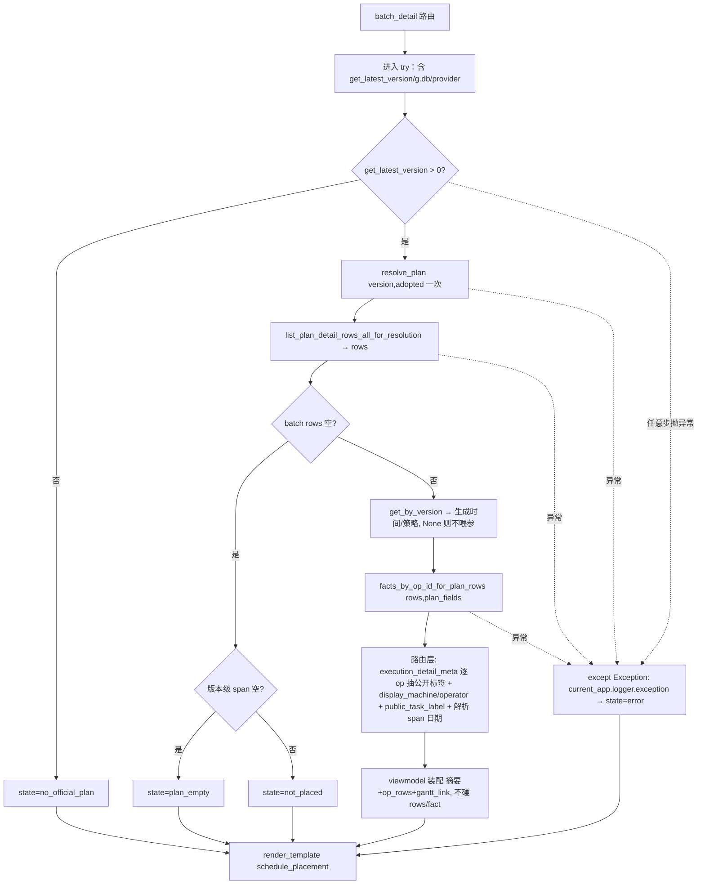

# fusion-batch-detail-schedule-card design

## 0. 术语约定

| 术语 | 定义 | 防冲突结论 |
|---|---|---|
| 排程去向卡（schedule placement card） | 批次详情页新增的一张只读卡：回答「本批次排进了哪个方案、几道工序、什么时间、现场干到哪了、怎么去甘特看」 | 全仓 grep `排程去向/schedule_placement/placement_op_row` 零生产冲突；与下方既有「批次工序（可编辑补充）」卡是两类（工艺模板 vs 已排方案），section-title 显式区分 |
| 最新方案（latest plan） | `adopted` 角色 @ `get_latest_version()`——取历史表最大版本，再按 adopted 解析，与甘特页默认视图同口径（scheduler_gantt.py:177 `svc.resolve_version` 内部即 `get_latest_version()`）。**不**等于"只筛成功结果"：若最新版本是失败/无 adopted 明细的运行，resolve_plan 抛 ValueError→error 态、或版本级无明细→plan_empty 态 | 版本取 `get_latest_version()`（返回 `int(... or 0)`，≤0 视为无版本）；角色硬钉 `ROLE_ADOPTED`；不用 `list_recent(limit=1)`（会选中失败/模拟运行），不按 `batch.status` 门控（以 rows 是否为空为准） |
| 排程去向行（placement_op_row） | 卡内只读工序表的一行视图模型，字段全部公开：`op_label` / `plan_machine_label` / `plan_operator_label` / `execution_status_label` / `actual_start_time_label` / `actual_end_time_label` / `actual_summary_label` / `has_execution_record`（路由从 execution_detail_meta 只取这些 *_label/has_* 键，**不下传**其裸 actual_start_time/actual_end_time 键） | `op_label` 走全站单源 `gantt_task_labels.public_task_label(row)`（gantt_task_labels.py:30，op_code 存在即返回 op_code 本身如「OP10」、为空才回退工序/零件/批次名，与甘特工序标签同源，不内联另拼）；`plan_machine_label/plan_operator_label` 由**路由**走单源 `display_machine(machine_id,machine_name,supplier_name)`/`display_operator(operator_id,operator_name)`（_sched_display_utils.py:46/55，外协 machine_id 空→「外协 {供应商}」/「外协/未分配」）算成 label 后下传；viewmodel/模板**只拿 label 字符串**；HTML **不外显** op_id/schedule_id/scenario_id/source_table/candidate_id 等**计划内部身份** raw 值（machine_id/operator_id/supplier_id 是全站公开业务编号——display_machine/display_operator 本就输出「{编号} {名称}」、全站到处展示，同页可编辑表亦显示，不在禁列；version 以 version_label「v8」形态展示） |
| 现场实际公开标签 | `execution_status_label / actual_start_time_label / actual_end_time_label / actual_summary_label / has_execution_record`（4.10 唯一可外显的现场事实表面，由共享 `execution_detail_meta(fact)` 单源产出）。时间标签为 ISO 形态 `YYYY-MM-DD HH:MM:SS`；无值时 `actual_start_time_label="暂无实际开工"`/`actual_end_time_label="暂无实际完工"`；无任何记录时 `has_execution_record=False`、`actual_summary_label="暂未记录现场实际"` | 本 feature 从 gantt_tasks 抽取共享并去前缀（见 2.5）；无记录行整行用 `actual_summary_label` 单格 muted 显示，与甘特详情面板一致 |

## 1. 决策与约束

**需求摘要**（roadmap 第 18 条，模块 W，依赖 fusion-handrolled-links-adoption 已 done）：批次详情排程去向卡 = ①最新方案工序数/时间跨度摘要 + ②「在甘特中定位本批次」+ ③工序表现场实际列（先查 adopted 计划行拿全身份）。三件齐全（roadmap 主文档第 18 条权威口径；capability-mining 草稿对本卡只列了护栏、并把现场列建议 merge 进既有可编辑表，本设计改为独立只读卡更优）。

**复杂度档位**：走默认档位（项目内常规 Flask 路由 + viewmodel + 模板，无对外 SDK/高并发/一次性工具偏离信号）。

**关键决策**：
1. **数据范围 = adopted@latest_version 单一口径**：版本取 `get_latest_version()`（与甘特默认一致），角色硬钉 `adopted`。批次详情页 URL 无 version/plan_role 维度，不引入这些参数（保持"详情页"语义）。
2. **取数单次解析（全局最优）**：plan/版本 service 均取自 `g.services`（`schedule_plan_query_service`/`schedule_history_query_service`，同 gantt 路由口径；仅 ExecutionFactProvider 由路由从 `g.db` 构造）。路由 `resolution = g.services.schedule_plan_query_service.resolve_plan(version, ROLE_ADOPTED)` **解析一次** → `rows = list_plan_detail_rows_all_for_resolution(version=version, source_table=resolution.source_table, candidate_id=resolution.candidate_id, scenario_id=resolution.scenario_id, batch_id=batch_id)`（生产侧 _for_resolution 入口同款，避免公开 wrapper 内部二次 resolve）→ `plan_fields = {"version": version, "source_table": resolution.source_table, "effective_plan_role": resolution.selected_role, "scenario_id": resolution.scenario_id}`（与 dashboard.py:325-332 同款；`selected_role` 经 scope_from_plan_row 的 `_field('effective_plan_role','selected_role')` 兼容）。**全 keyword 传参**（list_plan_detail_rows_all* 均 `*` kwonly）。`batch_id` 全程用 `batch_service.get()` 规范化后的 `b.batch_id`（同既有 :216 `list_batch_operations(batch_id=b.batch_id)`），保证取数/gantt 链接/展示三处批次号一致。plan_fields 形状与 web/routes/dashboard.py 同款（version 键随该惯例保留，scope 实际从 row.version 取，无害冗余）。
3. **现场事实走 4.10 唯一入口**：`ExecutionFactProvider(g.db, current_app.logger).facts_by_op_id_for_plan_rows(rows, plan_fields)`，**不传 include_op_ids**（只读卡：缺事实的工序自然走「暂未记录现场实际」，传 include_op_ids 会对缺事实 op raise）。禁 op_id-only（毒化口 raise）。每行经共享 `execution_detail_meta(facts.get(op_id))` 抽公开 *_label，绝不把 ExecutionFact 整体或内部身份字段送进 viewmodel/模板。
4. **「定位甘特」走 WorkbenchLink gantt 目标（日期解析在路由层）**：路由先把 rows 的 `start_time/end_time` 用 `parse_dt`（_sched_display_utils 公开名）解析，**跳过不可解析的值**，对可解析的 start 求 min、可解析的 end 求 max（两端各自独立——求"含本批次的窗口边界"只需端点可解析，不强制逐行 `st<et`），再各取 `.date().isoformat()` 得 `span_from_date`/`span_to_date`（`YYYY-MM-DD`，给 gantt 链接）；若 start 或 end 一端无任何可解析值则对应 date 为 None。**span_label（摘要里含时分的中文跨度）也由路由算**：`format_public_datetime(min_start_value)` + " ～ " + `format_public_datetime(max_end_value)`（坏值→「时间记录异常」不崩），作为字符串下传——viewmodel 不碰 rows、只摆放 span_label。viewmodel 用 `ctx = build_workbench_plan_context(version=version, date_from=span_from_date, date_to=span_to_date, batch_id=batch_id, [generated_at=, strategy=])`（plan_role 不显式传，默认即 ROLE_ADOPTED），再 `build_workbench_link(ctx, "gantt", label="在甘特中定位本批次", view="machine", batch_id=batch_id)`。批次跨度作窗口保证甘特按周渲染时该批次落在可见窗口内（finding-08）；gantt 目标 date_style=start_end→输出 start_date/end_date，甘特 `_parse_date` 严格 `%Y-%m-%d`，故必须传日期粒度。**span 日期算不出（rows 时间全坏）→ ctx 缺 date_from/date_to → build_workbench_link 判 disabled → 模板不渲染按钮**（不出会跳错误页的链接）。
5. **生成时间/策略取数（None 优雅降级）**：路由 `hist = get_by_version(version)`（返回 Optional）；`hist` 非 None → 把 `hist.schedule_time`/`hist.strategy` 交 viewmodel 喂 `build_workbench_plan_context(generated_at=, strategy=)`；`hist` 为 None（极端竞态，版本被删）→ **不喂参**（generated_at/strategy 走 _UNSET → label "-"），摘要照常出、不当 error（对齐 gantt scheduler_gantt.py:145-147 / week_plan 的 None 防护口径）。`generated_at_label`/`strategy_label`/`version_label` 由 build_workbench_plan_context 单点转换（4.2 口径：坏时间「时间记录异常」、未知策略走 #8 词表）。
6. **诚实五态 + 整段 try/except + current_app.logger**：取数全段（含 `get_latest_version()` 与 `g.db`/ExecutionFactProvider 构造）**一并**包在 try/except 内。状态：`get_latest_version()≤0`→`no_official_plan`；批次 rows 空时再查**版本级**是否有 adopted 明细（`get_plan_time_span_for_resolution(version=version, source_table=resolution.source_table, candidate_id=resolution.candidate_id, scenario_id=resolution.scenario_id)`，无 batch_id——**复用同一 resolution，不二次 resolve**）：版本级也空→`plan_empty`（「最新方案暂无可用排程明细」，不诬指本批次）、版本级有→`not_placed`（「本批次未排入最新方案」）；正常→`ok`；任何异常→`except Exception: current_app.logger.exception(...)` + `error`（**不静默吞**，只让本卡降级、整页主功能正常不 500）。`resolve_plan` 抛 `ValueError`（非 ValidationError），由这层宽 except 兜住（对齐项目「宽 except 必配 logger.exception」惯例）。

**明确不做**（可被 grep/测试反向核对）：
- 不点亮全站顶栏胶囊（不调 `publish_workbench_navigation_context`、不碰 web/navigation_context.py）——版本/时间/策略在**本卡内**自渲染。
- 不改既有「批次工序（可编辑补充）」卡与其 DOM 锚（`#batchOpsTable`/`data-linkage-row`/`data-op-id`/`batch-detail-linkage-data`/`window.__APS_BATCH_DETAIL_LINKAGE__`/`tplMachineOptions` 等，test_batch_detail_linkage.py 钉死）——新卡是**追加**的独立只读卡。
- 不把 batch_detail 纳入 EXPECTED_PAGE_SIGNALS（当前非 UI 几何契约页，不扩契约面）。
- 第一版只读，**零排产数据写入**；不按 `batch.status` 门控；不引入懒加载/性能预算（单批次行数小，归第 25 条）。

**前置依赖**：fusion-handrolled-links-adoption（done，gantt/batch_detail 已在 TARGET_PAGE_PATHS 白名单）；list_plan_detail_rows_all_for_resolution / get_plan_time_span / facts_by_op_id_for_plan_rows / get_latest_version / get_by_version / build_workbench_link / display_machine|display_operator / public_task_label 均已存在。

## 2. 名词与编排

### 2.1 名词层

**现状**：批次详情路由 `scheduler_batch_detail.py:210 batch_detail(batch_id)`（:209 装饰器 `@bp.get("/batches/<batch_id>")`）`render_template` 喂模板 15 个 context 变量，全是 batch 基础信息 + 可编辑工序表所需的资源选项/联动映射；**无任何排产版本/方案解析**（`_resolve_lazy_select_enabled` 是惰性下拉开关，非排程解析）。`ScheduleDetailRow`（schedule_rows.py:20-44）23 键 TypedDict，含 op_id/schedule_id/version/batch_id 内部身份 + machine_name/operator_name/supplier_name/op_code/op_type_name/start_time/end_time 公开字段。

**变化**：新增纯视图模型（无新持久化类型），作为 `schedule_placement` context 变量喂模板：

```
schedule_placement = {
  "state": "ok" | "no_official_plan" | "plan_empty" | "not_placed" | "error",
  "message": str,                 # 非 ok 态的诚实中文文案；ok 态为 ""
  "version_label": str,           # build_workbench_plan_context 输出（"v8" 形态）
  "generated_at_label": str,      # 4.2 口径：format_public_datetime，坏值"时间记录异常"，hist None→"-"
  "strategy_label": str,          # #8 词表单源 strategy_display_label
  "op_count": int,                # len(rows)
  "span_label": str,              # "2026年6月1日 08:00 ～ 2026年6月3日 17:00"（format_public_datetime，坏值"时间记录异常"不崩）
  "gantt_link": dict | None,      # build_workbench_link 输出（含 disabled/url）；disabled 或 span 日期缺→模板不渲染按钮
  "op_rows": List[placement_op_row],  # 仅 ok 态非空；公开字段见 0 节
}
```
示例（输入→输出）：批次 B1 在 v8 adopted 排了 3 道工序、第 1 道现场已完工 → `state="ok"`, `op_count=3`, `span_label="2026年6月1日 08:00 ～ 2026年6月2日 12:00"`；`op_rows[0]`：`op_label="OP10"`（op_code 本身）, `plan_machine_label="CNC-01 数控车床"`, `execution_status_label="已完工"`, `actual_start_time_label="2026-06-01 08:05:00"`, `actual_end_time_label="2026-06-01 16:30:00"`, `has_execution_record=True`；`op_rows[1/2]`：`has_execution_record=False`, `actual_summary_label="暂未记录现场实际"`；外协行 `plan_machine_label="外协 鑫源机械"`；`gantt_link.disabled=False`。

### 2.2 编排层



**现状**：`batch_detail` 路由线性取 batch + ops + 资源选项 → render。无版本/方案/现场分支。
**变化**：在 `view_ops = _build_view_ops(...)`（:242）之后、`render_template`（:244）之前插入一段**整体被 try/except 包裹**的排程去向取数（含 `get_latest_version()` 与 `g.db`/ExecutionFactProvider 构造）。路由层产出干净数据包（摘要原值 + op_rows 公开 label dict + span 日期字符串），传给 viewmodel 装配——**viewmodel 不接触 rows/ScheduleDetailRow/ExecutionFact**，只调同层 build_workbench_plan_context/build_workbench_link。控制流线性 + 四个诚实早退分支，无并发无状态机。既有路由契约测试（注入精简 services、无 history/plan_query service、无 g.db）落入 error 态仍返回 200（既有断言不破）；s4 另加提供 stub 的 ok 态路由测试，不让"绿"建立在 error 兜底之上。

### 2.3 挂载点清单（按「删了它 feature 是否消失」收紧）

1. `templates/scheduler/batch_detail.html` L26 后新增 `<div class="card">`（排程去向卡 DOM，外层 `` 守卫）——删了卡就没了。
2. `scheduler_batch_detail.py` 路由内排程去向取数段 + `render_template(..., schedule_placement=...)` 新增实参——删了卡无数据。
3. 新建 `web/viewmodels/scheduler_batch_schedule_placement.py`（卡视图模型装配）——删了卡无装配逻辑。

（结构归并项：新建 `core/services/scheduler/execution_fact_presentation.py` 的 `execution_detail_meta`——4.10 现场标签全站单源，gantt 也消费，非"删了 feature 就消失"的登记项，见 2.5。）

### 2.4 推进策略（按 paradigm 维度切片）

- **步 1（结构微重构，独立验证退出）**：把 `_execution_detail_meta`（+私有伴生 `_fmt_fact_dt`/`_fact_has_site_record`）从 gantt_tasks.py 抽到新建 `execution_fact_presentation.py`，**去前缀改名公开 `execution_detail_meta`**，gantt_tasks 改 import 公开名回来（datetime util 不搬、新模块从 `_sched_display_utils` import 公开名 `parse_dt`/`fmt_dt`——gantt_tasks 内的 `_parse_dt`/`_fmt_dt` 只是其 as 别名；`_execution_visuals` 甘特着色留 gantt_tasks）；顺手更新 gantt_week_plan.py:91 注释指向新模块。退出信号：gantt 任务相关测试全绿（行为零变）+ gantt_tasks.py 行数下降 + gantt_tasks 无对被搬函数的悬挂引用 + 新模块<500 + 全仓 `execution_detail_meta` 单一定义点。
- **步 2（编排骨架 + 计算节点）**：路由整段 try/except 取数（get_latest_version→resolve_plan 一次→list_plan_detail_rows_all_for_resolution→rows 空时版本级 span 查询→get_by_version→facts_by_op_id_for_plan_rows→逐 op execution_detail_meta + display_machine/operator + public_task_label + 解析 span 日期）+ 新 viewmodel 装配（摘要 *_label 经 build_workbench_plan_context；op_rows 仅公开 label；gantt_link；不碰 rows/fact）+ 五态诚实分支。退出信号：viewmodel/路由单测覆盖五态。
- **步 3（持久化）**：无（纯只读消费既有查询）。
- **步 4（前端 + 测试）**：模板新卡（摘要 aps-summary-grid + 定位甘特按钮[disabled/无 url 不渲染] + 只读工序表），外层 `` 守卫；路由 ok 态契约测试（stub services + g.db）+ 既有契约/linkage 测试保持绿 + execution_fact_presentation 单测 + gantt 回归。退出信号：五态目检 + daily gate 绿。

### 2.5 结构健康度与微重构

**先查 compound convention**：现场标签抽取 `_execution_detail_meta` 现为 gantt_tasks 模块私有；`execution_status_label` 等枚举标签已在 `core/models/operation_execution_labels.py` 共享。无既有 convention 禁止抽取。佐证 divergence 真实存在：`gantt_week_plan.py:91` 已有一处窄 status-label 实现（注释自承"与甘特详情 _execution_detail_meta 缺省一致"）。

**文件级**：`scheduler_batch_detail.py` 265/500（余 235）；`scheduler_workbench_links.py` 461/500、`reports_page_support.py` 499/500——**禁往这两个加码**，故卡装配落**新 viewmodel 文件**。`gantt_tasks.py` 392/500（抽出后下降）。

**目录级**：web/viewmodels/ 与 core/services/scheduler/ 均非摊平到危险密度；新增各 1 文件可接受。

**结论：微重构（拆文件）**——抽 `_execution_detail_meta`（+伴生）到 `core/services/scheduler/execution_fact_presentation.py` 并去前缀为公开 `execution_detail_meta`，作为 4.10「ExecutionFact→公开显示标签」全站单源；gantt_tasks 与批次卡**路由**各自 import（viewmodel 禁 import core.services，故 fact→label 抽取放**路由层**，viewmodel 只收纯 label dict）。理由：批次卡重复实现该映射会在 4.10 关键路径制造第二套口径（divergence 风险）；跨模块 import `_`-私有又是 smell。抽取属"只搬不改行为"，由现有 gantt 测试做回归锚。

**建议沉淀的 convention**：「ExecutionFact→前端公开标签只走 execution_fact_presentation.execution_detail_meta 单源；现场 status label 统一走 execution_status_label，新消费方禁内联状态文案/重复实现 4.10 标签映射」——若验收通过，建议 cs-decide 归档（措辞顺带覆盖 gantt_week_plan 那类窄实现）。

**超出范围的观察**（不阻塞，提示后续走 cs-refactor）：批次详情页「可编辑工序表」与本卡「已排方案工序表」是工艺模板 vs 已排结果两套工序视图，长期可统一信息架构，属页面信息架构重构非本卡范围。

## 3. 验收契约

| 场景 | 触发 | 期望可观察结果 |
|---|---|---|
| 正常排程去向 | 批次在 latest adopted 有排程 | 卡显示 vN/生成时间/策略/「N 道工序」/跨度；只读工序表逐行显示工序/计划设备/计划人员/现场状态/实际起止；「在甘特中定位本批次」按钮可点（gantt_batch+version+批次跨度日期窗口，start_date/end_date 为 YYYY-MM-DD） |
| 现场实际混合 | 部分工序有现场记录、部分无 | 有记录行显示「已完工/进行中」+ ISO 实际起止；无记录行显示「暂未记录现场实际」（actual_summary_label，muted），不留空不报错 |
| 外协工序 | 工序 machine_id 空 | 计划设备列显示「外协 {供应商}」或「外协/未分配」（走单源 display_machine），不空白 |
| 批次未排入 | 版本级有明细但本批次 rows 空 | 卡显示「本批次未排入最新方案」muted，**无**定位甘特按钮；非错误态 |
| 整版无明细 | get_latest_version>0 但该版本 adopted 版本级 span 空 | 卡显示「最新方案暂无可用排程明细，请确认排产是否成功」muted（区别于「本批次未排入」，不诬指本批次） |
| 尚无方案 | get_latest_version()≤0 | 卡显示「尚无排产方案」muted；无按钮 |
| 取数失败 | resolve_plan/list/facts 抛异常 | current_app.logger.exception 记一次；卡显示「排程信息读取失败，请到甘特图或排产历史确认。」；**整页基础信息卡 + 可编辑工序卡正常**，不 500 |
| 坏时间值 | 计划行 start/end 不可解析 | span 端点用 _parse_dt 跳坏行求 min/max；全坏→span_label「时间记录异常」+ date_from/date_to 算不出→**gantt_link disabled→定位按钮不渲染**（不出会跳错误页的链接） |
| 身份护栏（反向，**限新卡范围**） | — | **排程去向卡 op_rows + 卡内可见文本/data-\* 属性**不外显 op_id/schedule_id/scenario_id/source_table/candidate_id 等**计划内部身份**（machine_id/operator_id/supplier_id 是全站公开业务编号、经 display_machine/display_operator 正常展示，version 以 version_label 展示，**不在禁列**）。**例外**：`gantt_link.url` 作为 WorkbenchLink 合同链接，其 query 依合同携带 version/plan_role=adopted/gantt_batch/start_date/end_date——这是全站「定位甘特」按钮同款导航参数（test_scheduler_workbench_links_contract 钉死 plan_role 在 required_params），属功能路由非身份展示，不在本反向核对范围。既有可编辑工序卡的 data-op-id/name=machine_id 亦不在范围 |
| 唯一入口（反向） | — | 现场事实只经 facts_by_op_id_for_plan_rows 读；本 feature 代码无 facts_by_op_id/list_by_op_ids 调用 |
| 既有锚点不破 | — | test_batch_detail_linkage.py（render 不含 schedule_placement，靠 `` 守卫）/ test_scheduler_batch_detail_route_contract.py 既有断言全绿；另有新增 ok 态路由测试（stub services+g.db）覆盖正常态 |
| gantt 单源不变（反向） | — | execution_detail_meta 抽取后 gantt 任务相关测试全绿；全仓 `execution_detail_meta` 单一定义点（gantt_tasks 改 import 公开名） |

**明确不做反向核对项**：grep 确认无 `publish_workbench_navigation_context` 调用；无 `batch.status` 门控分支；无 url_for 直拼 gantt（走 build_workbench_link）；batch_detail 未进 EXPECTED_PAGE_SIGNALS；无任何写排产数据调用。

## 4. 与项目级架构文档的关系

- **新增模块**：`core/services/scheduler/execution_fact_presentation.py`（4.10 现场标签单源）、`web/viewmodels/scheduler_batch_schedule_placement.py`（卡装配）。ARCHITECTURE.md 第 3 节模块索引未单列「批次详情页」；验收时补一行指向新 viewmodel + 现场标签单源模块。
- **契约遵守**：模块 W 职责（只消费既有服务/字段、走公开 *_label）+ 4.10（现场事实唯一入口/公开标签/禁透传/非 adopted 无事实）+ 4.7（adopted 聚合护栏——本卡硬钉 adopted、URL 无 plan_role 维度、不随 request 身份切换，天然满足）+ 4.2（版本/时间/策略 *_label 经 build_workbench_plan_context 单点转换）+ 第 11 条 WorkbenchLink 合同（gantt 目标，注意 facts_by_op_id_for_plan_rows 生产消费方现已 5 处）。**借鉴** 4.11（N 模块）的只读/诚实态原则（本 feature 属 W 模块，4.11 编号挂 N，仅借鉴纪律不作直接契约编号）。
- **架构归并提示**：验收时在 .codestable/architecture/ 记录「ExecutionFact→公开标签单源 = execution_fact_presentation.execution_detail_meta」全站约定（候选 cs-decide）；并更新 roadmap 4.10 漂移的 file:line（_execution_detail_meta 实际 :185-210、抽取后迁新模块 execution_fact_presentation.execution_detail_meta）与 gantt_week_plan.py:91 注释指向。
