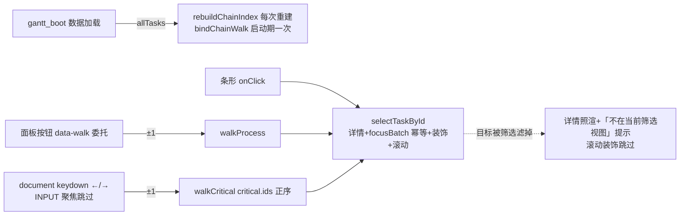

# fusion-chain-walk-navigation design

## 0. 术语约定

| 术语 | 定义 | 防冲突结论 |
|---|---|---|
| 工艺链巡检 | 详情面板「上一道/下一道」按钮：**沿后端已连的 process dependency 边走**（同 (batch_id,piece_id) 组内按 (seq,start,id) 排成线性链——同 seq 并行任务也被线性串起，语义=按排程顺序沿边、非严格工序号；piece_id None/空串归 "" 组，同批次缺件号任务串成一条链，按钮 title 注「按排程顺序」防误解） | 前驱=allTasks 的原始 `dependencies`（单前驱 id 字符串）；**不读 currentTasks.dependencies**（被 depsMode 重写：critical 模式是关键链前驱、batch 模式空串）；后继=前驱反转建 nextByFrom Map |
| 关键链巡检 | ←/→ 键沿 `state.critical.ids` 数组移动（后端 reversed 后正序：链起点→汇点） | 与工艺链是两条独立轴：工艺链=单批次内 seq 序；关键链=跨批次的总工期约束链。按钮归工艺链、方向键归关键链，UI 文案明示两者 |
| 程序化选中 | `selectTaskById(id)`：渲染详情+装饰刷新+横向滚动定位的统一入口 | 现状选中逻辑闭在 onClick 闭包（focusBatch toggle——连续巡检同批次会聚焦关掉再开），抽出后 onClick 与巡检共用；巡检路径 focusBatch 设为目标批次（幂等赋值非 toggle） |
| 视图外目标 | 巡检目标在 allTasks 但被前端筛选（onlyOverdue/filterBatch/filterResource）滤出 currentTasks | 详情面板照常渲染（纯数据），滚动与条形高亮跳过，面板顶部提示「该工序不在当前筛选视图中」——不静默装常态也不挡巡检 |
| 范围外目标 | 关键链 id 连 allTasks 都没有（关键链按整版计划回溯；/gantt/data 的 tasks 按当前日期窗口+服务端筛选截取） | walkCritical **跳过缺失 id 继续向同方向找**（链的连续巡检价值优先）；发生跳过时面板提示「已跳过 N 道当前范围外的工序」（防用户误以为链连续可见）；该方向无任何可达任务时停在原地并提示「关键链后续工序在当前日期范围/筛选之外」；无数据时按键空操作 |

## 1. 决策与约束

**需求摘要**（roadmap 第 13 条，模块 W）：关键链分析的真实用法是「沿链巡检」而非逐条点查——详情面板加 上一道/下一道 工艺导航（前端 dependencies 反查，零后端改动）+ 关键链 ←/→ 巡检（normalizeCriticalChain ids 正序）。依赖 #12 已 done（同在详情面板区施工，冲突已解除）。模块 W 纪律：只消费已存在字段。

**复杂度档位**：Web 应用默认档位，无偏离。

**关键决策**：

1. **新文件 `static/js/gantt_chain_walk.js`**（~120 行，挂 `ns.chainWalk`）：巡检状态（`currentTaskId`——state 现状只有 focusBatch 没有选中 id）+ 两套索引（`prevByFrom/nextByFrom` 工艺链 Map，建在 **allTasks 原始 dependencies** 上——allTasks=本次 /gantt/data 返回范围的全量（日期窗口+服务端 gantt_batch/gantt_resource 筛选后），非整版计划；关键链直接用 `state.critical.ids` 数组 indexOf）+ `selectTaskById(id, {scroll})` 程序化选中 + `walkProcess(±1)/walkCritical(±1)` 两个巡检函数。**生命周期两分**：事件绑定（委托/keydown）只绑一次（`bindChainWalk` 幂等，boot 启动期调用）；工艺链索引与 byId Map **每次数据加载后重建**（`rebuildChainIndex` 由 boot 在写入新 allTasks 后、`applyCriticalChainToState` 同期调用——「加载」重新 fetch 会换掉 allTasks，索引必须跟着换否则指向旧数据）；前端筛选变化不重建（索引基于本次接口返回全量）。
2. **selectTaskById 统一选中语义**：renderTaskDetail（task 来自 allTasks byId）→ `state.focusBatch = task.meta.batch_id`（**幂等赋值，不 toggle**——修「连续巡检同批次聚焦闪烁」）→ safeDecorateDynamic → 横向滚动：**gantt_render.js 把私有 `scrollToAnchor` 泛化导出为 `ns.scrollToTaskStart(task)`**（像素公式现成但它是模块私有且文件只导出 applyFilters/render——新文件无法直接调用，必须显式导出；不复制公式防双份真相；导出注释注明「仅供 chainWalk 程序化选中调用」收边界）；调用全程 try/catch 降级（DOM shim 无滚动 API，生产防御与可测性双赢）。现有 onClick 闭包改调 selectTaskById（行为变化仅 focusBatch 从 toggle 变幂等：二次点击同批次不再清聚焦）。**清聚焦入口取舍**：toggle 是现状唯一的窄清聚焦入口（「重置视图」按钮也清但连缩放/筛选/连线全重置，gantt_ui.js:250-277）——本 feature 在筛选区**新增「清除聚焦」小按钮**（`ganttClearFocus`，仅 `state.focusBatch=""`+装饰刷新）补回该能力，不让用户为取消高亮付出重置全视图的代价。
3. **详情面板巡检按钮**：buildTaskDetailHtml 头部区追加巡检行——「上一道/下一道」`<button>`（无前驱/后继时 disabled+title 原因）+ 关键链位置徽标（「关键链 3/7」，非关键链任务显示「不在关键链」）。**事件容器级委托**：`#ganttTaskDetail` 上一次性绑 click 委托（按 `data-walk` 属性分发）——面板 innerHTML 整体重写不丢绑定（现有 detail_links 全是 `<a>` 无事件先例，委托是唯一稳妥挂法）。
4. **keydown 挂 document**（DOM shim 可测：window 无 addEventListener）：←/→ 走 walkCritical；**输入框/选择框聚焦时跳过**（`e.target` 是 INPUT/SELECT/TEXTAREA 直接 return——仓库 keydown 先例无此防护，本次必须做，否则批次筛选框里按方向键移光标会跳任务）；无选中任务或关键链不可用时按键空操作（不抢默认行为）。
5. **视图外目标降级**：walkProcess/walkCritical 的目标 id 不在 currentTasks（被筛选滤掉）时——详情照渲（数据来自 allTasks）、滚动与装饰跳过、面板提示「该工序不在当前筛选视图中，清除筛选后可在图上看到」。不阻断巡检链（链的连续性 > 视图一致性）。
6. **测试**：① 按钮可用态/disabled/title/徽标断言走 `ns.popup.buildTaskDetailHtml(...)` 返回字符串（DOM shim innerHTML 剥标签，面板内按钮不可 querySelector/不可点）；巡检动作走 `ns.chainWalk.walkProcess/walkCritical` 程序化 API 后断言面板 textContent；② keydown：`document.dispatchEvent(Object.assign(new FakeEvent("keydown"), {key:"ArrowRight"}))`（FakeEvent 无 key 手动附；dispatch 节点自动成 target）；INPUT 跳过用 input 节点自身 dispatch 验证；③ 索引正确性反例（depsMode=critical 下 currentTasks.dependencies 被改写不影响工艺链反查）；④ 范围外/视图外两级降级断言；⑤ 既有甘特测试零回归（focusBatch toggle 断言按幂等新语义改+清聚焦按钮断言）。

**明确不做**：零后端改动（gantt_tasks.py/gantt_critical_chain.py/payload 零 diff——grep 钉死）；不做跨批次工艺链（_attach_process_dependencies 只连同批次同件，链到头就 disabled）；不做巡检历史栈（前进/后退）；不动 depsMode 三态与连线渲染；不做条形 tabindex/焦点无障碍改造（归 #27 controls-rework 议）；不改 detail_links 后端装配。

## 2. 名词与编排

### 2.1 名词层

**现状**：dependencies 由 `_attach_process_dependencies` 写单前驱 id 字符串（gantt_tasks.py:323-350，按 (batch_id,piece_id) 分组 seq 排序，meta.dependency_from 同值）；前端 `buildRenderTasks` 会按 depsMode **改写** currentTasks 的 dependencies（gantt_contract.js:341-362）；`state.critical.ids` 正序数组（后端 _backtrace_chain reversed，gantt_critical_chain.py:338；normalizeCriticalChain 去重保序，gantt_contract.js:67-127）；选中逻辑闭在 onClick 闭包（gantt_render.js:314-322，focusBatch toggle）；详情面板 `#ganttTaskDetail` innerHTML 整体重写（gantt_popup.js:138-146）；byId Map 先例 buildTaskMapById 基于 currentTasks（gantt_decorations.js:72-80）；横向滚动公式 scrollToAnchor（gantt_render.js:224-239）；DOM shim 限制：innerHTML 剥标签、无 window.addEventListener、无 scrollIntoView（test_gantt_critical_outline_sync.py:48-701）。

**变化**：
- 新增 `static/js/gantt_chain_walk.js`：chainWalk 模块（索引/选中状态/walkProcess/walkCritical/selectTaskById/keydown 与委托绑定）。
- 修改 `static/js/gantt_popup.js`：buildTaskDetailHtml 追加巡检行（按钮+关键链徽标+视图外提示）。
- 修改 `static/js/gantt_render.js`：onClick 改调 `ns.chainWalk.selectTaskById`；scrollToAnchor 滚动公式复用（抽参或直接调用）。
- 修改 `static/js/gantt_boot.js`：数据加载后 initChainWalk（建索引+绑委托/keydown 一次）。
- 修改 `templates/scheduler/gantt.html`：script 链补 gantt_chain_walk.js（加载顺序进 ui-gantt.md 协议）。
- 修改 `static/css/aps_gantt.css`：巡检按钮行样式（~15 行，纯 token）。

接口示例：

```js
// gantt_chain_walk.js（新文件，挂 ns.chainWalk）
ns.chainWalk = {
  bindChainWalk(),            // 绑委托/keydown——只绑一次（幂等守卫）
  rebuildChainIndex(),        // allTasks 建 prevById/nextById/byId——每次数据加载后重建
  selectTaskById(id, opts),   // 详情渲染 + focusBatch 幂等赋值 + 装饰 + 横向滚动
  walkProcess(delta),         // ±1 沿工艺链（allTasks 原始 dependencies 反查）
  walkCritical(delta),        // ±1 沿 state.critical.ids 正序（缺失 id 跳过；跳过时面板提示）
  currentTaskId(),            // 巡检状态读取（测试用）
};
// 详情面板巡检行（buildTaskDetailHtml 内）
// <div class="aps-gantt-task-walk">
//   <button data-walk="prev" {disabled+title}>上一道</button>
//   <button data-walk="next" {disabled+title}>下一道</button>
//   <span class="aps-gantt-task-walk-cc">关键链 3/7</span>  // 或「不在关键链」
// </div>
```

### 2.2 编排层



**流程级约束**：
- 工艺链索引必须建在 allTasks 原始 dependencies 上（currentTasks 被 depsMode 重写——反例测试钉死）。
- keydown 必须跳过表单控件聚焦态；无选中/链不可用时空操作不 preventDefault。
- 视图外目标：详情渲染照常、滚动装饰跳过、提示明示——不静默不阻断。
- scrollIntoView/scrollLeft 调用全部 try/catch 或类型防御（DOM shim 无这些 API，生产降级=可测性）。
- 零后端 diff；script 加载顺序钉死：chain_walk 在 **gantt_decorations.js 之后、gantt_render.js 之前**（消费 popup.renderTaskDetail 与 decorations 动态装饰导出——早于 decorations 且按既有「头部取依赖缺失即 return」模式写会静默失效）。模块内依赖一律**运行时读取**（函数体内取 ns.xxx，不在 IIFE 头部解构缓存 render/decorations 的导出），双保险。

### 2.3 挂载点清单

1. `static/js/gantt_chain_walk.js` — 新文件
2. `static/js/gantt_popup.js` buildTaskDetailHtml 巡检行 — 修改一处
3. `static/js/gantt_render.js` onClick 改调 selectTaskById + `ns.scrollToTaskStart` 导出 — 修改两处
4. `static/js/gantt_boot.js` bindChainWalk（一次）+ rebuildChainIndex（每次数据加载） — 修改两处
5. `templates/scheduler/gantt.html` script 链一行（decorations 后 render 前）+ 筛选区「清除聚焦」按钮 — 修改两处
6. `static/js/gantt_ui.js` 清除聚焦按钮绑定 — 修改一处
7. 测试（tests/gantt/ JS contract 扩展）

拔除推演：删新文件+回退 popup 巡检行/render onClick 与导出/boot 两调用/模板 script 与按钮/ui 绑定+删测试断言 → 行为回到「点查」现状（focusBatch 回 toggle），零悬挂（CSS 巡检段一并删）。

### 2.4 推进策略

1. chain_walk 新文件（索引/巡检/选中）+ popup 巡检行 + render/boot 接线 → JS 语法核 + 索引反例单测 → 绿
2. keydown/委托 + 视图外降级 → JS contract 扩展全绿
3. 浏览器目检（点击→巡检按钮走链/←→走关键链/筛选后视图外提示/滚动定位/输入框内方向键不跳）
4. 甘特全量回归 + daily gate → 绿

### 2.5 结构健康度与微重构

##### 评估
新逻辑落新文件（gantt_chain_walk.js ~120 行）——不往 gantt_popup.js(216)/gantt_render.js(349) 加状态管理；gantt.html script 链 15→16 个，ui-gantt.md 加载顺序协议同步。compound 无冲突 convention。

##### 结论：不做

超出范围的观察：条形 SVG 无键盘焦点（tabindex）是无障碍欠账，归 #27 controls-rework（清聚焦入口本 feature 已补 ganttClearFocus 按钮，不留 #27）。

## 3. 验收契约

关键场景：
1. 点击有前驱+后继的工序：面板见「上一道/下一道」均可用 + 关键链徽标（在链上显示「关键链 i/n」，否则「不在关键链」）。
2. `walkProcess(1)`：面板切到同批次下一道（seq 序）；链尾「下一道」disabled+title 说明；链头「上一道」同理。
3. ←/→：沿 critical.ids 正序/逆序移动；目标 id 不在 allTasks（窗口/服务端筛选截掉）跳过继续找且面板提示「已跳过 N 道当前范围外的工序」、该方向无可达停原地+「关键链后续工序在当前日期范围/筛选之外」提示；非关键链任务空操作；critical.available=false 空操作；**真实链头/链尾（无缺失 id 参与）按键空操作不提示**——位置徽标「关键链 i/n」已表达到头信息，链尾再按键不是错误态（与范围外「跳过/无可达」两个提示口径刻意区分）。
4. 筛选 onlyOverdue 后巡检到被滤掉的工序：详情照渲+「不在当前筛选视图」提示；滚动装饰不炸（无 wrapper 时跳过）。
5. 批次筛选输入框聚焦时按 ←/→：光标移动，任务不跳。
6. onClick 行为收敛：二次点击同批次条形不再清除聚焦（focusBatch 幂等赋值——有意变化，断言同步）；筛选区「清除聚焦」按钮单独清 focusBatch（不重置缩放/筛选）。
7. 工艺链索引基于 allTasks 原始 dependencies：depsMode=critical 下 currentTasks.dependencies 被改写为关键链前驱的反例不影响「上一道」指向（反例断言钉死）。
8. 全甘特测试零回归；daily gate 绿；payload/后端零 diff（git diff 核对）。

明确不做的反向核对：
- `core/services/scheduler/` 零 diff；`gantt_contract.js`（depsMode/normalizeCriticalChain）零 diff；`gantt_decorations.js` 零 diff。
- 无巡检历史栈；无跨批次工艺链；无 tabindex 改造。
- 并行 WIP 文件零接触（staged diff 核对）。

## 4. 与项目级架构文档的关系

验收时归并：ui-gantt.md 脚本加载顺序协议补 gantt_chain_walk.js + 巡检交互一段；ARCHITECTURE.md 甘特条目补沿链巡检句；roadmap 第 13 条回写 done（无下游解锁）。
