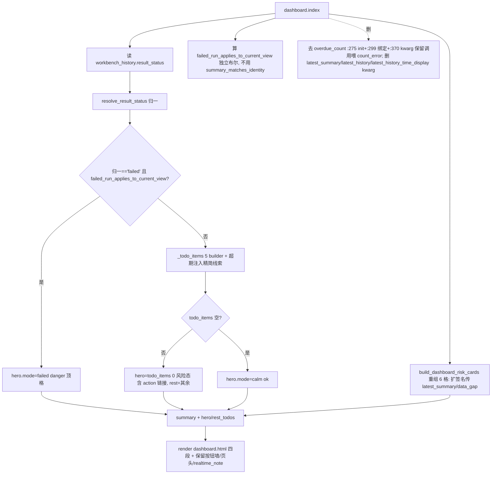

# fusion-dashboard-cockpit design

> 经两轮对抗审核（UltraCode 多评委+综合、Codex）逐条对真实代码核实修订。R2 综合判定无阻塞，仅完善测试迁移清单完整性 + 补 observability/手册两处遗漏测试 + 文案精度。关键事实更正与 Path C scope 见 0/1 节。

## 0. 术语约定

| 术语 | 定义 | 防冲突 / 事实核实 |
|---|---|---|
| 驾驶舱四段 | body 自上而下：①上下文带 ②hero 指令卡 ③6 格体检表 ④其余待处理清单。构图基准 drafts/dashboard-restyle-proto.html（在 `.codestable/roadmap/aps-frontend-fusion/drafts/`，仅构图基准、**不作实现输入**），遵 4.4 栅格+认知五原则 | 现状 5 块堆叠；本 feature 收敛 ②③④ + 删 stat-grid/当前查看排产卡/下一步面板，**保留底部「常用工作区」按钮墙**（Path C，决策 2） |
| 上下文带（①） | 壳层 base.html:113-114 既有 `plan_context_capsule`（全站 header 单点，item#9 已上线，本 feature 不搬不改）+ 保留首页「计划员值班台/今日待处理/generated_at_label/realtime_note」页头块 | EXPECTED_PAGE_SIGNALS（ui_geometry_contract_data.py:46-51）钉死 eyebrow「计划员值班台」、h3「今日待处理」、id `dashboard-workbench-title`；test_aps_workbench_first_round_flow_contract:193 钉死 realtime_note「待处理项根据当前数据实时生成，暂不保存已处理状态。」——**必须保留渲染** |
| hero 指令卡（②） | 整宽一张卡，三态（失败/风险/平静，见决策 1）。复用 todo_item **数据 schema**，但用自己的 CSS 类 `.aps-dashboard-hero`（含 severity-ok/notice/warning/danger 四档，**需新增 CSS**），不复用 `.aps-dashboard-todo-item`（仅 notice/warning/danger，无 ok 绿态，ui_contract.css:6030-6038）。**hero 模板必须渲染 primary_action/secondary_action 的 label+url**（带 build_workbench_link 上下文）——否则丢首页 context 链接（见决策 9） | 风险态 title **原样复用** todo_items[0].title（如「超期批次需要先看」），否则破 first_round_flow_contract:189 |
| 6 格体检表（③） | 6 等宽可点跳格：超期/待排/方案待确认/现场待确认/资源压力/基础数据。每格即入口，**正常项 severity-ok/notice 灰显**（CSS 已有 .aps-dashboard-risk-card.severity-ok/notice，ui_contract.css:5974-5978），异常着色 | 复用既有 aps-dashboard-risk-card 通道；现状 risk_cards 是另一套 6 卡，本 feature 删 2 补 2 改 1 链接（见 2.1）。**方案待确认/基础数据两格与 ④todo 并存是有意**（③=健康总览计数入口、④=行动 todo，同超期既在格又在 hero；样张亦如此） |
| 精简主导线索 | 超期 todo 顶 hero 时附：`N 个批次会晚于交期 · 逾期最久 {批次} 晚 {X}`。**口径钉死**：取 `summary['overdue_batches']['items']`（每条 {batch_id,due_date,finish_time}，schedule_summary_assembly.py:158-164）**逾期量最大**的一条（**不是「最早」**）；逾期量=`parse(finish_time) − due_exclusive(due_date)`，`due_exclusive=交期当日+1天00:00`（与超期判定同源 summary_runtime_state.py:18-21，**不可用 finish−due 否则多算一天**）。**日期解析须宽松**（审核补漏）：item 存的 `due_date` 是 **raw due_text**（assembly.py:161 写原文、可能含 `/` 如「2026/06/12」），`finish_time` 是 `%Y-%m-%d %H:%M:%S`（schedule_service.py:_format_dt:112）——解析须仿 `_parse_datetime` 兼容 `/`→`-`、纯日期/秒级时间，否则真实可接受数据被误判降级。零重算、零计划行扫描。**两态降级（无专用裁剪字段，按 count 判）**：`items` 缺失/非 list（minimal 档仅留 count，summary_size_guard_fields.py:252）→ 笼统句「N 个批次会晚于交期」；`items` 是 list 且解析出的 `count > len(items)`（被 items[:limit] 裁剪，summary_size_guard.py:117-121）→ 措辞「基于前 N 条…」或同样降级，**不拿截断子集冒充全量最严重**；count 不可解析→降级 | 2026-06-13 用户裁决取精简案。**不做**"集中在 X" 聚类（overdue_items 无工序信息，需扫计划行=整方案重算）。⚠️"工段"非本项目概念（全仓仅样张+早期策划稿出现），真概念是工序(op_code)/工序类型(op_type_name)；本 feature 不引入"工段"措辞 |
| 常用工作区按钮墙（保留件） | 现 dashboard.html:150-218，3 分组 11 按钮。**本 feature 保留不动**（Path C）：被 test_manual_entry_scope（11 按钮/3 分组，:46-65/:140-147）+ test_aps_workbench_context_propagation_contract（设备甘特图/资源排班/报表中心/周计划 带上下文）钉死；删墙推迟到 item#10 | ⚠️事实更正：批次管理/周计划/工作日历/排产历史**非"孤儿"**——经 scheduler_nav（build_scheduler_navigation_links scheduler_navigation_links.py:131-141）/system_nav 段内子导航**可达**，按钮墙是**首页一键直达便利**非唯一通路 |

## 1. 决策与约束

**需求摘要**（roadmap 第 19 条权威，构图 2026-06-11 定稿）：驾驶舱四段；删 stat-grid（先迁锚）+ 删按钮墙 + 删"下一步"卡 + hero 失败顶格 + severity 分级 + 死字段裁决 + 超期挂主导线索 + 全健康空态。受 4.2/4.4/4.6/4.7/4.9 约束。

**Path C scope（2026-06-13 用户拍板，基于审核更正事实）**：本 feature 做 ②③④ 重组 + 删 stat-grid + 删「当前查看排产」卡 + 删「下一步入口」quick-panel + 正文唯一性 + 死字段清理 + 文档同步；**「常用工作区」按钮墙保留不动，删除推迟 item#10**。依据：(a) 4 页经段内子导航可达，删墙不丢导航；(b) 按钮墙被 2 LIVE 契约钉死、首页带上下文跳转是真功能；(c) #10（本该承接 nav）未做，排期本意 #10 先于 #19。本 feature **不动** test_manual_entry_scope / context_propagation 两契约（墙在=不动），验收回写 roadmap：item#19「删按钮墙」移交 item#10。

**复杂度档位**：默认（常规路由+viewmodel+模板重排；精简线索零重算无性能偏离）。

**关键决策**：
1. **hero 三态**：
   - 失败态：在「**当前正式位置查看**」且 `resolve_result_status(workbench_history.result_status)=='failed'` 时 → danger hero「最近一次排产没有成功」。**双重护栏**：(a) 走既有归一单源 `resolve_result_status`/`_normalize_result_status_value`（web/viewmodels/scheduler_summary_result_state.py:24-109，含 `_LEGACY_RESULT_STATUS_ALIASES={'ok':'success','fail':'failed'}`），**禁裸 `=='failed'`**（漏判遗留别名 'fail'，触 cs-semantic-radar/fusion-label-single-source 红线）；(b) **门控不可复用 `summary_matches_identity`**（致命陷阱：`_summary_matches_plan_identity` dashboard.py:196-201 要求 `is_current_executable_official_version`，而该字段在 `result_status=failed` 时恒为 False——`_EXECUTABLE_RESULT_STATUSES=frozenset(("success","partial"))` schedule_plan_identity_builder.py:16/:149 把 failed 挡掉——故复用此闸会让失败 hero **永远不可达**）。改为 route 层**单算一个独立布尔** `failed_run_applies_to_current_view` = `_is_adopted_role_context` + `_is_plain_plan_context`（非预览/对比/模拟）+ **`requested_history_error == ""`**（请求干净——`_requested_version` dashboard.py:36-46 对 `version=abc`/`v<=0` 都返回 `(0, 错误文案)` 且 :280 写 plan_identity_blocking_error，故**不能**用裸 `requested_version<=0` 当"看最新"，会把"传了坏版本"误放行喊失败）+ **`workbench_version == 最新版本`**（看的就是最新正式位置而非有效旧版本回看，最新版本取 history_q list_recent；非被更新版本取代），**独立于 executability**，传给新 hero viewmodel。此时 `summary_matches_identity` 为 False → latest_summary=None → 其余 6 格/todo 自然降级为数据不足/data_gap（与失败 hero 共存，语义自洽：失败提示在顶、下方诚实显示摘要不可用）。`result_status` 字段在 `core/models/schedule_history.py:17`（route 经 ScheduleHistory 模型实例读）。primary→新 'batches'（去执行排产，context-free），secondary→'history'。**5 个测试场景钉死**：当前正式失败→显示；历史版本失败→隐去；预览/对比失败→隐去；'fail' 别名归一后→显示；**最新 failed + `?version=abc`/`?version=999`（坏/不存在版本）→隐去失败 hero、只显「请求不可用」**（requested_history_error≠"" 把它挡在门外）。
   - 风险态：hero=todo_items[0]（**title 原样复用**）；超期为首条时其 impact 注入精简主导线索。
   - 平静态：无 todo → severity-ok 绿 hero，title 短句「当前没有必须马上处理的排产风险」（既有 empty_state 完整文案保留为补充说明）。
2. **Path C 保留按钮墙**（见上）。删「下一步入口」quick-panel **安全**（其 6 项中 排产分析/甘特/资源派工/报表中心/计划和现场实际 由顶栏 7 项承接；**「周计划」顶栏无、由保留的按钮墙承接**；全仓无测试钉 quick-panel）。
3. **recent_metrics 不上首页**：删「当前查看排产」卡，拖期/总工期归报表中心、设备利用率缺失态护卫迁资源压力格。退役 `_recent_schedule_metrics`(dashboard_workbench.py:241-264) + `_summary_metrics`(:196-199) + `_metric_number`(:202-206，退役后唯一消费者消失成死码) 三者（顺带腾行数，见 2.5）。
4. **精简主导线索**：见 0 节（逾期最久 + due_exclusive 边界 + 按 count 判两态降级）。
5. **胶囊不搬、去 body 重复**（4.2 阶段二）：①=壳层既有胶囊；body 删版本（stat-grid 卡4 + risk-grid latest_version 卡两处）/时间·策略（当前查看排产卡），验收加正文唯一性断言（版本仅现 `.aps-plan-capsule-version`）。
6. **死字段裁决（口径精确）**：route 删四个零消费 render kwarg：
   - `overdue_count`：删 :275 `overdue_count = 0` 初始化 + :370 render kwarg；:299 改 `_, _history_count_error = _summary_overdue_count(history_summary_data)`（**保留调用喂 _history_count_error**，否则 :301 count_error NameError）。
   - `latest_summary` / `latest_history` / `latest_history_time_display`：删卡后均成新死 kwarg（base.html 不消费），一并删。
   - **`scheduled_count` 整条死链**（审核补漏）：删 stat-grid「已排批次」(dashboard.html:113) + scheduled_batches 卡后，`scheduled_count` 无展示用途——同步删 :274 查询 `len(batch_svc.list(status="scheduled"))` + :336 `build_dashboard_workbench_summary(scheduled_count=)` 入参 + `build_dashboard_risk_cards` 的 `scheduled_count` 形参（cards.py:97）+ :369 render kwarg，免留假依赖与一次无效服务查询。
   - **`pending_count` render kwarg**：删 stat-grid「待排批次」({{pending_count}} dashboard.html:111) 后 :368 render kwarg 死——删之；但**本地 pending_count 保留**喂 build_summary→待排风险格（仍用）。
   - **迁 test_schedule_summary_observability.py**：:181-182 现断言 `ctx["latest_summary"]==summary` / `ctx["overdue_count"]==3`（monkeypatch render_template 取 ctx）——删 kwarg 前须把断言迁到 `ctx["workbench_summary"]`（超期值经 summary_stats.overdue_count_value 投影；latest_summary 仍是 build_summary 输入）。
7. **severity 裁决（4.6）**：不引入 'unknown'（CSS 仅 ok/notice/warning/danger，资源压力缺失保持 notice/数据不足，避免同义混用）。failed hero=danger。6 格新增两格 severity：方案待确认（有候选→notice、无→ok 灰）、基础数据（有缺口→warning、无→ok 灰）。
8. **待排格点跳新增 'batches' 目标**：`'batches':'/scheduler/'`（scheduler.batches_page 执行排产页）。**3 处强制**（缺即运行期 raise/KeyError）：`TARGET_PAGE_PATHS`（link_query.py，缺→scheduler_workbench_links.py:381 raise）+ `_TARGET_QUERY_SPECS`（`{plan_style:'none',date_style:'none',batch_position:'none',resource_style:'none'}`，仿 batch_detail 去 batch_in_path；缺→link_query.py:288-292 raise）+ `TARGET_DEFAULT_LABELS`（缺→:415 KeyError，仅未显式传 label 时）。**第 4 处契约必需**（裁决：定 'batches' 为 context-free，就**必须**加入 `_CONTEXT_FREE_TARGETS`——否则 _append_extra_params:431-435 不拦，他人传 extra_params 可往 /scheduler/ 注入 version/批次/资源上下文，与「待排格=回待排列表（无上下文）」口径冲突；它不致 raise 但属契约正确性必需，非可选）。不进 VERSION_REQUIRED/DATE_RANGE_REQUIRED。回写两处契约测试：test_scheduler_workbench_links_contract 的 `set(TARGET_PAGE_PATHS)` 固定集（:466-481）+ `test_context_free_targets_reject_extra_params_escape`（:548 附近，扩到覆盖 'batches' 拒 extra_params）。

**明确不做**（grep/测试反向核对）：不删/不动按钮墙、不改 test_manual_entry_scope/context_propagation；不做超期工序类型聚类（不扫计划行、无 op_type_name 分组、不新增"工段"措辞）；不引入 severity 'unknown'；不裸 `result_status=='failed'`（走归一单源）；failed hero 用独立门控 failed_run_applies_to_current_view（不复用 summary_matches_identity/executable 闸，否则永不触发）；不搬胶囊进 body、不新增 body 版本/时间/策略；不抽 todo 家族；不删 `build_dashboard_quick_links`；不碰顶栏 workbench_nav_menu/侧栏 base.html；6 格不预留临期第 7 格（item#30）。

**前置依赖**：fusion-dual-track-retirement（done）+ fusion-anchor-baseline-prep（done）。软冲突用 Path C 化解（删按钮墙移交 #10）。

## 2. 名词与编排

### 2.1 名词层

**现状**：
- `dashboard.py:index()` 渲染 dashboard.html 喂 9 个 context（:365-381）：`overdue_count`(:370)/`latest_summary`(:379) 模板不消费但 **test_schedule_summary_observability.py:181-182 经 ctx 断言它们**；删卡后 `latest_history`/`latest_history_time_display` 亦成死 kwarg。`result_status`（core/models/schedule_history.py:17）**dashboard_workbench viewmodel 层不消费**（全仓他处消费：scheduler_history_summary.py:234、scheduler_batches_page.py:319/383 等；模板 :133 渲染 result_status_label）；本 feature route 新增一处读 `workbench_history.result_status`。
- `risk_cards`=build_dashboard_risk_cards（dashboard_workbench_cards.py:94-146）**6 卡**：latest_version/pending_batches/scheduled_batches/overdue_batches/resource_overload/site_record_gap。**现签名**只收 context/pending/scheduled/overdue_count/latest_history/resource_load_ratio/site_gap_count（**不含** latest_summary 与 data_gap 入参）。
- `todo_items`=_todo_items（:383-407）5 builder→排序→截 6。契约 test_dashboard_workbench_contract:136 钉死 `set(todos)=={overdue,resource_overload,site_record_gap,candidate_review}`。

**变化**：
1. `workbench_summary` 新增两**派生**键（`todo_items` 保持原样不变 → `set(todos)` 不破）：
   ```
   hero = {"mode":"failed|risk|calm","severity":"danger|warning|notice|ok",
           "title":str,"impact_text":str,"evidence_text":str,
           "primary_action":link|None,"secondary_action":link|None}
   rest_todos = List[todo_item]   # 风险态=todo_items[1:]；失败态=todo_items 全量；平静态=[]
   ```
   失败态 hero 为 **hero-only 合成物**（不进 todo_items、非新 kind）；风险态 hero=todo_items[0]（title 原样）。`_visible_text_from_summary`（test_dashboard_workbench_contract:34）**须扩**扫 hero（失败合成物为新文本）。
2. `risk_cards` 重组目标 **6 格**：删 latest_version（版本归胶囊）/scheduled_batches（已排）；留 overdue_batches/pending_batches/resource_overload/site_record_gap；补 candidate_review（方案待确认）/data_gap（基础数据）。**build_dashboard_risk_cards 签名须扩**（非"改链接"量级）：新增 `latest_summary`（candidate 比较，_candidate_comparison dashboard_workbench.py:135-142）+ data_gap 所需入参（或 build_summary 先算 candidate_count/data_gap_reason 纯值再传，**cards 禁 import core.services、禁扫 rows**；data_gap 复用 dashboard_data_gap_reason）。pending_batches 链接 'dashboard'→新 'batches'。标签对齐 roadmap（现场待确认/资源压力）。
3. WorkbenchLink 新增 context-free 'batches'（决策 8）。

示例：v8 adopted 现行、3 超期、result 成功 → hero.mode=risk、title「超期批次需要先看」、impact「3 个批次会晚于交期 · 逾期最久 B2024-117 晚 2 天 6 小时」、**渲染 primary「查看超期清单」→/reports/overdue（带 version/plan_role/date）**；6 格超期=3(danger)/待排=2(notice)/方案待确认=1(notice)/现场待确认=4(warning)/资源压力=91%(danger)/基础数据=无缺口(ok 灰)。result=failed 且现行 → hero.mode=failed danger + 去执行排产('batches')/查看历史('history')。

### 2.2 编排层



**变化**：route 多读 result_status 喂 summary（IO 在 route，viewmodel 不碰 ORM）；新模块算 failed hero（归一+门控）+ 精简线索 + hero/rest 切分；cards 扩签名重组 6 格；模板四段重排 + 删三块 + **保留按钮墙**。控制流线性+三态早分支。**4.7 门控**：线索/候选/利用率随 latest_summary 受 summary_matches_identity 闸；**失败 hero 用独立门控 failed_run_applies_to_current_view**（不复用 summary_matches_identity——它要求 executable 会把 failed 挡死）。失败态下 summary_matches_identity 仍为 False→latest_summary=None→6 格/todo 降级数据不足，与失败 hero 共存自洽。

### 2.3 挂载点清单（按「删了它 feature 是否消失」收紧）

1. `templates/dashboard.html` 四段重排（②hero[含 action 链接] ③6 格 ④去盒清单）+ 删 stat-grid/当前查看排产卡/下一步面板 + **保留按钮墙与值班台页头（含 realtime_note）**——删了它驾驶舱就没了。
2. `web/routes/dashboard.py:index()` 新增读 result_status 喂 summary + 删四死 kwarg（口径决策 6）——删了它 hero 失败态无源、死字段复活。
3. 新建 `web/viewmodels/dashboard_cockpit_hero.py`：failed hero（归一+门控）+ 精简线索 + hero/rest 切分——删了它 hero 三态无装配。
4. `web/viewmodels/dashboard_workbench_cards.py` 重组 6 格 + 扩签名——删了它体检表回退旧卡集。
5. `web/viewmodels/scheduler_workbench_link_query.py`（+scheduler_workbench_links.py）新增 'batches' 目标——删了它待排格点跳 raise。
6. `web/viewmodels/page_manuals_system.py` + `static/docs/scheduler_manual.md` 首页说明改写（旧统计卡/最近排产卡 → 驾驶舱四段：胶囊/hero/6 格/保留按钮墙）——删了它"本页说明"与手册教用户看不存在的旧区域。

（守卫迁移项见 2.4 步 1 与 3 节。**test_manual_entry_scope / context_propagation 因 Path C 保留按钮墙不动**；但 context_propagation/first_round 绿**额外依赖 hero 渲染 todo[0] 的 primary_action 带上下文链接**（决策 9 / 见 2.4 步 3 退出信号）。）

### 2.4 推进策略（按 paradigm 维度切片）

- **步 1（锚点/守卫/文档迁移，先于删 DOM）**：
  - (a) test_dashboard_overdue_count_tolerance.py:15 正则锚 stat-grid→体检格 risk-value（保「数据不足」/「1」/「超期批次数不是整数」）。
  - (b) **test_scheduler_plan_identity_summary_guard.py 迁 4 个测试函数**（非"两用例"）：① test_dashboard_invalid_requested_version_is_visible_gap（:366「当前查看版本」）+ ② test_dashboard_superseded_official_plan_does_not_fake_empty_site_facts（:406「当前查看版本」+ v12）→ 改断言胶囊 `.aps-plan-capsule-version`=v12；③ test_dashboard_recent_schedule_metrics_do_not_turn_missing_values_into_zero（:284「当前排产摘要缺少可信指标」）→ 改断言资源压力格缺失文案「当前摘要里没有可安全展示的设备平均利用率」/「数据不足」（cards.py:47-48，**非同字符串、不可平移**）；④ test_dashboard_recent_schedule_metrics_reject_bool_utilization_without_hiding_real_zero（:338-342 happy-path「拖期/0.0 小时/总工期/设备利用率/0.0%」）→ **整段删除**（首页不再展示这些指标，资源格 helper 用「设备平均利用率」不含子串「设备利用率」无法平移）。
  - (c) test_dashboard_schedule_time_display.py：时间诚实降级（format_public_datetime/「时间记录异常」/不泄 raw）迁到胶囊 generated_at_label。
  - (d) **test_schedule_summary_observability.py:181-182**：ctx 断言迁到 `ctx["workbench_summary"]`（决策 6）。
  - (e) **文档迁移**：page_manuals_system.py（:19/:61-75/:105-120 旧卡说明）+ scheduler_manual.md（:58-78）改写为驾驶舱；同步迁 test_page_manual_registry.py（:252-274 钉死「待排批次/已排批次/最近排产版本/模拟排产只生成版本…」）+ test_config_manual_markdown.py（:492-508「首页统计卡怎么看」）必含文案。
  - (f) **test_plan_context_capsule.py:137**（test_dashboard_capsule_fed_and_chrome_deduped）现已断言首页胶囊（v7/时间/策略）+ 正文去重（今日待处理 muted 行不渲染 version_label·plan_role_label）——本 feature 删 stat-grid 版本卡 + risk latest_version 卡 + 当前查看排产卡是其正文唯一性的延伸，**扩该测试**断言 body 无第二处版本渲染（与决策 5 正文唯一性同源），不破其既有胶囊断言。
  - (g) **test_label_single_source_contract.py**（RECLAIMED_TEMPLATES 含 templates/dashboard.html）扫描首页模板禁内联中文词表——hero/6 格/线索的**所有可见文案必须由 viewmodel 产出**（走既有标签函数/词表单源），模板不内联中文字典，否则触该守卫。
  退出信号：上述测试对旧 DOM/文案不再依赖、改后绿。
- **步 2（编排骨架+计算节点）**：新建 dashboard_cockpit_hero.py（failed hero 归一+门控、精简线索逾期最久+按 count 两态降级、hero/rest 切分）；route 读 result_status 喂 summary + 删四死 kwarg；cards 扩签名重组 6 格 + 'batches' 目标 3 强制+1 硬化。退出信号：viewmodel/route 单测覆盖 hero 三态 + 6 格 + 死字段消失 + 'batches' 可点不 raise + 精简线索三态（完整/缺失/裁剪）。
- **步 3（前端四段+测试）**：模板四段（hero 卡[新 `.aps-dashboard-hero` 四档 severity CSS，**只用 --ui-* token 禁裸 hex**（test_css_token_source_contract:127 冻结退役裸 hex）；ok 档不能套 todo-item 现有样式因其无 ok 档 + **渲染 primary/secondary action label+url**] + 6 格 signals 带 + 去盒清单 3px 左语义条）+ 删三块 + **删/降级 quick-panel CSS（ui_contract.css:6092）+ todo-layout 两列改单列（:6010）** + **保留按钮墙/页头/realtime_note**；扩 _visible_text_from_summary 扫 hero/rest_todos；加正文唯一性断言。退出信号：四段三态目检 + daily gate 绿 + **context_propagation/first_round 实跑全绿**（重点验「查看超期清单」→/reports/overdue 与资源相关链接仍在首页且携上下文）。
- **步 4（持久化）**：无（纯只读，零写入）。

### 2.5 结构健康度与微重构

**先查 compound convention**：现场标签单源 execution_fact_presentation（item#18）本 feature 仅间接消费不新增事实口。LOAD_*_RATIO 单源（dashboard_workbench_cards.py:14-15，test_css_token_source_contract:154 用 `is` 断言两模块同一对象）**保持不动**。

**文件级**：dashboard_workbench.py **481/500**——退役 recent_metrics 三函数（`_recent_schedule_metrics`:241-264 + `_summary_metrics`:196-199 + `_metric_number`:202-206，约 30 行）腾余量，净加 cockpit wiring（~10 行）后约 461，安全。dashboard_workbench_cards.py 160/500（扩签名+2 格余量足）。dashboard.py 382/500（加读 result_status+删死 kwarg 净增小）。scheduler_workbench_link_query.py **483/500**——'batches' 新增须**极简**（约 +6 → 489），若逼近 500 则 target spec 拆分另起。**门禁机制核实**：500 行限来自 `tools/quality_gate_shared.py:179 FILE_SIZE_LIMIT=500` + `:182 CORE_DIRS`（**仅 .py 目录**，含 web/viewmodels、web/routes、core 等）；**templates/*.html 当前不在 500 门禁内**（扩到 templates/static 是未做的 item#4 fusion-frontend-gates 的事，本 feature 不依赖），故 dashboard.html 行数无门禁压力（重排后预计仍下降，仅利好）。无 `FRONTEND_SIZE_DIRS` 此符号（item#4 未落地）。

**目录级**：web/viewmodels/ 未摊平，新增 1 文件（dashboard_cockpit_hero.py）可接受。

**结论：微重构（退役 recent_metrics 三函数 + 新建 cockpit 文件）**——**不抽 todo 家族**。审核证实 todo 家族非平铺 lift：`_resource_load_todo` 依赖 `_machine_util_ratio`（:175，留守 build_summary:472 也用）、各 builder 共用 _text/_safe_int/_datetime_label/_parse_datetime/_link，跨搬/留边界致循环 import 或 LOAD 单点破裂。改为：退役 recent_metrics 自然腾余量，cockpit 新逻辑（只消费已构建 todo_items 列表 + overdue 原值 + build_workbench_link + resolve_result_status，**无** dashboard_workbench↔cockpit_hero 回环）落新文件。dashboard_workbench.py 保留 LOAD import 不动。

**超出范围观察**（不阻塞）：「常用工作区」按钮墙删除 + 首页带上下文跳转承接归 **item#10**（侧栏做事路线带上下文），本 feature Path C 保留、验收回写 roadmap 移交；当前查看排产可编辑/已排两套工序视图统一属页面信息架构重构。

## 3. 验收契约

| 场景 | 触发 | 期望可观察结果 |
|---|---|---|
| 四段结构 | 打开首页 | ①上下文带（胶囊+页头 realtime_note）②hero ③6 格 ④去盒清单；**无** stat-grid/当前查看排产卡/下一步面板；**保留**常用工作区按钮墙 |
| hero 失败态（独立门控+归一） | 当前正式位置查看（failed_run_applies_to_current_view 真）且 resolve_result_status==failed | danger hero「最近一次排产没有成功」+ 去执行排产('batches')/查看历史('history')；不重复入④。**门控独立算、不用 summary_matches_identity**（后者要求 executable 会把 failed 挡死→hero 永不可达） |
| hero 失败态隐去（4.7） | 看历史版本/预览/对比 的失败结果 | **不**显失败 hero（failed_run_applies_to_current_view 假）；不拿非当前查看方案口径冒充 |
| hero 失败态 vs 坏版本请求 | 最新 failed + `?version=abc`/`?version=999`（坏/不存在版本） | **不**显失败 hero（requested_history_error≠"" 把它挡外）；显既有「请求不可用」语义，不与失败 hero 混淆 |
| hero 失败态可达性（防自相矛盾，反向） | result_status=failed 时 is_current_executable_official_version 恒 False | 失败 hero 门控**不得**依赖 is_current_executable_official_version / summary_matches_identity，否则永不触发 |
| 失败态归一（防失忆债） | DB 存遗留别名 'fail'/大小写 | 经 resolve_result_status 归一仍判失败；**禁**裸 `=='failed'` |
| hero 风险态+精简线索+action 链接 | result≠failed 有超期、超期为首条 | hero title 原样「超期批次需要先看」；impact 含`N 个批次会晚于交期 · 逾期最久 {批次} 晚 {X}`；**渲染 primary「查看超期清单」→/reports/overdue 带 version/plan_role/date 上下文**；④为其余 todo 不含该条 |
| 精简线索两态降级 | items 缺失(minimal) / count>len(items)(裁剪) | 缺失→笼统「N 个批次会晚于交期」；裁剪→「基于前 N 条…」或降级，**不拿截断子集冒充全量最严重**；零计划行扫描 |
| hero 平静态 | 无 todo | severity-ok 绿 hero「当前没有必须马上处理的排产风险」 |
| 6 格体检表 | 正常方案 | 恰 6 格（超期/待排/方案待确认/现场待确认/资源压力/基础数据），可点跳；正常项 ok/notice 灰显、异常着色；**无** latest_version/scheduled_batches 格 |
| ③④并存（裁决） | 有候选/有数据缺口 | 方案待确认/基础数据**同时**现于 ③6 格（总览计数入口）与 ④todo（行动项），有意并存（同超期既在格又在 hero） |
| 待排格点跳（挂载点完整） | 点「待排」格 | 跳 /scheduler/（'batches' 目标，**不 raise**——_TARGET_QUERY_SPECS 已补）；非指回 '/' |
| 正文唯一性（4.2 阶段二） | 渲染首页 | 版本仅现 `.aps-plan-capsule-version`；body 无第二处版本/排产生成时间/策略（stat-grid 版本+risk latest_version 卡+当前查看排产卡均删） |
| 锚点迁移（4.9） | 超期 '2.9'/列表型/脏值 | 正则锚迁体检格 risk-value，仍断言「数据不足」/「1」/「超期批次数不是整数」 |
| plan_identity_summary_guard 迁移（4 函数） | — | 两处「当前查看版本」(:366/:406)→断言胶囊 version_label(v12)；recent_metrics missing(:284)→资源格缺失文案；happy-path 拖期/总工期(:338-342)→**整段删除** |
| observability ctx 迁移 | — | test_schedule_summary_observability ctx 断言从 latest_summary/overdue_count 迁到 workbench_summary 投影 |
| 文档迁移 | 看"本页说明"/手册 | page_manuals_system + scheduler_manual 旧卡说明改驾驶舱；test_page_manual_registry/test_config_manual_markdown 钉死文案同步迁移 |
| 时间诚实迁移 | schedule_time 脏值 | 胶囊 generated_at_label 走 format_public_datetime，坏值「时间记录异常」不泄 raw；schedule_time_display 测试迁胶囊 |
| 死字段裁决（口径精确） | grep+跑路由 | route 不传 overdue_count/latest_summary/latest_history/latest_history_time_display 四 kwarg；删 :275 init；**`_summary_overdue_count` 调用保留**喂 _history_count_error（:301 不 NameError）；真超期值走 summary_stats.overdue_count_value |
| scheduled_count 死链清理 | grep | 删 stat-grid/已排卡后 scheduled_count 全删（:274 查询+ build_summary 入参+ cards 形参+ render kwarg）；pending_count render kwarg 删但本地保留喂待排格 |
| 线索日期宽松解析 | due_date='2026/06/12'（含斜杠的真实数据） | 线索正常算出逾期最久，**不**误判「数据不足」（解析兼容 `/`→`-` 与 %Y-%m-%d %H:%M:%S） |
| 胶囊去重测试延伸 | 渲染首页 | test_plan_context_capsule.py:137 既有胶囊+去重断言绿；扩断言 body 无第二处版本（stat-grid/risk latest_version/当前查看排产卡均删） |
| 词表单源（模板不内联） | 扫 templates/dashboard.html | hero/6 格/线索可见文案全由 viewmodel 产出，模板无内联中文词表（test_label_single_source_contract 绿） |
| 'batches' context-free 拒注入 | 给 'batches' 传 extra_params | 被拒（'batches' 已入 _CONTEXT_FREE_TARGETS）；test_context_free_targets_reject_extra_params_escape 扩覆盖 |
| severity 裁决（4.6） | 利用率算不出 | 资源压力 notice/数据不足；全仓无 `.severity-unknown`/`_SEVERITY_ORDER['unknown']` |
| 按钮墙不动（Path C 反向） | — | test_manual_entry_scope（11 按钮/3 分组）+ context_propagation（含「查看超期清单」带上下文，由 hero/④ 承接）**绿**；常用工作区按钮墙原样在 |
| 既有锚点不破 | — | EXPECTED_PAGE_SIGNALS 三锚 + realtime_note(first_round:193) + 备份提示四态 全保留 |
| 契约更新（反向） | — | todo_items 不变→set(todos) 不变；risk_cards by-kind 对新 6 格成立；_visible_text_from_summary 扩扫 hero/rest_todos；test_scheduler_workbench_links_contract set(TARGET_PAGE_PATHS) 加 'batches' |
| 抽取安全（反向） | — | LOAD_*_RATIO 仍两模块同一对象（test_css_token_source 绿）；未抽 todo 家族；无循环 import |
| 零写入（反向） | — | 无排产数据写入；无新增首屏计划行扫描 |

**明确不做反向核对**：grep 全仓无新增"工段"措辞、无 op_type_name 聚类、无 `.severity-unknown`；按钮墙/顶栏 workbench_nav_menu/侧栏 base.html 未动；body 无第二处版本；result_status 无裸字符串比较；`build_dashboard_quick_links` 仍在；6 格恰 6。

## 4. 与项目级架构文档的关系

- **新增模块**：`web/viewmodels/dashboard_cockpit_hero.py`（hero 三态装配 + 精简线索 + result_status 归一消费）。ARCHITECTURE.md 第 3 节模块索引验收补一行。
- **契约遵守**：4.2（胶囊正文唯一性阶段二，胶囊壳层单点不搬）+ 4.4（栅格+认知五原则：hero 风险=对比最强、6 格灰显三通道一致、tabular-nums）+ 4.6（severity 不引入 unknown）+ 4.7（adopted 聚合护栏：线索/候选/利用率随 latest_summary 受 summary_matches_identity 闸；failed hero 用**独立**门控 failed_run_applies_to_current_view[非预览/对比、当前最新正式位置、不要求 executable]，预览/历史失败不冒充当前）+ 4.9（删 stat-grid 前迁正则锚 + EXPECTED_PAGE_SIGNALS 三锚不破）。
- **契约扩展（需回写）**：WorkbenchLink 新增 context-free 'batches'→'/scheduler/'，影响 TARGET_PAGE_PATHS/TARGET_DEFAULT_LABELS/_TARGET_QUERY_SPECS（3 强制）+ _CONTEXT_FREE_TARGETS（可选硬化）与 test_scheduler_workbench_links_contract 的 set(TARGET_PAGE_PATHS)；属第 11 条 WorkbenchLink 合同一处受控新增。
- **跨条目协同 + roadmap 回写**：item#19「删按钮墙 + 首页带上下文跳转承接」**移交 item#10 fusion-nav-specs-unify**（侧栏做事路线带上下文就位再删）；本 feature 完成"删下一步面板"与四段重组其余部分。验收 cs-roadmap update 标注移交，避免 #10 以"按钮墙已删"错误前提推进。6 格为 item#30 预留挂点但本 feature 不预占。
- **文档同步**：首页"本页说明"(page_manuals_system.py)与系统手册(scheduler_manual.md)的旧卡说明随 UI 改写为驾驶舱口径，相关手册契约测试（test_page_manual_registry/test_config_manual_markdown）同步迁移。
- **recent_metrics 不变量迁移**：「缺失指标不伪装成 0」从「当前查看排产」卡迁到资源压力体检格（_resource_load_card 数据不足/notice 承接）；「版本诚实回显」迁到壳层胶囊 version_label。
