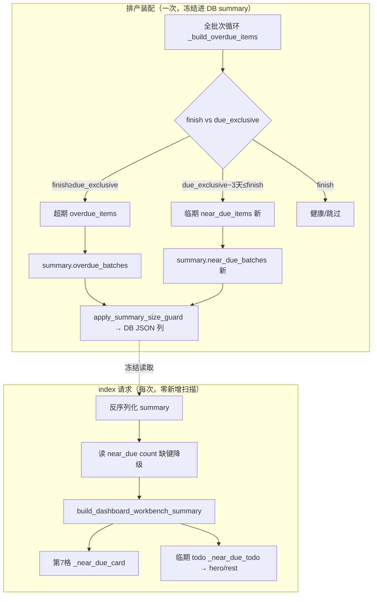

# fusion-due-soon-alert 方案设计

> 模块 N · 闭环补全（契约 4.11）。在 #19 驾驶舱四段之上扩第 7 类风险维度「临期」。
> 两个关键裁决（2026-06-14 用户拍板）：**格位=独立第 7 格**；**口径=排程卡交期（finish-基准）**。

## 0. 术语约定

| 术语 | 定义 | 防冲突结论 |
|---|---|---|
| 临期 / `near_due` | 排程完工时间 `finish` 落在 `[due_exclusive − NEAR_DUE_WINDOW_DAYS天, due_exclusive)` 的批次——排程上卡着交期完成、尚未超期、缓冲 ≤3 天 | grep 全仓 `临期/near_due/due_soon/NEAR_DUE` 零命中，全新命名无冲突 |
| `due_exclusive` | 交期排他下界 = 交期当日 + 1 天 00:00（交期次日零点）。复用现有口径，不另造 | 现有定义 `summary_runtime_state.due_exclusive:18`（装配链路权威）/ `dashboard_cockpit_hero._due_exclusive:52`（首页就地副本，注明"按同口径不 import core"） |
| 超期 / `overdue` | 现有口径 `finish >= due_exclusive`。临期是它的互补另一侧（`finish < due_exclusive` 且落 3 天窗内） | 现有 `schedule_summary_assembly._build_overdue_items:156`；临期与超期靠 `finish` 在 `due_exclusive` 哪一侧**严格互斥、零重叠双算** |
| `NEAR_DUE_WINDOW_DAYS` | 临期窗口常量，值 = 3，Python 侧单点定义在排产装配侧（临期判定唯一发生地）；契约 4.11「时间窗 Python 单点」 | 参照 `LOAD_*_RATIO`(4.4)、`BACKUP_STALE_DAYS`(#32) 的单源范式 |
| `near_due_batches` | summary 新增键 `{count, items:[{batch_id, due_date, finish_time}], window_days}`，与 `overdue_batches` 并列同构 | 全仓零引用，纯增量键 |

**易混提示**：「临期」≠「超期/逾期」（已晚于交期），≠「待排」（未进排产结果）。临期 = **已排产、排程能赶上、但缓冲不足 3 天**的赶工批次。

## 1. 决策与约束

### 需求摘要
- **做什么**：首页驾驶舱新增「临期」风险维度——① 体检表独立第 7 格；② 待办区临期类别；③ 临期窗口常量单点。
- **为谁**：每天值班的计划员，提前盯住"卡交期赶工、一旦现场延误就翻车"的批次，把超期止于未发。
- **成功标准（可验证）**：
  - 排产摘要含 N 个临期批次 → 体检表出现「临期」第 7 格（`value=N`，severity=warning，可点跳）；待办区出现临期条（无超期、且无同档更靠前 kind 的 warning todo 时临期可顶 hero——见 2.2 变化6 排序说明）。
  - 无临期（count=0）→ 第 7 格灰显一句话"暂无卡交期的临期批次"（4.11 诚实空态）、临期 todo 缺席。
  - 旧摘要缺 `near_due_batches` 键 → 第 7 格"数据不足"(None 态)、临期 todo 缺席；不伪造 0、不 KeyError、**且不放大成全摘要降级**（临期是独立非致命局部字段，见 2.2 变化4）。
  - 临期与超期对同一批次**零重叠双算**（`finish == due_exclusive` 归超期，不入临期）。
- **明确不做**：
  1. 不新建数据库表、不新增首屏计划行扫描、不改排产算法（4.11 只读）。
  2. 不引入 `now`（查看时刻）语义判临期——口径甲为 finish-基准，与超期同样 now 无关。
  3. 不接现场事实判"未完工"——临期纯排程层 `finish vs due_exclusive`，现场进度不进临期判定（与超期同源）。
  4. 不引入新 severity 档——临期复用 `warning/notice/ok` 既有四档之一，禁 `unknown`（CSS 与 `_SEVERITY_ORDER` 只有四档）。
  5. 不外显内部身份——临期 items 同超期只出 `batch_id`（公开业务 ID），不出 op_id/schedule_id/scenario_id。
  6. 不预占第 8 格、不改其余 6 格语义、不动按钮墙/侧栏（#10 的事）。
  7. 不留痕已处理状态——实时生成（遵 req `scheduler-daily-workbench` line 34 边界）。

### 复杂度档位
走「内部 Web 功能」默认档位，无偏离（单机离线 Win7、无并发、无对外 SDK、无高吞吐）。

### 关键决策

- **决策 1 — 口径 = 排程卡交期（finish-基准）**〔用户 2026-06-14 裁决〕
  临期 = `finish ∈ [due_exclusive − 3天, due_exclusive)`。换 now-基准（日历交期临近）会让数据路径从"装配侧算死冻结、首页零扫描直读"变成"装配侧宽窗候选清单 + 首页 now 精筛 + 排产过旧时陈旧降级"——名词层多一个 window 候选清单、编排层多 now 维度、多一套诚实降级。选 finish-基准因：与超期同一 `finish vs due_exclusive` 判定的两侧、严格互斥、now 无关可冻结、完全复用 #19 hero「零计划行扫描读冻结 items」范式、最贴合 4.11「共用同一交期字段/同一比较口径，禁两套算法各算各的」与「零新数据链路」。

- **决策 2 — 格位 = 独立第 7 格**〔用户 2026-06-14 裁决〕
  临期单独成 `risk_card`，severity 与跳转去向独立。换"合并进超期格"会让超期(danger)与临期(warning)挤一格丢失 severity 区分 + 跳转二选一，且牵动 `test_dashboard_overdue_count_tolerance` 正则锚。选独立格因符合 4.4 认知原则④「同类信息固定位置」+ #19 验收明确把第 7 格预留给本条。代价：3 列栅格下 7 格需自适应重排（归 implement 的 CSS 调整）。

- **决策 3 — 数据 = 同链路扩字段，非新数据链路**
  临期清单在 `_build_overdue_items`（已遍历全批次的循环）里「另一侧切分」，复用同一个 `due_date / finish_by_batch[finish] / due_exclusive_fn`，多冻结一个 `near_due_batches` 键。论证为**扩字段**非**新链路**：同源遍历（无新 batch/result 扫描、无新查询）+ 同冻结链路（同一 `result_summary` dict → `apply_summary_size_guard` → DB JSON 列 → parser 透传）+ 同治理（size-guard 截断/minimal 降级照 overdue 范式）+ `summary_schema_version` 保持 "1.2" 不升（纯增量加键）。满足 roadmap「零新数据链路」。

- **决策 4 — 临期窗口常量单点在装配侧**
  `NEAR_DUE_WINDOW_DAYS=3` 定义在临期判定唯一发生地（装配侧 `_build_overdue_items` 所在模块）。viewmodel 禁 import `core.services`，但口径甲下 viewmodel 只读冻结结论（`near_due_batches.count/items`）、**不重新判定**，故无需 import 该常量；若文案要显「3 天」，由装配把 `window_days` 一并冻进 summary，模板消费结论（4.11「模板只消费」）。

## 2. 名词与编排

### 2.1 名词层

**现状**
- `summary["overdue_batches"]` = `{count, items:[{batch_id, due_date, finish_time}]}` —— `schedule_summary_assembly.py:~463` 构造；`_build_overdue_items`（:112-182）在全批次循环里只 append `finish >= due_exclusive` 的超期项，`finish < due_exclusive`（含临期、含未到完工）在 :156 `continue` 丢弃。
- `risk_card` dict = `{kind, label, value, helper_text, severity, link, target_url}` —— `dashboard_workbench_cards._risk_card`（:22）；`build_dashboard_risk_cards`（:143）返回固定 6 元素列表（超期/待排/方案待确认/现场情况/资源负荷/基础数据）。
- `todo_item` dict = `{kind, severity, title, impact_text, evidence_text, handling_state_label, primary_action, secondary_action, ...}` —— `dashboard_workbench._todo_item`（:80）；`_todo_items`（:361）按 severity 排序取前 6。

**变化**
1. **新增 summary 键** `near_due_batches = {count, items:[同构三键], window_days:3}` —— 装配侧同循环切分（载体，与 overdue 并列同构）。临期项经 `_build_overdue_items` 的 **meta dict**（第二返回值）+ `RuntimeState` 新字段 `near_due_items` 流到 `assembly:463` 旁加键——**公开 `build_overdue_items` 的 `(items, meta)` 二元解包契约零变**（`build_overdue_items` 定义于 `summary_runtime_state.py:149`、经 `schedule_summary.py` 的 `__all__` 再导出，`test_schedule_summary_overdue_warning_append_fallback.py:24/:27` 从 `schedule_summary` import 并二元解包锁定，不可改三元）。
2. **新增常量** `NEAR_DUE_WINDOW_DAYS=3` —— 装配侧单点（4.11 时间窗单点）。
3. **新增第 7 个 risk_card** `kind="near_due"`、`label="临期"` —— `dashboard_workbench_cards` 新增 `_near_due_card`（三态：有值 warning / 无 ok / 缺键 notice"数据不足"）。
4. **新增 todo 类别** `kind="near_due"`、severity=`warning` —— `dashboard_workbench` 新增 `_near_due_todo`，注入 `_todo_items` 候选。
5. **扩签名** `build_dashboard_risk_cards(..., near_due_count)` —— 纯值在 `build_dashboard_workbench_summary` 先算再传（cards 禁扫 rows/禁 import core，同 #19 candidate/site_gap 范式）。

**接口示例**

```python
# 来源：core/services/scheduler/summary/_build_overdue_items（拆分后的 due-risk items builder）
# 同一全批次循环，:156 早返改两段判定（finish 与 due_exclusive 的关系决定归属）：
#   finish is None                              → 跳过（未排出完工）
#   finish >= due_exclusive                     → 超期（现状不变）
#   finish >= due_exclusive - WINDOW_DAYS天      → 临期（新，near_due_items.append）
#   else                                        → 健康（缓冲 >3 天，跳过）
# 输出冻结进 summary：
summary["overdue_batches"]  = {"count": 2, "items": [{"batch_id":"B12","due_date":"2026-06-15","finish_time":"2026-06-16 09:00:00"}, ...]}
summary["near_due_batches"] = {"count": 3, "window_days": 3,
                               "items": [{"batch_id":"B30","due_date":"2026-06-16","finish_time":"2026-06-16 18:00:00"}, ...]}
#   B30: due_exclusive = 06-17 00:00；finish 06-16 18:00 ∈ [06-14 00:00, 06-17 00:00) → 临期（缓冲 6 小时）
```

```python
# 来源：web/viewmodels/dashboard_workbench_cards._near_due_card（新增，仿 _overdue_card 三态）
_near_due_card(context, near_due_count=3)
#   → {kind:"near_due", label:"临期", value:"3", severity:"warning",
#      helper_text:"排程完工卡在交期前 3 天内、还没超期，建议盯住别拖成超期。", link:<去甘特/超期视图>}
_near_due_card(context, near_due_count=0)
#   → {... value:"暂无", severity:"ok", helper_text:"按当前排产，暂无卡交期的临期批次。"}   # 4.11 空态一句话
_near_due_card(context, near_due_count=None)   # 旧摘要缺 near_due_batches 键 / 解析失败（非致命局部，不拖垮其余 6 格）
#   → {... value:"数据不足", severity:"notice", helper_text:"当前摘要没有临期统计，不能把缺失显示成 0。"}
# 关键：near_due_count 的「键缺失→None」与「键在且==0→0」必须分辨（见 2.2 变化4）——
#       不可复用 _summary_overdue_count（它缺键返回 0 塌缩两态，且其 error 会触发全摘要降级）
```

```python
# 来源：web/viewmodels/dashboard_workbench._near_due_todo（新增，仿 _overdue_todo，第一版用计数文案不做最紧张线索）
_near_due_todo(context, near_due_count=3)
#   → {kind:"near_due", severity:"warning", title:"临期批次要盯住",
#      impact_text:"3 个批次排程完工卡在交期前 3 天内、还没超期，同类提醒已合并成这一条。",
#      handling_state_label:"实时生成，暂未保存已处理状态", primary_action:<查看>, secondary_action:<查看>}
near_due_count <= 0  → 返回 None（无 todo）
```

> link 去向（**终审已定 2026-06-14：gantt 为主**）：临期批次不在超期清单里，最直接的动作是"盯这批排程进度"，故第 7 格 + 临期 todo 的 `primary_action` 跳 **`gantt`**（设备甘特图，带 version/view=machine）；临期 todo `secondary_action` 跳 `overdue_report`（交期风险同一入口，一并看已超期）。均用 `WorkbenchLink` 不手拼 url_for（`gantt`/`overdue_report` 目标现存于 `scheduler_workbench_link_specs.py`）。降级边界：摘要不可用/缺日期时 WorkbenchLink 可能禁用 `gantt` 链接——但此时临期 count=None、第 7 格本就是"数据不足"（无有效临期跳转），与链接禁用自洽；有临期时 plan context 必在场、链接有效。

### 2.2 编排层



**现状**：排产时 `_build_runtime_state → _build_overdue_items` 遍历全批次、:156 `finish < due_exclusive` 早返跳过非超期、只收超期 → 冻结 summary → DB。首页 `index()`（dashboard.py:316）反序列化冻结 summary → `_summary_overdue_count`（:89）零扫描读 count → `build_dashboard_workbench_summary` 装 todo/cards/hero。拓扑：装配侧线性 pipeline；首页侧线性装配。

**变化**
1. 装配侧 `_build_overdue_items`（assembly:125 真实现）:156 早返 → **两段判定**（见主流程图 B 分支）：超期分支不变、临期分支把项收进 **meta dict**（`meta["near_due_items"]`），**保持 `(items, meta)` 二元返回不变**；同循环、同 `due_date/finish/due_exclusive`，无第二次遍历。
2. `_build_runtime_state`（runtime_state:174）从 `overdue_meta` 取 `near_due_items` → `RuntimeState` 新字段；`assembly:463` 旁加 `near_due_batches` 键。公开 `build_overdue_items` wrapper（runtime_state:149）二元契约不动。
3. size-guard 扩临期裁剪，**两条独立路径都要补**：① tier 路径——`TruncationTier` 加 `near_due_items_limit` 字段（照现有 `overdue_items_limit` 同款收紧曲线，档值以 `schedule_summary_types.py` 现状为准、不在 design 写死）+ `_trim_near_due_items`；② **minimal 兜底路径**——`minimal_summary_for_size_guard`（summary_size_guard_fields.py:218-281）是**从零重建的白名单**，`overdue_batches` 靠 :251-252 专门分支才保住 count，故临期须**仿加 `near_due_batches→{count}` 白名单分支**，否则 minimal 档**整键丢失**（不是只剩 count）。
4. 首页 `index()` 读临期 count——**用独立的非致命局部读取**（`in`+`isinstance`+`.get`），**不复用 `_summary_overdue_count`**：后者缺键返回 `0`（塌缩了"缺键"与"真 0"两态），且其 `count_error` 在 `dashboard.py:349-352` 会触发 `workbench_summary_data=None` 全摘要降级。临期读取须区分两态——**键缺失→`None`**（第7格 notice"数据不足"、临期 todo 缺席）、**键在且 count==0→`0`**（第7格 ok"暂无"）；缺 `near_due_batches` 键**不进 count_error、不拉低 `current_summary_available`、不影响其余 6 格**（与超期键的致命性区分：超期键是 summary 核心、缺=summary 真坏；临期键是旧版本无的新键、缺=局部降级）。读出的 `near_due_count` 作为**新参数传进 `build_dashboard_workbench_summary`**——**index() 是唯一读点**，与超期 `overdue_count` 同构（dashboard.py:347 读 `_summary_overdue_count`→:392 传 `overdue_count`，build_summary 不二次读）。
5. `build_dashboard_workbench_summary` **不二次读** near_due，只**消费 index 传入的 `near_due_count`** 并闸门化：`current_summary_available` 为真时喂 cards（第 7 格）+ 候选 todo（`_near_due_todo`），为假时强制 None（与 `current_overdue_count = _nonnegative_count(overdue_count) if current_summary_available else None`（dashboard_workbench.py:426）同构闸门）。
6. hero 三态逻辑**不改**（不动 `_todo_items` 排序与 `build_cockpit_hero`）：排序键是 `(_SEVERITY_ORDER[severity], str(kind))`（dashboard_workbench.py:384），warning 档内按 kind 字母序 tie-break。临期 severity=warning → 有超期(danger)时临期落 `rest_todos`；**无超期时临期是否顶 hero 取决于同档有无字母序更靠前的 warning todo**——`data_gap`(warning) 字母序 < `near_due`，故"无超期 + 有 data_gap(如 plan_time_span 缺失，与摘要可用性独立)"时 data_gap 顶 hero、临期落 rest。即"无超期则临期顶 hero"**仅在无同档更靠前 warning todo 时成立**，非无条件保证（不为此改排序逻辑）。

**流程级约束**
- **错误语义**：旧摘要缺 `near_due_batches` 键 → 第 7 格"数据不足"(notice)、临期 todo 缺席；不 KeyError、不把缺失伪造成 0、**且不放大成全摘要降级**（变化4 的独立非致命读取保证：缺临期键不触发 `workbench_summary_data=None`，其余 6 格照常）。装配侧坏交期复用 `_build_overdue_items` 既有 `invalid_due` 记账（同 `due_date` 解析，坏交期同样跳过、不静默冒充正常）；既有 warning 文案"已忽略超期判断"在临期切出后宜同步提及"临期"（坏交期同样不计临期），implement 一并微调、不阻塞。
- **互斥/幂等**：`finish` 严格 `< due_exclusive` 才入临期、`== due_exclusive` 归超期 → 零重叠双算；判定纯函数、对同一 summary 幂等。
- **零扫描**：首页只读冻结 `near_due_batches.count`（及未来可选的 items），无新增计划行扫描（守 #19「零新增首屏扫描」）。
- **诚实空态**：`count==0` → 第 7 格"暂无卡交期的临期批次"一句话（4.11）；临期 todo 不生成。
- **退化场景缺席**：无版本/摘要解析失败/日期读取失败时 `current_summary_available` 为假 → 临期 count=None → 临期 todo 缺席（守 `test_dashboard_workbench_contract` 多处退化场景 `set(todos)=={data_gap}`，:601/:627/:659/:682/:701 等 ≥5 处，implement 按实际 grep 全部补临期缺席断言、不止三处）。

### 2.3 挂载点清单

判据「删了它临期预警是否消失」：

1. **summary schema**：`core/services/scheduler/summary/` 的 `near_due_batches` 键 — 新增（删则临期无数据源，feature 消失）
2. **体检表数据源**：`web/viewmodels/dashboard_workbench_cards.py` `build_dashboard_risk_cards` 第 7 格 — 修改（删则第 7 格消失）
3. **待办类别**：`web/viewmodels/dashboard_workbench.py` `_near_due_todo` 注入 `_todo_items` 候选 — 新增（删则临期待办消失）
4. **临期窗口常量**：`NEAR_DUE_WINDOW_DAYS` 装配侧单点 — 新增（删则窗口口径无源）
5. **首页帮助说明书（两份独立用户可见拷贝）**：`web/viewmodels/page_manuals_system.py` `dashboard_first_run` 体检表段（:19/:73 硬编码"6 格体检表/六格"+枚举）+ 用户文档 `static/docs/scheduler_manual.md:70` 第三段——均改"7 格/七格"+补"临期"条（删则说明书谎报格数、违 4.11 诚实态；前者有 `test_page_manual_registry.py` 必含短语锚，后者无锚但仍须改、否则用户文档谎报）

> 模板 `dashboard.html` 的体检表 `` 循环**零改动**（格数由数据源 list 决定，模板对格数无感）——不算挂载点；其 `{# ③ 6 格体检表 #}` 注释(:57) 与 `dashboard_workbench_cards.py:167` 注释需顺带改 7 格（内部注释一致性，归 implement）。**内部支撑 wire**（首页 `index()` 读 count、`build_summary` 传值、`RuntimeState` 字段、size-guard 扩面、栅格 CSS 自适应）按 skill 判据是"为支持新能力修改的 wire"、归 implement、**不列挂载点**——它们是必做依赖（删了功能确会消失），落在 2.4 推进策略 step，但属内部改动而非注册/schema/配置/UI 注入点。

### 2.4 推进策略（paradigm 切片）

1. **微重构（只搬不改行为）**：按 2.5 把两个逼近 500 门禁的文件的目标逻辑搬到新文件。退出：编译/导入绿 + 全测试通过 + 对外签名零 diff + 仅 import 路径有 diff。
2. **后端编排骨架**：装配侧两段切分 + `near_due_batches` 键（经 RuntimeState 流转）。退出：跑一次排产，产出的 summary 含 `near_due_batches{count,items,window_days}`。
3. **计算节点**：临期判定精确边界 `[due_exclusive−3天, due_exclusive)` + `NEAR_DUE_WINDOW_DAYS` 常量单点。退出：单测覆盖正常 + 边界（`==due_exclusive` 归超期 / 恰窗下界含入 / 坏交期跳过 / 无 finish 跳过）。
4. **size-guard 扩面**：临期清单裁剪 tier + minimal 只留 count。退出：大临期列表用例裁剪生效 + 总量 ≤512KB + minimal 保 count 丢 items。
5. **先迁测试锚（4.9 先迁后改 DOM）**：① `test_dashboard_workbench_contract` 的 6 格全等顺序锚扩 7 格（临期居末）；② todo 集合穷举锚加 `near_due`、退化场景 `set(todos)=={data_gap}` 确认临期缺席；③ `test_page_manual_registry.py` 的"6 格体检表"必含短语锚迁为"7 格"+新增"临期"短语；④ summary schema/size-guard 大列表锚为**新增**（near_due 是新键，非迁移）；⑤ `EXPECTED_PAGE_SIGNALS` 首页信号锚加临期稳定文案。注：独立第 7 格下"超期格"label/markup 不变，`test_dashboard_overdue_count_tolerance` 正则锚**不牵动**（合并方案才牵动，本方案不取）。退出：迁锚后旧契约断言适配通过、新锚就位。
6. **首页接通**：`index()` 读临期 count（缺键降级）+ `build_summary` 算 `near_due_count` 传 cards/todo。退出：端到端一条真实临期批次渲出第 7 格 + 待办条。
7. **前端栅格 + 验收**：`grid-template-columns` 适配 7 格自适应（不破对齐）+ 补齐验收场景（空态/缺键/互斥/severity/页面信号锚）。退出：所有验收场景有证据 + daily gate 全绿 + 亮/暗/打印目检。

### 2.5 结构健康度与微重构

**评估前查 compound**：`search-yaml --filter doc_type=decision --filter category=convention --query "目录组织 OR 命名 OR 归属 OR viewmodel"` → 无命中（无既有 convention 约束，自由决策）。

##### 评估
- **文件级 — `web/viewmodels/dashboard_workbench.py`**：当前 **482 行**；职责已偏杂（todo builders + site-gap 计算 + 候选/负荷计算 + summary 装配编排混写）；本次要加 `_near_due_todo`（~13 行）+ 候选注入 + `build_summary` 算/传 near_due（~3 行）→ ~497 行，**逼近 500 门禁、几乎零余量**。
- **文件级 — `core/services/scheduler/summary/schedule_summary_assembly.py`**：当前 **485 行**；本次要把 `_build_overdue_items` :156 早返改两段 + 返回值多带 `near_due_items` + 字面量加 `near_due_batches` 键 → 预估 +12~18 行，**大概率破 500 门禁**（仅 15 行余量）。
- **文件级 — `web/viewmodels/dashboard_workbench_cards.py`**：197 行，加 `_near_due_card`(~20)+签名扩 → ~220，职责单一（风险卡装配），**健康**。
- **文件级 — `web/routes/dashboard.py`**：427 行，加临期 count 读取(~10) → ~437，**健康**。
- **目录级 — `web/viewmodels/`**：已多文件但本 feature 落新文件是"从胖文件搬出"性质，不新增摊平。

##### 结论：微重构（拆文件）

两个逼近门禁的文件借本 feature 各拆出一个内聚单元，给临期逻辑腾出余量、治本（否则后续任何 feature 都无法再往这两个文件加码）：

##### 方案
- **搬什么 / 搬到哪**：
  1. `schedule_summary_assembly.py` 的 `_build_overdue_items`(+`_record_invalid_due`) 这块「交期风险 items 构造」计算单元 → 新文件 `core/services/scheduler/summary/due_risk_items.py`（本就是独立计算节点，搬出后 assembly 专注编排）。assembly 485 → ~415，临期两段切分在新文件做，余量充足。
  2. `dashboard_workbench.py` 拆分——**终审已定走方案 X（拆，治本）**（方案 Y 不拆压行曾备选、未采纳；因依赖方向涉循环依赖须谨慎）：
     - **方案 X（拆，治本）**：todo builders（`_todo_item`+`_overdue_todo`/`_candidate_todo`/`_resource_load_todo`/`_site_record_gap_todo`/`_data_gap_todo`+`_near_due_todo`）→ `dashboard_workbench_todos.py`；**跨职责共享纯工具**（`_parse_datetime`:62、`_machine_util_ratio`:166、`_datetime_label`、`_text`、`_safe_int`、`_safe_float` 等——被 todo builder 与 `build_summary`/site-gap 共用、且被 `test_dashboard_workbench_contract.py:13-17` 直接 import）抽到**中立第三模块 `dashboard_workbench_shared.py`**。`dashboard_workbench.py`（留 `_todo_items` 编排+`build_summary`）与 `dashboard_workbench_todos.py` **都单向 import shared**、workbench 单向 import todos——**严禁 workbench↔todos 互相 import**（模块级顶层双向 import = 循环依赖 = 导入即崩）。3 个新文件，彻底避环。
     - **方案 Y（不拆，压行）**：workbench 不拆，`_near_due_todo` 极限压行使文件 ≤500（~497），不引入新文件、不动 import 拓扑。简单但贴线脆弱（仅 3 行余量）。
     注：assembly 侧 `due_risk_items.py` 拆分（搬什么1）是 assembly→新文件单向、不涉此环，强必要不变。
- **行为不变怎么验证**：编译/导入绿灯 + 现有全测试通过 + 对外签名零 diff + 仅 import 路径有 diff，**且 import 拓扑无环**（方案 X 下 workbench/todos 仅单向 import shared；可用 `python -c "import web.viewmodels.dashboard_workbench"` 不报 ImportError 自证）。`test_dashboard_workbench_contract.py:13-17` import 的 `_machine_util_ratio`/`_parse_datetime`（方案 X 下迁至 shared，由原模块再导出保可达、或测试同步改 import）须保持可达；`test_dashboard_cockpit_hero.py` 本地定义 `_overdue_todo`(:21)、**不** import 任何生产 builder，不受搬迁影响。
- **步骤序列（provable refactor，作为 checklist 第 1 步、独立退出）**：
  1. assembly 侧：新建 `due_risk_items.py`，移 `_build_overdue_items`(+`_record_invalid_due`)（不改函数体）；`summary_runtime_state.py:8` 的 import 改指向（单向，无环）。
  2. workbench 侧（方案 X）：先抽共享纯工具到 `dashboard_workbench_shared.py`，再移 todo builders 到 `dashboard_workbench_todos.py`；`dashboard_workbench.py` 与 todos.py 均单向 import shared、workbench 单向 import todos（**不反向**）。
  3. 同步 import 路径：`test_dashboard_workbench_contract` import 的 `_machine_util_ratio`/`_parse_datetime` 经 shared（原模块再导出或测试改 import）保持可达。
  4. 跑全相关测试 + 门禁 + 自证 import 无环（`python -c "import web.viewmodels.dashboard_workbench"` 不 ImportError），确认行为零变化、文件回安全行数。

> 取舍说明：`schedule_summary_assembly.py` 拆分（→due_risk_items.py）强必要（几乎必破门）、单向无环、不可省。`dashboard_workbench.py` 拆分有循环依赖陷阱——**终审已定（2026-06-14）走方案 X**（抽 shared 中立模块，3 新文件、单向无环、治本）；方案 Y（不拆、极限压行 ~497、贴线脆弱）未采纳。

##### 超出范围的观察（仅提示不阻塞）
- `web/viewmodels/dashboard_workbench.py` 即便拆出 todo builders，余下的 site-gap 计算 + 候选/负荷计算 + summary 装配仍是三类职责混居；本 feature 只做"搬出 todo builders"这一刀，更彻底的职责重划（计算 vs 编排分离）建议后续走 `cs-refactor`，本 feature 不动。

## 3. 验收契约

### 关键场景清单（输入/触发 → 期望可观察结果）

**正常路径**
1. 排产含 3 个临期批次（finish 落 `[due_exclusive−3天, due_exclusive)`）→ summary 出现 `near_due_batches.count==3`；首页体检表第 7 格「临期」value="3"、severity=warning、可点跳（→ gantt 设备甘特图）。
2. 有临期、无超期、**且无 data_gap/现场/负荷等同档 warning todo**（显式构造此前置）→ 临期 todo 成为 hero（warning 顶格）；有超期时临期落 `rest_todos`、超期 hero 顶格；"无超期但有 data_gap(warning)"时 data_gap 顶 hero、临期落 rest（kind 字母序 `data_gap`<`near_due`，非临期顶格）。
3. 体检表恰好 7 格、顺序为 超期/待排/方案待确认/现场情况/资源负荷/基础数据/临期（临期居末）。

**边界**
4. 某批 `finish == due_exclusive` → 归超期、**不**进临期（互斥零重叠：超期 count 含它、临期 count 不含）。
5. 某批 `finish == due_exclusive − 3天`（恰窗下界）→ 计入临期（闭区间下界含入）。
6. 某批 `finish < due_exclusive − 3天`（缓冲 >3 天）→ 健康，既不超期也不临期。
7. `near_due_batches.count == 0` → 第 7 格灰显（severity=ok）一句话"暂无卡交期的临期批次"；临期 todo 缺席。
8. 临期清单超大 → tier 路径裁剪 items 留 count、总量 ≤512KB；minimal 兜底路径经**新增白名单分支**保 `near_due_batches.count`、丢 items（仿 overdue summary_size_guard_fields.py:251-252，非靠 TruncationTier——minimal 不走 tier）。

**错误路径**
9. 旧历史摘要无 `near_due_batches` 键（但含 overdue_batches/algo、摘要本身可用）→ 第 7 格"数据不足"(notice)、不 KeyError、不显 0、临期 todo 缺席，**且其余 6 格与 hero 照常**（缺临期键不触发 `workbench_summary_data=None` 全摘要降级）。
10. 无版本/摘要解析失败/日期读取失败（退化场景）→ 临期 todo 缺席（`set(todos)` 不含 `near_due`）。
11. 批次交期写法非法 → 复用装配侧 `invalid_due` 记账跳过，不静默把坏交期批次冒充临期或健康。

### 明确不做的反向核对项
- 全仓 grep：临期判定**不出现** `datetime.now()`/`now` 入参（口径甲 now 无关）。
- 临期 items 渲染**不含**内部身份字段（op_id/schedule_id/scenario_id/source_table/candidate_id）——仅 `batch_id`。
- `_SEVERITY_ORDER` 与 CSS **不新增** `near_due`/`unknown` severity 档——临期复用 `warning/notice/ok`。
- `summary_schema_version` 仍为 `"1.2"`（纯增量加键不升版本）。
- 不新增数据库表/迁移；不新增首屏计划行扫描（首页临期取数仅读冻结 summary）。
- 不改排产算法（临期判定只在 summary 装配侧，不触 `core/algorithms/`）。
- 公开 `build_overdue_items` 保持 `(items, meta)` 二元返回（`test_schedule_summary_overdue_warning_append_fallback.py:27` 二元解包不破）；near_due 走 meta，不改解包形状。
- 不为临期改 `_todo_items` 排序键或 `build_cockpit_hero` 逻辑（hero 谁顶格按现有 severity+kind 字母序自然决定）。
- 首页帮助说明书两份（`page_manuals_system.py` + 用户文档 `static/docs/scheduler_manual.md`）体检表段均更新为 7 格、补"临期"；`dashboard.html:57`/`dashboard_workbench_cards.py:167` 注释顺带改——全仓 grep `6 格体检表|六格` 不残留与实渲 7 格不符的谎报（仅剩 `.codestable/` 历史归档）。

## 4. 与项目级架构文档的关系

acceptance 阶段需**提炼**回 `ARCHITECTURE.md`（非贴链接）：

- **名词**：summary 新增系统级契约键 `near_due_batches`（与 `overdue_batches` 并列，同一交期口径两侧）→ 归 ARCHITECTURE「3. 子系统索引」首页驾驶舱条目（line 48）补「第 7 格临期 + near_due_batches 同源切分」；契约 4.11 处可点明「临期/超期同口径」已落地实例。
- **动词骨架**：装配侧 `_build_overdue_items` 升级为「超期+临期两段切分」（拆至 `due_risk_items.py`）→ 归首页驾驶舱/summary 装配描述。
- **流程级约束**：临期窗口常量单点（4.11）、临期与超期互斥零重叠、缺键诚实降级 → 归「已知约束」。

关联已有架构 doc：首页驾驶舱（`ARCHITECTURE.md:48`）、现场标签单源(4.10)无关、契约 4.11（line 256）。requirement `scheduler-daily-workbench` 验收期 backfill：把「临期/交期临近」纳入其用户故事的风险枚举（现枚举超期/方案/资源/现场/基础数据五类，临期是第六类）+ 变更日志。

---
**终审已定（2026-06-14 用户拍板）**：① workbench 微重构走**方案 X**（拆，抽 shared 中立模块、治本无环；assembly 拆 due_risk_items.py 强必要、一并做）；② link 去向 **gantt 为主**（第7格+临期 todo primary→gantt、todo secondary→overdue_report）。双引擎对抗审核 4 轮收敛 0 blocker。
