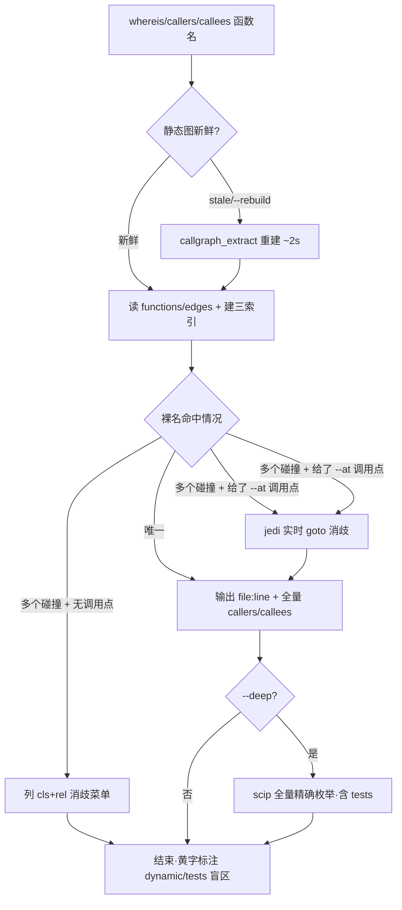

# symbol-locator design

## 0. 术语约定

| 术语 | 定义 | 防冲突结论 |
|---|---|---|
| **symbol-locator** | 本工具的代号;不作为对外命令名 | grep `symbol_locator/symbol-locator` 代码零命中 |
| **whereis / callers / callees** | 三个子命令:查定义位置 / 查谁调用它 / 查它调用谁 | grep `def whereis`、`def callers/callees` 代码零命中 |
| **静态图** | 既有 `callgraph_extract.py` 的产物 `functions.json`(6189 函数身份证) + `edges.json`(23037 条调用边),AST 静态分析,2s 全量重建 | 既有资产,不新造 |
| **实时消歧** | 用 jedi 在**具体调用点** `goto` 出准确定义,消解静态图标 `ambiguous` 的 attr/同名调用 | — |
| **深度档 (`--deep`)** | 用 scip-python 离线全量语义索引做精确影响面枚举 | — |
| **盲区** | 静态图画不出/不准的部分:同名碰撞(22%)、`ambiguous` 边、`dynamic_unresolved`(592 处 getattr 等)、`tests/` 不在扫描范围 | — |

## 1. 决策与约束

### 需求摘要
- **做什么**:命令行小工具,输入函数名 → 输出 (1) 定义 `file:line` (2) callers 谁调用它 (3) callees 它调用谁。
- **为谁**:开发者 + LLM(本会话/cs 技能),在 debug 和做实现时快速定位,不用手翻文件。
- **成功标准**:`whereis 某函数` 秒回位置;`callers/callees` 给出影响面;同名碰撞能消歧;盲区显式标注;且 LLM 在做实现/修复时会被自动提示使用。
- **明确不做**:
  1. 不接**实时 pyright LSP**(caller 跨文件给不全 #10086 + 每次起 server 运维重,已被双路调研证伪)。
  2. 默认**不覆盖 `tests/`**(静态图 `FIRST_PARTY_ROOTS` 不含 tests;`--deep` 的 scip 才覆盖)。
  3. 第一版 scip 仅作 `--deep` 重型档,**不做主路**。
  4. **不改全局 cs 技能文件**(`~/.claude/skills/cs-*`)——B 钩子改走项目内 `attention.md`(见 2.3)。
  5. 不做增量索引、不做编辑前 hook(用户已弃 C/D 档)。

### 复杂度档位
偏离默认业务档,走 **内部开发工具档**:
- 无需对外 API 稳定性/版本兼容、无需高并发、无需鉴权(本项目无登录单机离线)。
- 但保留两条硬约束:**被分析代码 Py3.8**(门禁红线不变);**工具自身源码也要 Py3.8 语法**(门禁默认扫全仓,`SKIP_DIR_NAMES` 不含工具目录)。

### 关键决策
- **三引擎分工(换做法名词层会变)**:静态图管"全"(秒查 + 全量调用边)、jedi 管"准"(实时消歧盲区)、scip 管"全量精确"(`--deep` 枚举)。换成单引擎(只 jedi / 只 scip)会丢掉"秒查全量边"或"实时不过期",名词层与编排都不同。
- **运行时 vs 被分析代码两个 Python(换做法约束会变)**:工具**跑在系统 python3.14**(用最新 jedi 0.20);它只**读** Py3.8 源码。这解除了 jedi 须钉 0.19.2 / scip 须 3.10+ 的版本顾虑(实测 jedi 0.20 消歧命中、scip 借 `pyrightconfig.json` 按 3.8 干净 index)。
- **jedi/scip 一律 lazy import(换做法编排会变)**:顶层不 import,只在用到的子命令内 import 并对缺失优雅降级。否则门禁用 `.venv`(3.8,无 jedi)导入工具模块会 ImportError。
- **新鲜度:静态图查时检测时间戳,stale 则自动 2s 重建**(实测 2.04s,可接受);jedi 实时不涉及;scip `--deep` 是 23s 快照,过期需显式重建。
- **被拒方案**:实时 pyright LSP(见"明确不做"#1);multilspy(默认 jedi 后端 + 常驻 asyncio 死锁)。

### 前置依赖
- jedi 0.20.0 已装系统 3.14(实测可用)。
- scip-python(npm 包) + scip CLI(Go 二进制) 仅 `--deep` 需要;implement 阶段在 `--deep` 步骤验证可获取性,缺失时该档优雅降级提示安装。

## 2. 名词与编排

### 2.1 名词层

**现状**(指向代码位置):
- `callgraph_extract.py`(`.codestable/checkup/scripts/`)产出 `functions.json` / `edges.json`,是天然查询数据源,但**没有任何查询入口**——数据躺在 1.3MB+4.3MB 的 json 里无人手翻。
- `reference_tracer.py`(`.limcode/skills/aps-deep-review/`)能追调用链,但入口是"文件/git 变更"而非"函数名",偏 review。

**变化**(全新模块,落 `tools/symbol_locator/` 子包):
| 名词 | 职责 | 动机 |
|---|---|---|
| `cli`(入口) | argparse:`whereis/callers/callees` + `--at/--deep/--rebuild/--json` | 用户与 LLM 的统一入口 |
| `static_index`(静态图加载器) | 读 json + 建三索引:裸名→key、callers(to→边)、callees(from→边);默认滤 `ambiguous` 边 | 秒查主路 |
| `freshness`(新鲜度) | 检测产物时间戳,stale 时调 callgraph_extract 重建(2s) | 数据不过期、不靠手动体检 |
| `jedi_resolver`(实时消歧) | 在调用点 `goto` 出准确定义(lazy import jedi) | 消解同名/attr 盲区 |
| `scip_deep`(深度档) | `--deep` 时读取已生成的 index.scip,`scip print --json`→倒排查询(lazy;兼容当前大 JSON documents 与 NDJSON);缺索引时提示生成命令 | 全量精确影响面 |
| `render`(输出) | 人看(`file:line` + 扇入扇出 + 盲区黄字标注) / `--json`(给 LLM) | 双受众 |

**接口示例**:
```
$ whereis build_dispatch_key
core/algorithms/dispatch_rules.py:41-95   (被调 0 · 调用 1)
# 来源:static_index 裸名唯一命中

$ whereis to_dict          # 64 处同名碰撞
⚠ 64 处同名,按类消歧(加 --at <file:line> 用 jedi 精确判定):
  ScheduleMetrics.to_dict   core/algorithms/evaluation.py:65
  Batch.to_dict             core/models/batch.py:47
  ... (列前 N + 提示)
# 来源:static_index 裸名索引 + cls/rel 消歧菜单

$ callers resolve_plan
谁调用 resolve_plan(全量 confident 边):
  core/services/.../plan_service.py:88  PlanService.adopt
  ...
⚠ 另有 3 条 ambiguous 边、1 处动态调用未画,加 --deep 用 scip 精确枚举
# 来源:static_index callers 倒排 + 盲区标注

$ callers resolve_plan --deep
[scip 全量精确] 谁调用 resolve_plan:12 处(含 tests/)
# 来源:scip_deep 倒排
```

### 2.2 编排层

**主流程图**(以 whereis 为主线,三引擎分工):


**现状**:无查询编排;`callgraph_extract` 是一次性"扫盘→写 json"的批处理,`reference_tracer` 是"文件→Markdown 报告"的线性管道。

**变化**:新增"裸名查询 → 消歧 → 兜底"的分支型编排(router 拓扑)。主路读 json 秒回;盲区分支按需调 jedi(实时)或 scip(`--deep`)。

**流程级约束**:
- **错误语义**:查无此名 → 返回非零 + 建议(模糊匹配近似名);jedi/scip/networkx 缺失 → 该路径优雅降级到静态图 + 黄字提示安装,**不崩**。
- **幂等/只读**:查询只读源码与 json;唯一写动作是重建产物(可重入,写既有产物目录)。
- **盲区可观测**:任何 callers/callees 结果都显式标注"另有 N 条 ambiguous / M 处动态 / 未含 tests",不静默给"看起来很全"的假象。
- **新鲜度透明**:输出头显示静态图快照时间;scip `--deep` 显示索引时间与索引路径,缺索引时提示生成命令。

### 2.3 挂载点清单

| 挂载位置 | 文件/配置 | 动作 |
|---|---|---|
| 命令入口 | `tools/symbol_locator/__main__.py`(可 `python -m`)+ 可选 `tools/` 下薄封装脚本 | 新增 |
| **A 钩子**:Claude Code 会话指令 | 项目根 `CLAUDE.md`(当前不存在)——写工具用法 + "改函数前先查位置/影响面" | 新增 |
| **B 钩子**:cs 技能启动必读 | `.codestable/attention.md` 的"命令与脚本陷阱/其他"分节——记一行"做实现/修复前用 symbol-locator 查影响面"(经 cs-note,**不动全局技能**) | 修改 |
| scip 索引产物 | `.codestable/checkup/latest/scip/index.scip`(本机按需生成,不入库;`--deep` 读取;缺失时提示生成命令) | 本地产物 |
| 运行时依赖 | jedi(系统 3.14,已装);scip-python+scip CLI(`--deep`) | 新增 |

> "融进 checkup"不单列为挂载点:工具自管新鲜度(2s 重建),不强依赖 checkup 保鲜;若要 checkup 顺带刷新,在 `attention.md` 记一笔即可,同样不改全局 cs-checkup 技能。

#### 2.3.1 钩子内容:触发关键词(A/B 钩子共用)

写进 `CLAUDE.md`(A)与 `attention.md`(B)的不只是"有这工具",而是这份**触发识别规则**——既是用户备忘,也是 LLM 识别依据:

| 用户意图话术 | LLM 应调 |
|---|---|
| "X 在哪 / X 定义在哪 / 找下函数 X" | `whereis X` |
| "谁调用 X / X 被谁用 / 改 X 影响谁 / 动 X 前看波及" | `callers X` |
| "X 调了啥 / X 依赖谁" | `callees X` |
| "X 的调用链 / 上下游" | `callers` + `callees` |
| "彻底/全量/精确查 X 调用点/依赖(含 tests)" | 加 `--deep` |
| 强制前缀:句首 `定位:` / "用定位工具" / "上 sl" | 必调(按语境选子命令) |

**触发动作约定**:做实现或改某函数前,先调 symbol-locator 查位置 + 影响面,再动手——这正是 A(全局软提醒)与 B(cs 实现/修复流程启动必读)要钉的习惯。

### 2.4 推进策略

```
1. 静态图查询骨架:cli + static_index,whereis/callers/callees 读 json 跑通(唯一名)
   退出信号:whereis build_dispatch_key 正确回 file:line;callers/callees 出全量 confident 边
2. 消歧菜单 + 盲区标注:同名碰撞列 cls/rel 菜单;callers/callees 标注 ambiguous/dynamic/tests
   退出信号:whereis to_dict 列 64 处菜单;callers 带盲区提示
3. jedi 实时消歧:--at 调用点时 lazy import jedi goto,缺失优雅降级
   退出信号:cal.to_dict --at 精确命中 WorkCalendar.to_dict;无 jedi 时降级不崩
4. 新鲜度:freshness 检测时间戳,stale 自动 2s 重建;--rebuild 强制
   退出信号:改一个函数后查询命中新行号;输出头显示快照时间
5. scip --deep 全量档:读取本机已生成 index.scip + scip print→倒排查询层,缺失降级提示生成命令
   退出信号:callers resolve_plan --deep 给出含 tests 的全量精确结果
6. 钩子落地:新建 CLAUDE.md(A) + cs-note 写 attention.md(B)
   退出信号:新会话/cs 技能启动能看到工具提示
7. 测试覆盖:补齐验收场景
   退出信号:所有验收场景有可观察证据
```

### 2.5 结构健康度与微重构

##### 评估
- **文件级**:本 feature 几乎全是**新增**,不改现有源码文件;仅 `CLAUDE.md`(新建)、`attention.md`(加一行,文档非源码)。无现有胖文件被触碰。
- **目录级 — `tools/`**:现有 ~37 个 `.py`,已是摊平 + 前缀分组(`long_gate_*`/`quality_gate_*`/`test_registry*`)。本 feature 要新增 6 个模块,**若散进 `tools/` 根会进一步摊平**。
- **目录级 — 单文件 500 行门禁**:六个职责(cli/static_index/freshness/jedi_resolver/scip_deep/render)若塞一个文件必超 500 行。

##### 结论:不做(纯新增,无既有文件/目录要重构)
无微重构动作(不改/不搬任何既有文件)。仅确立**新增组织约定**:新模块收进子包 `tools/symbol_locator/`(而非散落 `tools/` 根),一个职责一个文件,天然规避 500 行门禁、不加剧 `tools/` 根摊平。下面"方案"段记录的是新增落点,非既有搬迁。

##### 方案
- 搬什么:无既有代码搬迁(纯新增)——此项是"新增即按子包组织",非事后搬。
- 落点:`tools/symbol_locator/{__main__,cli,static_index,freshness,jedi_resolver,scip_deep,render}.py`,各 <500 行、单一职责。
- 行为不变验证:不适用(无既有行为);以"门禁绿灯 + 验收场景通过"为退出。

##### 建议沉淀的 convention
- 是否稳定模式:**是**——"`tools/` 下成组的多文件工具收进同名子包,不摊平根目录"。
- 适用范围:本仓库 `tools/`。
  → 建议 implement 跑通后走 `cs-decide` 归档为 `category: convention`。

##### 超出范围的观察
- `tools/` 根已有 ~37 文件摊平,历史工具未分包——本 feature 只管好自己进子包,既有摊平不在本 feature 处理,可后续 `cs-refactor`。

## 3. 验收契约

### 关键场景清单
| 输入/触发 | 期望可观察结果 |
|---|---|
| `whereis build_dispatch_key`(唯一名) | 回 `dispatch_rules.py:41-95` + 扇入扇出 |
| `whereis to_dict`(64 处碰撞) | 列 cls+rel 消歧菜单,不瞎选一个 |
| `whereis to_dict --at calendar_admin.py:306` | jedi 精确命中 `WorkCalendar.to_dict`(calendar.py:58) |
| `callers resolve_plan` | 全量 confident 边 + "另有 N ambiguous/M dynamic/未含 tests"标注 |
| `callees <某函数>` | 列其调用的函数 file:line |
| `callers <名> --deep` | scip 全量精确(含 tests),输出标索引时间 |
| 改一个函数后再查 | 命中**新**行号(stale 自动重建生效) |
| 无 jedi / 无 scip / 无 networkx | 对应路径降级到静态图 + 黄字提示安装,**进程不崩、退出码区分** |
| `--json` | 输出可被 LLM 解析的结构化 JSON |
| 查不存在的名 | 非零退出 + 近似名建议 |

### 明确不做的反向核对项
- 代码中**不应**出现实时 Pyright LSP 客户端逻辑。
- 默认(无 `--deep`)路径**不应**依赖 Node / scip(grep 顶层 import 无 scip;jedi/scip 均 lazy)。
- **不应**修改 `~/.claude/skills/cs-*` 任何文件(B 钩子只落 `attention.md`)。
- 工具源码用 Py3.8 语法(过 `scan_py38plus_syntax.py`)。

## 4. 与项目级架构文档的关系

- 本 feature 是 **dev tooling**,运行期不参与业务请求,系统级业务可见变化为零。
- 名词/流程级约束属工具自身,**不入** business architecture 的结构图。
- 但它与既有 `callgraph_extract` / `reference_tracer` 同属"代码导航基础设施"——建议 acceptance 阶段在 `ARCHITECTURE.md` 的工具/基础设施索引下新增一条**描述**(symbol-locator:函数定位/影响面查询,三引擎),而非贴链接。
- 关联既有 doc:无独立 callgraph 架构 doc;若后续基础设施增多,可考虑起 `infra-code-navigation.md` 聚合 callgraph_extract / reference_tracer / symbol-locator 三者。
