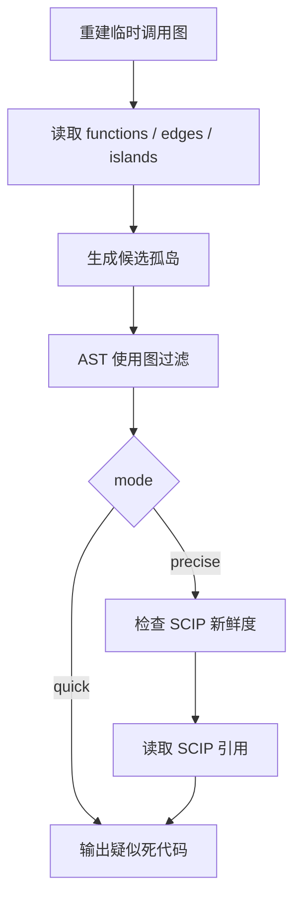

# dead-code-usage-graph

## 0. 术语

- **候选孤岛**：现有调用图里没有确信调用方、也没有确信被调用方的函数。
- **使用证据**：函数被真实代码引用、传参、注册为回调、通过模块属性调用、通过对象方法调用等证据。
- **快模式**：只用本地 AST 和现有调用图，适合 pre-push。
- **精确模式**：在快模式基础上读取新鲜 SCIP 索引，确认剩余候选的全仓引用。
- **疑似死代码**：没有确信调用边，也没有使用证据，也没有精确引用的函数。

## 1. 决策与约束

现状：

- pre-push 调 `tools/scan_dead_code_islands.py --quiet-when-clean`。
- 扫描脚本只读 `islands.json`。
- `islands.json` 只按确信边计算，`ambiguous` 边不参与。
- 这会把“扫描器没确信解析”误报成“没人用”。

变化：

- 保留调用图作为第一层候选来源。
- 新增真实使用图，解释候选函数是否被引用或注册。
- 新增精确模式，只有 SCIP 索引新鲜时才读取 SCIP；不新鲜直接失败，不静默降级。
- 基线语义从“原始孤岛”改成“疑似死代码”。

明确不做：

- 不用白名单和源码注释豁免当主方案。
- 不把 `ambiguous` 边当成真实调用链。
- 不在 pre-push 里强制重建 SCIP 索引。
- 不让精确模式在 SCIP 缺失或过期时退回快模式并继续报成功。

复杂度档位：

- 这是质量门禁工具改造，走偏高严谨档位：错误语义要清楚，测试要覆盖误报和真死代码两类。

## 2. 方案

### 2.1 名词层

现状：

- `scan_dead_code_islands.py` 只返回当前 `islands.json` 列表。

变化：

- 新增 `UsageEvidence`：记录某个函数为什么不是死代码。
- 新增 `UsageAnalysis`：包含 `live`、`maybe_live`、`suspect_dead` 三类结果。
- 新增 SCIP 索引状态：`fresh`、`missing`、`stale`、`dirty_worktree`。

示例：

```text
tools/symbol_locator/cli.py::_parse_at
  quick: live, reason=bare_reference, source=tools/symbol_locator/cli.py:49

tools/symbol_locator/scip_deep.py::build_index
  quick: suspect_dead
```

### 2.2 编排层



现状：

- 调用图失败会被 warn-only 路径吞掉。
- 基线刷新直接接受原始孤岛。

变化：

- 扫描失败是工具错误，不能静默成功。
- `--warn-only` 只影响“发现疑似死代码”是否阻断，不影响工具错误。
- `--mode precise` 遇到 SCIP 缺失、过期、工作区脏，直接非零退出。
- `--refresh` 写入的是过滤后的疑似死代码清单。

### 2.3 挂载点

- `tools/scan_dead_code_islands.py`：用户和 pre-push 的入口。
- `tools/dead_code_usage/`：使用图和 SCIP 精确引用实现。
- `.pre-commit-config.yaml`：pre-push 改为显式 `--warn-only`。
- `tools/symbol_locator/cli.py`：给 SCIP 建索引 helper 增加明确入口。
- `tests/gate_meta/`：新增合同测试并登记到质量门禁。

### 2.4 推进策略

1. 增加 CodeStable 文档和 checklist。
2. 增加 AST 使用图底座。
3. 改造扫描入口和错误语义。
4. 增加 SCIP 精确模式。
5. 接上 SCIP 建索引显式入口。
6. 补测试和门禁登记。
7. 跑门禁并做子代理对抗复审循环。

### 2.5 结构健康度

结论：新增子包，不继续把 `scan_dead_code_islands.py` 写胖。

理由：

- 原脚本已经是入口层，继续塞 AST 和 SCIP 逻辑会混杂职责。
- 新增 `tools/dead_code_usage/` 可以把数据模型、AST 使用图、SCIP 引用拆开。

## 3. 验收契约

- argparse 回调 `_parse_at` 在快模式下不报死代码。
- `freshness.rebuild_error_hint` 这种模块属性调用在快模式下不报死代码。
- `StaticIndex.lookup_name` 这种对象方法调用在快模式下不报死代码。
- 真正没有入口的函数在快模式下继续报。
- `--mode precise` 在 SCIP 索引过期时必须失败，不能降级。
- `--mode precise` 在工作区脏时必须失败，不能假装精确。
- pre-push 仍是 warn-only，但工具错误不能被静默吞掉。
- `build_index()` 有明确命令入口，不再是隐藏未接线 helper。
- 工具源码保持 Python 3.8 兼容。

## 4. 收尾

- 更新 checklist 到 done。
- 跑相关测试、Python 3.8 语法扫描、质量门禁。
- 按用户要求做子代理对抗复审循环，直到完整一轮无阻塞。
