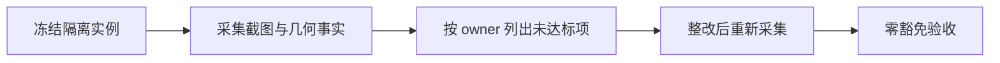

用户已授权并行实施；共同合同以 `implementation-20260912.md` 为准。

## 决策与约束

现有真实浏览器 smoke 保持 manual/CI 策略。新增工具复用项目隔离 `run_live_server` 和 Chromium 109，不读取生产数据库，不更改产品或静态构建。默认档位；图片与运行证据写入调用方明确给定的独立目录。

## 现状与变化

现有 `tests/app_runtime/test_ui_browser_geometry_smoke.py` 主要覆盖 1024/768 宽的深色场景，且不进入 daily required scope。此次新增独立 15 视图 × 2 尺寸 × 2 主题矩阵，冻结 boot、build_id、资源哈希及源标识，输出页面截图、G1–G6、局部裁切/重叠/点击可达测量。

挂载点：独立 collector、证据验收命令、应用 CSS 静态合同、daily gate 显式 `--workbench-ui-evidence`。移除这些入口即可卸载本验证能力，业务运行不受影响。既有大 gate 文件仅新增参数与命令调用，不搬动旧职责。

## 验收契约

- 缺页面、缺尺寸/主题、浏览器版本非 109、缺 boot/build 绑定、未执行必需断言或采集失败均不得记通过。
- 基线允许记录现有失败；每条失败必须带 owner、roadmap item 与移除条件。最终 gate 不接受任何豁免。
- 仅根页面无横滚不足以通过：局部文字裁切、卡片重叠及关键操作命中亦检查。吸顶合同在内部横纵滚动后实测。
- daily 默认命令不变；显式 opt-in 才运行新证据验收，旧 browser smoke 元合同保持。
- 本轨测试自身使用隔离正反样本，验证遗漏/伪通过被拒绝；真实矩阵由主线程统一构建后再次执行。

## 结构健康度

不做既有模块微重构。采集编排、页面测量、证据判定各自独立，新增验证文件归 `tests/workbench/`，避免把浏览器实现塞入 daily gate 主文件。
