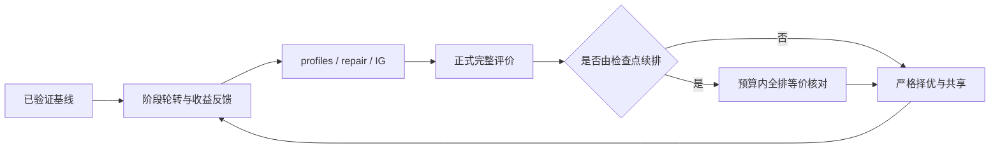

## 0. 术语

阶段工作机会：profiles/repair/IG 的一次可恢复工作单元。检查点：固定输入下的 SGS 派工状态快照。已验证方案：完成正式评价，若由续排产生还完成全量等价核对的候选。行走参考解可以与全局最好解不同，但不能绕开可行性、失败工序和冻结保护。

## 1. 决策与范围

用户已明确要求接替此前 Agent 继续实现和优化。按 `2026-09-14-decision-graph-search-rotation-and-checkpoint` 执行。复杂度为跨算法模块的既有功能接续；保留所有已有 UI、工作台和其他未提交改动，不自动提交或发布。

本次修复接力时旧资源覆盖泄漏、检查点输入绑定缺项和未验证续排候选发布；补齐近期收益反馈、生成器续用与规模控制、精英池多样性、停滞重置。明确不做：换语言、新增产品依赖、改变目标函数、业务数据迁移、放宽 seed 注入规则、改变质量阈值。

## 2. 接口与编排

### 2.1 现状与变化

现状：三个阶段已有轮转骨架，IG 有独立解池、生成器与状态恢复；但父方案接力只更新顺序，缓存身份过窄，部分旧测试仍要求固定时间预留。

变化：起点/缓存/解池按完整决策上下文区分；阶段显式记录首次工作机会和近期真实收益；检查点签名覆盖全部排产语义，最终候选先全排对照再发布。例如资源覆盖从 `M1/P1` 切到 `M2/P2` 后，IG 必须按新覆盖解码并丢弃不兼容的旧缓存。

### 2.2 主流程

所有阶段使用同一截止，阶段之间等待不算该阶段工作耗时。解池切换必须同步批序、资源和 profile；只在输入一致的范围复用评分与检查点。

IG 每次试解及必需验证后暂停；重插中间态和固定父上下文留到本轮结束。其他阶段的更优 incumbent 立即成为严格采纳门槛，新的父解上下文在迭代边界接管。已正式解码的参考项缓存最多等于解池容量；同一固定上下文里确定性解码失败不重试。IG 首次等待实际 v2 父解，profiles 已无法继续时才允许从现有 baseline 起步，不通过虚构三个解码的总成本实现“保底”。

启动时优先最佳分数层，并使用独立解池随机流。对于符合独立单资源条件的 `min_overdue` 起点，`due_date_seed` 可再提出一个交期队列顺序；计算只使用观察工时作为启发，内部探测有 2048 次上限且真实计时。每个返回顺序仍正式 SGS 解码；估算不可信时由完整 score 拒绝并保留原起点。`initial_seed` 区分构造探测、构造耗时、正式解码、被选作参考与严格改善 incumbent；`starting_incumbent_*`、`parent_*` 与实际重解码分数分别记录，避免把不同来源混为一谈。

诊断字段按实际口径使用：`initial_seed.runtime_ms` 只计构造，`decodes` 只计该提议的正式解码；拒用后重解原父序仍计入 IG 总解码数。采用交期起点时，`parent_order_consistent` 比较的是新参考分数和原父分数，false 不等于同序全排与续排失真；等价性以完整业务摘要和 score 核对为准。

### 2.3 挂载点

`optimizer_graph_ready.py` 编排三个阶段；`optimizer_graph_ready_iterated_greedy_run.py` 接入 IG；`GreedyScheduler.schedule` 接入检查点捕获与恢复。移除这些挂载点会使相应能力失效。

### 2.4 推进策略

先冻结原现场与记录决定，再并行实现职责独立的计算组件；主线程整合接力、验证与性能开销；短合同通过后进行同源矩阵，最后回填实际验收结果。用户随后明确要求“不跑全门禁”，因此以本次针对性测试和算法对照交付，不启动隔离副本的全门禁，也不声明 clean proof。

### 2.5 结构约束

现有 IG 主文件已经较大。本轮在自身职责范围内把上下文/候选验证等独立逻辑拆出，避免继续堆叠；不调整其他调度器或工作台结构。Python 3.8 语法和正式复杂度/体量检查必须通过。

## 3. 验收契约

- 可用阶段先获一次机会；无法满足时报告原因，零计时不得导致饥饿；近期收益确实影响同量级用时阶段的选择。
- 生成器成功续用；完整变差、中断、拒绝缩小；原位扩大；停滞切换重置规模。
- 三个起点的完整上下文保持，池按受控多样性选择；退火不交易失败工序，最终最好方案仍严格择优。
- 新 incumbent 的批序、资源/profile 与缓存一致；不同输入的检查点明确拒绝，内部无语义缓存变化不导致误拒。
- 续排的最终胜出方案已核对全排结果；预算打断不发布未经核对方案；全排和续排都真实计时计数。
- 相关短回归、Python 3.8/结构检查；SMTWT 250×3s/5s 与 e2e20 同条件比较；千工序记录实际耗时和迭代数，不以减少 pick 次数代替端到端性能。
- 交期起点的适用边界、交期等号、完整工序集合、探测/时间预算、估算与正式分数分离均有测试；模型结果不能绕过 SGS 或占用已验证指纹集合。
- 原业务数据、冻结规则、完整目标分数、错误和公开/内部边界保持。

## 4. 文档联动

保留旧 ff-note 的历史测量，不覆盖为新数字；新增本轮 acceptance。架构 `service-scheduler.md` 说明实际新增语义，roadmap 只回填真实已验证状态，不把整个 ALNS 路线宣布完成。
