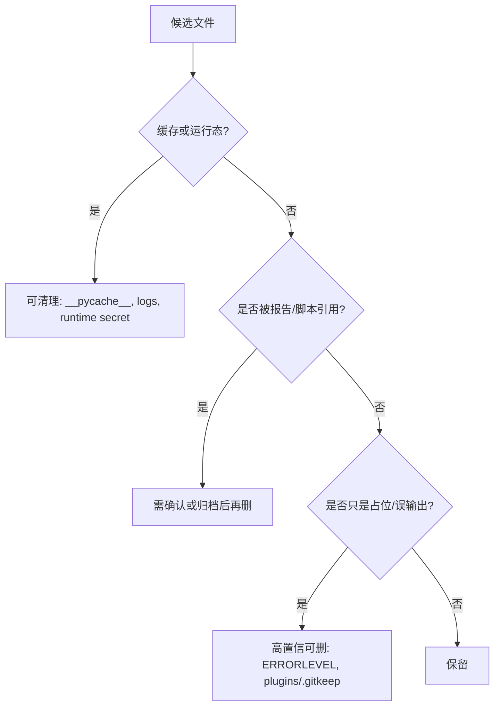

# 仓库无必要/垃圾文件探索

## 速答

本次探索成功调用 9 个 GPT-5.5 Explore 子代理：6 个按区域扫描仓库，3 个做对抗审查。结论收敛后，真正能称为“纯粹无必要/垃圾”的文件不多，主要是缓存、运行态本地文件、误落盘输出和已经失去占位意义的 `.gitkeep`。

最明确的可删候选是：`tests/ERRORLEVEL`、`plugins/.gitkeep`、各处 `__pycache__/`，以及不再用于现场排障时的本地运行日志/密钥文件。证据型产物不能因为被 `.gitignore` 忽略就直接删：`evidence/FullSelfTest/logs/`、`evidence/QualityGate/`、`evidence/ComplexExcelCases/Case01..Case06` 都需要先确认是否还承担当前验收或复现价值。

## 高置信可清理候选

| 路径 | 状态 | 结论 | 依据 |
|---|---|---|---|
| `tests/ERRORLEVEL` | 已被 git 跟踪 | 高置信可删 | 内容只有一行批处理残留输出；搜索未发现引用；正式脚本是 `tests/verify_installer_start_errorlevel.bat`。 |
| `plugins/.gitkeep` | 已被 git 跟踪 | 高置信可删 | `plugins/` 已有 README 和两个插件文件，不再需要空目录占位；只删 `.gitkeep`，不删插件目录。 |
| `**/__pycache__/`、`*.pyc` | 被 `.gitignore` 忽略 | 高置信可清理 | Python 缓存，可再生成。 |
| `logs/aps_error.log` | 被 `.gitignore` 忽略 | 可清理 | 当前为空，属于运行日志。 |
| `logs/aps.log` | 被 `.gitignore` 忽略 | 可清理但避开排障窗口 | 运行日志不是长期证据；若正在排查现场问题，先摘录关键片段再清。 |
| `logs/aps_secret_key.txt` | 被 `.gitignore` 忽略 | 可清理但会让现有 session 失效 | 运行期生成的 SECRET_KEY 文件，缺失时会重新生成。 |

## 不能直接删的证据型候选

| 路径 | 最终分类 | 原因 |
|---|---|---|
| `evidence/QualityGate/quality_gate_manifest.json`、`evidence/QualityGate/receipts/` | 可删旧产物，但删后要重跑门禁 | manifest/receipts 是当前质量门禁 proof，可重建但删除会让现有 proof 失效。 |
| `evidence/FullSelfTest/logs/` | 需确认，不能整目录直接删 | 当前全量自测汇总报告就在该目录，逐项日志也可能是最近一次 PASS 的证据。 |
| `evidence/ComplexExcelCases/Case01..Case06` | 需确认 | `.gitignore` 标成重型 per-run artifacts，但汇总报告引用了各 case 的 input/output/result 路径。 |
| `audit/2026-03/20260316_perf_profile_artifacts/*.prof` | 归档后再删 | `.prof` 是性能画像原始证据，报告只是摘要。 |
| `evidence/FullE2E/gantt_*.html/json` | 需确认 | 它们是可视化/契约快照，若不再作为验收证据，可归档后删。 |

## 需业务或架构确认

| 路径 | 判断 |
|---|---|
| `desktop/` | PyQt 甘特图 PoC 不在 Web 主线内，但文件说明它复用 Web/PyQt 共用契约，不能按残留物直接删。 |
| `templates_excel/转换输出/` | 是转换脚本默认输出，也被阶段验收记录提到；如果不是交付样例，需同步调整脚本/文档/打包口径。 |
| `app_new_ui.py`、`start_new_ui.bat` | README 和回归测试仍把它们作为现代 UI 入口，不建议删除。 |
| `build_win7_*.bat`、`run_smoke_*.bat` | 仍是 Win7 打包/验收入口，不建议删除。 |
| `开发文档/V1.2/*_archived.md`、`策划方案/` | 历史追溯材料，是否删除取决于是否还要保留原始需求/审计链。 |

## 明确应保留的易误判项

- `codestable/`：当前默认工作流事实源。
- `.limcode/`：旧工作流归档和 APS 专项资产库，项目约定暂不删除。
- `evidence/` 中的报告、summary、阶段验收文档：多数是验收和排障事实源。
- `vendor/.gitkeep`、`db/.gitkeep`、`logs/.gitkeep`、`backups/.gitkeep`：这些占位文件保留运行/交付目录结构；不要和 `plugins/.gitkeep` 混为一谈。
- `templates_excel/` 顶层模板：交付 Excel 模板目录，不是转换输出垃圾。
- `web_new_test/`：现代 UI 模板覆盖层和 `/static-v2` 静态资源，不是测试残留目录。

## 关键证据

1. `.gitignore:1-2` 忽略 `__pycache__/` 和 `*.pyc`，支持缓存清理。
2. `.gitignore:27-29`、`.gitignore:71-75` 忽略运行日志和 `logs/aps_secret_key.txt`，说明它们是本地运行态产物。
3. `web/bootstrap/security.py:10-52` 说明 SECRET_KEY 文件缺失时会重新生成。
4. `.gitignore:54-56` 说明 ComplexExcelCases 只保留报告和 summary，per-run artifacts 默认忽略。
5. `evidence/ComplexExcelCases/complex_cases_report.md:19-29` 仍引用 Case01 的 input/output/result 路径，删除前要确认不再需要复现细节。
6. `.gitignore:78-80` 忽略 FullSelfTest logs 和 QualityGate manifest/receipts，但 `evidence/FullSelfTest/logs/full_selftest_report.md:1-15` 显示当前汇总报告就在 logs 目录。
7. `evidence/QualityGate/quality_gate_manifest.json:1-6` 记录 clean worktree 排除路径，证明 manifest/receipts 是门禁 proof 的一部分。
8. `audit/2026-03/20260316_perf_profile_report.md:5-9` 直接引用 `.prof` 原始画像目录和命令。

## 对抗审查后的收紧点

- `ignored` 只表示“不该进版本库”，不等于“没有证据价值”。
- FullSelfTest、QualityGate、ComplexExcelCases 这三类从“高置信可删”降级为“需确认/可重建后清理”。
- 跟踪文件里，只有 `tests/ERRORLEVEL` 和 `plugins/.gitkeep` 被多个子代理一致认为是高置信可删。
- `.prof`、`templates_excel/转换输出/`、FullE2E 甘特快照都更适合“归档后再删”或“改文档/脚本口径后再删”。

## 后续建议

若要真正执行清理，建议分两步：先删 `tests/ERRORLEVEL`、`plugins/.gitkeep` 和缓存/本地运行日志；再单独开一次“证据产物瘦身”任务，决定 FullSelfTest、QualityGate、ComplexExcelCases、perf profile 和 FullE2E 快照的归档策略。
