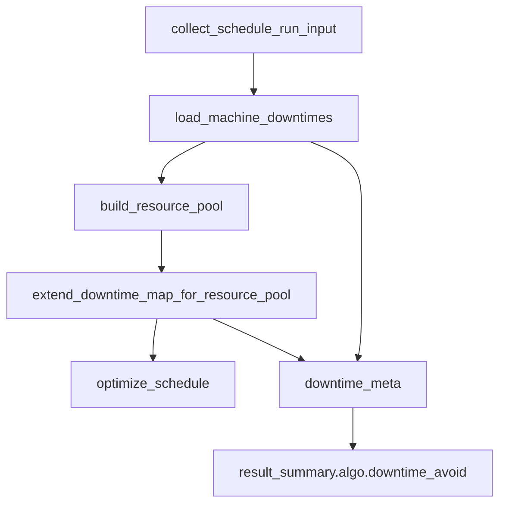

# 停机区间与自动分配资源池合同设计

## 0. 术语约定

- 停机区间：`MachineDowntimes` 中仍有效、结束时间晚于排产开始时间的设备不可用时间段。
- 读取合同：排产输入阶段对停机区间读取结果给出的明确状态，包括成功、无记录、整体失败、部分设备失败。
- 扩展合同：自动分配开启后，把资源池候选设备的停机区间补进 `downtime_map` 的明确状态。
- 候选设备：本次 M3 只采用资源池宽口径，即 `resource_pool["operators_by_machine"]` 中有可用人员关系的设备；不进入逐工序精确候选和算法排序。

## 1. 决策与约束

本次只处理 P1-16 / P1-17 当前事实源：`load_machine_downtimes` 和 `extend_downtime_map_for_resource_pool` 的复杂度、测试证据和可见状态。M2 的冻结窗口 proof 不能继承为停机 proof，M3 也不能声称减少 full-test-debt。

明确不做：

- 不改冻结窗口、优化器主逻辑、落库、页面、runtime/plugin 或质量门禁工具。
- 不新增业务 `if`、fallback、兜底、静默吞错；只整理已有判断和重复流程。
- 不把资源池候选设备从宽口径改成逐工序精确候选；如果必须改算法候选规则，另起计划。
- 不把 P1-16 / P1-17 写成 full-test-debt 减少。

复杂度档位：本次属于技术债合同收口，目标是让两个登记函数回到阈值内，并用测试证明行为没有丢。

## 2. 名词与编排

### 2.1 名词层

现状：

- `downtime_map={}` 既可能表示真的没有停机记录，也可能是加载失败后返回空字典；两者必须靠 `downtime_meta` 区分。
- `downtime_load_*` 和 `downtime_extend_*` 字段已经进入 summary 投影，下游公开读取 `algo.downtime_avoid`，不直接读取 raw meta。
- `MachineDowntimeRepository.list_active_after()` 是停机有效行查询入口，但缺少真实查询测试。

变化：

- 保留既有字段名和值：`downtime_load_ok`、`downtime_load_error`、`downtime_partial_fail_count`、`downtime_partial_fail_machines_sample`、`downtime_extend_attempted`、`downtime_extend_ok`、`downtime_extend_error`、`downtime_extend_partial_fail_count`、`downtime_extend_partial_fail_machines_sample`。
- 抽出内部小 helper 统一“查询单台设备停机、整理时间段、记录失败设备、写 meta/sample”的流程。
- 新增窄测试证明：成功但无记录是正常成功；整体失败必须可见；部分失败保留成功设备；候选设备无停机不新增空 key。

### 2.2 编排层

现状：

- load 先按工序已有 `machine_id` 读取停机。
- build resource pool 再构建自动分配资源池。
- extend 最后按资源池设备补候选设备停机。

变化：

- 编排顺序不变：仍然是 load -> build pool -> extend。
- load/extend 内部复用同一套停机读取 helper，减少重复判断。
- raw meta 继续只在内部流转，公开层仍由 summary 投影成安全文案和稳定字段。

### 2.3 挂载点

- `resource_pool_builder.py` 的停机读取入口：删掉本 feature 后，load/extend 会回到重复读取和高复杂度。
- `MachineDowntimeRepository.list_active_after()` 查询测试：删掉本 feature 后，active、结束时间和排序合同没有直接证明。
- M3 feature 目录和 roadmap/items 回填：删掉后，CodeStable 无法追踪 P1-16/P1-17 承接状态。

### 2.4 推进策略

1. 先回填 M3 计划和 feature 承接，保证后续执行有来源。
2. 补 resource_pool_builder / repository / collector 三类窄测试。
3. 在 resource_pool_builder 内部抽 helper，降低 load/extend 复杂度，不改变公开字段。
4. 跑目标验证、债务脚本和门禁；若复杂度达标，用受控脚本刷新台账。
5. 子代理复审后写 acceptance，回填 M3 和 M4 交接。

## 3. 验收契约

- 没有任何停机记录时，`downtime_load_ok=True`，`downtime_map={}`，不出现 warning。
- 单设备加载失败时，失败设备进入 count/sample，健康设备的停机区间保留。
- 停机仓库初始化、开始时间格式化或查询前准备失败时，`downtime_load_ok=False`，summary 显示停机避让已降级，不把空 map 伪装成健康。
- 进入逐设备查询后，单台失败或多台全部失败都按 partial count/sample 暴露；这不是新增兜底，而是保持现有“按设备记录失败”的合同。
- 自动分配关闭时，extend 不动原 map，也不写“尝试扩展”。
- 自动分配开启且候选设备有停机时，候选设备停机被补齐。
- 候选设备无停机时，不新增空 key，且 `downtime_extend_ok=True`。
- 候选设备部分失败时，成功设备保留，失败设备进入 extend partial meta。
- extend 查询前准备失败时，保留原 `downtime_map`，写入 `downtime_extend_ok=False` 和公开错误文案。
- 反向核对：不新增 fallback、兜底、静默吞错；不改算法主逻辑；不减少 full-test-debt。

## 4. 与项目级架构文档的关系

本次不新增对外能力和新模块，只收口排产输入阶段的内部合同。验收阶段需要确认：

- `architecture/` 不需要新增系统能力说明。
- 若 helper 形成稳定跨模块接口，才写入架构；本次默认不写。
- roadmap 和 feature 追踪必须回填，因为这是 P1 scheduler debt cleanup 的正式里程碑。
