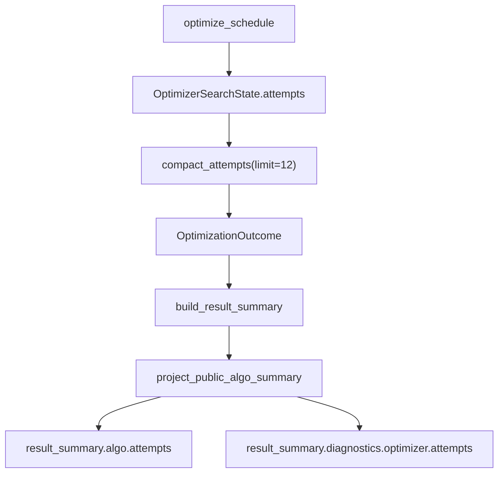

# 优化器结果合同补证设计

## 0. 术语约定

- 优化器结果合同：`optimize_schedule()` 返回的 `OptimizationOutcome` 以及其中 `attempts`、`algo_stats`、`best_score` 等字段的稳定外形。
- rejected 诊断：候选方案因为 `ValidationError` 被拒绝时写入的 `source="candidate_rejected"` 记录。
- 稳定诊断口径：rejected 诊断必须保留 `origin.type` 和 `origin.field`，`origin.message` 只作为排障补充，不作为唯一合同。
- 公开 attempts：`result_summary.algo.attempts` 中页面可以展示的尝试记录。
- 内部 diagnostics：`result_summary.diagnostics.optimizer.attempts` 中用于排障的优化器诊断记录。

## 1. 决策与约束

本次只处理 PR-4 当前事实源：优化器输出、rejected 诊断、attempts 压缩、已有 `state.best is None` 路径外形和 strict/non-strict bad data 证据。PR-5 的 summary/result_summary 落库和页面不泄漏内部诊断，必须在下一段自己证明。

明确不做：

- 不重新拆优化器，不改调度算法主逻辑。
- 不新增独立 `reason` 字段；如果测试证明必须新增，先停下来说明。
- 不新增 `if`、fallback、兜底、静默吞错或宽泛默认值逻辑。
- 不在 summary、页面或落库层补二次兜底。
- 不改冻结窗口、停机资源池、落库业务规则、runtime/plugin 或质量门禁工具运行逻辑。
- 不声称 full-test-debt 减少。

复杂度档位：本次是合同补证，不追求拆文件或降复杂度。当前重点是让已有合同有红灯测试和复验命令保护。

## 2. 名词与编排

### 2.1 名词层

现状：

- `OptimizationOutcome` 已是优化器输出的真实返回类型，下游 orchestrator 会拒绝非该类型结果。
- rejected 记录由 optimizer 候选评估边界创建，当前通过 `origin.type/field/message` 表达原因。
- attempts 在优化器层先由 `compact_attempts(limit=12)` 压缩，summary 只能投影压缩后仍存在的记录。
- `project_public_algo_summary()` 会把普通 attempt 投到公开 attempts，把 rejected 放入内部 diagnostics。
- rejected 诊断入口在 `optimizer_attempt_records.py`，strict/non-strict 候选分流会穿过 `schedule_optimizer_steps.py` 和 `optimizer_local_search.py`；这些文件纳入 PR-4 文件边界，默认只读核对，只有红灯证明必须修时才允许改。

变化：

- 用测试固定 `12` 条 scored attempt 加 `1` 条 rejected attempt 的整链形状：公开 attempts 留 `11` 条 scored，rejected 留在 diagnostics。
- 用测试固定已有 `state.best is None` 路径：没有 best 时仍返回真实 `OptimizationOutcome`，字段外形稳定。
- 加严现有 projection 测试，确认 rejected 的 `origin.type/field/message` 保留，且 rejected 不伪造 `score`。
- 所有变化都落在测试证据和 feature/roadmap 追踪；运行代码只有红灯证明必须修时才动。

### 2.2 编排层

现状：

- optimizer 本体负责生成和压缩 attempts。
- summary 层只做公开字段投影，不应该补救优化器层已经丢失的诊断。

变化：

- PR-4 只在测试里穿透 optimizer 到 summary projection 的边界，证明上游没有把关键 rejected 诊断挤掉。
- 若测试失败，根因优先落在 optimizer 创建诊断或压缩 attempts 的地方，不在页面、落库或 summary display 层补丁式修复。

### 2.3 挂载点

- `tests/regression_optimizer_public_summary_projection_contract.py`：固定 optimizer attempts 进入 summary 后的公开/诊断分层。
- `tests/regression_ortools_budget_guard_skip_when_no_time.py`：固定已有 `state.best is None` 路径的输出外形。
- PR-4 feature 目录与 roadmap/items 回填：让 CodeStable 能追踪本段证据补齐状态。

### 2.4 推进策略

1. 先创建 PR-4 feature 三件套并把 items 改为 `in-progress`。
2. 补或加严 optimizer 公开投影、attempts 压缩和已有 `state.best is None` 路径测试。
3. 只在红灯证明需要时改 optimizer 层实现；默认不改运行代码。
4. 跑 PR-4 目标测试、静态检查、full-test-debt、台账检查和 yaml 校验。
5. 请 subagent 复审优化器链路、测试缺口和无新增兜底。
6. 写 acceptance，items 标 `done`，并在 PR-5 头部写清承接边界。

## 3. 验收契约

- `12` 条 scored attempt 加 `1` 条 rejected attempt 进入 `build_result_summary` 后，公开 attempts 保留 `11` 条 scored，rejected 留在 `diagnostics.optimizer.attempts`。
- rejected 诊断保留 `origin.type`、`origin.field`、`origin.message`，并且没有伪造 `score`。
- 公开 attempts 不出现 `source`、`tag`、`used_params`、`algo_stats`、`origin`。
- 已有 `state.best is None` 路径仍返回真实 `OptimizationOutcome`，并保留稳定的 `summary`、`used_strategy`、`used_params`、`best_score`、`best_order`、`algo_stats`、`attempts`。
- strict 候选坏数据继续抛 `ValidationError`；non-strict 只记录允许跳过的候选，不静默改成成功。
- 反向核对：不新增 fallback、兜底、静默吞错；不改 summary/页面/落库；不减少 full-test-debt。

## 4. 与项目级架构文档的关系

本次不新增对外能力和新模块，只补齐优化器输出合同证据。验收阶段需要确认：

- `architecture/` 不需要新增系统能力说明。
- 如果运行代码没有变化，requirements 不需要回写。
- roadmap 和 feature 追踪必须回填，因为这是 P1 scheduler debt cleanup 的正式里程碑。
