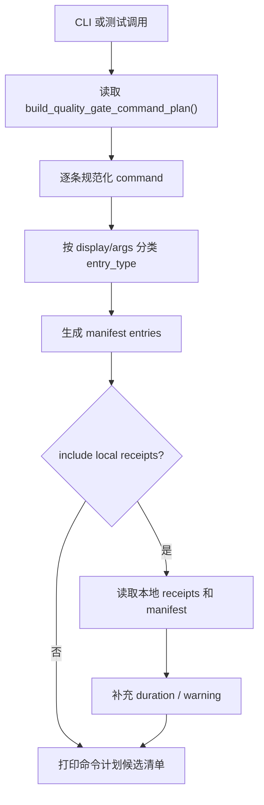

# long-gate-manifest-probe 设计方案

## 0. 术语约定

- 长耗时门禁清单：从 `tools.quality_gate_shared.build_quality_gate_command_plan()` 当前返回的命令计划里整理出的结构化列表。它只说明“有哪些命令、属于哪类、将来能不能缓存”，不执行命令。
- entry：清单里的单条命令记录，包含 `entry_id`、`entry_type`、`display`、`args`、`command_hash` 和文件 scope 占位。
- 本地 receipt 探测：读取 `evidence/QualityGate/receipts/*.json` 和 `quality_gate_manifest.json`，用于展示历史命令耗时或缺失情况。它只读本地产物，不把旧 receipt 当成远程事实。
- 防冲突结论：当前仓库已有 `quality_gate_manifest`、`command_receipts`、`receipt` 这些质量门禁证据概念；本 feature 使用 `long_gate_manifest` 命名，避免和现有 clean proof manifest 混在一起。

## 1. 决策与约束

### 需求摘要

本 feature 只做 roadmap PR-0：新增一个只读探测工具，能从真实质量门禁命令计划生成长耗时门禁清单，并在用户要求时读取本地 receipt 做慢命令提示。

成功标准：

- 入口必须调用真实 `build_quality_gate_command_plan()`。
- 清单必须包含 collect-only、full-test-debt、ruff、pyright、architecture fitness、required regressions、debt ledger、startup regressions、quickref 等当前计划里的主要命令分类。
- `--include-local-receipts` 在没有本地 receipt 时要明确说明“没有历史 receipt，只能用命令计划候选清单”。
- 这一步不能接入 `scripts/run_quality_gate.py` 的真实执行循环，也不能改变质量门禁结果。

明确不做：

- 不做输入指纹计算。
- 不写 success cache。
- 不新增 `--long-gate-cache`。
- 不改现有 receipt schema。
- 不执行任何质量门禁命令。

复杂度档位：走“本地开发工具”默认档位，无对外 API、无并发、无持久化写入；唯一输出是终端文本和可被测试读取的 Python dict。

关键决策：

- D1：命令来源只认 `build_quality_gate_command_plan()`，不手写当前 13 步命令。这样以后注册表变化时，探测工具能自然看到新计划。
- D2：required regression 和 startup regression 的分类以真实 command plan 的 pytest args 为主体，并用动态注册表函数辅助识别，不复制静态测试列表。
- D3：本地 receipt 只作为探测信息。缺失、损坏、旧格式都不能让工具失败；最多输出 duration unknown 或 warning。

## 2. 名词与编排

### 2.1 名词层

现状：

- `tools/quality_gate_shared.py::build_quality_gate_command_plan()` 返回质量门禁命令 dict 列表。
- `tools/quality_gate_shared.py::QUALITY_GATE_TOOL_PATHS` 和 `QUALITY_GATE_SOURCE_FILES` 保存门禁工具和源文件范围。
- `tools/quality_gate_shared.py::build_quality_gate_receipt_rel_path()` 定义 receipt 文件名规则。
- `scripts/run_quality_gate.py` 写入 receipt、stdout log 和 stderr log。

变化：

- 新增 `tools/long_gate_manifest.py`。
- 新增 `LONG_GATE_SCHEMA_VERSION = 1`。
- 新增 `classify_quality_gate_command(command)`，返回 entry type。
- 新增 `build_manifest_from_quality_gate_plan(command_plan, receipts=None)`，把命令计划整理成 manifest dict。
- 新增 `build_long_gate_manifest(repo_root)`，内部调用真实 command plan。
- 新增 `load_local_quality_gate_receipts(repo_root)` 和 CLI 输出函数，只读本地 evidence。

接口示例：

```python
# 来源：tools/long_gate_manifest.py build_long_gate_manifest
manifest = build_long_gate_manifest(repo_root)
manifest["entries"][0]["entry_id"] == "pytest_collect_all"

# 来源：tools/long_gate_manifest.py classify_quality_gate_command
classify_quality_gate_command({"display": "python tools/check_full_test_debt.py", "args": ["python", "tools/check_full_test_debt.py"]})
# => "full_test_debt"
```

### 2.2 编排层

主流程：



现状：

- 当前没有独立的 long gate 清单工具。
- 质量门禁 runner 会写 receipt，但 receipt 只服务 clean proof 和失败续跑。

变化：

- 新工具只读 command plan 和本地 evidence。
- CLI 输出清楚标记 `LONG`、`PROBE`、`UNKNOWN`，让维护者知道哪些是后续缓存候选。
- 没有本地 receipt 时输出固定提示，不制造假耗时。

跨层纪律：

- 失败关闭范围：读 command plan 失败时正常抛错；读本地 receipt 失败时降级成 warning。
- 可观测点：CLI 输出 entry 总数、每条分类、本地 receipt 状态。
- 幂等性：重复运行不写文件，输出只取决于当前 command plan 和本地 receipt。

### 2.3 挂载点清单

本 feature 不引入真实门禁挂载点。它只新增一个可手动运行的工具模块：

- `python -m tools.long_gate_manifest --print`
- `python -m tools.long_gate_manifest --print --include-local-receipts`

删掉该模块和对应测试后，真实质量门禁行为不变。

### 2.4 推进策略

1. 编排骨架：新增 feature 文档和 checklist，回写 roadmap item 为 in-progress。
   退出信号：CodeStable YAML 校验通过。
2. 清单模块：新增 `tools/long_gate_manifest.py`，能从 command plan 生成 entries。
   退出信号：直接调用 `build_long_gate_manifest()` 能看到当前主要 entry。
3. 本地 receipt 探测：补 `--include-local-receipts`，缺失 receipt 时输出固定提示，损坏/未知 receipt 输出 warning。
   退出信号：CLI 在当前仓库和临时测试目录都能稳定输出。
4. 合同测试：新增 `tests/test_long_gate_manifest.py`，覆盖真实入口、分类、动态 args、pyright tools scope、无 receipt 提示和未知 receipt warning。
   退出信号：定向 pytest 通过。

## 3. 验收契约

关键场景：

- S1：调用 `build_long_gate_manifest(repo_root)` → 真实调用 `build_quality_gate_command_plan()`，不是测试里手写清单替代。
- S2：当前真实 command plan → manifest entries 包含 `pytest_collect_all`、`full_test_debt`、`architecture_fitness`、`required_regressions`、`debt_ledger_sync`、`startup_runtime_regressions`、`quickref_vs_routes`。
- S3：pyright tools 命令 → entry 的 `tool_file_scopes` 包含 `QUALITY_GATE_TOOL_PATHS`。
- S4：没有本地 receipts 时运行 `--print --include-local-receipts` → 输出固定的 no receipts 提示。
- S5：本地 receipts 里出现 command plan 识别不了的 display → 输出 warning，不静默丢弃。

反向核对项：

- 代码中不应新增 `--long-gate-cache`。
- `scripts/run_quality_gate.py` 不应出现 long gate 执行分支。
- 新工具不应执行 `_run_command`、`subprocess.run` 质量门禁命令。

## 4. 与项目级架构文档的关系

本 feature 只是新增质量门禁辅助探测工具，不改变系统运行架构和正式质量门禁入口。验收阶段不需要更新 `codestable/architecture/ARCHITECTURE.md`，但验收报告要明确说明：`scripts/run_quality_gate.py` 仍是唯一正式质量门禁入口，本工具只是后续缓存工作的准备层。
