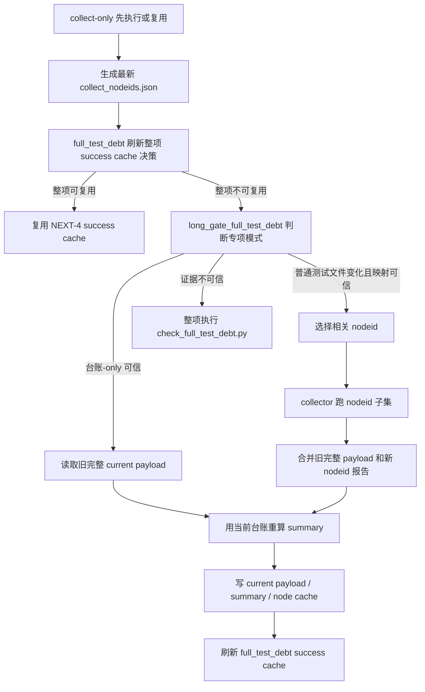

# full-test-debt-nodeid-cache 设计方案

## 0. 术语约定

- full-test-debt：质量门禁里的 `python tools/check_full_test_debt.py`，用来确认完整 pytest 债务证明仍可信。
- 整项成功复用：NEXT-4 已完成的能力。只有输入、输出、日志和 schema 都完全匹配时，整步复用上次成功结果。
- nodeid 增量：NEXT-5 新增能力。只有普通测试文件变化，并且能从 `collect_nodeids.json.nodeids_by_file` 精确找到对应 nodeid 时，才重跑这些 nodeid，再把结果合并回完整 current payload。
- node cache：`evidence/QualityGate/full_test_debt_node_cache.json`。它不是 success cache 的替代品，只是 full-test-debt 专项辅助证据。
- 台账-only：只有 `开发文档/技术债务治理台账.md` 变化，且上次 current payload 仍可信时，不重跑 pytest，只用当前台账重新校验并重写 summary。
- 整项回退：nodeid 增量或台账-only 任一证据不完整、不可信、映射不到，就回到 NEXT-4 的整项执行或整项复用。

## 1. 决策与约束

### 需求摘要

本 feature 完成 roadmap `NEXT-5`：在 NEXT-4 的 full-test-debt 整项成功复用基础上，新增更细的 nodeid 级增量复用，但只允许在非常窄的安全场景启用。目标是少跑一点完整 pytest，同时不让旧成功掩盖新失败。

成功标准：

- 新增 `evidence/QualityGate/full_test_debt_node_cache.json`，并加入 `.gitignore` 和本地 hook 拦截。
- 新增 `tools/long_gate_full_test_debt.py`，集中处理 full-test-debt 的 node cache、台账-only、nodeid 增量、整项回退原因。
- 修正 collect nodeid 解析，参数化 nodeid 里有空格或 `collected` 字样时不能被截断或误跳过。
- `full_test_debt` 的整项指纹继续覆盖 NEXT-4 输入范围，并补齐被完整 pytest 直接导入的脚本、CodeStable 文档和 `.limcode` 证据目录边界。
- 只有普通测试文件变化，且不是 `conftest.py`、不是测试 helper、不是动态/跨文件依赖场景时，才尝试 nodeid 增量。
- 增量结果必须合并回一份完整 `current_full_test_debt.json`，再复用原 `build_full_test_debt_summary()` 台账校验；不能把子集 pytest payload 直接当完整 proof。
- 只改台账时，不跑 pytest，但必须校验旧 current payload 和旧 success cache 输出 hash、collect proof、repo identity、工具/环境指纹后，才重写 `full_test_debt_summary.json`。
- 增量失败、collector JSON 不合法、node cache 坏、stdout/stderr 证据缺失或 hash 不一致时，不能复用旧成功。

明确不做：

- 不启用 startup、required、ruff、pyright、architecture、debt ledger、quickref 等后续 planned entry。
- 不新增新的 long gate entry；nodeid 增量只是 `full_test_debt` 内部的执行模式。
- 不改变 full-test-debt 的债务判定语义，不放宽 active xfail、fixed、strict XPASS、candidate debt、collection error 的失败规则。
- 不用 nodeid 猜测测试 helper 或 fixture 的影响范围；映射不可靠时整体重跑。
- 不把 explain 当 proof；explain 只展示决策，不写 node cache、不写 summary、不写 receipt、不写 success cache。
- 不提交 `evidence/QualityGate/` 下的运行产物。

复杂度档位：质量门禁缓存。第一优先级是不能假绿，命中率排在后面；任何证据不完整，都要牺牲加速、保住真实执行。

## 2. 名词与编排

### 2.1 名词层

现状：

- `full_test_debt` 已经是 enabled entry，整项 success cache 绑定 `current_full_test_debt.json`、`full_test_debt_summary.json`、`collect_nodeids.json` 和完整输入指纹。
- `collect_nodeids.json` 已有 `nodeids_by_file`，但解析 nodeid 时会按空格截断，参数化 nodeid 不完全可信。
- `check_full_test_debt.py` 只能现场跑 collector，不支持读取已有 current payload 后只重算 summary。
- `collect_full_test_debt.py` 可以透传 nodeid 给 pytest，但默认会覆盖 `current_full_test_debt.json`。
- runner 在整项不能复用时会清掉旧 full-test-debt 输出，这对 NEXT-4 安全，但会挡住 NEXT-5 的增量合并。

变化：

- `tools/long_gate_schema.py` 新增 `FULL_TEST_DEBT_NODE_CACHE_SCHEMA_VERSION`。
- `tools/quality_gate_shared.py` 的 collect nodeid 解析改成保留整行 nodeid，只过滤 pytest 汇总/噪声行。
- `tools/collect_full_test_debt.py` 增加安全输出隔离参数，让 nodeid 子集收集不覆盖正式 `current_full_test_debt.json`。
- `tools/check_full_test_debt.py` 拆出读取已有 current payload、从 payload 生成 summary、写 summary 的复用入口。
- `tools/long_gate_full_test_debt.py` 负责：
  - 读写 node cache。
  - 校验 node cache schema、payload hash、collect nodeid hash、测试文件 hash、工具 hash、台账 hash、stdout/stderr hash。
  - 根据 previous/current full-test-debt 指纹差异判断是否只有普通测试文件变化，或是否台账-only。
  - 从 `nodeids_by_file` 找出要重跑的 nodeid，去重并保持稳定顺序。
  - 调用 collector 跑 nodeid 子集，并把子集结果合并进旧完整 current payload。
  - 让合并后的 payload 继续走原 checker 台账校验。
  - 给 runner 返回明确执行模式、回退原因、增量 nodeid 清单。
- `scripts/run_quality_gate.py` 在 full-test-debt 整项 success cache 不能复用时，先询问专项模块是否能走台账-only 或 nodeid 增量；不能则整项执行。

### 2.2 编排层

跨层纪律：

- nodeid 增量必须发生在 runner 删除旧 full-test-debt 输出之前，或从 node cache/旧 success cache 中读取所需旧证据，不能依赖会被清理的裸文件。
- `execution_mode` 必须能区分 `reused_success_cache`、`executed`、`nodeid_incremental`、`ledger_only`。
- clean-worktree proof 验证要承认 `nodeid_incremental` 和 `ledger_only`，但只在它们的 receipt 记录了足够的旧 cache、nodeid、summary hash、合并 payload hash 时承认。
- force rerun full_test_debt 或 force all 时，必须绕过 nodeid 增量和台账-only，执行整项。
- `--no-long-gate-cache` 时，不读不写 success cache，也不读不写 node cache。
- dirty/resume 场景不写新的 success cache 或 node cache。

### 2.3 挂载点

- `tools/long_gate_full_test_debt.py`：新增专项增量判断、node cache 读写、payload 合并和回退原因。
- `tools/collect_full_test_debt.py`：新增输出隔离参数，不改变默认全量收集行为。
- `tools/check_full_test_debt.py`：拆可复用的 current payload summary 校验入口。
- `scripts/run_quality_gate.py`：在 full-test-debt 命令执行前接入专项模式，写清 receipt/summary。
- `tools/long_gate_manifest.py` / `tools/long_gate_fingerprint.py` / `tools/long_gate_schema.py`：补齐指纹边界和 schema 常量。
- `.gitignore` / `tools/git_hook_checks.py`：阻止 node cache 运行产物进提交。
- `tests/test_long_gate_full_test_debt_cache.py`：锁住 nodeid 增量、台账-only、坏证据回退、force/explain/no-cache 守护。

拔掉本 feature 的方式：关闭 runner 里的 nodeid 增量/台账-only 分支，保留 NEXT-4 整项 success cache；删除 node cache 输出和专项模块引用即可回到整项执行/整项复用。

### 2.4 推进策略

1. 先修地基：nodeid 解析、输出隔离、summary 复用入口、schema/忽略/hook。
2. 再补专项模块：node cache schema、变更分类、nodeid 映射、payload 合并、台账-only。
3. 接入 runner：保持整项复用优先，force/no-cache/explain 继续优先生效。
4. 补测试：先覆盖假绿风险，再覆盖 happy path。
5. 回写 CodeStable：acceptance、items、roadmap 主文档和 NEXT-6 planned 边界。

## 3. 验收契约

关键场景：

- S1：带空格或 `collected` 字样的参数化 nodeid 能完整写入 `collect_nodeids.json`。
- S2：只改一个普通测试文件时，能从 `nodeids_by_file` 找到对应 nodeid，只计划重跑这些 nodeid。
- S3：只改多个普通测试文件时，合并 nodeid 去重且顺序稳定。
- S4：测试文件变化但映射不到 nodeid、文件看起来像 helper、没有可运行测试时，整体重跑。
- S5：`conftest.py`、`tests/**/conftest.py`、pytest 配置、依赖文件变化时，整体重跑。
- S6：`core/`、`web/`、`data/`、`plugins/`、`scripts/` 里被测试直接导入的源码、根脚本、模板、静态资源、Excel 模板、安装脚本变化时，整体重跑。
- S7：collector/checker/runner/schema/cache/fingerprint/manifest/summary/registry 工具变化时，整体重跑。
- S8：只改技术债务台账时，不跑 pytest，只读取可信旧 current payload，用当前台账重算 summary，并刷新 success cache。
- S9：台账-only 但旧 current payload 缺失、hash 不匹配、payload.head_sha 差异不只台账、collect proof 不可信时，整体重跑。
- S10：node cache 第一次不存在时，整项执行成功后写入。
- S11：node cache JSON 损坏、schema version 不匹配、payload hash 不一致、collect nodeid hash 不匹配、测试文件 hash 不匹配、stdout/stderr 日志缺失或 hash 不一致时，整体重跑或重跑相关 nodeid，不能误复用。
- S12：增量重跑失败、collector stdout 非 JSON、exitstatus 非 0、合并后台账校验失败时，不能复用旧成功掩盖失败。
- S13：增量重跑成功后，写新的 `current_full_test_debt.json`、`full_test_debt_summary.json`、`full_test_debt_node_cache.json`，并刷新 full_test_debt success cache。
- S14：`--long-gate-force-rerun full_test_debt` 和 `--long-gate-force-rerun-all` 必须整项重跑，不走 nodeid 增量。
- S15：`--long-gate-cache-explain` 只打印决策，不写 node cache、不写 proof。
- S16：`--no-long-gate-cache` 不读不写 success cache，也不读写 node cache。
- S17：startup、required、ruff、pyright、architecture、debt ledger、quickref 仍保持 planned。

反向核对项：

- 不新增新的 enabled entry。
- 不改 active xfail / fixed / candidate debt / strict XPASS 判定规则。
- 不把坏 node cache 当 proof。
- 不把子集 pytest payload 直接当 full-test-debt proof。
- 不提交 `evidence/QualityGate/full_test_debt_node_cache.json`。

## 4. 与项目级架构文档的关系

本 feature 是质量门禁工具链内部能力，不改变 APS 排产业务功能，不需要更新 `codestable/requirements/`。它会补充 `quality-gate-long-cache` roadmap 的 NEXT-5 状态和规则。架构总入口无需新增业务模块说明。
