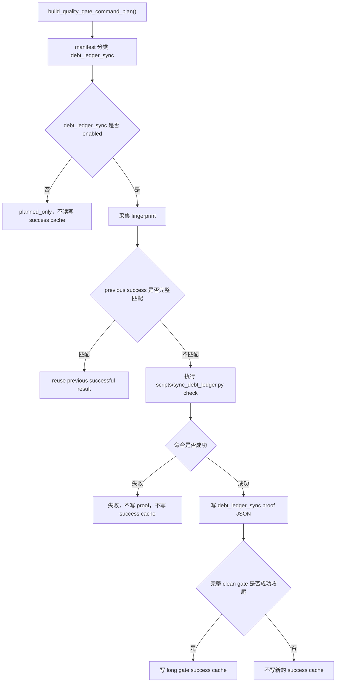

# debt-ledger-sync-cache 设计方案

## 0. 术语约定

- `debt_ledger_sync`：完整质量门禁里的 `python scripts/sync_debt_ledger.py check` 这一条命令。它检查技术债务治理台账和当前扫描结果是否一致。
- debt ledger proof JSON：`debt_ledger_sync` 成功执行后写出的 `evidence/QualityGate/debt_ledger_sync.json`。它只证明这一条命令本次成功执行，并且输出、日志、台账和扫描元数据都有记录。
- architecture scan file cache：`tools/architecture_scan_cache.py` 管的文件级扫描事实缓存。它是扫描 helper 的运行产物，不是 `debt_ledger_sync` 本身的 success cache 输出。
- clean-worktree final proof：干净工作区下运行 `scripts/run_quality_gate.py --require-clean-worktree --long-gate-cache` 并完整成功收尾。`--long-gate-cache-explain`、cache hit、proof JSON 都不能冒充它。

## 1. 决策与约束

### 需求摘要

本 feature 推进 roadmap `NEXT-11`：为正式质量门禁里的债务台账同步检查接入 long gate success cache。目标是让这条命令在输入文件、台账、扫描 helper、配置、依赖、Python 环境、architecture scan 元数据、声明输出 proof 和 stdout/stderr 日志都没变时，可以复用上一轮完整 clean gate 写下的成功结果。

成功标准：

- `debt_ledger_sync` 继续来自真实 `build_quality_gate_command_plan()`，命令仍是 `python scripts/sync_debt_ledger.py check`。
- manifest 能为 `debt_ledger_sync` 声明完整输入范围、配置范围、工具范围、依赖范围、环境 key 和输出文件。
- `evidence/QualityGate/debt_ledger_sync.json` 被写入、被 output_result_files 声明、被 success cache hash 绑定，并被 `.gitignore`、hook 和 clean worktree generated path 排除清单保护。
- 台账文件、roadmap/feature 文档、sync 脚本、ledger/operations/scan/architecture cache helper、扫描源码、配置、依赖、Python 环境和 architecture scan 元数据变化都会让 fingerprint 变化。
- `architecture_fitness` 和 `quickref_vs_routes` 仍保持 planned，不借 NEXT-11 顺手启用。
- `scripts/sync_debt_ledger.py check` 的业务语义不变；它仍只校验，不刷新、不修复、不直接写 proof。

明确不做：

- 不启用 `architecture_fitness`。
- 不启用 `quickref_vs_routes`。
- 不改变 daily gate 或 pre-push 默认语义。
- 不把 `--long-gate-cache-explain` 当 proof。
- 不把 cache hit 或 `debt_ledger_sync.json` 当 clean-worktree final proof。
- 不提交 `evidence/QualityGate/**` 运行产物。
- 不改变 `scripts/sync_debt_ledger.py check` 的校验业务行为。
- 不使用 Python 3.9+ 类型语法，不使用 `shell=True`。

复杂度档位：质量门禁安全增强。输入范围宁可保守一点多重跑，也不能少算导致错误复用。

## 2. 名词与编排

### 2.1 名词层

现状：

- `tools/quality_gate_shared.py` 的 command plan 已包含 `python scripts/sync_debt_ledger.py check`。
- `tools/long_gate_manifest.py` 已能把这条命令识别成 `ENTRY_DEBT_LEDGER_SYNC`，但 `_CACHE_ENABLED_ENTRY_TYPES` 还没有它，所以它当前是 planned。
- `debt_ledger_sync` 还没有专属 output proof path，`evidence/QualityGate/debt_ledger_sync.json` 也还没有进入 artifact hygiene 清单。
- `tools/architecture_scan_cache.py` 已有 `architecture_scan_cache_metadata()`，能提供 cache schema、fact schema、scanner version hash 和 radon 行为 hash。
- `scripts/sync_debt_ledger.py check` 目前由台账加载和 `validate_ledger_against_current_scan()` 校验组成，不负责写 long gate proof。

变化：

- 在 `tools/quality_gate_shared.py` 增加 `QUALITY_GATE_DEBT_LEDGER_SYNC_REL`，必要时在 `tools/quality_gate_support.py` re-export。
- 在 `tools/long_gate_manifest.py` 为 `debt_ledger_sync` 增加专属 scopes、env_keys 和 `output_result_files`，但先不启用。
- 在 `tools/long_gate_fingerprint.py` 增加 architecture scan metadata 运行时 key，让 cache schema、fact schema、scanner version hash 和 radon 行为变化能进入 fingerprint。
- 在 `scripts/run_quality_gate.py` 增加 `debt_ledger_sync` proof writer，写出单条 entry 的成功 proof。
- 在 `.gitignore`、`tools/git_hook_checks.py` 和 `GENERATED_CLEAN_WORKTREE_EXCLUDED_PATHS` 加入 `evidence/QualityGate/debt_ledger_sync.json`。
- 最后只把 `ENTRY_DEBT_LEDGER_SYNC` 加入 enabled set；`architecture_fitness`、`quickref_vs_routes` 不动。

### 2.2 编排层

跨层纪律：

- command hash 继续覆盖 display、args、capture_output、output_policy 和 env_overlay。
- `architecture_scan_cache.json` 是 helper 运行产物，不作为 `debt_ledger_sync` 的 input scope 或 output_result_files。
- architecture scan schema、scanner version hash 和 radon 行为要通过 metadata 进入 fingerprint 和 proof。
- proof JSON 必须写在单条命令成功后、pending success cache 写入前。
- explain、dirty worktree、失败续跑、unbound proof 都不能写新的 success cache。
- proof JSON 必须写清楚 `does_not_claim: clean_worktree_proof`。

### 2.3 挂载点

- `tools/quality_gate_shared.py`：新增 debt ledger proof path 常量。
- `tools/quality_gate_support.py`：对外稳定入口如需使用则 re-export 新常量。
- `tools/long_gate_manifest.py`：声明 `debt_ledger_sync` scopes、output 和 enabled 状态。
- `tools/long_gate_fingerprint.py`：增加 architecture scan metadata runtime key。
- `scripts/run_quality_gate.py`：写 `debt_ledger_sync` proof，并把它纳入 clean-worktree generated path 排除。
- `.gitignore`、`tools/git_hook_checks.py`：防止新 proof 运行产物混入提交。
- `tests/test_long_gate_debt_ledger_cache.py` 和现有 long gate / hook 测试：锁住 fingerprint、proof、artifact hygiene 和 enabled 边界。
- `codestable/roadmap/quality-gate-long-cache/`：记录 NEXT-11 状态。

拔掉本 feature 的方式：把 `ENTRY_DEBT_LEDGER_SYNC` 从 `_CACHE_ENABLED_ENTRY_TYPES` 移除；保留 proof path 和 artifact hygiene 也不会改变实际复用行为。

### 2.4 推进策略

1. CodeStable scaffold：创建本 feature 文档和 checklist，把 roadmap item 标为 in-progress，并修正 roadmap 里 NEXT-10 陈旧段落。
2. proof path 与 artifact hygiene：声明 `debt_ledger_sync` proof path，加入 ignore/hook/clean excluded path，但不启用 entry。
3. manifest / fingerprint：补齐 `debt_ledger_sync` scopes、env keys、architecture scan metadata 指纹和相关测试，仍不启用。
4. proof writer：runner 在 `debt_ledger_sync` 成功后写 proof JSON，仍不启用。
5. enable：只启用 `debt_ledger_sync`，确认 `architecture_fitness` 和 `quickref_vs_routes` 仍 planned。
6. acceptance / roadmap：写验收报告，更新 checklist 和 roadmap 状态，明确 proof 口径和未做事项。

## 3. 验收契约

关键场景：

- S1：`debt_ledger_sync` 继续从真实 command plan 分类出来，命令身份不变。
- S2：启用前 `debt_ledger_sync` 是 planned；启用后 enabled 只比 NEXT-10 多这一项。
- S3：`architecture_fitness` 和 `quickref_vs_routes` 始终保持 planned。
- S4：`debt_ledger_sync` 的 fingerprint 会因 `开发文档/技术债务治理台账.md` 变化而变化。
- S5：`debt_ledger_sync` 的 fingerprint 会因 roadmap / feature 文档变化而变化。
- S6：`debt_ledger_sync` 的 fingerprint 会因 sync 脚本、ledger helper、operations、scan helper、architecture cache helper 变化而变化。
- S7：`debt_ledger_sync` 的 fingerprint 会因扫描源码、配置、依赖、Python 环境或 architecture scan metadata 变化而变化。
- S8：`architecture_scan_cache.json` 本身不是 `debt_ledger_sync` 的输入；它的生成时间不能让 fingerprint 抖动。
- S9：成功执行后会写 `evidence/QualityGate/debt_ledger_sync.json`，缺失或篡改该 proof 会导致重跑。
- S10：`.gitignore`、hook 和 clean excluded path 都保护 `debt_ledger_sync.json`。
- S11：`--long-gate-cache-explain` 不写 `debt_ledger_sync.json`，也不算 proof。
- S12：dirty / resume / unbound 场景不写新的 `debt_ledger_sync` success cache。
- S13：`scripts/sync_debt_ledger.py check` 仍只校验，不直接写 proof，不刷新台账。

反向核对项：

- 不把 explain/cache hit/proof JSON 说成 clean-worktree final proof。
- 不提交 `evidence/QualityGate/debt_ledger_sync.json`。
- 不改变 daily/pre-push 默认命令。
- 不新增宽泛兜底或静默吞错。
- 不使用 Python 3.9+ 语法。

## 4. 与项目级架构文档的关系

本 feature 属于质量门禁工具链增强，不新增 APS 用户可见业务能力，不改变排产、导入、保存等业务链路。`codestable/architecture/ARCHITECTURE.md` 已经把质量门禁入口写为 `scripts/run_quality_gate.py`；本 feature 只是在该入口下新增一条 long gate success cache 能力，不改变应用运行架构。
