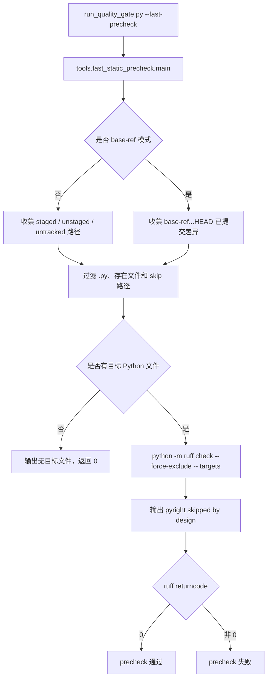

# fast-static-precheck 设计方案

## 0. 术语约定

- fast static precheck：快速静态预检。它只看本次改动相关的 Python 文件，用来提前提醒明显静态问题。
- worktree 模式：默认模式，收集 staged、unstaged、untracked 三类本地改动。
- base-ref 模式：可选模式，只看某个 base ref 到 HEAD 的已提交差异，不纳入 unstaged / untracked。
- `ruff_check_full`：正式完整门禁里的全仓 `python -m ruff check`，本 feature 不替代它。
- `pyright_gate_full` / `pyright_tools_full`：正式完整门禁里的两条 pyright 检查，本 feature 不替代它们。
- long gate success cache：长耗时门禁成功缓存。本 feature 不读写它。

## 1. 决策与约束

### 需求摘要

本 feature 完成 roadmap `NEXT-9`：新增一个快速静态预检入口，让维护者在本地改动还没收口前，只对本次改动相关的 Python 文件跑一遍局部 ruff，尽早发现明显问题。

成功标准：

- 默认纳入 staged、unstaged、untracked 的 `.py` 文件。
- 非 Python 改动直接跳过。
- 删除文件、不存在文件、目录、repo 外路径不检查。
- generated / vendor / venv / evidence / backups / build / dist / `.git` / `.venv` / `__pycache__` 等路径跳过。
- 路径统一成 `/`，命令用 list args，不拼 shell 字符串。
- 无目标 Python 文件时返回 0，并输出“没有本次改动的 Python 文件需要快速静态预检”。
- ruff 只对目标文件运行，失败则 precheck 失败。
- pyright 默认跳过，并清楚说明局部 pyright 不能代表正式 pyright gate。
- `scripts/run_quality_gate.py --fast-precheck` 是独立早退入口，不进入完整门禁计划。
- `tools/git_hook_checks.py run-fast-static-precheck` 是独立手动入口，不改变 pre-push 默认 daily gate。

明确不做：

- 不启用 `ruff_check_full` success cache。
- 不启用 `pyright_gate_full` / `pyright_tools_full` success cache。
- 不启用 `architecture_fitness` success cache。
- 不启用 `debt_ledger_sync` / `quickref_vs_routes` success cache。
- 不改 `architecture_fitness`、`full_test_debt`、`required_regressions`、`startup_runtime_regressions`、`pytest_collect_all` 的既有语义。
- 不把 fast precheck 写成 final quality gate。
- 不把 fast precheck 写成 clean-worktree proof。
- 不把 daily fast gate 写成 full-test-debt proof 或 clean proof。
- 不把 `--long-gate-cache-explain` 写成 proof。
- 不写 long gate success cache，不写 full gate proof，不提交运行产物。
- 不接入 `scripts/run_daily_quality_gate.py`；daily gate 当前已经跑全量 ruff，继续保持原 daily 口径。

复杂度档位：质量门禁快速提醒。安全边界和 proof 口径优先，命中范围第二。

### 只读审查结论

- scope subagent 结论：默认口径必须是 staged / unstaged / untracked；rename 取新路径；删除和非 Python 跳过；`--base-ref` 只能作为可选提交差异模式，不能替代默认 worktree 模式。
- static-tools subagent 结论：局部 ruff 可作为快速提醒；pyright 不建议默认局部启用，因为正式门禁分成 `pyright_gate_full` 和 `pyright_tools_full` 两套口径，局部结果容易误导。
- hook/cache subagent 结论：`--fast-precheck` 必须在 `build_quality_gate_command_plan()` 前早退；不得写 manifest、receipt、summary 或 success cache；当前 enabled long gate entry 只能保持 4 个。

## 2. 名词与编排

### 2.1 名词层

现状：

- `scripts/run_quality_gate.py` 只有正式质量门禁和 long gate cache / explain 入口。
- `scripts/run_daily_quality_gate.py` 是 pre-push 默认日常快门禁，已经声明不是 clean proof，并跑全量 ruff。
- `tools/git_hook_checks.py run-quality-gate` 调 daily gate；`run-final-quality-gate` 调完整 clean gate。
- `tools/long_gate_manifest.py` 当前 enabled entry 只有 `pytest_collect_all`、`full_test_debt`、`required_regressions`、`startup_runtime_regressions`。

变化：

- 新增 `tools/fast_static_precheck.py`：
  - `collect_staged_paths()`：读取 `git diff --cached --name-only --diff-filter=ACMR -z --`。
  - `collect_unstaged_paths()`：读取 `git diff --name-only --diff-filter=ACMR -z --`。
  - `collect_untracked_paths()`：读取 `git ls-files --others --exclude-standard -z --`。
  - `collect_changed_python_files()`：合并三路路径，过滤出本次要检查的 `.py` 文件。
  - `main(argv=None) -> int`：打印 precheck 口径、运行局部 ruff、说明 pyright 跳过。
- 新增 `scripts/run_quality_gate.py --fast-precheck`：
  - 解析参数后立即调用 `tools.fast_static_precheck.main([])` 并返回。
  - 与 clean proof / long gate / explain / resume 参数互斥。
- 新增 `tools/git_hook_checks.py run-fast-static-precheck`：
  - 用项目 `.venv` Python 调 `scripts/run_quality_gate.py --fast-precheck`。
  - 不改变 `run-quality-gate` 和 `run-final-quality-gate`。

输出示例：

```text
FAST STATIC PRECHECK ONLY: not final ruff/pyright/full quality gate proof
这是快速提前提醒，只检查本次改动相关 Python 文件。
它不代表完整质量门禁通过；not ruff_check_full, not pyright_gate_full, not pyright_tools_full.
```

### 2.2 编排层



跨层纪律：

- precheck 不进入 `build_quality_gate_command_plan()`。
- precheck 不评估 long gate cache，不写 `quality_gate_manifest.json`，不写 receipt，不写 summary，不写 success cache。
- base-ref 模式只检查已提交差异，不默认吞进 unstaged / untracked。
- ruff 命令用 `[sys.executable, "-m", "ruff", "check", "--force-exclude", "--", *targets]`。
- pyright 默认跳过，输出解释，返回码只由已执行的检查决定。
- 保持 Python 3.8 / Win7 兼容：不使用 `list[str]`、`dict[str, ...]`、`X | Y`、`match/case`，不依赖 `shell=True`。

### 2.3 挂载点

- `tools/fast_static_precheck.py`：核心收集、过滤、CLI 和局部 ruff 执行。
- `scripts/run_quality_gate.py`：新增 `--fast-precheck` 早退入口。
- `tools/git_hook_checks.py`：新增 `run-fast-static-precheck` 手动入口。
- `tests/test_fast_static_precheck.py`、`tests/test_run_quality_gate.py`、`tests/test_git_hook_checks.py`、`tests/test_long_gate_manifest.py`：锁住文件收集、入口早退、hook 语义和 planned entry 守护。
- `codestable/roadmap/quality-gate-long-cache/` 与本 feature 文档：记录 NEXT-9 状态和验收结果。

拔掉本 feature 的方式：删除 `tools/fast_static_precheck.py`，移除 `--fast-precheck` 参数和 hook 子命令，删除对应测试，并把 roadmap item 回退；不需要回滚 long gate enabled 列表，因为本 feature 不修改它。

### 2.4 推进策略

1. 设计与状态：创建 feature 文档和 checklist，把 roadmap item 标为 in-progress。
2. 核心模块：实现路径收集、路径过滤、skip 规则、ruff 执行和 pyright skip 文案。
3. 入口接入：接入 `run_quality_gate.py --fast-precheck` 和 `run-fast-static-precheck`，不接 daily gate。
4. 测试覆盖：新增 fast precheck 测试，扩展 run_quality_gate / hook / manifest 测试。
5. 验证与对抗审查：跑最小验证命令，用 Agent 做实现后复审，修完阻塞后写 acceptance 并回写 done。

## 3. 验收契约

关键场景：

- S1：staged `.py` 文件会进入目标列表。
- S2：unstaged tracked `.py` 文件会进入目标列表。
- S3：untracked `.py` 文件会进入目标列表。
- S4：非 Python 文件不会触发 ruff。
- S5：删除文件、不存在文件、目录不会传给 ruff。
- S6：skip 路径下的 `.py` 文件不会传给 ruff。
- S7：路径含空格或中文时仍作为单独 list arg 传给 ruff。
- S8：无目标 Python 文件时返回 0，不调用 ruff，并输出清楚 skip 文案。
- S9：ruff 失败时 precheck 返回失败，并给出可复制复跑命令。
- S10：pyright 默认跳过，输出说明不是 `pyright_gate_full` / `pyright_tools_full`。
- S11：`run_quality_gate.py --fast-precheck` 早退，不调用完整 command plan。
- S12：`--fast-precheck` 与 clean proof / long gate / explain / resume 参数互斥。
- S13：hook 新子命令调用 `scripts/run_quality_gate.py --fast-precheck`，不改变 daily/final 两个旧入口。
- S14：planned long gate entry 仍不启用。

反向核对项：

- 不启用 `architecture_fitness`、`ruff_check_full`、`pyright_gate_full`、`pyright_tools_full`、`debt_ledger_sync`、`quickref_vs_routes`。
- 不写 long gate success cache proof。
- 不写 full gate proof。
- 不把局部 ruff 说成 `ruff_check_full`。
- 不把 pyright skip 或局部结果说成 full pyright gate。
- 不把 daily fast gate 或 explain 说成 clean proof。

## 4. 与项目级架构文档的关系

本 feature 属于质量门禁入口增强，不新增 APS 用户可见能力，不改变业务架构。`codestable/architecture/ARCHITECTURE.md` 不需要新增独立架构条目；验收时只需确认质量门禁入口仍以 `scripts/run_quality_gate.py` 为准，且 daily/final/precheck 三个入口的 proof 口径不互相冒充。
