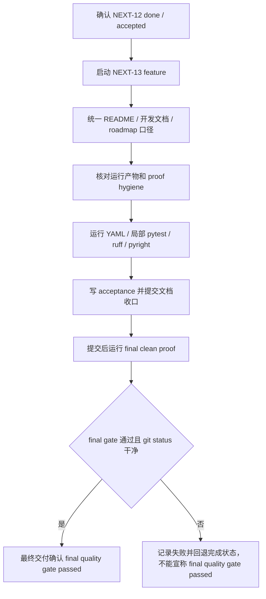

# long-gate-docs-final-proof 设计方案

## 0. 术语约定

- long gate cache：完整质量门禁里给长耗时检查准备的成功缓存。它只能复用已经完整成功且证据重新校验通过的结果。
- enabled entry：已经允许 success cache 复用的 long gate entry。当前是 `pytest_collect_all`、`full_test_debt`、`ruff_check_full`、`pyright_gate_full`、`pyright_tools_full`、`required_regressions`、`debt_ledger_sync`、`startup_runtime_regressions` 和 `quickref_vs_routes`。
- planned entry：已经识别为候选，但还不能复用 success cache 的 entry。当前只剩 `architecture_fitness`。
- clean-worktree final proof：在干净工作区运行 `PYTHONDONTWRITEBYTECODE=1 .venv/bin/python scripts/run_quality_gate.py --require-clean-worktree --long-gate-cache` 并完整成功收尾，然后 `git status --short` 仍没有输出。
- 局部验证：单独 pytest、ruff、pyright、YAML 校验、artifact hook 检查等定位型验证。它们有价值，但不能冒充 clean-worktree final proof。
- 运行产物：门禁运行期间生成的本地证据文件，例如 `evidence/QualityGate/**`，其中包括 `evidence/QualityGate/quickref_vs_routes.md`。这些文件不能提交。历史 tracked `evidence/Conformance/quickref_vs_routes.md` 不再作为 long gate 运行输出。

## 1. 决策与约束

### 需求摘要

本 feature 推进 roadmap `NEXT-13`：把 README、开发文档、roadmap、items 和 feature acceptance 的说法收成同一套口径，并在本地重新跑最终 clean proof。它不是新缓存 entry，也不是新的业务功能。

成功标准：

- NEXT-13 feature 文档落地，items.yaml 从 `planned` 推到 `in-progress`，验收完成后再推到 `done`。
- README、`开发文档/README.md` 和 roadmap 的 enabled/planned entry 列表与 `tools/long_gate_manifest.py`、测试和 items.yaml 一致。
- roadmap 里不再残留 `quickref_vs_routes` 同时 enabled / planned 的矛盾。
- 文档明确：`--long-gate-cache-explain`、cache hit、summary counts、daily gate、pre-push fast gate、单独 pytest、ruff、pyright 都不是 clean-worktree final proof。
- 文档明确：最终 clean proof 必须运行带 `--require-clean-worktree --long-gate-cache` 的完整门禁，并记录 `git status --short`。
- 文档明确：运行产物不能提交，尤其是 `evidence/QualityGate/**` 和 `evidence/QualityGate/quickref_vs_routes.md`。
- acceptance 不把提交后才运行的 final gate 写成历史事实；本阶段最终交付必须绑定提交后的 final gate 结果和 `git status --short`。

明确不做：

- 不启用 `architecture_fitness` success cache。
- 不新增 long gate entry。
- 不修改 long gate cache 核心实现、fingerprint、cache 写入逻辑、hook 或 CI 命令。
- 不修改 APS 排产、导入、保存等业务逻辑。
- 不升级依赖，不引入外部前端资源。
- 不使用 Python 3.9+ 类型语法，不使用 `shell=True`。
- 不提交或计划提交 `evidence/QualityGate/**`、`evidence/QualityGate/quickref_vs_routes.md`、receipts、logs、summary 或 success cache。

复杂度档位：文档和证明收口。风险不在“代码难写”，而在把局部验证、历史验收或远端事实误说成了本机最终 proof，所以本阶段的重点是口径统一和证据干净。

## 2. 名词与编排

### 2.1 名词层

现状：

- `tools/long_gate_manifest.py` 和 `tests/test_long_gate_manifest.py` 已锁住 9 个 enabled entry，`architecture_fitness` 仍 planned。
- 启动本阶段前，roadmap 顶部已经写明 `quickref_vs_routes` enabled，但第 4.1 节仍把它留在 planned 列表。
- 启动本阶段前，`README.md` 和 `开发文档/README.md` 还停在旧 enabled/planned 口径，只列出部分已启用 entry。
- NEXT-12 acceptance 明确说没有完成 clean-worktree final quality gate。
- `.gitignore`、`tools/git_hook_checks.py` 和 `scripts/run_quality_gate.py` 已经把 quickref report 和已登记的 long gate 运行产物路径当成本地运行产物保护；hook 只拦已登记路径，不会自动通配保护整个 `evidence/QualityGate/`。如果出现新的 `evidence/QualityGate/` 运行产物，默认也不能进入提交。

变化：

- 启动阶段新增 NEXT-13 design 和 checklist，验收阶段再补齐 acceptance。
- 将 items.yaml 中 `long-gate-docs-final-proof` 绑定到本 feature，并按状态机推进。
- 更新 README、开发文档和 roadmap：enabled 列表统一为 9 个，planned 只保留 `architecture_fitness`。
- 将最终 proof 命令统一成 `scripts/run_quality_gate.py --require-clean-worktree --long-gate-cache` 或 `tools/git_hook_checks.py run-final-quality-gate`。
- 在验收报告里逐项记录局部验证、final proof、long gate summary、`git status --short`、已登记运行产物保护和本次是否有新的 `evidence/QualityGate/` 运行产物混入提交。

### 2.2 编排层

跨层纪律：

- roadmap 状态机只能 `planned -> in-progress -> done`，不能跳阶段。
- 只改文档和 CodeStable 状态，不碰缓存执行代码。
- 任一局部验证都必须标成局部验证。
- final proof 和工作区干净状态必须绑定同一次收尾。
- 如果提交后的 final gate 失败或 `git status --short` 非空，不能最终交付为 done，必须修复或回退 acceptance、items 和 roadmap 的完成状态。

### 2.3 挂载点

- `codestable/features/2026-05-16-long-gate-docs-final-proof/`：本阶段 design、checklist、acceptance。
- `codestable/roadmap/quality-gate-long-cache/quality-gate-long-cache-items.yaml`：NEXT-13 状态和 feature 绑定。
- `codestable/roadmap/quality-gate-long-cache/quality-gate-long-cache-roadmap.md`：enabled/planned、最终 proof 命令、注意事项和子 feature 清单。
- `README.md`：面向使用者的质量门禁和 long gate cache 说明。
- `开发文档/README.md`：面向开发者的同一套质量门禁和 long gate cache 说明。

拔掉本 feature 的方式：回退这些文档和 CodeStable 状态即可；系统运行代码、hook 和 CI 不应因此变化。

### 2.4 推进策略

1. CodeStable 启动：创建 NEXT-13 design/checklist，items.yaml 改 `in-progress` 并填 feature。
2. 文档口径收口：修 README、开发文档、roadmap 中 enabled/planned、final proof、daily/pre-push、运行产物和 explain 说明。
3. artifact / proof hygiene：确认文档不要求提交运行产物，hook/ignore/check-staged 仍保护已登记证据文件，并明确新的 `evidence/QualityGate/` 运行产物也不能进入提交。
4. 局部验证：运行 YAML 校验、相关 pytest、ruff、pyright，并在 acceptance 中标为局部验证。
5. 验收和 final proof：写 acceptance，跑 final clean proof，记录 `git status --short`，通过后回写 checklist 和 items。

## 3. 验收契约

- S1：NEXT-13 先 `in-progress`，只有 acceptance 完成后才 `done`。
- S2：README、开发文档、roadmap 和 manifest/test 的 enabled entry 列表一致。
- S3：`quickref_vs_routes` 不再在 roadmap 的 planned 列表里残留。
- S4：`architecture_fitness` 仍是 planned，没有启用 success cache。
- S5：daily gate 和 pre-push fast gate 没被写成 final proof。
- S6：`--long-gate-cache-explain`、cache hit、summary counts、quickref report、单独 pytest、ruff、pyright 都没有被写成 final proof。
- S7：final proof 命令明确包含 `--require-clean-worktree --long-gate-cache`，或使用等价的 `tools/git_hook_checks.py run-final-quality-gate`。
- S8：运行产物不能提交的范围写清楚，已登记运行产物通过 hook/artifact 检查，新的 `evidence/QualityGate/` 运行产物也没有进入提交。
- S9：YAML、局部测试、ruff、pyright 的结果被记录为局部验证。
- S10：最终交付必须记录提交后的 final gate 结果和 `git status --short`；如果 final gate 失败或工作区不干净，必须回退 acceptance、items 和 roadmap 的完成状态。

反向核对项：

- 不启用 `architecture_fitness`。
- 不新增 entry。
- 不改 APS 业务逻辑。
- 不降低 CI / final gate 要求。
- 不升级依赖。
- 不提交运行产物。

## 4. 与项目级架构文档的关系

本 feature 不新增 APS 用户可见能力，不改变应用运行架构，也不改变质量门禁的执行链路。它只把已经完成的 long gate cache 路线、文档状态和最终 proof 口径收齐，因此不需要更新 `codestable/architecture/ARCHITECTURE.md` 或需求文档。
