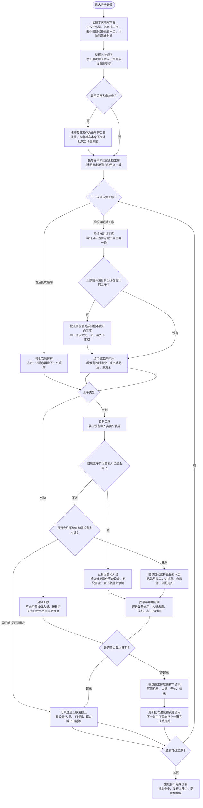
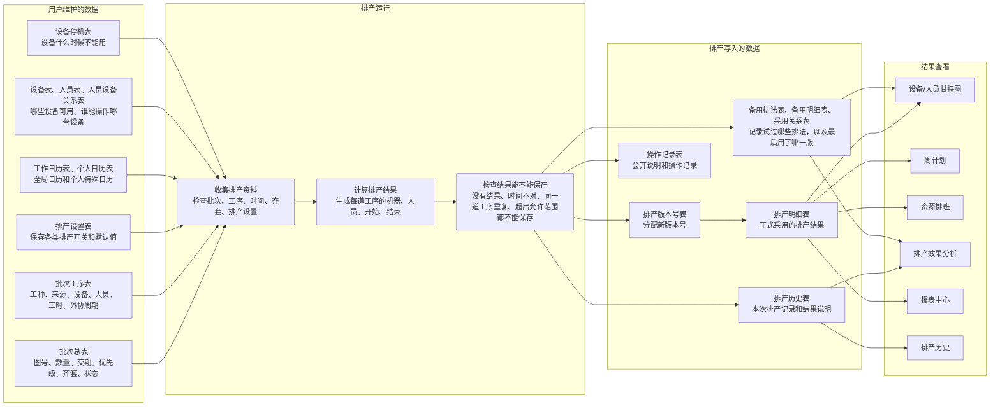
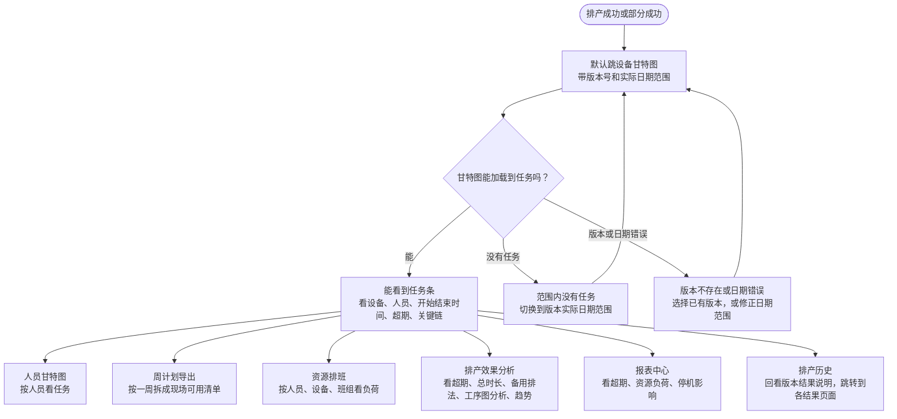

# 排产全流程图理解稿

这份文件是给项目维护者自己看懂排产链路用的，不是线上说明书。它把 16 个只读子代理查到的结果合在一起，重点回答四个问题：

- 操作者从哪里开始添加资料，哪些资料会影响排产。
- 点击模拟排产或正式排产以后，系统到底怎么收集资料、怎么计算、怎么保存结果。
- 打开不同设置以后，会怎么改变排产计算。
- 出错以后，系统会在哪里停、页面会怎么提示、操作者应该回哪里修。

> 注意：这份图文先单独保存，给项目维护者自己看。当前系统内置说明书页面只确认会把图的源码显示出来，没有证据说明它会直接显示成流程图。

---

## 1. 总览图：从添加资料到最终排产

```mermaid
flowchart TD
  START(["操作者开始准备排产"])

  subgraph DATA["一、先把排产要用的数据准备好"]
    D1["维护工种资料<br/>让系统认识数铣、钳、标印等工种"]
    D2{"是否有外协工序？"}
    D3["维护供应商资料<br/>外协工序交给谁、默认几天回来"]
    D4["维护零件工艺路线<br/>把图号拆成多道工序"]
    D5["维护工序工时<br/>自制工序的换型时间和单件工时"]
    D6["维护人员基本信息<br/>哪些人在岗、能参与排产"]
    D7["维护设备信息<br/>哪些设备可用、属于哪个工种"]
    D8["维护人员-设备关系<br/>谁能操作哪台设备、技能和主操信息"]
    D9["维护工作日历<br/>工作日、假期、加班、每天可用工时和效率"]
    D10{"有人请假、加班或特殊班次？"}
    D11["维护个人工作日历<br/>某个人某天单独按特殊时间算"]
    D12{"有设备停机或维修？"}
    D13["维护停机计划<br/>系统排时间时会避开这些时间"]
    D14{"要管物料齐套<br/>或会启用齐套检查？"}
    D15["维护物料和批次物料需求<br/>系统据此判断齐套、部分齐套、未齐套"]
    D16["新增或导入批次<br/>批次号、图号、数量、交期、优先级、齐套状态"]
    D17["生成批次工序<br/>从零件工艺模板复制到本批次"]
    D18["打开批次详情补资料<br/>自制补设备、人员、工时；外协补供应商、周期"]
    D19{"资料保存或表格检查是否有错误？"}
    D20["回到对应页面修资料<br/>例如补工种、图号、人员设备关系、工时、日期"]
  end

  subgraph RUN["二、进入排产调度并提交"]
    R1["进入 排产调度 到 排产调度<br/>状态筛选保持 待排"]
    R2["勾选一个或多个待排批次"]
    R3["填写本次开始时间、截止日期、最多计算多久"]
    R4["选择本次要不要查得更严<br/>要不要检查齐套；资料有问题时要不要立刻停止"]
    R5{"点击哪个按钮？"}
    R6["模拟排产（插单模拟）<br/>会生成可查看版本，但不改批次/工序状态"]
    R7["执行排产<br/>成功后会改正式批次/工序状态"]
  end

  subgraph SERVICE["三、系统收集资料并做排产前检查"]
    S1["排产服务加锁<br/>防止同一时间跑两次排产"]
    S2["收集页面上填写的内容<br/>批次、开始时间、截止日期、最多算多久、是否查齐套、发现问题是否停止"]
    S3["读取已经保存的资料<br/>批次、工序、排产设置、上一版结果、停机安排、可用设备人员、日历"]
    S4{"排产前检查通过？"}
    S5["直接停止并提示<br/>没选批次、日期错、批次不能排、未齐套、无可排工序"]
    S6["整理成本次要排的工序清单<br/>把批次里的工序拆成一道道待排任务"]
    S7{"是否启用锁定近期排程？"}
    S8["读取上一版近期排程<br/>近期范围内任务先放进去，不重新排"]
  end

  subgraph ALGO["四、系统开始计算排产结果"]
    A1{"工序图分析怎么用？"}
    A2["关闭<br/>不做工序图分析，直接按普通方式排"]
    A3["只看说明<br/>只生成工序图分析说明；排法仍按普通方式走"]
    A4["参与排产<br/>先跑普通排法，再跑几种重点工序优先排法"]
    A5{"工序图排法能不能用？"}
    A6["工序图信息不完整、内容有错或没法整理<br/>参与排产时直接停止"]
    A12["工序前后关系互相卡住，但允许继续<br/>先不用工序图排法，按普通方式继续排"]
    A13["工序前后关系互相卡住，并且要求停止<br/>停止，让人先修前后关系"]
    A7["开始尝试排法<br/>快速排少试几次；精细排会多试几种排法"]
    A8["正式往时间表里排<br/>按批次顺序或让系统自动挑工序，一道工序一道工序找时间和设备人员"]
    A9{"是否排出可保存结果？"}
    A10["没有能保存的结果<br/>本次停止，不保存排产明细，不生成历史记录，不占用版本号"]
    A11["有可保存结果<br/>生成结果说明：哪些排上、哪些没排上、有哪些提醒和错误"]
  end

  subgraph SAVE["五、保存版本并展示结果"]
    P1["分配新版本号<br/>保证每次排产版本不重复"]
    P2["保存排产明细<br/>每道排上的工序都有机器、人员、开始时间、结束时间、版本号"]
    P3["保存排产历史<br/>记录本次是成功、部分成功还是失败，并保存结果说明"]
    P4{"是否正式排产？"}
    P5["模拟排产<br/>不改批次状态、不改工序状态、不保存自动补齐资源"]
    P6["正式排产<br/>改已排工序状态；批次全排上变已排，否则仍待排"]
    P7{"是否生成了备用排法对比？"}
    P8["保存备用排法<br/>保存普通排法、重点工序排法，以及最后采用哪一版"]
    P9["跳到设备甘特图<br/>按版本和日期范围加载任务"]
    P10["继续查看<br/>人员甘特图、周计划、资源排班、排产效果分析、报表中心、排产历史"]
  end

  START --> D1 --> D2
  D2 -- "有" --> D3 --> D4
  D2 -- "没有" --> D4
  D4 --> D5 --> D6 --> D7 --> D8 --> D9 --> D10
  D10 -- "有" --> D11 --> D12
  D10 -- "没有" --> D12
  D12 -- "有" --> D13 --> D14
  D12 -- "没有" --> D14
  D14 -- "是" --> D15 --> D16
  D14 -- "否" --> D16
  D16 --> D17 --> D18 --> D19
  D19 -- "有错误" --> D20 --> D1
  D19 -- "无错误" --> R1

  R1 --> R2 --> R3 --> R4 --> R5
  R5 -- "先试算" --> R6 --> S1
  R5 -- "正式执行" --> R7 --> S1

  S1 --> S2 --> S3 --> S4
  S4 -- "不通过" --> S5 --> D20
  S4 -- "通过" --> S6 --> S7
  S7 -- "开启且有上一版" --> S8 --> A1
  S7 -- "关闭或无上一版" --> A1

  A1 -- "关闭" --> A2 --> A7
  A1 -- "只看报告" --> A3 --> A7
  A1 -- "参与排产" --> A4 --> A5
  A5 -- "工序图资料有问题" --> A6 --> D20
  A5 -- "前后关系互相卡住且要求停止" --> A13 --> D20
  A5 -- "前后关系互相卡住但允许继续" --> A12 --> A7
  A5 -- "可用" --> A7
  A7 --> A8 --> A9
  A9 -- "没有" --> A10 --> D20
  A9 -- "有" --> A11 --> P1

  P1 --> P2 --> P4
  P4 -- "模拟" --> P5 --> P3
  P4 -- "正式" --> P6 --> P3
  P3 --> P7
  P7 -- "有" --> P8 --> P9
  P7 -- "没有" --> P9
  P9 --> P10
```

---

## 2. 计算内部图：一道工序到底怎么排进去

大白话理解：

- 排产计算不是一次把所有任务摊开随便排，而是一道工序一道工序往时间线上放。
- 自制工序要同时找到设备和人员，二者任何一个缺了，都排不出这道工序；开启自动分配后，系统才会尝试从可用设备和人员清单里补。
- 外协工序不占内部设备和人员，主要看外协周期；如果是合并外协组，同组外协会按一个整体周期处理。
- 工作日历、个人日历、设备停机会影响“什么时候能开工、什么时候能结束”。
- 如果某道工序失败，后续同批次工序通常也会受影响；如果启用了工序图排法，依赖它的后续工序会更明确地被挡住。

---

## 3. 设置影响图：开关打开以后改变什么

```mermaid
flowchart TD
  A(["把排产设置带入本次计算"])

  subgraph S1["本次临时选择"]
    B1{"本次启用齐套检查？"}
    B2["否：齐套状态只显示<br/>不会挡住本次排产"]
    B3["是：未齐套或部分齐套直接停止<br/>齐套日期会变成最早开工日"]
    B4{"资料有问题时是否立刻停止？"}
    B5["否：严重问题仍会停<br/>能绕过去的问题就继续排，并把提醒写出来"]
    B6["是：排产设置、工时、外协周期等问题<br/>更容易直接停止"]
    B7["本次最多计算多久<br/>只影响这一次多种排法对比，不保存到长期设置"]
  end

  subgraph S2["先排谁、怎么挑工序"]
    C1{"先按什么排？"}
    C2["优先级优先<br/>特急、急件更靠前"]
    C3["交期优先<br/>交期近的更靠前"]
    C4["同时看优先级和交期<br/>哪个更重要，由设置里的数值决定"]
    C5["先进先出<br/>按创建顺序排"]
    C6{"怎么挑下一道工序？"}
    C7["按批次顺序排<br/>更直观，按固定顺序推进"]
    C8["系统自动挑工序<br/>每轮从当前可做任务里挑更合适的一道"]
    C9["系统自动挑工序时怎么看<br/>剩余时间少、交期更近、整体更急的更靠前"]
  end

  subgraph S3["计算方式"]
    D1{"想算得快一点还是细一点？"}
    D2["快速计算<br/>主要跑一轮，出结果快"]
    D3["精细计算<br/>多试几种排法，并小范围调整顺序"]
    D4{"是否多花一点时间试更好排法？"}
    D5["不开：不多试这一种排法"]
    D6["开：精细计算时多试一种起步排法<br/>失败时按设置决定停止还是继续并提醒"]
    D7{"更看重什么结果？"}
    D8["少超期批次、少拖期小时、少重点任务拖期、少换型<br/>影响系统更喜欢哪种结果"]
  end

  subgraph S4["工序图排法和备用排法"]
    E1{"工序图分析怎么用？"}
    E2["关闭：不做图分析"]
    E3["只看说明：只生成工序图说明<br/>排法仍按普通排产走"]
    E4["参与排产：普通排法 + 几种重点工序优先排法<br/>最后自动选一版"]
    E5{"工序图排法出错或关系互相卡住？"}
    E6["工序图信息不完整、内容有错或没法整理<br/>参与排产时直接停止"]
    E7["工序前后关系互相卡住，但允许继续<br/>先不用工序图排法，继续普通排法"]
    E10["工序前后关系互相卡住，并且要求停止<br/>直接停止，让人先修关系"]
    E8["关键工序看重程度、影响后面工序看重程度<br/>数值越大，关键工序或牵动后面多的工序越容易提前"]
    E9["重点工序排法要试几种、最后按什么挑<br/>可以按总分挑，也可以更照顾交期"]
  end

  subgraph S5["设备人员和近期结果"]
    F1{"是否自动补设备和人员？"}
    F2["不开：自制工序缺设备/人员就失败"]
    F3["开启：从可用设备、在岗人员、谁能操作哪台设备里自动选组合"]
    F4{"是否把系统自动补的设备人员保存回去？"}
    F5["模拟排产：不保存自动补的设备人员"]
    F6["正式排产：长期设置允许时，只补空白处，不覆盖原来已填内容"]
    F7{"锁定近期排程？"}
    F8["不开：本次重新计算"]
    F9["开启且有上一版：近期范围内任务沿用上一版，减少近期波动"]
  end

  A --> B1
  B1 -- "否" --> B2
  B1 -- "是" --> B3
  A --> B4
  B4 -- "否" --> B5
  B4 -- "是" --> B6
  A --> B7
  A --> C1
  C1 --> C2
  C1 --> C3
  C1 --> C4
  C1 --> C5
  A --> C6
  C6 --> C7
  C6 --> C8 --> C9
  A --> D1
  D1 --> D2
  D1 --> D3 --> D4
  D4 --> D5
  D4 --> D6
  A --> D7 --> D8
  A --> E1
  E1 --> E2
  E1 --> E3
  E1 --> E4 --> E5
  E5 --> E6
  E5 --> E7
  E5 --> E10
  E4 --> E8
  E4 --> E9
  A --> F1
  F1 --> F2
  F1 --> F3 --> F4
  F4 --> F5
  F4 --> F6
  A --> F7
  F7 --> F8
  F7 --> F9
```

几个容易写错的点：

- 系统里有一个看起来像“齐套会影响排序”的设置，但当前更像预留项。实际排序主要看优先级和交期，不要写成齐套已经会直接改变排序。
- “优先推荐主操/高技能人员”主要是批次详情页面给人的推荐说法，不是排产计算里的主要规则。
- “导出工序图排查文件”有设置项，但没有查到它真正改变计算结果或一定会导出文件的证据，不要把它写成会影响排产结果。
- “工序图排法一定更好”不能这么写。更准确的说法是：它会多试几种重点工序优先排法，再按规则挑一版；不保证每套数据都一定比普通排法好。

---

## 4. 错误处理图：报错以后应该回哪里修

```mermaid
flowchart TD
  A(["点击模拟排产或执行排产"])
  B{"排产前检查"}
  C["没选批次<br/>提示：请至少选择 1 个批次"]
  D["日期或时间不合法<br/>回排产面板重填开始时间、截止日期"]
  E["批次已完成、已取消、没有可重排工序<br/>回批次列表换待排批次或重新生成工序"]
  F["启用齐套检查但批次未齐套<br/>回物料需求或批次详情处理齐套，或关闭本次齐套检查"]
  G["排产设置或资料有问题<br/>如果要求有问题就停，会直接停；否则能继续就继续并提醒"]
  H{"检查通过？"}

  I["系统开始排产"]
  J{"排产中遇到什么问题？"}
  K["自制缺设备或人员<br/>回批次详情补设备/人员，或开启自动分配并维护人机关系"]
  L["工时或外协周期不合法<br/>回零件工时、批次工序或供应商周期修正"]
  M["超过允许排到的日期范围<br/>延长截止日期、减少本次批次、补设备人员或调整工时"]
  N["工序前后关系缺失或互相绕圈<br/>参与排产时可能让本次直接停止；只看说明时一般只提醒"]
  O["系统自己出了问题<br/>页面会显示通用提示，维护人员看日志"]
  P{"有没有任何可保存排程？"}
  Q["没有<br/>本次停止，不保存排产明细，不生成排产历史，不占用版本号"]
  R["有<br/>保存能用的排程，把错误写进结果说明，页面显示部分完成或警告"]

  S{"保存后去哪里看？"}
  T["成功或部分成功<br/>写版本，跳设备甘特图"]
  U["结果缺版本号<br/>不跳甘特图，提示无法查看本次结果"]
  V["版本不存在或日期范围错误<br/>甘特图、周计划、资源排班等页面会按自己的方式提示"]
  W["范围内没有任务<br/>不是系统坏了，通常是日期范围或版本选择不对"]

  A --> B
  B --> C --> Q
  B --> D --> Q
  B --> E --> Q
  B --> F --> Q
  B --> G --> H
  B --> H
  H -- "不通过" --> Q
  H -- "通过" --> I
  I --> J
  J --> K --> P
  J --> L --> P
  J --> M --> P
  J --> N --> P
  J --> O --> P
  J -- "没有问题" --> P
  P -- "没有" --> Q
  P -- "有" --> R --> S
  S --> T
  S --> U
  T --> V
  T --> W
```

常见错误和处理方式：

| 场景 | 系统怎么处理 | 操作者应该怎么做 |
|---|---|---|
| 没选批次 | 直接停止，不开始计算 | 回排产调度页，勾选至少一个待排批次 |
| 开始时间或结束日期写错 | 直接停止 | 按 `2026-05-20` 或 `2026-05-20 08:00` 这类格式重填 |
| 批次已完成或已取消 | 直接停止 | 不要拿这些批次重排，换待排批次 |
| 启用齐套检查但批次未齐套 | 直接停止 | 先处理物料和齐套状态，或确认本次不需要齐套检查后关闭开关 |
| 自制工序缺设备或人员 | 该工序失败；如果完全没有可保存结果，整次停止 | 到批次详情补设备/人员；或维护人员、设备、人机关系后开启自动分配 |
| 工时、外协周期不合法 | 可能单道工序失败，也可能因为要求有问题就停而直接停止 | 回零件工时、批次工序、供应商设置修正 |
| 超出允许排到的日期范围 | 工序失败，可能造成部分完成 | 延长截止日期、减少本次批次数、增加设备人员或修正工时 |
| 工序图分析不可用 | 只看说明时通常只提醒；参与排产时可能让本次直接停止 | 修工序前后关系，或临时把工序图分析改成只看说明/关闭 |
| 版本号不存在 | 查看结果页面会提示，部分页面拦住，部分页面内提示 | 选择已有版本或最新版本，不要手填不存在的版本号 |
| 甘特图范围没有任务 | 页面显示空结果，不等于排产失败 | 换到该版本实际排产日期范围，或从历史入口重新打开 |

---

## 5. 数据怎么进数据库、怎么再被页面读出来

保存规则要点：

- 模拟排产也会保存排产明细和排产历史，所以模拟结果能打开甘特图、周计划和分析页。
- 模拟排产不会改批次状态和工序状态，也不会把自动补齐的设备/人员保存回批次工序。
- 正式排产会把排上的工序改成已排；一个批次的本次可重排工序都排上了，批次才会变成已排，否则仍然待排。
- 没有任何可保存结果时，系统会直接停止，不保存排产明细，不生成排产历史，也不占用版本号。
- 开启备用排法比较时，正式采用的排法会保存到排产明细里；其它代表排法会进备用排法表，供甘特图或分析页按角色查看。

---

## 6. 结果查看图：排完以后怎么看

结果页面的理解：

- 设备甘特图是排产后默认入口，最适合先确认“新版本到底排到了哪些时间段”。
- 人员甘特图适合看某个人是否被排得太满。
- 周计划适合给现场按天执行。
- 资源排班适合看设备、人员、班组的负荷和跨班组情况。
- 排产效果分析适合看这版结果好不好、有没有备用排法、有没有工序图分析给出的排查提示。
- 报表中心适合看超期、资源负荷、停机影响。
- 排产历史是回看入口，不是恢复入口；它能跳到某个版本的相关结果页。

---

## 7. 证据入口

下面这些是本文件合成时用到的主要源码入口，方便后续继续查：

| 主题 | 主要文件 |
|---|---|
| 页面提交 | `templates/scheduler/_run_panel.html`、`templates/scheduler/batches.html`、`static/js/scheduler_run.js` |
| 正式排产入口 | `web/routes/domains/scheduler/scheduler_run.py` |
| 模拟排产入口 | `web/routes/domains/scheduler/scheduler_week_plan.py` |
| 排产总服务 | `core/services/scheduler/schedule_service.py` |
| 收集排产资料 | `core/services/scheduler/run/schedule_input_collector.py`、`schedule_input_builder.py` |
| 排产总调度 | `core/services/scheduler/run/schedule_orchestrator.py` |
| 尝试多种排法 | `core/services/scheduler/run/schedule_optimizer.py`、`optimizer_local_search.py` |
| 核心排产计算 | `core/algorithms/greedy/scheduler.py`、`dispatch/sgs.py`、`dispatch/batch_order.py`、`internal_operation.py`、`external_groups.py`、`auto_assign.py` |
| 工序图分析 | `core/services/scheduler/run/schedule_graph_report.py`、`core/services/scheduler/graph/*`、`core/algorithms/greedy/dispatch/sgs_graph.py` |
| 保存和版本 | `core/services/scheduler/run/schedule_persistence.py`、`data/repositories/schedule_history_repo.py` |
| 结果说明 | `core/services/scheduler/summary/*` |
| 甘特图和结果页 | `web/routes/domains/scheduler/scheduler_gantt.py`、`core/services/scheduler/gantt_service.py`、`static/js/gantt_boot.js` |
| 错误脱敏和提示 | `core/models/scheduler_public_errors.py`、`core/models/scheduler_degradation_messages.py`、`web/routes/domains/scheduler/scheduler_user_messages.py` |
| 排产设置项 | `core/services/scheduler/config/config_field_spec.py` |
| 数据表和保存结构 | `schema.sql`、`core/models/*`、`data/repositories/*` |
