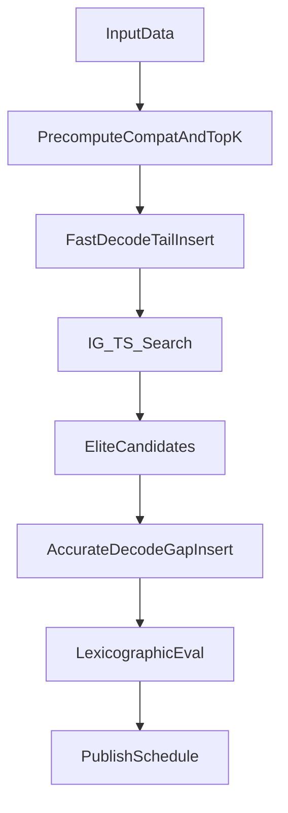
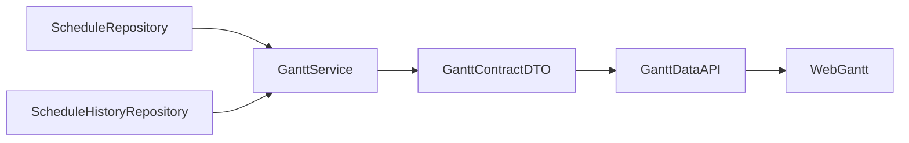

# APS测试系统 - 排产优化完整方案

## 文档信息
- **版本**: v1.2.9（一致性收敛版）
- **日期**: 2026-02-26
- **适用范围**: APS测试系统 v2.0+
- **目标环境**: Windows 7 SP1 x64 + Python 3.8.10（单机无网）

---

## 目录

1. [项目概述](#1-项目概述)
2. [现状分析与问题诊断](#2-现状分析与问题诊断)
3. [优化目标与验收标准](#3-优化目标与验收标准)
4. [技术架构设计](#4-技术架构设计)
5. [数据模型设计](#5-数据模型设计)
6. [核心算法设计](#6-核心算法设计)
7. [Win7兼容交付基线](#7-win7兼容交付基线)
8. [实施路线图](#8-实施路线图)
9. [测试验证方案](#9-测试验证方案)
10. [风险评估与应对](#10-风险评估与应对)
11. [部署与运维](#11-部署与运维)
12. [附录](#12-附录)

---

## 1. 项目概述

### 1.1 项目背景

APS测试系统是一款面向中小型制造企业的单机版排产软件，运行在Windows 7环境下。系统需要处理双资源约束（设备+人员）的作业车间调度问题，支持内外部工序混合、紧急插单等复杂场景。

### 1.2 当前系统架构

```
┌─────────────────────────────────────────────────────────────┐
│                      APS测试系统 v1.0                        │
├─────────────────────────────────────────────────────────────┤
│  第一层: 多策略排序（优先级/交期/权重/FIFO）                  │
│  第二层: 双资源约束贪心算法（Serial SGS）                     │
│  第三层: 简单局部搜索（improve模式）                          │
└─────────────────────────────────────────────────────────────┘
```

### 1.3 核心挑战

| 挑战 | 描述 | 影响 |
|------|------|------|
| 双资源约束 | 设备和工人双重约束，互相锁死 | 解空间爆炸 |
| Win7限制 | 无法使用现代C++库（OR-Tools） | 算法选择受限 |
| 单机稳态 | 目标机以单机运行为主，默认单线程可复现 | 必须先保证单线程稳定，再评估可控并行 |
| 实时响应 | 车间操作员不能等待 | 算法必须在秒内完成 |
| 插单扰动 | 紧急订单导致全局重排 | 调度神经质 |

### 1.4 现状实现边界（v1.x）与 v2.0 规划状态（本版冻结）

为避免评审把“设计目标”误读为“已上线能力”，本版先冻结现状与规划边界：

| 主题 | v1.x 现状（已实现，可验收） | v2.0 规划（未落地） | 证据锚点 |
|------|------------------------------|----------------------|----------|
| 算法内核 | `GreedyScheduler`（含 `batch_order/sgs` 派工与 `improve` 模式） | `IG + TS + FastDecode/AccurateDecode` 双解码框架 | `core/algorithms/greedy/scheduler.py` |
| 运行形态 | Flask Web（路由 + 模板） | Flask Web（保留） + Numba JIT | `requirements.txt` |
| 甘特图能力 | Web 甘特图（设备/人员双视图、关键链高亮、依赖箭头模式、筛选与图例、URL 状态持久化） | Web 甘特图持续增强（复用同一数据契约） | `web/routes/scheduler_gantt.py`、`templates/scheduler/gantt.html`、`static/js/gantt.js`、`core/services/scheduler/gantt_contract.py` |
| 打包接入 | 当前仓库尚无 `.spec` 打包基线文件 | 后续补齐 spec、缓存回退与预热降级钩子 | 仓库根目录 `*.spec` 检索为空（需补证据文件） |
| 验证证据 | 已有 Web/排产冒烟与全量自测报告 | v2.0 目标能力需后续补充专项验收 | `evidence/Phase7/smoke_phase7_report.md`、`evidence/Phase10/smoke_phase10_report.md`、`evidence/FullSelfTest/full_selftest_report.md` |

> 状态口径冻结：第4~8章以 v2.0 目标态设计为主；其中 **4.6 / 8.5 / 9.5** 额外补充“v1.x 甘特图可执行基线”，用于指导当前仓库持续迭代，不作为 v2.0 已落地声明。

---

## 2. 现状分析与问题诊断

### 2.1 性能瓶颈分析

#### 2.1.1 面向对象性能灾难

**问题**: 使用`@dataclass Operation`定义工序对象，每次变异使用`copy.deepcopy()`复制成千上万个对象

**影响**:
- 原计划10秒迭代1000次，实际只能跑50次
- CPU算力全浪费在内存分配和垃圾回收
- Python GC频繁触发，程序卡顿

#### 2.1.2 Serial SGS时间碎片

**问题**: 串行调度生成机制只能生成"半主动调度"，甘特图上留下大量本可利用的时间碎片

**影响**:
- 设备利用率低下
- Makespan比理论最优高10%~20%

#### 2.1.3 盲目搜索浪费算力

**问题**: 禁忌搜索使用常规工序交换，不区分关键/非关键工序

**影响**:
- 对非瓶颈工序进行交换，100%不会缩短总工期
- 有效搜索空间占比极低

### 2.2 业务逻辑缺陷

#### 2.2.1 调度神经质

**场景**: 下午2点来个加急单，系统把全车间下午的刀具、物料准备和人员机台对应关系全部打乱

**后果**: 引发调度室与车间工人的对立

#### 2.2.2 人员模型过于简化

**问题**: `Operation`只定义了`duration`和`worker` ID，未考虑技能差异

**现实**: 高级技工耗时可能只有学徒工的一半

**现状口径说明**: v1.x 仍以 `OperatorMachine.skill_level + is_primary` 形成的 `pair_rank` 作为资源排序兜底，不改变加工时长；若后续引入“技能影响工时”，须作为独立里程碑实施。

#### 2.2.3 忽略换模时间

**问题**: 未考虑序列相关换模时间(SDST)

**现实**: A型号换B型号需要换夹具/调刀补，连续加工A型号只需极短时间

### 2.3 问题-章节-修订动作映射（本版执行清单）

| 问题点 | 当前症状 | 对应章节 | 本版修订动作 |
|------|------|------|------|
| SmartDecoder尾插上限 | 只记录`machine_time/worker_time`，无法利用空隙 | 第6章 | 引入`FastDecode + AccurateDecode`双解码；精评阶段做空隙插入 |
| 编码与邻域不一致 | 仅有`js`排序基因却要求“资源再指派” | 第5/6章 | 升级为双层编码`(js + resource_preference)`，邻域同时作用排序与资源偏好 |
| 关键路径精算过重 | 每轮全量关键路径构图成本高 | 第6章 | 采用“限频精算 + 近似关键工序” |
| SDST规模膨胀 | `sdst(machine,job,job)`在规模上升时内存压力大 | 第5章 | 改为`sdst(machine,family,family)`并增加`job_to_family`映射 |
| 目标与验收错位 | 优化主目标与现场验收口径不一致 | 第3章 | 改为分层目标：可行性优先，其次交付、稳定、换模、完工期 |
| 冻结期只靠惩罚 | 产生大量必死解，浪费迭代预算 | 第6章 | `hard frozen`进入解码可行域，`soft frozen`作为偏好成本 |
| setup规则语义不完整 | `machine_only`和`machine_and_worker`计算未分流 | 第6章 | 明确两种规则的开始/占用时间公式与伪代码 |
| Win7落地风险未闭环 | 缓存目录权限、杀软拦截、首启预热失败 | 第7/10/11章 | 增加缓存路径回退、白名单建议、可重试与纯Python回退 |
| 人员能力建模尺度失控 | 直接上`worker×op`细粒度参数维护成本高 | 第5/11/12章 | v1.x 维持 `OperatorMachine` 的 `pair_rank` 排序语义，不引入技能速度系数；预留后续扩展点 |

### 2.4 复审补充问题-章节-修订动作映射（v1.2.8）

| 问题点 | 复审结论 | 对应章节 | 本版修订动作 |
|------|------|------|------|
| 打包证据锚点失真 | 文档引用 `排产系统.spec`，但仓库无 `.spec` 文件 | 第1/7/12章 | 改为“仓库暂无 `.spec`”，并将补齐 `.spec` 作为后续交付门禁 |
| `delta_eval` 未定义 | 仅在 IG 伪代码调用，未给出实现契约 | 第6章 | 新增“增量评估契约”与回退方案（未实现前使用全量快评） |
| SA跨层尺度不自洽 | L1~L4 量纲差异大，共用温度易偏置接受率 | 第6章 | 补充“首个差异层内比较 + 分层归一化”门禁说明 |
| 近似关键工序忽略工人瓶颈 | 仅统计机器负载，不符合双资源目标 | 第6章 | 评分中加入 `worker_load`，瓶颈项取机器/工人联合指标 |
| hard frozen 热路径冗余 | 每轮候选重复判定冻结工序，浪费预算 | 第6章 | 明确“硬冻结预写入 slot，不进入候选循环” |
| 不可行中间态处理不清 | `cand_eval.feasible=False` 的主循环分支未显式声明 | 第6章 | 在主循环补“不可行即丢弃，不参与接受准则” |
| `precompute_topk` 性能契约缺失 | 伪代码为纯 Python 三重循环，未声明 JIT 要求 | 第5章 | 明确该函数需 `@njit`/向量化实现并纳入性能门禁 |
| `deap` 依赖缺少使用场景 | 仅出现在依赖清单，方案正文无落地职责 | 第7章 | 从 Win7 目标依赖与离线下载清单移除 |
| v2 到 v1 运行回退缺失 | 仅定义 v2 内部降级链，无内核兜底 | 第10章 | 增加“v2 -> v1 GreedyScheduler”降级分支 |
| 参数持久化闭环不完整 | v2 新参数未明确落盘位置与版本管理 | 第11章 | 增补 `ScheduleConfig/ScheduleHistory` 的参数落盘策略 |
| `OperatorSkill` 表定位未声明 | schema 已存在，但文档未定义与 `pair_rank` 的关系 | 第5章 | 新增“OperatorSkill 当前定位”说明（不进入本期时长模型） |
| 材料约束边界缺失 | schema 有 `Materials/BatchMaterials`，但算法边界未声明 | 第5章 | 新增“材料约束为本期边界外能力”声明与留痕要求 |
| 插件系统关系未声明 | 仓库存在 `core/plugins/*`，文档无接入口径 | 第4章 | 增补“插件扩展关系”说明，明确本期不作为必选路径 |
| Phase 5 并行前提表述过满 | 甘特展示任务与算法产物存在隐式依赖 | 第8章 | 将“可并行”改为“部分并行”，并补依赖门禁 |
| 版本历史最早日期过粗 | `v1.0` 仅写“2025年”，追溯粒度不足 | 第12章 | 标注“待补具体日期”，并纳入文档维护待办 |

---

## 3. 优化目标与验收标准

> 状态：本章定义 v2.0 优化项目的核心目标与验收准则，部分指标（如 FastDecode）在 v1.x 中尚未具备现状值。

### 3.1 性能目标

| 指标 | 当前 | 目标 | 验收标准 |
|------|------|------|----------|
| FastDecode快评延迟 | - | 100工序下均值<10ms | 连续1000次评估通过 |
| AccurateDecode精评延迟 | - | 100工序下均值<120ms | 连续100次精评通过 |
| Hybrid IG求解时延 | - | 200工序下P90<8s | 1000迭代（含周期精评）通过 |
| 内存峰值 | 180MB | <350MB | Win7目标机峰值<350MB（注1） |
| 首次预热恢复性 | - | 失败可重试并可降级 | 预热失败不阻断排产 |

> **注1 内存目标调整说明**：v1.0 目标为 <50MB，v1.2 调整为 <350MB。以 200 工序、20 台机器、20 个工人、50 个 family 为基准的分项估算如下：
>
> | 分类 | 主要项 | 估算 |
> |------|--------|------|
> | 数据结构 | proc_time/sdst_family_matrix/兼容矩阵/日历数组/slot数组/workspace | ~2MB |
> | Numba JIT | 首次编译产生的LLVM IR与机器码缓存（约15~20个@njit函数） | 60~100MB |
> | Python运行时 | 解释器+标准库+numpy/numba模块加载 | 50~70MB |
> | UI层 | 浏览器渲染缓冲（Chrome109） | 30~50MB |
> | 峰值余量 | 搜索过程中elite pool(5个EvalResult副本)等临时分配 | 10~20MB |
> | **合计** | | **~150~240MB** |
>
> 数据结构本身仅占约 2MB，内存大头来自 Numba JIT 编译缓存和 Python/浏览器运行时。优化方向应聚焦减少 @njit 函数数量和控制 elite pool 容量。
>
> **实测门禁（新增）**：
> - Phase 1 退出前，必须在 Win7 目标机实测 200 工序场景峰值内存（taskmgr RSS）。
> - 若实测 >350MB：优先减少 `@njit` 函数数量（合并小函数），其次压缩 `elite pool`（如 5→3），仍不达标再启用降级路径。
> - Chrome109 需分别在“空甘特页 / 200任务甘特页”测量并留档。

### 3.2 目标口径（Lexicographic）

主线旨在实现分层目标比较（Lexicographic），不再依赖单一`makespan`加权和：

| 层级 | 目标 | 典型指标 | 判定规则 |
|------|------|----------|----------|
| L0 可行性 | 先满足硬约束 | 资源冲突=0；工艺先后满足；hard frozen零变动 | 任一违规直接判负 |
| L1 交付 | 优先交期表现 | 加权拖期/准交率 | 先比较L1，优者胜 |
| L2 稳定性 | 控制插单扰动 | 扰动综合指标（见下方公式） | L1相同再比较L2 |
| L3 切换成本 | 降换模与提连续率 | 总换模时长、同类连续率 | L2相同再比较L3 |
| L4 效率 | 最后看工期与利用率 | makespan、设备利用率 | L3相同再比较L4 |

#### 3.2.1 各层指标的可实现定义（统一量纲与取整）

为避免“文档指标”和“实现指标”口径漂移，本方案对 L1/L3/L4 给出可直接落地的定义，并补齐 L2 的数值化方式。

**统一约定**：

- **时间量纲**：统一为 `int64` 分钟；区间均为半开 `[start,end)`；若输入为秒/小时必须在构建实例时统一换算。
- **批次完工时间（双口径，避免 external 边界歧义）**：
  - `finish_time_internal(batch)`：仅 internal 工序 `end_time` 最大值（用于算法可控性能分析）。
  - `finish_time_customer(batch)`：含 external 约束后的客户口径完工时间（用于交付报表与发布验收）。
  - 发布比较主口径固定为 `finish_time_customer`，不得与 internal 口径混用。
- **交期数据质量门禁**：`due_date` 为空或解析失败时，标记 `DELIVERY_DUE_DATE_MISSING`；默认禁止发布。仅在“历史补录白名单”模式下允许继续，且该批次必须从准交分母剔除并在结果摘要单独留痕。

**L1 交付（建议以“加权拖期”为主指标，越小越好）**：

- **字段来源**：`Batches.due_date`（DATE/`YYYY-MM-DD`）与 `Batches.priority`（normal/urgent/critical）。
- **交期时刻**：采用半开区间一致口径 `due_exclusive = (due_date + 1 day) 00:00`，在指标计算前统一换算到“分钟时间轴”，避免 `23:59:59` 的取整歧义。
- **优先级权重**：`w(normal)=1.0, w(urgent)=2.0, w(critical)=3.0`（可配置但必须留档）。
- **拖期分钟**：\(t_j=\max(0,\; finish\_time(j)-due\_exclusive(j))\)。
- **加权拖期**：\(L1=\sum_j w_j \cdot t_j\)（单位：分钟）。
- **准交率（可报表，不参与比较）**：\(on\_time\_rate = 1-\frac{overdue\_count}{due\_count}\)。

> 说明：文档中若同时使用“超期批次数/总拖期/加权拖期”，必须明确主指标是谁。推荐主指标为加权拖期（L1），超期批次数作为报表辅助指标与断言项。
>
> 口径门禁（新增）：若 `finish_time_internal` 与 `finish_time_customer` 混用，或同一报告同时使用两种交期截止定义，结果应标记 `DELIVERY_METRIC_INCONSISTENT` 并拒绝发布。

**L2 稳定性指标量化公式**：

L2 需要一个"基线方案"作为参照。插单/重排场景下基线为上一版发布计划；首次排产时 L2 恒为 0（无历史对比）。

```
L2 = w_time * time_shift_rate + w_res * resource_change_rate

time_shift_rate  = sum(|start_new[i] - start_base[i]|) / (n_affected * makespan_base)
resource_change_rate = count(ms_new[i] != ms_base[i] or ws_new[i] != ws_base[i]) / n_affected
n_affected = 基线与新方案可对齐且非 hard frozen 的工序数

默认权重：w_time = 0.6, w_res = 0.4
```

边界门禁（必须）：
- 若 `n_affected == 0`：定义 `time_shift_rate=0`、`resource_change_rate=0`、`L2=0`（禁止除零）。
- 若 `makespan_base <= 0`：分母按 `max(makespan_base, 1)` 处理，并记录 `L2_BASELINE_DEGENERATE` 诊断标记。

L2 越小越好。当两个候选的 L1 相同时，L2 小的方案扰动更可控，优先选择。

L2 的实现建议：

- `time_shift_rate/resource_change_rate` 是比率，若 `EvalResult.objective_l2` 需要整数，建议统一放大 \(10^6\) 后取整：`objective_l2 = int(round(L2 * 1_000_000))`。
- `soft_frozen_penalty()` 属于解码器的“局部启发式评分项”，不应替代最终 L2 公式；最终 L2 应在 `FullSchedule` 与 `base_schedule` 对齐后计算并落盘。

L2 基线数据流（必须闭环）：

1. **存储**：每次排产发布后，将当前方案的 `op_code/op_id/start_times/ms/ws` 以 `version` 为键落盘（优先写入 `ScheduleHistory.result_summary`，必要时可由 `Schedule` 表回查重建）。
2. **加载**：重排/插单时，以“上一版发布 `version`”为基线，读取 `op_code/op_id -> start_time/machine_id/operator_id`。
3. **对齐**：主键优先 `op_code`，当 `op_code` 缺失或重复时回退 `op_id`；新增工序不计入 `n_affected`，已删除工序按 `resource_change=1,time_shift=0` 计入扰动。
4. **对齐失败回退**：若工序同时缺失 `op_code/op_id` 或发生不可恢复冲突，标记 `L2_ALIGNMENT_DEGRADED`；默认当 `unaligned_ratio > 5%` 时禁止发布，触发“稳定优先”参数集重跑。
5. **阈值分场景配置（新增）**：`unaligned_ratio` 阈值可按场景配置（常规重排默认 5%，大版本工艺变更可临时放宽），但任何放宽都必须在发布记录中留痕“阈值变更原因 + 审批人”。
6. **首次排产**：无历史版本时 L2 恒为 0（与本节定义一致）。

**L3 切换成本（建议以“总换模时长”为主指标，越小越好）**：

- **字段来源**：`job_to_family` 与 `sdst_family_matrix`（或等价的“按族换模”规则）。
- **总换模时长**：按每台机器的最终序列，逐工序累加 `base_setup_time(op)`，并对相邻对累加 `SDST(prev_family,curr_family)`；两者必须同口径参与 L3 比较与报表。
  发布前必须以“SDST 闭环重建后的序列”为准（见 6.1.1）。
- **同类连续率（可报表/断言）**：\(\frac{\#\{adjacent\ pairs\ with\ same\ family\}}{\#\{adjacent\ pairs\}\;(\text{>0})}\)。
- **边界口径**：当全局 `adjacent_pairs==0`（如每台机器仅 0/1 道工序）时，置 `continuity_defined=false`，L3 比较仅使用“总换模时长”。
- **数据门禁**：若存在 `job_to_family` 越界/缺失，候选解直接判为 `FAMILY_MAPPING_INVALID`，禁止默认回填为 0 继续比较 L3。

**L4 效率（建议以 makespan 为主指标，越小越好）**：

- **makespan**：\(L4=\max(end\_time)-\min(start\_time)\)（单位：分钟）。
- **设备/人员利用率（可报表/断言）**：以内部工序为口径，\(\text{util}=\frac{\sum busy\_time}{makespan\_{internal}\cdot used\_count}\)。当 `makespan_internal==0` 时利用率无定义，应在报表中标记 `util_defined=false`。

| 目标 | 描述 | 验收标准 |
|------|------|----------|
| 冻结期支持 | hard frozen进入解码可行域 | hard frozen工序开始时间与资源保持不变 |
| 平滑插单 | 优先局部右移与受影响资源内重排 | 插单后计划扰动率<10% |
| SDST优化 | 按family组织减少切换 | 同类连续率>80%，换模总时长下降 |
| 能力匹配 | 沿用 `pair_rank`（主操+技能等级）做 tie-break | auto-assign 相关回归通过（含技能排序映射） |

### 3.3 量纲与比较规则（防止“算得快但不对口”）

`lexicographic_compare(a, b)`按`L0 -> L1 -> L2 -> L3 -> L4`逐层比较，首个分出优劣的层级即返回，不再用低层级覆盖高层级结果。

仅在需要与历史版本兼容时，允许使用备选加权和：

`cost = w1*norm(L1) + w2*norm(L2) + w3*norm(L3) + w4*norm(L4)`

约束要求：
- `norm(.)`必须按同一时间窗与同一基线归一化，禁止不同量纲直接相加。
- 加权和仅用于候选预排序，不得替代L0硬约束判定。
- 发布验收仍以分层目标断言（见第9.4节）为准。

---

## 4. 技术架构设计

> 状态：目标态设计稿，未落地（用于后续实施评审，不作为当前已上线能力）。

### 4.1 分层算法架构

```
┌─────────────────────────────────────────────────────────────────┐
│  第四层: 发布与深度优化层 (>60秒)                                 │
│  ├─ Memetic (IG + TS + 资源偏好基因扰动)                        │
│  └─ AccurateDecode精评 + 下发前可行性校核                        │
├─────────────────────────────────────────────────────────────────┤
│  第三层: 全局优化层 (10-60秒)                                    │
│  ├─ 迭代贪心(IG) with 分散重建（js + resource_preference）       │
│  └─ 限频关键路径精算（每N轮或出现新最优时触发）                  │
├─────────────────────────────────────────────────────────────────┤
│  第二层: 局部优化层 (1-10秒)                                     │
│  ├─ 禁忌搜索(TS) with 双资源关键块邻域                          │
│  └─ 排序交换 + 资源偏好基因变异（机器/工人）                     │
├─────────────────────────────────────────────────────────────────┤
│  第一层: 快速响应层 (<1秒)                                       │
│  ├─ FastDecode（Top-K组合 + 尾插快评）                           │
│  └─ 优先规则排序 (SPT/LPT/MWKR/FIFO)                            │
└─────────────────────────────────────────────────────────────────┘
```

### 4.2 算法选择决策矩阵

| 问题规模 | 快速响应(<1秒) | 常规求解(1-30秒) | 深度优化(>30秒) |
|----------|----------------|------------------|-----------------|
| **小规模(<50工序)** | FastDecode | TS（排序+资源偏好） | IG + AccurateDecode精评 |
| **中规模(50-200)** | FastDecode | IG（限频关键路径） | Memetic（IG+TS）+ 精评 |
| **大规模(>200)** | FastDecode(Top-K压缩) | IG(限制迭代) | 分段优化 + elite精评 |

### 4.3 核心算法组合（推荐）

**推荐组合**: IG(破坏重建) + TS关键块邻域 + 双解码器(FastDecode + AccurateDecode)

**理由**:
1. 双层编码让排序优化与资源优化可同时进行，避免“邻域动作不可表达”。
2. FastDecode 承担大规模迭代快评，旨在实现秒级响应。
3. AccurateDecode通过空隙插入释放时间碎片，避免尾插上限锁死。
4. 关键路径采用限频精算，兼顾定向搜索收益与运行时开销。

### 4.4 快评-精评闭环（主流程）



流程约束：
- 搜索阶段默认使用`FastDecode`进行候选快评，仅保留`EvalResult`轻量结果。
- 每`N`次迭代或出现新最优时，对`elite`候选触发`AccurateDecode`精评。
- 最终下发前必须执行一次`AccurateDecode`与冻结/日历可行性复核。

### 4.5 v1.0 → v2.0 架构迁移路径（目标态迁移设计）

当前仓库仍以 v1.x（Flask + GreedyScheduler）为主；v2.0（Web + Numba + 新算法栈）尚未落地。以下内容为迁移设计基线，用于后续实施评审：

```
v1.0 架构（保留与废弃标注）：
├── Flask + HTML模板（保留：Web UI 持续迭代）
├── SQLite + Repository层（保留：数据持久化仍用SQLite）
├── @dataclass 业务模型（保留：作为数据加载层的中间表示）
├── GreedyScheduler / Serial SGS（废弃：由IG+TS+双解码替代）
├── Excel导入管线 / openpyxl（保留：Excel模板与导入逻辑不变）
└── 冻结窗口 freeze_window.py（保留：语义对接FrozenContext）
```

**分层迁移策略**：

| 层级 | v1.0 组件 | v2.0 对应 | 迁移方式 |
|------|-----------|-----------|----------|
| UI层 | Flask路由 + HTML模板 | Flask路由 + HTML模板（增量优化） | 原样保留，按需增强 |
| 数据访问层 | SQLite + Repository | SQLite + Repository（不变） | 原样保留 |
| 数据转换层 | 无（直接用dataclass） | `InstanceBuilder`: dataclass → numpy数组 | 新增转换层 |
| 算法层 | GreedyScheduler | IG+TS+FastDecode/AccurateDecode | 全新开发 |
| 配置层 | config.py + schedule_params | 扩展：新增SDST/能力/冻结配置项 | 增量扩展 |

#### 4.5.0 扩展边界补充（复审新增）

- **插件系统关系**：仓库已存在 `core/plugins/`（manager/registry/runtime）。v2.0 算法默认以内建实现为主，不将“插件化加载算法”作为本期必选交付项；若后续采用插件注入，需新增“插件 ABI 与回退策略”专项评审。
- **材料约束边界**：schema 已包含 `Materials/BatchMaterials`，但本方案的 v2.0 算法主线暂不把“材料齐套约束”纳入 L0 可行域。发布时必须在结果摘要中标记“材料约束未参与优化”，避免现场误读为已覆盖。

**数据转换层（InstanceBuilder）设计**：

```python
class InstanceBuilder:
    """从 v1.0 的 SQLite/dataclass 模型构建 DRCJSSPInstance numpy数组"""
    
    def build(self, batches, machines, operators, op_machines, calendar) -> DRCJSSPInstance:
        instance = DRCJSSPInstance(...)
        self._fill_proc_time(instance, batches, op_machines)
        self._fill_compatibility(instance, batches, machines, operators)
        self._fill_skill_model(instance, operators)
        self._fill_sdst_matrix(instance, batches)
        self._fill_calendar(instance, calendar)
        precompute_topk(instance)
        return instance
```

#### 4.5.1 字段映射（SQLite/Excel → InstanceBuilder → `DRCJSSPInstance`）

本节仅做“现有实现口径回填”，不新增业务功能：对 v1.x 数据模型中不存在的信息（如 SDST / family）采用**保守默认**，确保 v2.0 算法可跑通且不会引入隐式语义变化。

| `DRCJSSPInstance` 字段 | 现有数据来源（SQLite/Excel） | 默认/缺省策略 | 备注 |
|---|---|---|---|
| `n_jobs` | `Batches`（本次选中批次） | - | job≈batch |
| `n_operations` | `BatchOperations`（本次选中批次的工序） | - | `DRCJSSPInstance` 仅覆盖 internal 双资源工序；external 工序通过 release 约束参与 |
| `n_machines` | `Machines(status=active)` 或“本次涉及的设备集合” | 默认 active | 与现有资源池口径对齐 |
| `n_workers` | `Operators(status=active)` 或“本次涉及的人员集合” | 默认 active | 与现有资源池口径对齐 |
| `op_info` | `BatchOperations(batch_id, seq, piece_id)` | `piece_id` 为空则置 0/空串映射 | 用于 job/op 索引与追溯 |
| `job_op_count/job_op_start` | 按 `batch_id` 聚合 `BatchOperations` 计数并前缀和 | - | 需保证同一批次工序按 `seq` 有序 |
| `op_type_of_op`、`n_op_types` | `BatchOperations.op_type_id`（优先）或 `op_type_name`（兜底） | 缺失时拒绝排产或映射到“unknown” | 建议强制维护 `op_type_id`，避免名称漂移 |
| `job_to_family`、`n_families` | v1.x 无显式 family：可用 `Batches.part_no` 作为 family | 默认 `family=part_no`（每图号一族） | 这是“零新增功能”的最保守做法；此时 SDST 仅能按图号聚合 |
| `base_setup_time` | `BatchOperations.setup_hours` | 缺失视为 0 | 建议统一换算为分钟 `ceil(hours*60)` |
| `proc_time` | `BatchOperations.unit_hours * Batches.quantity` | 缺失视为 0；负值/非有限值拒绝 | v1.x 建议落地为 `proc_time(n_operations,)`；v2.0 若有机台工时再扩展到二维 |
| `machine_op_compatible` | `Machines.op_type_id == BatchOperations.op_type_id` | 若 `machine_id` 强指定且不允许替代，则仅该机为 1 | 需在方案中明确“可替代”策略，避免与现场约束冲突 |
| `worker_op_compatible` | `OperatorMachine(operator_id,machine_id)` + `Machines.op_type_id` | 建议做“粗兼容”（可操作任一兼容设备即置 1） | 真实可行性仍以 `is_pair_compatible(op,m,w)` 约束 `OperatorMachine` 对 |
| `pair_rank`（排序元信息） | `OperatorMachine.skill_level + is_primary` | 缺失按末位排序 | v1.x 仅用于资源候选排序 tie-break，不影响加工时长 |
| `sdst_family_matrix` | v1.x 无 SDST 表 | 默认全 0（无序列相关换模） | 不新增功能前提下的默认行为 |
| `*_unavail_by_priority` | `WorkCalendar`/`OperatorCalendar`/`MachineDowntimes` | 见 5.1.1（合并/裁剪/溢出门禁） | 注意 Excel 导入侧限制与优先级门禁一致性 |

`OperatorSkill` 当前定位（与 `pair_rank` 的关系）：
- schema 已存在 `OperatorSkill`，但 v1.x 与本期 v2.0 目标态均以 `OperatorMachine.skill_level + is_primary -> pair_rank` 作为排序依据。
- 本期不将 `OperatorSkill` 引入“技能影响工时”计算，避免维护尺度失控；若后续启用，须作为独立里程碑并补充数据治理与回归。

外协工序处理边界（v2.0 口径冻结）：
- `DualLayerEncoding` 不包含 external 工序（`source=external` 不参与 `js` 编码）。
- `n_operations` 仅计入 internal 工序；external 工序不作为独立派工对象。
- L4 的 `makespan` 以 internal 工序口径计算；external 通过 `ext_days` 形成后续 internal 的 `release` 约束。
- 关键链分析可将 external 映射为固定时长虚拟节点，与现有 merged 外协组口径一致。

#### 4.5.2 Schema 迁移与回滚策略（对齐现有实现，不新增功能）

- **结构来源**：`schema.sql` 为唯一权威；启动时通过 `ensure_schema()` 以事务方式执行建表脚本。
- **版本标记**：使用 `SchemaVersion`（单行）记录当前 schema 版本；当检测到新库已满足最新结构时可直接提升版本，避免无谓迁移。
- **迁移门禁**：`current_version < CURRENT_SCHEMA_VERSION` 时，迁移前必须生成备份文件（落在 `backups/` 目录），迁移失败可回滚。
  典型场景：WorkCalendar 历史 `day_type=weekend` 统一清洗为 `holiday`（已有回归用例）。
- **日期字段清洗**：`Batches.due_date/ready_date` 等 DATE 字段需做格式标准化（`YYYY-MM-DD`），否则会导致交付指标与超期提示失真。

此转换层是 v1.0 数据与 v2.0 算法之间的桥梁，Phase 1 第 3 天实现。

### 4.6 甘特图持续演进设计（Web先行，契约统一）

> 状态：本节为“可执行实施基线”。目标是保证当前 Web 甘特图可持续迭代，并通过统一契约约束前后端，避免“文档有方向、实现无落地步骤”的空档。

#### 4.6.1 当前甘特图实现事实（v1.x）

| 主题 | 当前实现口径（已实现） | 代码锚点 |
|---|---|---|
| 页面入口 | `GET /scheduler/gantt`，设备/人员视图切换，版本与周范围切换 | `web/routes/scheduler_gantt.py`、`templates/scheduler/gantt.html` |
| 数据接口 | `GET /scheduler/gantt/data`，返回 tasks / calendar_days / critical_chain | `web/routes/scheduler_gantt.py`、`core/services/scheduler/gantt_service.py` |
| 数据契约 | 已引入 `contract_version=2`；`history` 默认不回传，需 `include_history=1` | `core/services/scheduler/gantt_contract.py`、`web/routes/scheduler_gantt.py` |
| 任务字段 | tasks 含 `schedule_id/lock_status/duration_minutes/edge_type` 与 `meta` 扩展字段 | `core/services/scheduler/gantt_tasks.py`、`data/repositories/schedule_repo.py` |
| 关键链 | 边携带 `edge_type/reason/gap_minutes`，并输出 `edge_type_stats/edge_count/cache_hit` | `core/services/scheduler/gantt_critical_chain.py`、`core/services/scheduler/gantt_service.py` |
| 前端交互 | 颜色模式、依赖箭头模式（互斥）、关键链高亮、URL 状态持久化、日/周/月粒度切换 | `static/js/gantt.js`、`static/css/aps_gantt.css` |

#### 4.6.2 统一甘特契约（Web 单轨）

推荐以如下结构作为跨端唯一契约（字段可扩展，不可随意删改）：

```json
{
  "contract_version": 2,
  "view": "machine",
  "version": 12,
  "week_start": "2026-03-02",
  "week_end": "2026-03-08",
  "task_count": 128,
  "tasks": [
    {
      "id": "B001-OP05",
      "schedule_id": 952,
      "name": "B001-OP05 MC001 OP001",
      "start": "2026-03-02 08:00:00",
      "end": "2026-03-02 10:00:00",
      "duration_minutes": 120,
      "lock_status": "unlocked",
      "dependencies": "",
      "edge_type": "process",
      "custom_class": "priority-urgent overdue",
      "meta": {
        "batch_id": "B001",
        "machine_id": "MC001",
        "operator_id": "OP001",
        "status": "scheduled"
      }
    }
  ],
  "calendar_days": [],
  "critical_chain": {
    "ids": ["B001-OP05", "B001-OP10"],
    "edges": [
      {
        "from": "B001-OP05",
        "to": "B001-OP10",
        "edge_type": "machine",
        "reason": "资源前驱（设备）",
        "gap_minutes": 0
      }
    ],
    "edge_type_stats": {
      "process": 0,
      "machine": 1,
      "operator": 0,
      "unknown": 0
    },
    "edge_count": 1,
    "cache_hit": true
  }
}
```

契约约束：
- `contract_version` 升级必须伴随回归测试更新与版本说明。
- `history` 默认不返回；仅在显式 `include_history=1` 时返回，避免接口体积膨胀。
- 任何新增字段必须“可缺省、可回退”，禁止破坏旧端解析。

#### 4.6.3 双轨实施原则（执行顺序固定）



执行原则：
1. **Web 轨先行**：先保证现网可读、可查、可解释，且回归门禁可执行。
2. **契约优先**：先固化 DTO，再推进前端渲染与交互；禁止先写页面再反推接口。
3. **渲染与业务分层**：前端只负责渲染与交互，不复制业务拼装逻辑；业务组装统一留在服务层。
4. **风险前置**：任何契约变更先加回归，再改实现。

#### 4.6.4 Web 持续迭代门槛（防止“半收口”）

进入下一阶段 UI 收口前，必须同时满足：
- Web 回归全绿：`tests/smoke_phase8.py` + 甘特专项回归（见 9.5）。
- 契约快照稳定：连续两次版本迭代不出现“非预期字段漂移”。
- 关键交互闭环：设备/人员视图切换、版本切换、URL 状态持久化与关键链高亮在同一周计划下可稳定复现。

---

## 5. 数据模型设计

> 状态：目标态设计稿，未落地（用于后续实施评审，不作为当前已上线能力）。

### 5.1 核心数据类

```python
@dataclass
class DRCJSSPInstance:
    """双资源约束JSSP问题实例（family级SDST + 可扩展能力模型）"""
    
    # 基本参数
    n_jobs: int                    # 工件数量
    n_machines: int                # 机器数量
    n_workers: int                 # 工人数量
    n_operations: int              # 工序总数
    n_families: int                # 产品族数量
    n_op_types: int                # 工序类型数量（预留，v1.x 现状不用于技能时长建模）
    
    # 工序ID数据 (n_operations, 3): [job_id, op_id, route_id]
    op_info: np.ndarray            # int32
    job_op_count: np.ndarray       # int32
    job_op_start: np.ndarray       # int32
    op_type_of_op: np.ndarray      # (n_operations,), int16
    job_to_family: np.ndarray      # (n_jobs,), int16
    
    # 加工/换模时长（时间统一int64）
    # v1.x 建议使用 proc_time: (n_operations,)；v2.0 可扩展为按机器二维工时
    proc_time: np.ndarray          # (n_operations,) 或 (n_machines, n_operations)
    base_setup_time: np.ndarray    # (n_operations,)
    
    # 机器/工人兼容性
    machine_op_compatible: np.ndarray  # (n_machines, n_operations), 1=兼容
    worker_op_compatible: np.ndarray   # (n_workers, n_operations), 1=兼容
    
    # 能力/排序元信息（v1.x现状）
    # pair_rank 来源于 OperatorMachine(skill_level + is_primary)，仅用于候选排序 tie-break
    # 不改变加工时长；“技能影响工时”保留为后续独立里程碑扩展点
    
    # SDST换模时间（按family建模）
    sdst_family_matrix: np.ndarray     # (n_machines, n_families, n_families), int64
    
    # 日历不可用区间（按优先级分集合，Numba nopython兼容）
    # 约定：0=normal，1=urgent（critical 归并 urgent）
    MAX_UNAVAIL: int = 256                         # 每资源最大不可用段数（默认256，可配置但建议>=128）
    PRIORITY_NORMAL: int = 0
    PRIORITY_URGENT: int = 1
    machine_unavail_by_priority: np.ndarray        # (2, n_machines, MAX_UNAVAIL, 2), int64
    machine_unavail_count_by_priority: np.ndarray  # (2, n_machines), int32
    worker_unavail_by_priority: np.ndarray         # (2, n_workers, MAX_UNAVAIL, 2), int64
    worker_unavail_count_by_priority: np.ndarray   # (2, n_workers), int32
    
    # Setup资源占用规则（用int常量代替str，Numba兼容）
    SETUP_MACHINE_ONLY: int = 0
    SETUP_MACHINE_AND_WORKER: int = 1
    setup_resource_rule: np.ndarray                # (n_machines,), int8；0=machine_only, 1=machine_and_worker
    
    # Top-K候选对预计算（定长3D数组，Numba nopython兼容）
    TOPK_MAX: int = 8                              # 每道工序最多保留的候选(m,w)对数
    op_topk_pairs: np.ndarray                      # (n_operations, TOPK_MAX, 3), int32: [m, w, rank]
    op_topk_count: np.ndarray                      # (n_operations,), int32
```

#### 5.1.1 日历口径与不可用区间生成（对齐现有实现）

本方案在 `DRCJSSPInstance` 中使用 `*_unavail_by_priority` 表示“按优先级分集合的资源不可用区间”，目的是让 Numba 解码器在 `nopython` 模式下进行可行性判断（避免运行期调用 Python `datetime`），并消除“单集合数组 + 动态优先级门禁”导致的快评/精评不可比问题。

##### 5.1.1.1 现有系统日历数据源与优先级门禁（事实口径）

- **全局日历**：SQLite 表 `WorkCalendar(date, day_type, shift_start, shift_end, shift_hours, efficiency, allow_normal, allow_urgent, ...)`。
- **人员专属日历**：`OperatorCalendar(operator_id, date, ...)`，若存在个人配置则覆盖全局。
- **day_type 规范化**：管理侧建议仅存 `workday/holiday`，其中 `weekend` 统一视为 `holiday`（现有迁移与管理侧逻辑即如此）。
- **默认策略**：未配置日期时，周末默认为不可排产（`shift_hours=0`），工作日默认 8h（见 `core/services/scheduler/calendar_engine.py::_default_for_date`）。
- **默认回退与归一化关系**：引擎默认回退日历在未配置日期时仍可能返回 `weekend`；导入/迁移/展示层会把 `weekend` 归一化为 `holiday`，以统一业务口径（见 `web/routes/scheduler_utils.py::_normalize_day_type`）。
- **班次跨午夜**：当 `shift_end <= shift_start` 时视为次日结束；并且“日期键”以 `shift_start` 所在日期为准，次日凌晨会归属到前一天窗口（见 `CalendarEngine._policy_for_datetime`）。
- **优先级门禁**：`allow_normal/allow_urgent` 会影响“该日是否允许排入普通/急件”，其中 `critical` 归并到 `urgent`（见 `DayPolicy.is_priority_allowed`）。
- **设备停机**：设备不可用区间来自 `MachineDowntimes`（按设备维度展开后参与避让；见 `core/services/scheduler/resource_pool_builder.py::load_machine_downtimes` + `core/algorithms/greedy/scheduler.py`）。

> **关键一致性口径（v1.2.9 收敛）**：优先级门禁统一在实例构建期固化为 `*_unavail_by_priority`，解码阶段仅按 `priority_code` 取对应集合；禁止再叠加运行期 `is_priority_allowed()` 二次判定。

##### 5.1.1.2 `*_unavail` 的语义（解码器侧内部表示）

- **时间单位**：统一使用 `int64` 分钟（或秒，但必须全局一致）；区间为半开区间 `[start, end)`。
- **含义**：在 `*_unavail` 中出现的区间表示该资源在该段时间**不可用于 setup/process 占用**。
- **建议时间窗**：只生成与本次排产相关的有限 horizon（例如从 `base_time` 起到 `base_time + horizon`），并在导入阶段完成排序与合并。

##### 5.1.1.3 生成规则（从现有表推导，不新增功能）

为保证“现有实现口径可映射到 Numba 结构”，推荐按如下来源构造不可用区间：

1. **工人工作窗外时间全部视为不可用**（对齐现有引擎口径）。
   - 对 **工人**：优先使用 `OperatorCalendar`，不存在则回退全局 `WorkCalendar`；工作窗外时间分别写入 `worker_unavail_by_priority[normal/urgent]`。
2. **机器不可用区间来源（需明确口径，避免“隐式新增功能”）**：
   - **必选**：设备停机区间 `MachineDowntimes` 并入 `machine_unavail_by_priority`（两级集合均生效）。
   - **可选（按现场制度决定）**：若现场要求机器也遵循 `WorkCalendar` 班次/假期，则将“工作窗外时间”并入 `machine_unavail_by_priority`；若希望保持与现有实现一致，可不叠加（因为内部工序必占工人，工人窗口已足够约束开工时刻）。
3. **优先级门禁处理（V1.2.9 口径冻结）**：
   - **统一口径**：采用“按优先级分集合”建模，固定生成 `*_unavail_by_priority[0/1]`；`critical` 归并到 `priority=1`。
   - **等价配置优化**：当 `allow_normal == allow_urgent` 时，两套集合可复用同一内容（实现可共享缓存），但接口语义仍保持双集合。
   - **禁止双轨**：禁止混用“单套 `*_unavail` + 运行期 `is_priority_allowed()` 动态判定”的双轨逻辑，否则快评/精评结果不可比。
   - **门禁校验**：若检测到 `allow_normal != allow_urgent` 且实例未生成双集合，必须阻断排产并标记 `PRIORITY_GATE_UNAVAILABLE`（不可仅告警）。

##### 5.1.1.4 压缩/合并与 `MAX_UNAVAIL` 溢出门禁（必须写清）

静态区间数组有上限（默认 `MAX_UNAVAIL=256`，可配置），因此必须定义“合并与溢出”口径，避免静默截断导致误排：

- **排序**：按 `start` 升序。
- **合并**：区间重叠或相邻（`next.start <= cur.end`）必须合并为 `[cur.start, max(cur.end,next.end))`。
- **裁剪**：与 horizon 无交集的区间丢弃；对部分交集区间做裁剪。
- **溢出处理（建议门禁）**：合并后若 `count > MAX_UNAVAIL`，先执行“horizon 裁剪 + 相邻段再次压缩”；仍超限时才拒绝排产并提示用户合并停机/简化日历，禁止“截断后继续算”。
- **建议约束**：`shift_hours` 建议限制在 `[0, 24]`；若出现 `>24` 会造成跨日窗口重叠，`date` 键语义不再唯一（现有引擎也会出现歧义）。

##### 5.1.1.5 Excel 导入与页面配置的已知限制（风险提示）

- **全局日历 Excel 导入**（`web/routes/scheduler_excel_calendar.py`）当前仅支持 `日期/类型/可用工时/效率/允许*`，**不暴露 `shift_start/shift_end`**。
- **人员日历 Excel 导入**（`core/services/common/excel_validators.py`）当前要求 `班次结束 > 班次开始`，因此 **不支持跨午夜班次的 Excel 导入**；但管理侧/引擎侧逻辑是支持跨午夜的。

以上差异不要求新增功能，但必须在方案里写清楚：哪些能力“现已支持”、哪些“仅页面支持/仅导入支持”，以及现场如何规避（例如统一用 `shift_hours` 表达跨日、或改用页面配置）。

**Top-K 预计算策略**：

- **计算时机**：数据导入阶段一次性预计算，搜索全程复用。仅当问题实例变更（工序/资源/兼容性变化）时重新计算。
- **排序标准**：对每道工序 `op_idx`，枚举所有兼容的 `(m, w)` 对，按以下综合 rank 排序取前 K 个：
  ```
  rank(op_idx, m, w) = (proc_time[op_idx], pair_rank(w, m))
  ```
  即按“基础加工时长 + 人机排序偏好”选取前 K；其中 `pair_rank` 继承 v1.x 现状语义（主操优先、技能等级作为 tie-break），不改变加工时长。
- **K=8 选择依据**：典型场景下每道工序兼容 2~5 台机器、2~5 个工人，全组合 4~25 对。K=8 通常覆盖 >90% 的有效组合。当兼容对 <8 时 `op_topk_count[op_idx]` 记录实际数量。
- **覆盖率保护**：若某工序兼容对总数 > 2*K 且 Top-K 覆盖率 < 60%，在数据校验阶段发出警告。
- **正确性兜底（必须）**：Top-K 只用于性能加速，不能改变“是否可行”的结论。
  - 当 Top-K 内**没有任何可行候选**（冻结/日历/停机/能力等导致）时，必须按如下顺序回退，避免把“截断导致不可行”误判为“真不可行”：
    1) **偏好优先**：若资源偏好基因指向的 `(m,w)` 可行，即使不在 Top-K 里也要尝试。
    2) **全量枚举兜底**：对该 `op_idx` 直接枚举所有兼容 `(m,w)`（复杂度 \(O(M\cdot W)\)，仅在 Top-K 无解时触发）。
      说明：为保证 Numba nopython 兼容，取消“渐进扩 K（8→16→32）”动态策略，固定为“Top-K + 全量枚举”两级。
- **触发条件与上限**：
  - `op_topk_count[op_idx]==0`：视为数据错误（无兼容对），应在导入/构建实例阶段直接报错并阻断排产。
  - 若全量枚举仍无可行候选：判定为“真不可行”，进入 `diagnose_infeasible`（冲突来源应区分：冻结/日历/停机/兼容性/能力）。
- **不可行归因（建议）**：若 Top-K 无可行但全量存在可行对，应在 `EvalResult.violation_code` 或诊断信息中标记 `TOPK_TRUNCATED`，并记录：兼容对总数、Top-K 覆盖率、首个可行对的 rank，用于调参回归与现场解释。

```python
@njit
def precompute_topk(machine_op_compatible, worker_op_compatible, pair_compatible,
                    proc_time, pair_rank, op_topk_pairs, op_topk_count, topk_max):
    """Numba nopython 版本：固定数组 + 线性插入，不使用 Python list/sort/lambda。"""
    n_m, n_op = machine_op_compatible.shape
    n_w = worker_op_compatible.shape[0]

    for op_idx in range(n_op):
        # 先清空本工序 Top-K
        for i in range(topk_max):
            op_topk_pairs[op_idx, i, 0] = -1
            op_topk_pairs[op_idx, i, 1] = -1
            op_topk_pairs[op_idx, i, 2] = 10**9  # 占位 rank
        k = 0

        for m in range(n_m):
            if machine_op_compatible[m, op_idx] == 0:
                continue
            for w in range(n_w):
                if worker_op_compatible[w, op_idx] == 0:
                    continue
                if pair_compatible[w, m] == 0:  # 与 OperatorMachine 人机对约束一致
                    continue

                base_time = proc_time[op_idx] if proc_time.ndim == 1 else proc_time[m, op_idx]
                rank = pair_rank[w, m]
                key0, key1, key2, key3 = base_time, rank, m, w

                # 在线维护前 topk_max 个最优候选（按 key 词典序）
                insert_pos = min(k, topk_max - 1)
                while insert_pos > 0:
                    pm = op_topk_pairs[op_idx, insert_pos - 1, 0]
                    pw = op_topk_pairs[op_idx, insert_pos - 1, 1]
                    if pm < 0:
                        insert_pos -= 1
                        continue
                    p_time = proc_time[op_idx] if proc_time.ndim == 1 else proc_time[pm, op_idx]
                    p_rank = pair_rank[pw, pm]
                    if (key0, key1, key2, key3) >= (p_time, p_rank, pm, pw):
                        break
                    if insert_pos < topk_max:
                        op_topk_pairs[op_idx, insert_pos, 0] = pm
                        op_topk_pairs[op_idx, insert_pos, 1] = pw
                        op_topk_pairs[op_idx, insert_pos, 2] = op_topk_pairs[op_idx, insert_pos - 1, 2]
                    insert_pos -= 1

                if insert_pos < topk_max:
                    op_topk_pairs[op_idx, insert_pos, 0] = m
                    op_topk_pairs[op_idx, insert_pos, 1] = w
                    op_topk_pairs[op_idx, insert_pos, 2] = rank
                    if k < topk_max:
                        k += 1

        op_topk_count[op_idx] = k
```

落地口径说明：
- v1.x 基线维持 `pair_rank` 排序语义，技能不参与时长计算。
- 若后续现场数据成熟，可在不改算法主干的前提下扩展“技能影响工时”模型（独立里程碑）。
- `precompute_topk` 属热路径预处理函数，落地时必须采用 `@njit` 或等价向量化实现，并纳入性能门禁；禁止以纯 Python 三重循环作为正式实现。

#### 5.1.2 AccurateDecode 空隙插入的 Numba 数组化设计

AccurateDecode 需要维护每台机器/每个工人的"已排区间列表"。Numba 的 TypedList 性能远低于原生数组（官方 issue #5909），因此采用**预分配定长二维数组 + 计数器 + 二分插入**方案：

```python
MAX_SLOTS = 512  # 单资源最大已排区间数（200工序场景下足够）

# 预分配一次，搜索全程复用
machine_slots = np.zeros((n_machines, MAX_SLOTS, 2), dtype=np.int64)   # [start, end)
machine_slot_count = np.zeros(n_machines, dtype=np.int32)
worker_slots = np.zeros((n_workers, MAX_SLOTS, 2), dtype=np.int64)
worker_slot_count = np.zeros(n_workers, dtype=np.int32)
```

空隙查找使用 `np.searchsorted` 做二分定位（在 Numba 0.53.1 + NumPy 1.20.3 目标组合下可用），插入时右移数组尾部。每次解码前 reset 计数器即可复用缓冲区。

`MAX_SLOTS` 溢出门禁（必须）：
- 若单资源 `slot_count` 达到 `MAX_SLOTS-1`，后续工序分配到该资源时应标记 `SLOT_OVERFLOW` 并跳过该资源候选。
- 若某工序的全部候选资源均触发 `SLOT_OVERFLOW`，应判定不可行并进入 `diagnose_infeasible`。
- 禁止静默截断或越界写入。

### 5.2 双层编码设计（排序 + 资源偏好）

```python
class DualLayerEncoding:
    """双层编码：排序基因(js) + 资源偏好基因"""
    
    def __init__(self, n_jobs: int, job_op_count: np.ndarray):
        self.n_jobs = n_jobs
        self.job_op_count = job_op_count
        self.n_operations = sum(job_op_count)
        
        # 第一层：排序基因（保证每个job出现次数合法）
        self.js = np.zeros(self.n_operations, dtype=np.int32)
        
        # 第二层：资源偏好基因（-1表示交由decoder自由选择）
        self.machine_pref = np.full(self.n_operations, -1, dtype=np.int16)
        self.worker_pref = np.full(self.n_operations, -1, dtype=np.int16)
    
    def random_initialize(self, random_seed: Optional[int] = None):
        """随机初始化排序，并为资源偏好提供可行初值"""
        if random_seed is not None:
            np.random.seed(random_seed)
        
        job_list = []
        for j in range(self.n_jobs):
            job_list.extend([j] * self.job_op_count[j])
        
        self.js = np.array(job_list, dtype=np.int32)
        np.random.shuffle(self.js)
        self._init_resource_preference()
    
    def decode_to_operation_sequence(self, job_op_start: np.ndarray) -> np.ndarray:
        """将js解码为op_idx序列。job_op_start须从DRCJSSPInstance传入。"""
        op_sequence = np.zeros(self.n_operations, dtype=np.int32)
        job_counters = np.zeros(self.n_jobs, dtype=np.int32)
        
        for i, job_id in enumerate(self.js):
            op_id = job_counters[job_id]
            op_idx = job_op_start[job_id] + op_id
            op_sequence[i] = op_idx
            job_counters[job_id] += 1
        
        return op_sequence

    def mutate_resource_preference(self, op_idx: int):
        """只改变资源偏好，不改变工艺顺序合法性"""
        self.machine_pref[op_idx] = random_compatible_machine(op_idx)
        self.worker_pref[op_idx] = random_compatible_worker(op_idx)
```

资源偏好语义：
- `machine_pref/worker_pref`是“偏好”而非硬约束，decoder可在不可行时覆盖。
- 偏好命中可降低二级成本（换模、扰动、能力不匹配），不允许破坏L0可行性。

### 5.3 调度结果数据结构（搜索态/下发态分层）

**热路径复用策略**：搜索阶段使用预分配的 `decode_workspace`（包含 start_times/end_times/ms/ws 等数组），FastDecode 直接写入 workspace 并仅返回标量元组 `(feasible, l1, l2, l3, l4, makespan)`。只在需要保留 elite 候选时才执行一次 `np.copy` 生成 `EvalResult`。这样 IG 1000 次迭代不产生数组分配开销。

```python
# 搜索阶段预分配，全程复用
class DecodeWorkspace:
    """FastDecode 写入缓冲区（禁止在热路径创建新数组）"""
    start_times: np.ndarray    # (n_operations,), int64，预分配
    end_times: np.ndarray
    ms: np.ndarray             # (n_operations,), int16
    ws: np.ndarray             # (n_operations,), int16
    op_sequence: np.ndarray    # (n_operations,), int32

@dataclass
class EvalResult:
    """仅在 elite 保存路径使用（数组从 workspace copy 而来）"""
    feasible: bool
    objective_l1: int               # 交付层指标（如加权拖期）
    objective_l2: int               # 稳定层指标（扰动成本）
    objective_l3: int               # 切换层指标（换模/连续率）
    objective_l4: int               # 效率层指标（makespan等）
    
    makespan: int
    start_times: np.ndarray          # 从workspace copy
    end_times: np.ndarray
    ms: np.ndarray
    ws: np.ndarray
    
    op_sequence: np.ndarray
    violation_code: int = 0          # 0=可行，其他值表示冲突类型
    
@dataclass
class FullSchedule:
    """最终下发与可视化结果"""
    eval_result: EvalResult
    machine_schedules: List[List[Tuple]]   # 每台机器的调度序列
    worker_schedules: List[List[Tuple]]    # 每个工人的调度序列
    setup_intervals: List[List[Tuple]]     # setup区间（用于审计setup规则）
    critical_path: List[int]                # 精算关键路径
    critical_blocks: Dict[str, List[List[int]]]
    infeasible_reasons: List[str]           # 无可行解时的冲突解释
```

---

## 6. 核心算法设计

> 状态：目标态设计稿，未落地（用于后续实施评审，不作为当前已上线能力）。

### 6.1 双解码器：FastDecode（快评）+ AccurateDecode（精评）

**职责分工**:
- `FastDecode`：用于IG/TS大规模迭代评估，采用Top-K组合 + 尾插快评，返回`EvalResult`。
- `AccurateDecode`：用于elite候选精评与最终下发，采用空隙插入，返回`FullSchedule`。

**`setup_resource_rule`语义（必须分流实现）**:

| 规则 | setup占用 | process占用 | 时间计算 |
|------|-----------|-------------|----------|
| `machine_only` | 仅机器占用`[t_setup, t_setup+setup)` | 机器+工人占用`[t_proc, t_proc+duration)` | `t_proc = t_setup + setup` |
| `machine_and_worker` | 机器+工人全程占用`[t_setup, t_setup+setup+duration)` | 同上 | `t_proc = t_setup + setup` |

**加工时长读取公式（v1.x 现状）**：

```python
@njit
def get_duration(op_idx, m, proc_time):
    """v1.x 基线：技能不影响工时。
       proc_time 可是一维(op)或二维(m,op)表示，按形状读取。"""
    if proc_time.ndim == 1:
        return np.int64(proc_time[op_idx])
    return np.int64(proc_time[m, op_idx])

@njit
def get_family_setup(m, prev_family, op_idx,
                     job_to_family, op_info, sdst_family_matrix):
    """SDST取决于机器m上"前一个加工件的family"到"当前件family"的切换。
       扁平化传参版本（Numba nopython兼容）。"""
    curr_family = job_to_family[op_info[op_idx, 0]]
    if prev_family < 0:
        return np.int64(0)  # 该机器尚未排过工序，无换模
    return sdst_family_matrix[m, prev_family, curr_family]

@njit
def get_total_setup(m, prev_family, op_idx, base_setup_time,
                    job_to_family, op_info, sdst_family_matrix):
    """统一 setup 口径：base_setup_time + family SDST。"""
    family_setup = get_family_setup(m, prev_family, op_idx, job_to_family, op_info, sdst_family_matrix)
    return np.int64(base_setup_time[op_idx]) + family_setup
```

**Numba 落地约束**：上述伪代码中的 `instance` 在 Numba nopython 模式下不能是 Python dataclass 实例。实际实现时须将 `DRCJSSPInstance` 的各字段拆成独立 numpy 数组作为函数参数传入（"扁平化传参"），或使用 `@jitclass`。`DualLayerEncoding` 同理——搜索热路径中传递的是 `js`、`machine_pref`、`worker_pref` 三个裸数组，而非类实例。

伪代码（快评）：

> **伪代码状态**：v2.0 目标态设计，非当前仓库实现。

```python
class FastDecoder:
    """尾插快评：高吞吐、可容忍少量评估误差"""
    
    def decode_eval(self, encoding: DualLayerEncoding, frozen_ctx) -> EvalResult:
        instance = self.instance  # FastDecoder 初始化时持有的实例数组容器（真实落地需扁平化传参）
        op_sequence = encoding.decode_to_operation_sequence(instance.job_op_start)
        init_tail_state()  # machine_tail, worker_tail, last_family
        
        for op_idx in op_sequence:
            release = predecessor_finish(op_idx)
            priority_code = priority_code_of_op(op_idx)  # 0=normal, 1=urgent(含critical)
            best = None
            
            # 只遍历预计算Top-K候选(m,w)，避免O(M*W)全枚举
            for k in range(instance.op_topk_count[op_idx]):
                m, w, _rank = instance.op_topk_pairs[op_idx, k, 0], instance.op_topk_pairs[op_idx, k, 1], instance.op_topk_pairs[op_idx, k, 2]
                if not is_pair_compatible(op_idx, m, w):
                    continue
                if violates_hard_frozen(op_idx, m, w, frozen_ctx):
                    continue
                
                duration = get_duration(op_idx, m, instance.proc_time)
                setup = get_total_setup(
                    m, machine_last_family[m], op_idx,
                    instance.base_setup_time,
                    instance.job_to_family, instance.op_info, instance.sdst_family_matrix,
                )
                rule = instance.setup_resource_rule[m]
                m_unavail = instance.machine_unavail_by_priority[priority_code, m]
                m_unavail_n = instance.machine_unavail_count_by_priority[priority_code, m]
                w_unavail = instance.worker_unavail_by_priority[priority_code, w]
                w_unavail_n = instance.worker_unavail_count_by_priority[priority_code, w]
                t_setup, t_proc, t_finish = evaluate_tail_slot(
                    release, m, w, setup, duration,
                    rule,
                    m_unavail, m_unavail_n,
                    w_unavail, w_unavail_n
                )
                
                score = (
                    t_finish,                                # 一级：尽早完工
                    setup,                                   # 二级：少换模
                    preference_penalty(encoding.machine_pref, encoding.worker_pref, op_idx, m, w),
                    soft_frozen_penalty(
                        op_idx, t_proc, m, w,
                        frozen_ctx.is_soft_frozen, frozen_ctx.fixed_start, frozen_ctx.fixed_machine, frozen_ctx.fixed_worker,
                    ),
                )
                best = select_lexicographic_min(best, score, m, w, t_setup, t_proc, t_finish)
            
            # Top-K 截断兜底：Top-K 内无可行候选时，必须回退到全量枚举
            # 否则会把“Top-K 截断导致不可行”误判为“真不可行”（见 5.1 Top-K 预计算策略）
            if best is None:
                # 伪代码：直接全量枚举兼容对（Numba 兼容）
                for m, w in enumerate_all_compatible_pairs(op_idx):
                    if not is_pair_compatible(op_idx, m, w):
                        continue
                    if violates_hard_frozen(op_idx, m, w, frozen_ctx):
                        continue
                    duration = get_duration(op_idx, m, instance.proc_time)
                    setup = get_total_setup(
                        m, machine_last_family[m], op_idx,
                        instance.base_setup_time,
                        instance.job_to_family, instance.op_info, instance.sdst_family_matrix,
                    )
                    rule = instance.setup_resource_rule[m]
                    m_unavail = instance.machine_unavail_by_priority[priority_code, m]
                    m_unavail_n = instance.machine_unavail_count_by_priority[priority_code, m]
                    w_unavail = instance.worker_unavail_by_priority[priority_code, w]
                    w_unavail_n = instance.worker_unavail_count_by_priority[priority_code, w]
                    t_setup, t_proc, t_finish = evaluate_tail_slot(
                        release, m, w, setup, duration,
                        rule,
                        m_unavail, m_unavail_n,
                        w_unavail, w_unavail_n
                    )
                    score = (
                        t_finish,
                        setup,
                        preference_penalty(encoding.machine_pref, encoding.worker_pref, op_idx, m, w),
                        soft_frozen_penalty(
                            op_idx, t_proc, m, w,
                            frozen_ctx.is_soft_frozen, frozen_ctx.fixed_start, frozen_ctx.fixed_machine, frozen_ctx.fixed_worker,
                        ),
                    )
                    best = select_lexicographic_min(best, score, m, w, t_setup, t_proc, t_finish)
            
            if best is None:
                return build_infeasible_eval(op_idx, violation_code="NO_FEASIBLE_PAIR")
            
            commit_tail_assignment(best)
        
        return build_eval_result()
```

伪代码（精评）：

> **伪代码状态**：v2.0 目标态设计，非当前仓库实现。

```python
class AccurateDecoder:
    """空隙插入精评：用于候选精算与最终下发"""
    
    def decode_full(self, encoding: DualLayerEncoding, frozen_ctx) -> FullSchedule:
        instance = self.instance  # AccurateDecoder 初始化时持有的实例数组容器（真实落地需扁平化传参）
        op_sequence = encoding.decode_to_operation_sequence(instance.job_op_start)
        # hard frozen 优化：预写入 slots 并从候选序列排除，避免每轮重复判断
        op_sequence = filter_out_hard_frozen(op_sequence, frozen_ctx)
        # 预分配slot数组（见5.1.2），reset计数器即可复用
        reset_slot_arrays(machine_slots, machine_slot_count,
                          worker_slots, worker_slot_count, frozen_ctx)
        # slot_to_op: 记录每个slot对应的op_idx，用于空隙插入时查找前驱family
        slot_to_op = np.full((n_machines, MAX_SLOTS), -1, dtype=np.int32)
        
        for op_idx in op_sequence:
            release = predecessor_finish(op_idx)
            priority_code = priority_code_of_op(op_idx)  # 0=normal, 1=urgent(含critical)
            best = None
            
            # 候选生成顺序建议：偏好 -> Top-K -> 全量兜底（Top-K 无解必须回退；见 5.1 Top-K 策略）
            for m, w in candidate_pairs_with_preference(op_idx, encoding):
                if violates_hard_frozen(op_idx, m, w, frozen_ctx):
                    continue
                
                duration = get_duration(op_idx, m, instance.proc_time)
                # 空隙插入模式下，SDST须按候选插入位置的实际前驱family计算（见6.1.1）
                insert_pos = find_insert_position(machine_slots[m], machine_slot_count[m], release)
                prev_family = get_predecessor_family_at(
                    slot_to_op[m], insert_pos, instance.job_to_family, instance.op_info)
                setup = get_total_setup(
                    m, prev_family, op_idx,
                    instance.base_setup_time,
                    instance.job_to_family, instance.op_info, instance.sdst_family_matrix
                )
                rule = instance.setup_resource_rule[m]
                m_unavail = instance.machine_unavail_by_priority[priority_code, m]
                m_unavail_n = instance.machine_unavail_count_by_priority[priority_code, m]
                w_unavail = instance.worker_unavail_by_priority[priority_code, w]
                w_unavail_n = instance.worker_unavail_count_by_priority[priority_code, w]
                slot = find_earliest_feasible_slot(
                    machine_slots[m], machine_slot_count[m],
                    worker_slots[w], worker_slot_count[w],
                    m_unavail, m_unavail_n,
                    w_unavail, w_unavail_n,
                    release, setup, duration,
                    rule
                )
                if slot[0] < 0:  # (-1,-1,-1) 表示不可行
                    continue
                
                score = (
                    slot[2],  # finish
                    setup,
                    preference_penalty(encoding.machine_pref, encoding.worker_pref, op_idx, m, w),
                    soft_frozen_penalty(
                        op_idx, slot[1], m, w,  # slot[1]=proc_start
                        frozen_ctx.is_soft_frozen, frozen_ctx.fixed_start, frozen_ctx.fixed_machine, frozen_ctx.fixed_worker,
                    ),
                )
                best = select_lexicographic_min(best, score, m, w, slot)
            
            if best is None:
                return build_infeasible_schedule(op_idx)
            
            best_m, best_w, best_slot = best[0], best[1], best[2]
            commit_slot(best_m, best_w, best_slot,
                        machine_slots, machine_slot_count,
                        worker_slots, worker_slot_count)
            prev_family = lookup_predecessor_family(
                machine_slots[best_m], machine_slot_count[best_m],
                best_slot, instance.job_to_family, instance.op_info, slot_to_op)
            # 注意：空隙插入模式下不能用尾部跟踪，须按实际插入位置的前驱工序family计算SDST（见6.1.1）
        
        return build_full_schedule(machine_slots, machine_slot_count,
                                   worker_slots, worker_slot_count)
```

核心空隙插入函数（机器空隙 ∩ 工人空隙 ∩ release）：

```python
HORIZON_LIMIT = np.int64(525600 * 2)  # 安全上界：2年的分钟数（时间单位为分钟）
MAX_SLOT_JUMPS = 10_000              # 防退化：单次找位最大跳步次数

@njit
def next_conflict_end(m_slots, m_count, w_slots, w_count,
                      m_unavail, m_unavail_n, w_unavail, w_unavail_n, t):
    """返回 >=t 的最近冲突区间结束时刻。
       在机器/工人已排slot及不可用区间中二分定位冲突，取最早可跳过的 end。"""
    # 伪代码：实现时可对每类区间做 searchsorted，汇总最小 end
    return np.int64(t + 1)

@njit
def find_earliest_feasible_slot(m_slots, m_count, w_slots, w_count,
                                m_unavail, m_unavail_n, w_unavail, w_unavail_n,
                                release, setup, duration, rule):
    """返回 (setup_start, proc_start, finish) 元组，或 (-1,-1,-1) 表示不可行。
       Numba nopython 不支持 namedtuple/None 返回，统一用 int64 元组。"""
    t = release
    jumps = 0
    while t < HORIZON_LIMIT:
        if rule == 0:  # SETUP_MACHINE_ONLY
            s0, s1 = t, t + setup
            p0, p1 = t + setup, t + setup + duration
            feasible = slots_free(m_slots, m_count, s0, s1) and \
                       slots_free(m_slots, m_count, p0, p1) and \
                       slots_free(w_slots, w_count, p0, p1) and \
                       unavail_free(m_unavail, m_unavail_n, s0, p1) and \
                       unavail_free(w_unavail, w_unavail_n, p0, p1)
        else:  # SETUP_MACHINE_AND_WORKER (rule == 1)
            f0, f1 = t, t + setup + duration
            p0, p1 = t + setup, t + setup + duration
            feasible = slots_free(m_slots, m_count, f0, f1) and \
                       slots_free(w_slots, w_count, f0, f1) and \
                       unavail_free(m_unavail, m_unavail_n, f0, f1) and \
                       unavail_free(w_unavail, w_unavail_n, f0, f1)
        
        if feasible:
            return (t, p0, p1)  # (setup_start, proc_start, finish)
        
        t_next = next_conflict_end(m_slots, m_count, w_slots, w_count,
                                   m_unavail, m_unavail_n, w_unavail, w_unavail_n, t)
        if t_next <= t:
            max_jump = max(setup + duration, np.int64(60))
            t_next = min(t + max_jump, HORIZON_LIMIT)  # 防退化跳步
        t = t_next
        jumps += 1
        if jumps >= MAX_SLOT_JUMPS:
            return (-1, -1, -1)
    return (-1, -1, -1)
```

> `unavail_free(unavail_arr, count, start, end)` 检查日历不可用区间是否与 `[start, end)` 重叠，逻辑与 `slots_free` 类似（二分 + 区间比较）。

#### 6.1.1 空隙插入模式下的 SDST 计算（已知限制）

FastDecode 采用尾插，`machine_last_family[m]` 始终指向该机器上时间线末尾的 family，SDST 计算天然正确。

AccurateDecode 采用空隙插入，工序可能插入到机器已排序列的中间位置，此时：

1. **前驱 family 必须从实际插入位置读取**：通过 `slot_to_op` 数组记录每个 slot 对应的 op_idx，插入前用 `find_insert_position` 定位，再查 `slot_to_op[m][insert_pos - 1]` 的 family。
2. **后继工序的 SDST 可能失效（搜索态近似）**：插入 B 到 A 和 C 之间后，C 的前驱从 A 变为 B，C 的 SDST 也应随之改变。为控制运行时开销，搜索/精评过程中允许**不做级联重算**（只保证“插入工序本身”的 SDST 取值正确）。
   - **风险**：不做级联重算会低估或高估后继工序的 setup，占用区间可能发生偏移；若直接把该时间线用于下发，可能出现“setup 不足导致机器时间重叠/违反日历”的硬错误。
3. **发布前闭环（必须可执行）**：最终下发前不能只“校验指标”，必须把 SDST 对时间线的影响闭环到可行日程：
   - **全量重建**：按每台机器的最终顺序（`machine_slots` 的实际排列顺序），逐条用 `prev_family -> curr_family` 精确重算 SDST，并基于 precedence release + 资源占用 + `*_unavail` 重新推导 `(setup_start, proc_start, finish)`，必要时整体右移后继工序。
   - **时间预算（统一毫秒口径，复审修订）**：预算按“规模 + 近邻复杂度”估算并留安全系数：
     `sdst_rebuild_budget_ms = clamp(500, 8000, int( base_ms + a*n_operations + b*changed_edges ))`。
     其中 `base_ms/a/b` 由 Win7 目标机历史样本分位数回填；禁止直接以分钟工期线性换算毫秒预算。
   - **失败处理**：若重建后不可行或超时，该候选判为 infeasible 并回退下一 `elite`。当 `elite` 前 3 个连续失败/超时时，允许直接降级到 FastDecode 尾插下发，并显式标记 `SDST_REBUILD_TIMEOUT/SDST_REBUILD_FAILED`。
   - **指标口径**：L3（换模/切换成本）必须使用“重建后的精确 SDST”汇总，禁止用搜索态近似值直接出报表。
   - **降级口径**：降级下发时，L3 统一按 FastDecode 尾插序列统计并在报表标注“降级下发（粗评）”。

```python
@njit
def get_predecessor_family_at(slot_to_op_m, insert_pos,
                               job_to_family, op_info):
    """查找机器m上insert_pos位置的前驱工序的family"""
    if insert_pos <= 0:
        return np.int16(-1)  # 无前驱
    prev_op = slot_to_op_m[insert_pos - 1]
    if prev_op < 0:
        return np.int16(-1)
    return job_to_family[op_info[prev_op, 0]]
```

#### 6.1.2 评分辅助函数定义

以下函数在 FastDecode / AccurateDecode 的候选评分中使用，直接影响搜索方向：

```python
@njit
def preference_penalty(machine_pref, worker_pref, op_idx, m, w):
    """资源偏好未命中时的惩罚值（int64，量纲=分钟）。
       对应 L3 切换成本层——偏好命中意味着无额外换模/交接。
       返回值：0=完全命中；单项未命中返回 PREF_MISS_COST；均未命中返回 2*PREF_MISS_COST。"""
    PREF_MISS_COST = np.int64(30)  # 可配置，默认30分钟等效惩罚
    penalty = np.int64(0)
    if machine_pref[op_idx] >= 0 and machine_pref[op_idx] != m:
        penalty += PREF_MISS_COST
    if worker_pref[op_idx] >= 0 and worker_pref[op_idx] != w:
        penalty += PREF_MISS_COST
    return penalty

@njit
def soft_frozen_penalty(op_idx, t_proc, m, w,
                        is_soft_frozen, fixed_start, fixed_machine, fixed_worker):
    """软冻结工序偏离原方案的惩罚值（int64，量纲=分钟）。
       对应 L2 稳定性层——偏离越大惩罚越高。
       未冻结工序返回0。"""
    if not is_soft_frozen[op_idx]:
        return np.int64(0)
    time_shift = abs(t_proc - fixed_start[op_idx])
    resource_change = np.int64(0)
    if m != fixed_machine[op_idx]:
        resource_change += 60  # 换机器等效60分钟惩罚
    if w != fixed_worker[op_idx]:
        resource_change += 30  # 换工人等效30分钟惩罚
    return time_shift + resource_change

@njit
def approximate_critical_ops(start_times, end_times, ms,
                             ws, n_operations, makespan, top_n):
    """近似关键工序评分——不做全量关键路径构图，用启发式打分选出最可能影响makespan的工序。
       评分公式：score = 0.4 * duration_ratio + 0.4 * slack_inv + 0.2 * bottleneck_ratio
       - duration_ratio = (end - start) / makespan
       - slack_inv = 1 / (1 + slack)，slack = makespan - end_time（简化松弛量）
       - bottleneck_ratio = 该机器总负载 / makespan
       返回 top_n 个工序索引。"""
    machine_load = np.zeros(np.max(ms) + 1, dtype=np.int64)
    worker_load = np.zeros(np.max(ws) + 1, dtype=np.int64)
    for i in range(n_operations):
        machine_load[ms[i]] += end_times[i] - start_times[i]
        worker_load[ws[i]] += end_times[i] - start_times[i]
    scores = np.zeros(n_operations, dtype=np.float64)
    for i in range(n_operations):
        dur = end_times[i] - start_times[i]
        duration_ratio = dur / max(makespan, 1)
        slack = makespan - end_times[i]
        slack_inv = 1.0 / (1.0 + max(slack, 0))
        machine_ratio = machine_load[ms[i]] / max(makespan, 1)
        worker_ratio = worker_load[ws[i]] / max(makespan, 1)
        bottleneck_ratio = max(machine_ratio, worker_ratio)
        scores[i] = 0.4 * duration_ratio + 0.4 * slack_inv + 0.2 * bottleneck_ratio
    return np.argsort(-scores)[:top_n]
```

### 6.2 双资源关键块搜索（限频精算 + 近似关键工序）

**核心思想**: 关键路径很有价值，但不每轮全量重算。用“限频精算 + 近似关键工序”控制运行时开销。

> **伪代码状态**：v2.0 目标态设计，非当前仓库实现。

```python
@dataclass
class CriticalView:
    """统一关键视图契约：全量精算与近似模式共用同一返回结构。"""
    machine_blocks: List[List[int]]
    critical_ops: np.ndarray   # int32 op_idx 数组
    source: str                # "full" / "approx"

class DualResourceNeighborhood:
    def refresh_critical_view(self, full_schedule, iter_id, improved):
        if iter_id % cp_refresh_interval == 0 or improved:
            cp = compute_full_critical_path_and_blocks(full_schedule)
            return CriticalView(
                machine_blocks=cp.machine_blocks,
                critical_ops=np.array(cp.critical_ops, dtype=np.int32),
                source="full",
            )
        approx_ops = approximate_critical_ops(
            full_schedule.start_times, full_schedule.end_times,
            full_schedule.ms, full_schedule.ws,
            full_schedule.n_operations, full_schedule.makespan, top_n=20
        )
        return CriticalView(
            machine_blocks=[],
            critical_ops=approx_ops.astype(np.int32),
            source="approx",
        )
    
    def generate_neighbors(self, encoding: DualLayerEncoding, critical_view):
        neighbors = []
        
        # 排序邻域：关键块边界交换/插入
        for block in critical_view.machine_blocks:
            if len(block) < 2:
                continue
            neighbors.append(swap_boundary(encoding, block[0], block[1]))
            neighbors.append(swap_boundary(encoding, block[-2], block[-1]))
        
        # 资源偏好邻域：只改偏好基因，不破坏工艺顺序
        for op_idx in critical_view.critical_ops[:10]:
            neighbors.append(mutate_machine_pref(encoding, op_idx))
            neighbors.append(mutate_worker_pref(encoding, op_idx))
        
        return neighbors
```

### 6.3 IG(Iterated Greedy)算法（快评主循环 + 周期精评）

**核心思想**: 大破大立仍是主框架，但评估从“单一makespan”升级为“分层目标向量”。

> **伪代码状态**：v2.0 目标态设计，非当前仓库实现。

```python
class IteratedGreedy:
    # --- 温度调度参数 ---
    T0: float = 0.5       # 初温（归一化delta尺度，非绝对温度）
    T_MIN: float = 0.01   # 终温
    ALPHA: float = 0.995   # 指数降温率：T_(k+1) = ALPHA * T_k
    # --- destroy 参数 ---
    D_RATIO: float = 0.15  # 破坏比例：每轮移除 d = max(2, int(n_operations * D_RATIO)) 个工序
    D_SELECT: str = "random_with_critical_bias"  # 移除策略（见下方说明）
    # --- 精评触发 ---
    ACCURATE_EVAL_INTERVAL: int = 50  # 每N轮对当前最优触发精评
    
    def solve(self, initial_encoding: DualLayerEncoding, max_iterations, time_budget, frozen_ctx):
        current = initial_encoding
        current_eval = fast_decoder.decode_eval(current, frozen_ctx)
        best = current
        best_eval = current_eval
        temperature = self.T0
        
        for iteration in range(max_iterations):
            if time_budget_exceeded(time_budget):
                break
            
            destroyed, removed_tokens = self._destroy(current)
            candidate = self._rebuild_scattered(destroyed, removed_tokens)
            cand_eval = fast_decoder.decode_eval(candidate, frozen_ctx)

            if not cand_eval.feasible:
                continue  # 不可行候选直接丢弃，不参与接受准则
            
            if need_accurate_eval(iteration, cand_eval, best_eval):
                cand_full = accurate_decoder.decode_full(candidate, frozen_ctx)
                cand_eval = cand_full.eval_result
                if not cand_eval.feasible:
                    continue
            
            if self._accept(cand_eval, current_eval, temperature):
                current, current_eval = candidate, cand_eval
            
            if lexicographic_better(cand_eval, best_eval):
                best, best_eval = candidate, cand_eval
            
            temperature = max(self.T_MIN, temperature * self.ALPHA)
        
        return accurate_decoder.decode_full(best, frozen_ctx)
    
    def _destroy(self, encoding):
        """移除 d 个 js 位置（不是直接移除 op_idx），保留其资源偏好基因。
           D_SELECT策略：70%概率从近似关键工序中选取，30%概率随机选取，
           保证搜索聚焦瓶颈的同时维持多样性。"""
        op_sequence = encoding.decode_to_operation_sequence(self.instance.job_op_start)
        d = max(2, int(encoding.n_operations * self.D_RATIO))
        if random() < 0.7 and hasattr(self, '_cached_critical_ops'):
            critical_set = set(self._cached_critical_ops)
            pool = [pos for pos, op_idx in enumerate(op_sequence) if op_idx in critical_set]
        else:
            pool = list(range(encoding.n_operations))  # js 位置池
        removed_pos = sample(pool, min(d, len(pool)))
        removed_pos.sort()
        removed_tokens = [(pos, int(encoding.js[pos])) for pos in removed_pos]  # (原位置, job_id)
        destroyed = remove_positions_from_js(encoding, removed_pos)
        return destroyed, removed_tokens
    
    def _rebuild_scattered(self, destroyed, removed_tokens):
        """将移除的 js token 按“随机贪心插入”重建。
           候选位置采用随机采样 + 工艺邻近位置，避免全量位置扫描。
           注：`delta_eval` 为目标态增量评估接口；若未实现或置信度不足，必须回退到
           “试插入 + fast_decoder.decode_eval 全量快评”的保守路径。"""
        candidate = destroyed.copy()
        shuffle(removed_tokens)
        for _old_pos, job_id in removed_tokens:
            best_pos, best_cost = 0, float('inf')
            sampled_positions = sample_insert_positions(candidate, job_id, max_count=int(sqrt(candidate.n_operations) + 4))
            for pos in sampled_positions:
                delta = fast_decoder.delta_eval(candidate, job_id, pos)  # 局部增量评估，非全量decode
                if delta < best_cost:
                    best_pos, best_cost = pos, delta
            candidate = insert_job_token_at(candidate, job_id, best_pos)
            op_idx = decode_op_idx_at_js_pos(candidate, best_pos, self.instance.job_op_start)
            if random() < 0.05:
                candidate.mutate_resource_preference(op_idx)
        return candidate

    def _accept(self, cand_eval, current_eval, temperature):
        """SA接受准则：仅在“首个差异层”内计算概率，避免跨层量纲污染"""
        if lexicographic_better(cand_eval, current_eval):
            return True
        for level in [1, 2, 3, 4]:
            c_val = getattr(cand_eval, f'objective_l{level}')
            r_val = getattr(current_eval, f'objective_l{level}')
            if c_val != r_val:
                scale = level_scale(level, c_val, r_val)  # 分层归一化，禁止跨层共用尺度
                delta = (c_val - r_val) / scale
                return random() < exp(-delta / temperature)
        return True
```

**温度调度说明**：采用指数降温 `T_(k+1) = 0.995 * T_k`，1000 轮后温度衰减至 `T0 * 0.995^1000 ≈ 0.0034`，后期几乎只接受改进解。初温 T0=0.5 对应"首层分出差异的层级上，允许约 39% 概率接受 delta=0.5 的劣化"。归一化采用 `max(|c|,|r|,1)`，避免基准值为 0 时接受概率异常。

**复杂度口径（重建阶段）**：当 `delta_eval` 已实现且通过一致性回归时，可按“有限采样 + 增量评估”估算为近似 \(O(d \cdot \sqrt{n})\)；未满足门禁时按“有限采样 + 全量快评”口径评估复杂度并据实报表。

**IG destroy/rebuild 时资源偏好基因处理策略**：
- `_destroy` 移除工序时，对应的 `machine_pref/worker_pref` 值**保留不清除**。
- `_rebuild_scattered` 重新插入时，偏好值跟随工序原样带入新位置。
- decoder 在新位置评估时，如果原偏好指向的资源不可行（被冻结或不兼容），decoder 自动覆盖为最优可行资源，不报错。
- 每轮 IG 有固定概率（如 5%）对被移除工序执行 `mutate_resource_preference`，注入资源搜索多样性。

### 6.4 冻结期与鲁棒调度（硬约束进可行域 + 失败可解释）

> **伪代码状态**：v2.0 目标态设计，非当前仓库实现。

```python
@dataclass
class FrozenContext:
    """Numba nopython兼容：用bool数组代替Set[int]"""
    is_hard_frozen: np.ndarray     # (n_operations,), bool
    is_soft_frozen: np.ndarray     # (n_operations,), bool
    fixed_start: np.ndarray        # (n_operations,), int64（hard frozen时有效）
    fixed_machine: np.ndarray      # (n_operations,), int16
    fixed_worker: np.ndarray       # (n_operations,), int16

class RobustScheduler:
    def build_frozen_context(self, base_schedule, current_time, window_minutes, operation_status):
        """硬冻结进可行域，软冻结转偏好成本"""
        ctx = FrozenContext(...)
        for op_idx in range(instance.n_operations):
            status = operation_status.get(op_idx, "pending")
            if status in ("processing", "completed", "material_prepared"):
                add_hard_frozen(ctx, op_idx, base_schedule)
            elif base_schedule.eval_result.start_times[op_idx] < current_time + window_minutes:
                add_soft_frozen(ctx, op_idx)
        return ctx
    
    def insert_job(self, request):
        best = None
        best_eval = None
        
        # 采用局部修复式候选生成，优先受影响资源与关键块范围内重排
        for candidate in generate_local_repair_candidates(request):
            full_schedule = optimizer.solve(candidate, frozen_ctx=self.current_frozen_ctx)
            if not full_schedule.eval_result.feasible:
                continue
            if best is None or lexicographic_better(full_schedule.eval_result, best_eval):
                best = full_schedule
                best_eval = full_schedule.eval_result
        
        if best is None:
            return diagnose_infeasible(self.current_frozen_ctx, request)
        return best

def diagnose_infeasible(frozen_ctx, request):
    """返回冲突来源与放宽建议，而不是只返回INF"""
    return {
        "error": "NO_FEASIBLE_SOLUTION",
        "reasons": [
            "硬冻结占用了关键窗口且无兼容资源",
            "候选工序在冻结窗口内缺少可用工人/机器"
        ],
        "suggestions": [
            "放宽软冻结窗口",
            "允许加班窗口",
            "允许外协工序"
        ]
    }
```

---

## 7. Win7兼容交付基线

> 状态：目标态基线，待接入（仅描述目标交付要求，不代表当前仓库已实现）。

本章用于定义 v2.0 的 Win7 目标交付基线，不代表当前仓库已全部接入。

### 7.1 当前仓库现状与差距（截至 v1.x）

当前仓库与本章目标态之间的主要差距如下：

- 当前运行依赖仍是 Flask/openpyxl 口径，未接入 Numba 运行依赖（见 `requirements.txt`）。
- 当前仓库尚无 `.spec` 打包基线文件（后续需补齐并纳入证据链）。
- 仓库中暂无 `runtime_hook.py` 与 `NUMBA_CACHE_DIR` 回退落地文件。
- 仍以 Web UI 为主线，尚未引入新 UI 运行时依赖。
- 现有证据链以 Web/Greedy 路径为主（见 `evidence/Phase7/smoke_phase7_report.md`、`evidence/Phase10/smoke_phase10_report.md`、`evidence/FullSelfTest/full_selftest_report.md`）。

以上差距项对应的证据索引见 12.3.1。

> 口径说明：本章后续条目均为“目标交付基线（待接入）”，用于实施前对齐，不作为当前仓库“已上线能力”依据。

### 7.2 目标机要求（交付前提）

```
硬前提（必须满足）：
├── 操作系统: Windows 7 SP1 x64
├── 处理器: x64架构（不支持x86/32位）
├── 内存: 至少4GB RAM
├── 磁盘: 至少1GB可用空间（含缓存与日志）
├── 权限: 非管理员也可写缓存目录
└── 补丁: 建议安装以下更新
    ├── KB2999226 (Universal CRT) - 必须
    ├── KB2670838 (Platform Update) - 推荐
    └── KB2533623 (安全更新) - 推荐
```

### 7.3 目标依赖基线（待接入）

```
# requirements_win7_final.txt（目标基线草案）
numpy==1.20.3                  # 与 numba 0.53.1 的历史兼容基线；numpy 1.21 在 #7175 暴露已知问题，后续由 #7176 路线修复
numba==0.53.1                  # 项目 Win7 现场的候选历史基线（非“当前仓库已接入”）
llvmlite==0.36.0               # 与 numba 0.53.x 的配对版本
pyinstaller==4.10              # 项目 Win7 现场实测基线；官方支持口径为 Win8+，Win7 属非官方兼容
pip>=24.0                      # 开发/打包环境建议基线；Python 3.8 可用上限为 pip 24.3.1
```

外部口径依据见 12.3.2（pip 元数据、Numba 兼容议题、PyInstaller 官方 README）。

### 7.4 离线包与 wheel 仓准备（待接入后执行）

```bash
# prepare_offline_packages.sh
pip download \
    --only-binary=:all: \
    --platform win_amd64 \
    --python-version 38 \
    numpy==1.20.3 numba==0.53.1 llvmlite==0.36.0 \
    pyinstaller==4.10 \
    -d ./packages
```

目标交付要求：
- 安装包携带完整 `packages/` 离线仓；
- 首次安装不依赖互联网；
- 依赖清单与 wheel 文件哈希可追溯留档。

**pip 版本说明**：开发与打包环境建议 pip >=24.0（Python 3.8 最高可用 pip 24.3.1）。若现场网络策略复杂，建议使用 wheel 离线升级：`python -m pip install --no-index pip-24.3.1-py3-none-any.whl`。

### 7.5 缓存目录回退策略（目标行为，待接入）

`NUMBA_CACHE_DIR` 建议按顺序尝试：

1. `C:\Users\Public\SchedulerCache\Numba`
2. `C:\ProgramData\SchedulerCache\Numba`
3. `%LOCALAPPDATA%\SchedulerCache\Numba`

目标行为说明：
- 每一层执行“可写性探测（创建-写入-删除）”；
- 首个可写路径即锁定并写入运行日志；
- 若全部失败，切换纯 Python 模式并给出明确提示。

### 7.6 PyInstaller 运行时钩子示例（待接入，非现状）

```python
# runtime_hook.py
import os
from pathlib import Path

def pick_cache_dir():
    candidates = [
        Path(r"C:\Users\Public\SchedulerCache\Numba"),
        Path(r"C:\ProgramData\SchedulerCache\Numba"),
        Path(os.environ.get("LOCALAPPDATA", r"C:\Temp")) / "SchedulerCache" / "Numba",
    ]
    for p in candidates:
        try:
            p.mkdir(parents=True, exist_ok=True)
            probe = p / ".write_test"
            probe.write_text("ok", encoding="ascii")
            probe.unlink()
            return str(p)
        except Exception:
            continue
    return ""

cache_dir = pick_cache_dir()
if cache_dir:
    os.environ["NUMBA_CACHE_DIR"] = cache_dir
os.environ.setdefault("NUMBA_NUM_THREADS", "1")  # Win7单机策略
os.environ.setdefault("OMP_NUM_THREADS", "1")
```

### 7.7 首次 JIT 预热与失败回退（目标行为，待接入）

建议目标：
- 启动后展示阶段进度（模型加载 -> 样例解码 -> 缓存写入）；
- 失败自动重试（建议 2 次）；
- 仍失败则切换纯 Python 执行并提示“性能受限但可继续排产”。

### 7.8 杀软与安全策略（交付建议）

- 安装指引给出白名单建议：程序目录、缓存目录、日志目录；
- 记录“缓存写入失败/被拦截”事件，便于现场排障；
- 离线交付包附 `环境自检工具`，用于检查补丁、权限、路径和依赖。

---

## 8. 实施路线图

> 状态：目标态实施计划，未落地（用于排期与里程碑管理）。

> 排期口径修订：v1.2.6 将核心开发周期从约 6 周调整为约 8.5 周，为 Numba nopython 调试、性能回归和参数调优预留必要缓冲。

### 8.1 Phase 1: 数据与解码内核（2.5周）

| 天数 | 任务 | 交付物 |
|------|------|--------|
| 1-3 | 搭建Win7测试环境，验证依赖兼容性 | 环境验证报告 |
| 4-6 | 实现family级SDST、`base_setup_time`闭环与`job_to_family`映射 | models.py |
| 7-9 | 实现双层编码`DualLayerEncoding`与合法性校验 | encoding.py, validator.py |
| 10-12 | 实现FastDecode与Top-K候选预计算（nopython契约） | fast_decoder.py |
| 13-15 | 实现AccurateDecode（空隙插入）+ setup规则分流 + 优先级双集合 unavail 取数 | accurate_decoder.py |
| 16-18 | 单元测试与基线性能测试（含nopython门禁） | 测试报告 |

**退出条件**:
- 所有单元测试通过
- `machine_only`与`machine_and_worker`结果均可行且可区分
- hard frozen工序开始时间与资源保持不变
- Numba nopython 编译通过且关键热路径无 object mode 回退
- Win7环境运行无异常

### 8.2 Phase 2: 搜索与鲁棒调度（2周）

| 天数 | 任务 | 交付物 |
|------|------|--------|
| 1-4 | 实现IG+TS框架（排序邻域+资源偏好邻域） | optimizer.py |
| 5-6 | 实现关键路径限频精算与近似关键工序评分 | critical_ops.py |
| 7-10 | 集成冻结期策略（hard入可行域，soft入偏好成本） | robust_scheduler.py |
| 11-12 | 实现无可行解诊断（冲突来源+建议动作） | infeasible_diag.py |
| 13-14 | 集成测试、性能回归与首轮参数调优 | 集成测试报告、性能报告 |

**退出条件**:
- L0约束违规为0，L1交付指标不劣于基线
- 200工序场景下`Hybrid IG`达到P90<8s
- Win7 冒烟通过（含超时降级/失败回退路径）

### 8.3 Phase 3: Web UI集成（1.5周）

| 天数 | 任务 | 交付物 |
|------|------|--------|
| 1-3 | Web 甘特交互闭环与可中断流程提示 | `static/js/gantt.js`、`templates/scheduler/gantt.html` |
| 4-6 | 展示分层目标结果与失败诊断信息 | `templates/scheduler/*`、`static/js/*` |
| 7-8 | 打包配置与预热策略接入 | build.py, runtime_hook.py |
| 9-10 | 打包测试（含预热失败重试/降级） | 打包测试报告 |

### 8.4 Phase 4: 现场验证（2周）

| 天数 | 任务 | 交付物 |
|------|------|--------|
| 1-3 | 车间实地测试 | 现场测试报告 |
| 4-6 | 插单与冻结冲突场景验证 | 场景验证报告 |
| 7-10 | 性能压力测试 | 性能测试报告 |
| 11-12 | “无可行解解释+放宽建议”可用性验证 | 访谈记录 |
| 13-14 | 操作员培训与参数固化 | 培训记录、反馈 |

### 8.5 Phase 5: 甘特图收口（1~2周，部分并行）

> 本阶段用于把 4.6 的甘特图实施原则转为可交付里程碑，避免“只写方案、不落执行”。
>
> 并行边界（新增）：W1/W2 的契约与交互收口可与算法 Phase 并行推进；涉及“分层目标结果展示”的页面联调依赖 Phase 2 产出，必须在其后串行收口。

| 周次 | Web 轨任务（必须先完成） | 交付物 |
|---|---|---|
| W1 | 固化甘特契约字段与 `contract_version`；`history` 改为按需返回；关键链解释字段落地 | `gantt_contract.py` |
| W2 | 前端交互语义收口（状态优先后端、依赖箭头互斥、URL 状态持久化、视图粒度切换） | UI 对齐清单 + 演示记录 |
| W3（可选） | 性能门禁与证据固化（首屏/筛选/颜色切换耗时） | `evidence/Phase8/smoke_phase8_report.md` 增补 |

**退出条件（必须全部满足）**：
- Web 甘特图在 3 类典型场景稳定可用：常规周计划、超期批次定位、插单后关键链复核。
- 甘特契约回归全绿（见 9.5），无未解释字段漂移。
- 页面可读性与契约一致性验证通过：接口字段、前端显示与回归断言一致。

---

## 9. 测试验证方案

> 状态：本章定义 v2.0 优化项目的测试验证基线，部分测试用例（如双层编码突变）在 v1.x 贪心内核下尚不可执行。

### 9.1 单元测试基线（目标态）

```python
def test_dual_layer_encoding_legality():
    """双层编码中js合法，资源偏好突变不破坏工艺顺序"""
    ...

def test_resource_preference_mutation():
    """资源偏好基因突变后仍保持兼容域约束"""
    ...

def test_setup_rule_machine_only():
    """setup仅占机器，不应无谓占用工人"""
    ...

def test_setup_rule_machine_and_worker():
    """setup与加工均占机器+工人"""
    ...

def test_setup_total_time_closure():
    """setup_total 必须等于 base_setup_time + family_sdst，且用于占用区间计算"""
    ...

def test_gap_insert_respects_calendar():
    """空隙插入必须跳过班次/休息不可用区间"""
    ...

def test_unavail_segments_merge_and_overflow_guard():
    """unavail 段必须排序/合并，且 count<=MAX_UNAVAIL（超限应拒绝排产，禁止静默截断）"""
    ...

def test_calendar_allow_flags_gate():
    """allow_normal/allow_urgent 门禁与双集合 unavail 口径一致（normal/urgent 分流，critical 归并 urgent）"""
    ...

def test_priority_gate_requires_dual_unavail_when_flags_differ():
    """当 allow_normal != allow_urgent 且仅构建单集合 unavail 时，必须阻断并返回 PRIORITY_GATE_UNAVAILABLE"""
    ...

def test_critical_view_contract_consistent():
    """refresh_critical_view 在 full/approx 两种模式下必须返回同构 CriticalView"""
    ...

def test_destroy_rebuild_js_token_semantics():
    """IG destroy/rebuild 以 js 位置 token 为单位，禁止直接把 op_idx 当作 js 索引"""
    ...

def test_l2_zero_affected_guard():
    """n_affected==0 时 L2 必须返回 0，且不得发生除零"""
    ...

def test_l2_alignment_fallback_and_quality_flag():
    """op_code 对齐失败时回退 op_id；unaligned_ratio>5% 必须标记 L2_ALIGNMENT_DEGRADED 并禁止发布"""
    ...

def test_delivery_due_date_quality_gate():
    """due_date 缺失或解析失败时必须触发 DELIVERY_DUE_DATE_MISSING，并按发布门禁处理"""
    ...

def test_sdst_rebuild_budget_ms_consistency():
    """SDST 重建预算按“规模+复杂度”口径计算，并与降级触发阈值一致"""
    ...

def test_hard_frozen_immutable():
    """hard frozen工序的开始时间和资源不可变化"""
    ...

def test_soft_frozen_preference_cost():
    """soft frozen优先保持原资源与原开工点"""
    ...

def test_family_sdst_mapping():
    """job_to_family映射后，换模时间读取正确"""
    ...

def test_skill_rank_tiebreak():
    """技能等级排序 tie-break 符合 pair_rank 预期（不改变加工时长）"""
    ...

def test_lexicographic_compare():
    """候选解按L0->L4逐层比较"""
    ...

def test_infeasible_diagnosis():
    """无可行解时返回冲突来源与建议动作"""
    ...

def test_started_op_remaining_time():
    """已开工工序按剩余工时参与排产，不可回退到未开工状态"""
    ...
```

### 9.2 性能测试

```python
def test_fast_decode_latency():
    """100工序下1000次快评，均值<10ms"""
    ...

def test_accurate_decode_latency():
    """100工序下100次精评，均值<120ms"""
    ...

def test_hybrid_ig_latency():
    """200工序下1000迭代(含周期精评)P90<8s"""
    ...

def test_topk_pair_precompute():
    """Top-K候选预计算在导入阶段可接受且可复用"""
    ...

def test_peak_memory():
    """Win7目标机内存峰值<350MB"""
    ...

def test_first_warmup_recoverable():
    """首次预热失败后可重试并可降级纯Python"""
    ...
```

### 9.3 场景回归测试（现场高风险）

| 用例ID | 场景 | 目标层级 | 验收点 |
|--------|------|------|------|
| TC001 | 班次日历导致跨休息区间 | L0 | 结果无资源冲突，跨班次处理正确 |
| TC009 | 跨午夜班次归属 | L0 | 次日凌晨时间点归属到前一日工作窗，排产不跳错班次 |
| TC010 | allow_normal/allow_urgent 门禁 | L0 | 普通件读取 `*_normal`、急件/特急读取 `*_urgent`；差异配置下结果可解释且无越权排产 |
| TC002 | `machine_only` 与 `machine_and_worker` 对比 | L0/L3 | 两种规则结果不同且均可行 |
| TC003 | 插单触发冻结窗口冲突 | L0/L2 | hard frozen零变动，soft frozen扰动可控 |
| TC004 | SDST family映射切换 | L3 | 换模时长与family序列一致 |
| TC005 | 已开工工序(剩余工时)重排 | L0/L2 | 已开工工序不回退，整体可行 |
| TC006 | 无可行解诊断 | L0 | 3秒内返回冲突点与建议动作 |
| TC007 | 资源偏好基因启停对比 | L1/L2/L3 | 交付不退化且切换/扰动受控 |
| TC008 | 200工序压力回归 | L4 | 性能达标且不出现内存异常 |
| TC011 | L2 对齐键缺失/重复 | L2 | `op_code` 失败可回退 `op_id`；`unaligned_ratio>5%` 标记 `L2_ALIGNMENT_DEGRADED` 并阻断发布 |
| TC012 | SDST 重建预算门禁 | L3/L4 | `sdst_rebuild_elapsed_ms > sdst_rebuild_budget_ms` 时触发 `SDST_REBUILD_TIMEOUT` 并执行既定降级（预算由规模/复杂度模型给出） |

### 9.4 分层目标断言模板

| 层级 | 自动断言 | 失败处理 |
|------|------|------|
| L0 可行性 | 违规数必须为0 | 立即失败，输出冲突详情 |
| L1 交付 | 加权拖期不劣于基线 | 若劣化>阈值则拒绝发布 |
| L2 稳定 | 插单扰动率小于阈值，且 `n_affected==0 -> L2=0`；对齐质量标记可观测 | 若 `L2_ALIGNMENT_DEGRADED` 或劣化>阈值，触发“稳定优先”参数集重跑并禁止发布 |
| L3 切换成本 | 换模时长基于 SDST 重建后序列；`continuity_defined=false` 时仅比较总换模时长 | 重建失败/超时则候选作废；连续失败按 10.4 执行降级并留痕 |
| L4 效率 | makespan下降或利用率不劣化 | 允许保留但标记收益不足 |

### 9.5 甘特图专项回归与性能门禁（v1.x 可执行）

本节为当前仓库可直接执行的甘特图门禁，不依赖 v2.0 算法落地：

#### 9.5.1 契约与语义回归（必须）

- `tests/regression_gantt_contract_snapshot.py`
  - 断言：`contract_version/task_count/tasks/calendar_days/critical_chain` 顶层字段稳定；
  - 断言：tasks 扩展字段（`schedule_id/lock_status/duration_minutes/edge_type`）存在；
  - 断言：`include_history=1` 才返回 `history`。
- `tests/regression_gantt_status_mode_semantics.py`
  - 断言：状态配色语义“后端状态优先，时间仅兜底”；
  - 断言：依赖模式使用 `depsMode` 单一互斥口径，不再使用旧双开关语义。
- `tests/smoke_phase8.py`
  - 断言：甘特图接口字段齐全；
  - 断言：关键链返回 `edge_type/reason/gap_minutes`；
  - 断言：同版本二次请求 `critical_chain.cache_hit=true`。

#### 9.5.2 性能门禁（Win7 口径）

建议在 `smoke_phase8` 或同等脚本中落盘以下耗时：
- 首次加载甘特数据（接口 + 首渲染）；
- 筛选切换（批次/资源/仅超期）；
- 纯视觉切换（配色模式/关键链高亮）。

默认门槛建议：
- 甘特数据接口首次响应 `< 8000ms`（Phase8 冒烟阈值）；
- 纯视觉切换不触发全量重建（仅增量装饰）。

### 9.6 关键口径一致性门禁（新增）

以下断言用于防止“文档修过、实现漂移”：

- **优先级门禁一致性**：当 `allow_normal != allow_urgent` 时，必须存在 `*_unavail_by_priority[0/1]` 双集合；缺任一集合即失败。
- **时间阈值一致性**：同一候选必须同时落盘 `accurate_eval_elapsed_ms`、`sdst_rebuild_elapsed_ms`、`sdst_rebuild_budget_ms`，并满足“规模+复杂度”预算模型（含参数版本号）。
- **L2 对齐可追溯**：结果中必须包含 `aligned_count/unaligned_count/unaligned_ratio`；`unaligned_ratio>5%` 时禁止发布。
- **降级可解释**：触发降级时必须输出 `degrade_reason`（如 `SDST_REBUILD_TIMEOUT`）与触发阈值快照，禁止仅返回“已降级”。

---

## 10. 风险评估与应对

### 10.1 技术风险

| 风险 | 等级 | 应对措施 |
|------|------|----------|
| AccurateDecode耗时超预算 | 高 | 限制精评频率；只对elite候选精评；必要时降级FastDecode下发并标记风险 |
| Top-K候选截断过度 | 中 | 设定覆盖率阈值；Top-K 无解时直接回退全量枚举（仅对当前工序触发），避免误判无可行解 |
| 关键路径精算成为瓶颈 | 中 | 采用“限频精算+近似瓶颈评分”；新最优时再全量精算 |
| `setup_resource_rule`实现偏差 | 高 | 两种规则分别做回归用例，禁止共用同一开始时间公式 |
| 资源偏好基因突变过强 | 中 | 限制突变步长并增加“回退到无偏好”保护 |
| Numba编译或缓存失败 | 高 | 预热重试+路径回退；最终降级纯Python模式 |
| 内存峰值过高 | 中 | 评估结构分层（EvalResult/FullSchedule）；禁用热路径对象创建 |
| SA跨层接受率失真 | 中 | 仅在首个差异层内计算接受概率，并采用分层归一化尺度 |
| 增量评估实现偏差 | 高 | `delta_eval` 未通过一致性门禁前一律回退全量快评 |

### 10.2 业务风险

| 风险 | 等级 | 应对措施 |
|------|------|----------|
| 冻结期与插单冲突导致无可行解 | 高 | 返回冲突来源（工序/资源/时间窗）并给出放宽建议 |
| 日历配置错误导致计划不可执行 | 高 | 导入前做日历合法性校验（重叠、断档、越界） |
| family映射错误导致换模失真 | 中 | 增加`job_to_family`一致性检查与抽样复核 |
| 技能等级配置失真导致auto-assign选人不优 | 中 | 启用技能排序映射回归（如`regression_skill_rank_mapping.py`）并定期抽检 |
| 调度结果扰动过大被现场拒绝 | 中 | 提升稳定层权重；优先局部修复式重排 |

**补充：日历合法性校验细则（对齐 5.1.1，不新增功能，仅明确门禁）**：

- **班次时间字段**：`shift_start/shift_end` 必须为 `HH:MM`；推荐 `shift_hours ∈ [0,24]`，禁止 `>24`（会造成跨日窗口重叠与 date 键歧义）。
- **跨午夜班次**：若允许跨午夜，必须统一采用“日期键=shift_start 所在日期”的归属规则（现有引擎已如此），并补齐覆盖用例（见 TC009）。
- **优先级门禁一致性**：统一按优先级分集合（`*_unavail_by_priority[0/1]`）执行；当 `allow_normal != allow_urgent` 但双集合缺失时必须阻断并报 `PRIORITY_GATE_UNAVAILABLE`（见 5.1.1.3）。
- **不可用区间上限**：对 `MachineDowntimes` 等区间做排序/合并/裁剪后，若仍超出 `MAX_UNAVAIL`，应阻断排产并提示合并停机/简化日历，禁止静默截断。
- **Excel 导入限制提示**：全局日历 Excel 目前不暴露 `shift_start/shift_end`，人员日历 Excel 目前不支持跨午夜（见 5.1.1.5）。

### 10.3 环境风险

| 风险 | 等级 | 应对措施 |
|------|------|----------|
| Win7 x86机器 | 高 | 安装前阻断并提示仅支持x64 |
| 缺少VC++运行库/补丁 | 高 | 交付离线补丁包并提供自检脚本 |
| 缓存目录不可写 | 高 | 启用三级回退目录并记录实际落点 |
| 杀软拦截缓存写入 | 中 | 安装指引明确白名单目录，失败自动回退 |
| 超长/非ASCII路径异常 | 中 | 默认使用ASCII缓存路径并在启动时校验 |

### 10.4 降级策略（必须可执行）

1. **算法降级**：`AccurateDecode -> FastDecode`，并在结果中标记“粗评下发”。  
   - 触发：单次精评耗时 `> accurate_eval_timeout_ms`（默认 `250ms`，与 `<120ms` 目标保持同量级）或 `sdst_rebuild_elapsed_ms > sdst_rebuild_budget_ms`（由“规模+复杂度”预算模型给出）。  
2. **优化降级**：`IG+TS -> 仅IG -> 仅规则排序`，确保可生成基本排产计划。  
   - 触发：连续 200 轮无改进且剩余预算 `<20%`；或预算耗尽仍无可行解。  
3. **运行降级**：`Numba -> 纯Python`，确保系统功能持续可用。  
   - 触发：JIT 预热连续 2 次失败或缓存目录三级回退均不可写。  
4. **资源降级**：临时禁用资源偏好基因扰动，仅保留排序优化。  
   - 触发：前 50% 迭代中偏好突变无收益。  
5. **业务降级**：在用户确认后，逐步放宽软冻结/班次约束（硬冻结不放宽）。  
   - 触发：`diagnose_infeasible` 明确建议放宽且用户确认。  
6. **内核回退（新增）**：`v2.0 算法栈 -> v1.x GreedyScheduler`，确保在目标态未稳定时仍可交付可执行方案。  
   - 触发：v2 路径连续出现不可恢复异常、关键口径门禁持续失败，或现场验收确认“稳定性优先”。  
   - 留痕：必须在 `ScheduleHistory.result_summary` 标记 `V2_ALGORITHM_FALLBACK` 与触发原因。  

#### 10.4.1 v2 -> v1 内核回退适配契约（新增，必须实现）

- **输入适配**：`FallbackAdapter` 必须把 v2 的批次集合、冻结上下文、排程窗口、优先级口径映射为 `GreedyScheduler.schedule()` 可接受参数（含 `batch_order_override/seed_results/dispatch_mode`）。
- **约束对齐**：`hard frozen` 必须转为 v1 的 seed 占用（同 `op_id/start/end/machine/operator`）；`soft frozen` 转为排序/派工偏好，不得在回退路径隐式放宽硬约束。
- **输出对齐**：回退结果必须补齐 `L0~L4` 的最小可解释摘要（允许 L2/L3 标注“回退口径”），并在 `result_summary` 持久化 `fallback_input_hash/fallback_reason/fallback_version`。
- **回退回归（最小集）**：至少覆盖三类用例：冻结窗口、交期门禁、资源冲突；断言“回退成功但不静默失真”（即有降级留痕与口径标记）。

---

## 11. 部署与运维

### 11.1 首次启动体验

```python
# first_run.py
from pathlib import Path
from enum import IntEnum

class WarmupStatus(IntEnum):
    NOT_FIRST_RUN = 0
    WARMUP_OK = 1
    WARMUP_FAILED_FALLBACK = 2

def check_first_run(cache_dir: str) -> WarmupStatus:
    """检查是否首次运行，返回枚举状态"""
    flag_file = Path(cache_dir) / ".first_run"
    
    if flag_file.exists():
        return WarmupStatus.NOT_FIRST_RUN
    
    print("首次运行，正在进行初始化...")
    print("这可能需要几分钟时间，请耐心等待...")
    
    instance = create_test_instance()
    fast_decoder = FastDecoder(instance)
    accurate_decoder = AccurateDecoder(instance)
    encoding = DualLayerEncoding(instance.n_jobs, instance.job_op_count)
    encoding.random_initialize()
    
    for retry in range(2):
        try:
            start = time.time()
            _ = fast_decoder.decode_eval(encoding, frozen_ctx=None)
            _ = accurate_decoder.decode_full(encoding, frozen_ctx=None)
            elapsed = time.time() - start
            print(f"初始化完成，耗时{elapsed:.1f}秒")
            flag_file.write_text(f"Initialized at {time.strftime('%Y-%m-%d %H:%M:%S')}", encoding="ascii")
            return WarmupStatus.WARMUP_OK
        except Exception as e:
            print(f"预热失败，第{retry + 1}次重试: {e}")
    
    enable_python_fallback_mode()
    return WarmupStatus.WARMUP_FAILED_FALLBACK
```

### 11.2 数据质量检查

```python
def validate_data(instance: DRCJSSPInstance) -> Tuple[bool, List[str]]:
    """数据质量检查"""
    errors = []
    
    for op_idx in range(instance.n_operations):
        # 检查兼容机器
        if not np.any(instance.machine_op_compatible[:, op_idx] == 1):
            errors.append(f"工序{op_idx}无兼容机器")
        
        # 检查兼容工人
        if not np.any(instance.worker_op_compatible[:, op_idx] == 1):
            errors.append(f"工序{op_idx}无兼容工人")
        
        # 检查加工时长（机器相关）
        for m in range(instance.n_machines):
            p = instance.proc_time[op_idx] if instance.proc_time.ndim == 1 else instance.proc_time[m, op_idx]
            if instance.machine_op_compatible[m, op_idx] == 1 and p <= 0:
                errors.append(f"机器{m}工序{op_idx}加工时长无效")
        
        # v1.x 口径：技能不参与时长计算，能力信息仅用于 pair_rank 排序
    
    # 检查 pair_rank（排序元信息）合法性（示意）
    # 要求：rank 非负；对每个兼容人机对都可给出稳定 rank 值
    # 具体数据来源与映射规则见 resource_pool_builder._skill_rank
    
    # 检查family映射
    for j in range(instance.n_jobs):
        family = instance.job_to_family[j]
        if family < 0 or family >= instance.n_families:
            errors.append(f"工件{j}的family映射越界")
    
    # 检查日历不可用区间（按优先级分集合；MAX_UNAVAIL 上限、排序、重叠）
    # 说明：unavail 区间的构造规则见 5.1.1；这里仅做结构合法性门禁，防止“静默截断/乱序”导致误排。
    for p in (instance.PRIORITY_NORMAL, instance.PRIORITY_URGENT):
        p_name = "normal" if p == instance.PRIORITY_NORMAL else "urgent"
        for m in range(instance.n_machines):
            n = int(instance.machine_unavail_count_by_priority[p, m])
            if n < 0 or n > int(instance.MAX_UNAVAIL):
                errors.append(f"机器{m}({p_name})不可用区间数异常：{n}（MAX_UNAVAIL={instance.MAX_UNAVAIL}）")
                continue
            prev_end = np.int64(-1)
            for i in range(n):
                s = np.int64(instance.machine_unavail_by_priority[p, m, i, 0])
                e = np.int64(instance.machine_unavail_by_priority[p, m, i, 1])
                if e <= s:
                    errors.append(f"机器{m}({p_name})不可用区间[{i}]非法：[{s},{e})")
                    continue
                if s < prev_end:
                    errors.append(f"机器{m}({p_name})不可用区间乱序或重叠：prev_end={prev_end}, cur=[{s},{e})")
                if e > prev_end:
                    prev_end = e

        for w in range(instance.n_workers):
            n = int(instance.worker_unavail_count_by_priority[p, w])
            if n < 0 or n > int(instance.MAX_UNAVAIL):
                errors.append(f"工人{w}({p_name})不可用区间数异常：{n}（MAX_UNAVAIL={instance.MAX_UNAVAIL}）")
                continue
            prev_end = np.int64(-1)
            for i in range(n):
                s = np.int64(instance.worker_unavail_by_priority[p, w, i, 0])
                e = np.int64(instance.worker_unavail_by_priority[p, w, i, 1])
                if e <= s:
                    errors.append(f"工人{w}({p_name})不可用区间[{i}]非法：[{s},{e})")
                    continue
                if s < prev_end:
                    errors.append(f"工人{w}({p_name})不可用区间乱序或重叠：prev_end={prev_end}, cur=[{s},{e})")
                if e > prev_end:
                    prev_end = e
    
    return len(errors) == 0, errors
```

### 11.3 异常兜底

```python
class SafeOptimizer:
    """安全优化器（带回退机制）"""
    
    def optimize(self, encoding, time_budget=30.0):
        try:
            # 主流程：IG/TS + 双解码
            full_schedule = hybrid_optimizer.solve(encoding, time_budget=time_budget)
            return full_schedule
        except Exception as e:
            # 异常回退到FastDecode，确保仍可产出结果
            print(f"优化异常，回退到FastDecode: {e}")
            eval_result = fast_decoder.decode_eval(encoding, frozen_ctx=current_frozen_ctx)
            if not eval_result.feasible:
                return diagnose_infeasible(current_frozen_ctx, request=None)
            return build_publishable_schedule_from_eval(eval_result)
```

### 11.4 留痕、日志与可审计性（最小集）

不新增业务功能前提下，排产系统仍需要具备“可追溯、可复现、可解释”的最小留痕能力，避免现场出现“算出了结果但说不清为什么/改了什么”的争议。

#### 11.4.1 最小留痕项（建议必须落盘）

- **输入范围**：本次排产选中的批次 ID 列表（或其哈希）、批次数/工序数、起算时间 `start_dt`、排产截止 `end_date`、数据库 `SchemaVersion`。
- **参数快照**：排序策略与参数、派工方式/规则、目标函数名称、时间预算、是否启用冻结窗口与天数、是否启用自动分配资源等。
- **参数持久化约束（新增）**：v2.0 新增参数（如 `TOPK_MAX`、`D_RATIO`、`ACCURATE_EVAL_INTERVAL`、温度调度与降级阈值）必须与发布版本绑定落盘；推荐“`ScheduleConfig` 存默认值 + `ScheduleHistory.result_summary` 存本次生效快照”的双轨方案。
- **随机性**：随机种子（若使用伪随机扰动），以及迭代/重启次数；建议把种子与 `version` 绑定，确保同输入可复现。
- **硬约束启用状态**：至少记录 precedence / calendar / machine+operator 冲突 / 停机避让 / 冻结窗口 等是否生效；若某约束因加载失败而降级，必须显式标记降级原因。
- **结果摘要**：`result_status`（success/partial/failed）、scheduled_ops/failed_ops、关键指标（L1~L4 或等价目标向量）、超期批次清单（采样）、warnings/errors（采样）。
- **边界声明（新增）**：当本次排产未纳入材料约束优化（`Materials/BatchMaterials` 仅用于上游校验）时，必须在结果摘要输出 `MATERIAL_CONSTRAINT_NOT_OPTIMIZED=true`。
- **无可行解诊断上下文**：触发失败的工序/资源/时间窗、不可行类型（冻结/日历/停机/兼容性/Top-K 截断等）、建议动作（放宽软冻结/合并停机/补齐资源等）。

#### 11.4.2 落盘位置（对齐现有实现）

- **ScheduleHistory（DB）**：`ScheduleHistory.result_summary` 存储结构化 JSON（含：策略、参数、hard_constraints、降级信息、attempts/improvement_trace 等），并与 `version/created_by` 关联。
- **ScheduleConfig（DB）**：用于持久化系统默认参数与安全阈值（含 v2 新参数默认值）；发布时实际生效值仍以 `ScheduleHistory.result_summary` 快照为准，避免“默认值漂移”导致不可复现。
- **OperationLogs（DB）**：事务后写入 `OperationLogs` 作为操作留痕（避免 logger 内部 commit 破坏原子性），用于追踪“谁在何时发起排产/模拟”。
- **Schedule（DB）**：最终排程明细落在 `Schedule` 表，作为回溯与冻结窗口 seed 的数据源。
- **Excel 导入审计**：Excel 导入/导出应记录文件名、模式、耗时、错误采样（现有实现已具备审计入口，需在交付指引中明确查看方式）。

---

## 12. 附录

### 12.1 参考文献

1. Nowicki, E., & Smutnicki, C. (1996). A fast tabu search algorithm for the job shop problem. *Management Science*, 42(6), 797-813.
2. Ruiz, R., & Stützle, T. (2007). A simple and effective iterated greedy algorithm for the permutation flowshop scheduling problem. *European Journal of Operational Research*, 177(3), 2033-2049.
3. Taillard, É. (1994). Parallel taboo search techniques for the job shop scheduling problem. *ORSA Journal on Computing*, 6(2), 108-117.
4. Zheng, X. L., & Wang, L. (2016). A knowledge-guided fruit fly optimization algorithm for dual resource constrained flexible job-shop scheduling problem. *International Journal of Production Research*, 54(18), 5554-5566.
5. Allahverdi, A., Ng, C. T., Cheng, T. C. E., & Kovalyov, M. Y. (2008). A survey of scheduling problems with setup times or costs. *European Journal of Operational Research*, 187(3), 985-1032.

### 12.2 术语表

| 术语 | 英文 | 说明 |
|------|------|------|
| 作业车间调度 | Job Shop Scheduling | 每个工件有特定的工艺路线 |
| 双资源约束 | Dual Resource Constrained | 设备和工人双重约束 |
| 关键路径 | Critical Path | 决定总工期的最长路径 |
| 关键块 | Critical Block | 同一机器上连续的关键路径工序 |
| 冻结期 | Frozen Window | 不可移动的时间窗口 |
| SDST | Sequence-Dependent Setup Time | 序列相关换模时间 |
| IG | Iterated Greedy | 迭代贪心算法 |
| 双层编码 | Dual-Layer Encoding | 排序基因(js) + 资源偏好基因(machine_pref/worker_pref) |
| 分层目标 | Lexicographic Objective | 按L0→L4逐层比较，高层级优先 |
| 快评/精评 | FastDecode / AccurateDecode | 尾插快评用于搜索迭代，空隙插入精评用于下发 |
| 产品族 | Product Family | SDST按族而非按件建模，降低矩阵规模 |
| 预分配slot | Pre-allocated Slot Array | Numba兼容的定长二维数组+计数器，替代动态列表 |

### 12.3 证据锚点（本版新增）

#### 12.3.1 内部证据（仓库内）

- 现状算法实现：`core/algorithms/greedy/scheduler.py`（`GreedyScheduler`）。
- 现状依赖口径：`requirements.txt`（Flask/openpyxl）。
- 现状打包口径：仓库根目录当前未检索到 `.spec` 文件；需在接入打包链路时补齐并补证据锚点。
- 日历默认与归一化：`core/services/scheduler/calendar_engine.py`、`web/routes/scheduler_utils.py`。
- schema 现状锚点：`schema.sql`（含 `SchemaVersion`、`ScheduleConfig`、`OperatorSkill`、`Materials`、`BatchMaterials`）。
- 插件系统现状锚点：`core/plugins/manager.py`、`core/plugins/registry.py`。
- 现状能力验证：
  - `evidence/FullSelfTest/full_selftest_report.md`
  - `evidence/Phase7/smoke_phase7_report.md`
  - `evidence/Phase10/smoke_phase10_report.md`

#### 12.3.2 外部证据（公开来源）

- pip 24.3.1 元数据（`requires_python >=3.8`）：
  - https://pypi.org/pypi/pip/24.3.1/json
- Numba 与 NumPy 1.21 兼容问题与跟踪：
  - https://github.com/numba/numba/issues/7175
  - https://github.com/numba/numba/issues/7176
- PyInstaller 官方支持语义（Win8+ 官方支持，Win7 非官方兼容）：
  - https://raw.githubusercontent.com/pyinstaller/pyinstaller/develop/README.rst

### 12.4 版本历史

| 版本 | 日期 | 修改内容 |
|------|------|----------|
| v1.2.9 | 2026-02-26 | 一致性收敛：统一优先级门禁数据契约为 `*_unavail_by_priority` 并消除“双轨判定”；补 setup 闭环（`base_setup_time + family_sdst`）及 L3 口径；重写 Top-K 预计算为 nopython 友好伪代码并补 `pair_compatible` 过滤；统一 `CriticalView` 返回契约；修正 IG destroy/rebuild 的 js token 语义；将 `accurate_eval_timeout_ms` 默认值收敛到 250ms；新增 v2->v1 回退适配契约与最小回归集；补 due_date 质量门禁并去重 9.6 重复断言。 |
| v1.2.8 | 2026-02-26 | 复审补强：修正打包证据锚点（仓库暂无 `.spec`）；补 L1 双口径与交期半开区间定义；新增复审映射清单（`delta_eval` 契约、SA 分层归一化、worker 瓶颈、hard frozen 预写入、不可行中间态分支、Top-K JIT 门禁、v2->v1 内核回退）；移除 `deap` 目标依赖；补 `OperatorSkill/ScheduleConfig/Materials` 与插件系统边界说明；将 Phase5 改为“部分并行”。 |
| v1.2.7 | 2026-02-26 | 评审收口：统一优先级门禁为双集合 `*_unavail_normal/*_unavail_urgent`（移除 A/B 双轨）；补 L2/L3 边界门禁与对齐失败回退（`n_affected==0`、`L2_ALIGNMENT_DEGRADED`、`continuity_defined`）；统一 SDST 重建预算毫秒公式并与 10.4 降级触发一致；新增 9.6 关键口径一致性门禁与回归断言。 |
| v1.2.6 | 2026-02-26 | 审查修订：技能模型收敛为 `pair_rank` 排序（不影响工时）；IG 重建改随机贪心插入降复杂度；补 SDST 闭环预算与超时降级；优先级门禁放宽支持 `allow_normal != allow_urgent`；`setup_resource_rule` 改 per-machine；补 L2 数据流、外协边界、`MAX_SLOTS` 溢出门禁、降级触发阈值；实施周期调整为约 8.5 周。 |
| v1.2.5 | 2026-02-24 | 新增甘特图实施基线：补 4.6（统一契约 + Web先行 + 迭代门槛）、8.5（甘特图实施计划）、9.5（甘特专项回归与性能门禁）；将 `contract_version/tasks 扩展字段/include_history/关键链解释与缓存` 纳入标杆文档执行口径。 |
| v1.2.4 | 2026-02-24 | 口径修订：新增“现状实现边界”状态表；明确第3~9章为目标态设计稿/验证基线；修正性能表中不准确现状值；优化算法描述语气（保证->旨在/确保）；L1拖期统一分钟口径并删除`/60`；优先级门禁在 V1.2 固定为配置门禁 A；第7章改为“目标交付基线+当前差距”；修复3.1表格断裂；补`weekend`默认回退与`holiday`归一化说明；补内部/外部证据锚点并更新 Win7/PyInstaller 表述。 |
| v1.2.3 | 2026-02-23 | 四审修正：numpy降级1.20.3（修Numba#7175兼容性）、AccurateDecode SDST改slot前驱查找（修空隙插入逻辑缺陷）、proc_time有效性防护、v1.0→v2.0架构迁移路径与InstanceBuilder、SA温度调度参数补齐、IG destroy/rebuild伪代码、penalty函数定义、Top-K预计算策略、L2公式、内存分项估算、PyInstaller注释修正、伪代码变量作用域修正、HORIZON_LIMIT定义 |
| v1.2.2 | 2026-02-23 | 三审查漏：补get_family_setup定义（含prev_family）、空隙插入函数接入日历不可用区间、返回值改int64元组、防死循环保护、Numba扁平化传参说明、AccurateDecode补machine_last_family跟踪 |
| v1.2.1 | 2026-02-23 | 二审修订：Numba数组化设计（预分配slot/TopK/日历）、EvalResult热路径复用、加工时长公式、SA分层delta、IG偏好基因策略、FrozenContext改bool数组、pip版本要求、参考文献与术语补齐 |
| v1.2 | 2026-02-23 | 算法-数据-业务一致性修订：双层编码、Fast/Accurate双解码、分层目标、冻结期硬约束入解码与可解释失败 |
| v1.0 | 2025年（具体日期待补） | 初始版本 |

---

**本文档为APS测试系统优化项目的完整实施方案。**
