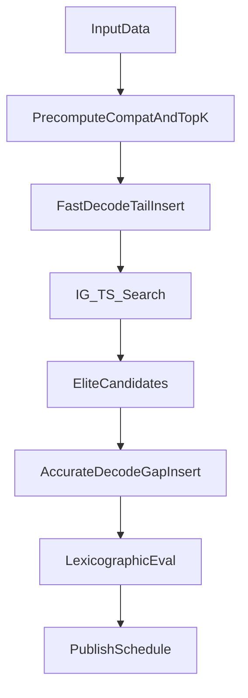
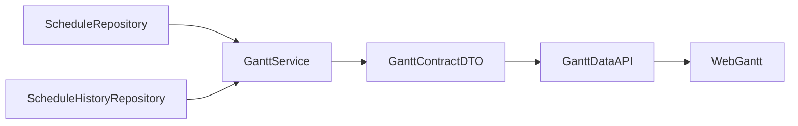

# 排产优化 — 技术架构

> 归属版本：v1.3.0 | 最后修改：2026-03-12
>
> 总览入口：[APS测试系统_排产优化完整方案.md](APS测试系统_排产优化完整方案.md)

## 文档目的

描述 v2.0 排产优化引擎的技术架构设计：分层组件结构、约束边界划分、数据转换层接口、以及与现有系统的集成方式。

## 本文边界

- **覆盖**：引擎分层架构图、约束边界（4.5.0~4.5.7）、物料齐套门禁语义、Web 异步执行占位、ext_group_id 快照占位、数据转换层设计、GreedyScheduler v1.x 可执行基线。
- **不覆盖**：数据模型定义（见 [排产优化_数据模型与实例构建.md](排产优化_数据模型与实例构建.md)）、算法细节（见 [排产优化_核心算法.md](排产优化_核心算法.md)）。
- **事实来源**：主文档第 4 章。
- **关联**：[系统速查表.md](../系统速查表.md)、[面板与接口清单.md](../面板与接口清单.md)。

## 4. 技术架构设计

> 状态：目标态设计稿，未落地（用于后续实施评审，不作为当前已上线能力）。

### 4.1 分层算法架构

```
┌─────────────────────────────────────────────────────────────────┐
│  第四层: 发布与深度优化层 (>60秒)                                 │
│  ├─ Memetic (IG + TS + 资源偏好基因扰动)                        │
│  └─ AccurateDecode精评 + 下发前可行性校核                        │
├─────────────────────────────────────────────────────────────────┤
│  第三层: 全局优化层 (10-60秒)                                    │
│  ├─ 迭代贪心(IG) with 分散重建（js + resource_preference）       │
│  └─ 限频关键路径精算（每N轮或出现新最优时触发）                  │
├─────────────────────────────────────────────────────────────────┤
│  第二层: 局部优化层 (1-10秒)                                     │
│  ├─ 禁忌搜索(TS) with 双资源关键块邻域                          │
│  └─ 排序交换 + 资源偏好基因变异（机器/工人）                     │
├─────────────────────────────────────────────────────────────────┤
│  第一层: 快速响应层 (<1秒)                                       │
│  ├─ FastDecode（Top-K组合 + 尾插快评）                           │
│  └─ 优先规则排序 (SPT/LPT/MWKR/FIFO)                            │
└─────────────────────────────────────────────────────────────────┘
```

### 4.2 算法选择决策矩阵

| 问题规模 | 快速响应(<1秒) | 常规求解(1-30秒) | 深度优化(>30秒) |
|----------|----------------|------------------|-----------------|
| **小规模(<50工序)** | FastDecode | TS（排序+资源偏好） | IG + AccurateDecode精评 |
| **中规模(50-200)** | FastDecode | IG（限频关键路径） | Memetic（IG+TS）+ 精评 |
| **大规模(>200)** | FastDecode(Top-K压缩) | IG(限制迭代) | 分段优化 + elite精评 |

### 4.3 核心算法组合（推荐）

**推荐组合**: IG(破坏重建) + TS关键块邻域 + 双解码器(FastDecode + AccurateDecode)

**理由**:
1. 双层编码让排序优化与资源优化可同时进行，避免"邻域动作不可表达"。
2. FastDecode 承担大规模迭代快评，旨在实现秒级响应。
3. AccurateDecode通过空隙插入释放时间碎片，避免尾插上限锁死。
4. 关键路径采用限频精算，兼顾定向搜索收益与运行时开销。

### 4.4 快评-精评闭环（主流程）



流程约束：
- 搜索阶段默认使用`FastDecode`进行候选快评，仅保留`EvalResult`轻量结果。
- 每`N`次迭代或出现新最优时，对`elite`候选触发`AccurateDecode`精评。
- 最终下发前必须执行一次`AccurateDecode`与冻结/日历可行性复核。

### 4.5 v1.0 → v2.0 架构迁移路径（目标态迁移设计）

当前仓库仍以 v1.x（Flask + GreedyScheduler）为主；v2.0（Web + Numba + 新算法栈）尚未落地。以下内容为迁移设计基线，用于后续实施评审：

```
v1.0 架构（保留与废弃标注）：
├── Flask + HTML模板（保留：Web UI 持续迭代）
├── SQLite + Repository层（保留：数据持久化仍用SQLite）
├── @dataclass 业务模型（保留：作为数据加载层的中间表示）
├── GreedyScheduler / Serial SGS（废弃：由IG+TS+双解码替代）
├── Excel导入管线 / openpyxl（保留：Excel模板与导入逻辑不变）
└── 冻结窗口 freeze_window.py（保留：语义对接FrozenContext）
```

**分层迁移策略**：

| 层级 | v1.0 组件 | v2.0 对应 | 迁移方式 |
|------|-----------|-----------|----------|
| UI层 | Flask路由 + HTML模板 | Flask路由 + HTML模板（增量优化） | 原样保留，按需增强 |
| 数据访问层 | SQLite + Repository | SQLite + Repository（不变） | 原样保留 |
| 数据转换层 | 无（直接用dataclass） | `InstanceBuilder`: dataclass → numpy数组 | 新增转换层 |
| 算法层 | GreedyScheduler | IG+TS+FastDecode/AccurateDecode | 全新开发 |
| 配置层 | config.py + schedule_params | 扩展：新增SDST/能力/冻结配置项 | 增量扩展 |

#### 4.5.0 扩展边界补充（复审新增）

- **插件系统关系**：仓库已存在 `core/plugins/`（manager/registry/runtime）。v2.0 算法默认以内建实现为主，不将"插件化加载算法"作为本期必选交付项；若后续采用插件注入，需新增"插件 ABI 与回退策略"专项评审。
- **材料约束边界**：schema 已包含 `Materials/BatchMaterials`，但本方案的 v2.0 算法主线暂不把"材料齐套约束"纳入 L0 可行域。发布时必须在结果摘要中标记"材料约束未参与优化"，避免现场误读为已覆盖。

#### 4.5.3 物料齐套门禁语义（对齐现有实现，非新增功能）

当前系统已有完整的物料齐套闭环，但本文档此前未充分描述。以下为事实口径：

- `BatchMaterials` 表记录每个批次所需物料及其齐套状态。
- `BatchMaterialService._calc_batch_ready()` 自动汇总判断批次齐套状态，将结果写回 `Batches.ready_status` 和 `Batches.ready_date`。
- 排产时，若 `enforce_ready_effective=True`（由 `enforce_ready_default` 配置控制），系统拦截所有 `ready_status != "yes"` 的批次不参与排产。
- 对于已齐套批次，`ready_date` 作为该批次最早可开工时间约束（`release` 约束）。

**语义边界**：
- `enforce_ready` 是"能不能排"的开关门禁。
- `ready_date` 是"最早什么时候排"的时间约束。
- 两者是独立的两层约束，不可混为一谈。

#### 4.5.4 Web 排产异步执行模型（待设计）

> **占位节 — 待架构 ADR 后回填**

**问题陈述**：当前 Web 排产为同步 POST 请求（`web/routes/scheduler_run.py`），长耗时排产（如 Case03 的 17 分钟）会阻塞 Flask 请求线程，用户无法操作且可能触发超时。

**当前行为**：用户点击"排产"按钮后，浏览器一直等待直到排产完成或超时。

**待决策点**：
- 架构选型：后台线程池 vs 任务队列 vs WebSocket 推送。
- 进度反馈：轮询 vs 推送 vs 混合模式。
- 超时与取消：用户能否中途取消正在执行的排产。

**临时风险**：在异步模型落地前，v1.x 和 v2.0 的排产都存在 Web UI 阻塞风险。中等规模以上场景建议在操作指引中提示"排产耗时较长，请勿关闭页面"。

**预计回填时机**：Phase 3（Web UI 集成）启动前完成 ADR。

#### 4.5.5 外协工序 ext_group_id 快照策略（待设计）

> **占位节 — 待数据模型变更决策后回填**

**问题陈述**：`BatchOperations` 不存储 `ext_group_id`，排产时通过 `schedule_template_lookup.py` 回查 `PartOperations` 模板获取外协合并组信息。若创建批次后模板被修改，历史批次的外协分组关系可能漂移。

**当前行为**：每次排产动态回查模板，以 `PartOperations.ext_group_id` 为事实来源。

**待决策点**：
- 是否在 `BatchOperations` 创建时固化 `ext_group_id`（快照策略）。
- 若固化，模板后续修改时是否需要级联更新已有批次。
- 若继续回查，是否在排产结果中记录"本次使用的 ext_group_id 映射快照"以确保可复现。

**临时风险**：在决策落地前，用户修改工艺模板的外协分组后重排历史批次，可能得到与预期不符的合并结果。建议在操作指引中提醒"修改外协分组后，已有批次的排产结果可能受影响"。

**预计回填时机**：Phase 1 数据转换层实现时一并决策。

**数据转换层（InstanceBuilder）设计**：

```python
class InstanceBuilder:
    """从 v1.0 的 SQLite/dataclass 模型构建 DRCJSSPInstance numpy数组"""
    
    def build(self, batches, machines, operators, op_machines, calendar) -> DRCJSSPInstance:
        instance = DRCJSSPInstance(...)
        self._fill_proc_time(instance, batches, op_machines)
        self._fill_compatibility(instance, batches, machines, operators)
        self._fill_skill_model(instance, operators)
        self._fill_sdst_matrix(instance, batches)
        self._fill_calendar(instance, calendar)
        precompute_topk(instance)
        return instance
```

#### 4.5.6 字段映射（SQLite/Excel → InstanceBuilder → `DRCJSSPInstance`）

本节仅做"现有实现口径回填"，不新增业务功能：对 v1.x 数据模型中不存在的信息（如 SDST / family）采用**保守默认**，确保 v2.0 算法可跑通且不会引入隐式语义变化。

| `DRCJSSPInstance` 字段 | 现有数据来源（SQLite/Excel） | 默认/缺省策略 | 备注 |
|---|---|---|---|
| `n_jobs` | `Batches`（本次选中批次） | - | job≈batch |
| `n_operations` | `BatchOperations`（本次选中批次的工序） | - | `DRCJSSPInstance` 仅覆盖 internal 双资源工序；external 工序通过 release 约束参与 |
| `n_machines` | `Machines(status=active)` 或"本次涉及的设备集合" | 默认 active | 与现有资源池口径对齐 |
| `n_workers` | `Operators(status=active)` 或"本次涉及的人员集合" | 默认 active | 与现有资源池口径对齐 |
| `op_info` | `BatchOperations(batch_id, seq, piece_id)` | `piece_id` 为空则置 0/空串映射 | 用于 job/op 索引与追溯 |
| `job_op_count/job_op_start` | 按 `batch_id` 聚合 `BatchOperations` 计数并前缀和 | - | 需保证同一批次工序按 `seq` 有序 |
| `op_type_of_op`、`n_op_types` | `BatchOperations.op_type_id`（优先）或 `op_type_name`（兜底） | 缺失时拒绝排产或映射到"unknown" | 建议强制维护 `op_type_id`，避免名称漂移 |
| `job_to_family`、`n_families` | v1.x 无显式 family：可用 `Batches.part_no` 作为 family | 默认 `family=part_no`（每图号一族） | 这是"零新增功能"的最保守做法；此时 SDST 仅能按图号聚合 |
| `base_setup_time` | `BatchOperations.setup_hours` | 缺失视为 0 | 建议统一换算为分钟 `ceil(hours*60)` |
| `proc_time` | `BatchOperations.unit_hours * Batches.quantity` | 缺失视为 0；负值/非有限值拒绝 | v1.x 建议落地为 `proc_time(n_operations,)`；v2.0 若有机台工时再扩展到二维 |
| `machine_op_compatible` | `Machines.op_type_id == BatchOperations.op_type_id` | 若 `machine_id` 强指定且不允许替代，则仅该机为 1 | 需在方案中明确"可替代"策略，避免与现场约束冲突 |
| `worker_op_compatible` | `OperatorMachine(operator_id,machine_id)` + `Machines.op_type_id` | 建议做"粗兼容"（可操作任一兼容设备即置 1） | 真实可行性仍以 `is_pair_compatible(op,m,w)` 约束 `OperatorMachine` 对 |
| `pair_rank`（排序元信息） | `OperatorMachine.skill_level + is_primary` | 缺失按末位排序 | v1.x 仅用于资源候选排序 tie-break，不影响加工时长 |
| `sdst_family_matrix` | v1.x 无 SDST 表 | 默认全 0（无序列相关换模） | 不新增功能前提下的默认行为 |
| `*_unavail_by_priority` | `WorkCalendar`/`OperatorCalendar`/`MachineDowntimes` | 见 5.1.1（合并/裁剪/溢出门禁） | 注意 Excel 导入侧限制与优先级门禁一致性 |

`OperatorSkill` 当前定位（与 `pair_rank` 的关系）：
- schema 已存在 `OperatorSkill`，但 v1.x 与本期 v2.0 目标态均以 `OperatorMachine.skill_level + is_primary -> pair_rank` 作为排序依据。
- 本期不将 `OperatorSkill` 引入"技能影响工时"计算，避免维护尺度失控；若后续启用，须作为独立里程碑并补充数据治理与回归。

外协工序处理边界（v2.0 口径冻结）：
- `DualLayerEncoding` 不包含 external 工序（`source=external` 不参与 `js` 编码）。
- `n_operations` 仅计入 internal 工序；external 工序不作为独立派工对象。
- L4 的 `makespan` 以 internal 工序口径计算；external 通过 `ext_days` 形成后续 internal 的 `release` 约束。
- 关键链分析可将 external 映射为固定时长虚拟节点，与现有 merged 外协组口径一致。

#### 4.5.7 Schema 迁移与回滚策略（对齐现有实现，不新增功能）

- **结构来源**：`schema.sql` 为唯一权威；启动时通过 `ensure_schema()` 以事务方式执行建表脚本。
- **版本标记**：使用 `SchemaVersion`（单行）记录当前 schema 版本；当检测到新库已满足最新结构时可直接提升版本，避免无谓迁移。
- **迁移门禁**：`current_version < CURRENT_SCHEMA_VERSION` 时，迁移前必须生成备份文件（落在 `backups/` 目录），迁移失败可回滚。
  典型场景：WorkCalendar 历史 `day_type=weekend` 统一清洗为 `holiday`（已有回归用例）。
- **日期字段清洗**：`Batches.due_date/ready_date` 等 DATE 字段需做格式标准化（`YYYY-MM-DD`），否则会导致交付指标与超期提示失真。

此转换层是 v1.0 数据与 v2.0 算法之间的桥梁，Phase 1 第 3 天实现。

### 4.6 甘特图持续演进设计（Web先行，契约统一）

> 状态：本节为"可执行实施基线"。目标是保证当前 Web 甘特图可持续迭代，并通过统一契约约束前后端，避免"文档有方向、实现无落地步骤"的空档。

#### 4.6.1 当前甘特图实现事实（v1.x）

| 主题 | 当前实现口径（已实现） | 代码锚点 |
|---|---|---|
| 页面入口 | `GET /scheduler/gantt`，设备/人员视图切换，版本与周范围切换 | `web/routes/scheduler_gantt.py`、`templates/scheduler/gantt.html` |
| 数据接口 | `GET /scheduler/gantt/data`，返回 tasks / calendar_days / critical_chain | `web/routes/scheduler_gantt.py`、`core/services/scheduler/gantt_service.py` |
| 数据契约 | 已引入 `contract_version=2`；`history` 默认不回传，需 `include_history=1` | `core/services/scheduler/gantt_contract.py`、`web/routes/scheduler_gantt.py` |
| 任务字段 | tasks 含 `schedule_id/lock_status/duration_minutes/edge_type` 与 `meta` 扩展字段 | `core/services/scheduler/gantt_tasks.py`、`data/repositories/schedule_repo.py` |
| 关键链 | 边携带 `edge_type/reason/gap_minutes`，并输出 `edge_type_stats/edge_count/cache_hit` | `core/services/scheduler/gantt_critical_chain.py`、`core/services/scheduler/gantt_service.py` |
| 前端交互 | 颜色模式、依赖箭头模式（互斥）、关键链高亮、URL 状态持久化、日/周/月粒度切换 | `static/js/gantt.js`、`static/css/aps_gantt.css` |

#### 4.6.2 统一甘特契约（Web 单轨）

推荐以如下结构作为跨端唯一契约（字段可扩展，不可随意删改）：

```json
{
  "contract_version": 2,
  "view": "machine",
  "version": 12,
  "week_start": "2026-03-02",
  "week_end": "2026-03-08",
  "task_count": 128,
  "tasks": [
    {
      "id": "B001-OP05",
      "schedule_id": 952,
      "name": "B001-OP05 MC001 OP001",
      "start": "2026-03-02 08:00:00",
      "end": "2026-03-02 10:00:00",
      "duration_minutes": 120,
      "lock_status": "unlocked",
      "dependencies": "",
      "edge_type": "process",
      "custom_class": "priority-urgent overdue",
      "meta": {
        "batch_id": "B001",
        "machine_id": "MC001",
        "operator_id": "OP001",
        "status": "scheduled"
      }
    }
  ],
  "calendar_days": [],
  "critical_chain": {
    "ids": ["B001-OP05", "B001-OP10"],
    "edges": [
      {
        "from": "B001-OP05",
        "to": "B001-OP10",
        "edge_type": "machine",
        "reason": "资源前驱（设备）",
        "gap_minutes": 0
      }
    ],
    "edge_type_stats": {
      "process": 0,
      "machine": 1,
      "operator": 0,
      "unknown": 0
    },
    "edge_count": 1,
    "cache_hit": true
  }
}
```

契约约束：
- `contract_version` 升级必须伴随回归测试更新与版本说明。
- `history` 默认不返回；仅在显式 `include_history=1` 时返回，避免接口体积膨胀。
- 任何新增字段必须"可缺省、可回退"，禁止破坏旧端解析。

#### 4.6.3 双轨实施原则（执行顺序固定）



执行原则：
1. **Web 轨先行**：先保证现网可读、可查、可解释，且回归门禁可执行。
2. **契约优先**：先固化 DTO，再推进前端渲染与交互；禁止先写页面再反推接口。
3. **渲染与业务分层**：前端只负责渲染与交互，不复制业务拼装逻辑；业务组装统一留在服务层。
4. **风险前置**：任何契约变更先加回归，再改实现。

#### 4.6.4 Web 持续迭代门槛（防止"半收口"）

进入下一阶段 UI 收口前，必须同时满足：
- Web 回归全绿：`tests/smoke_phase8.py` + 甘特专项回归（见 9.5）。
- 契约快照稳定：连续两次版本迭代不出现"非预期字段漂移"。
- 关键交互闭环：设备/人员视图切换、版本切换、URL 状态持久化与关键链高亮在同一周计划下可稳定复现。

---
